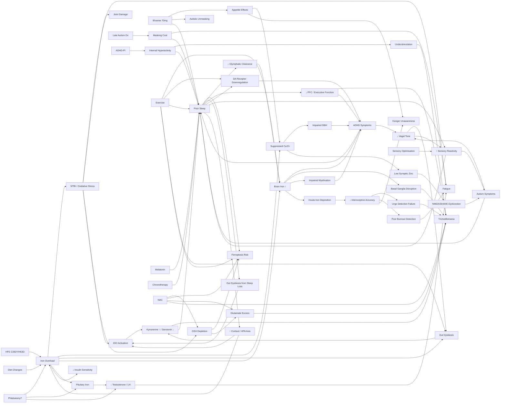

# Health Research — Map of Content

> Personal health research vault. Cross-referenced notes covering iron metabolism, neurodevelopment, mineral interactions, gut-brain axis, and clinical management.
> Patient: Anthony G. | Age: 37 | Key conditions: AuDHD (ADHD-PI + Autism), Trichotillomania, HFE C282Y/H63D compound heterozygote

---

## Lab Results
- [[Blood Results - December 2025]] — comprehensive health assessment: ferritin 738, low folate, thyroid/HbA1c normal, RHR 88bpm, body composition
- [[Blood Results - March 2026]] — iron studies + minerals: TSAT 60%, ferritin 380 (↓48%), low-normal copper/zinc, HFE confirmed

## Genetics
- [[HFE Compound Heterozygosity]] — genotype analysis, penetrance data, emerging research
- [[HFE Compound Het - Disease Associations Beyond Iron]] — full disease association map: HCC (HR 5.25), colorectal cancer, arthritis, ALS, PCT, diabetes, QoL
- [[Genetic Architecture of AuDHD]] — shared genetics across ADHD, autism, TTM, iron; COMT, MTHFR, dopamine/serotonin genes, pharmacogenomics, GWAS overlap, pathway convergence

## Iron Metabolism
- [[Transferrin Saturation - Clinical Significance]] — TSAT 60%, NTBI thresholds, guidelines
- [[Iron Overload and NTBI]] — non-transferrin bound iron, toxicity mechanisms
- [[Ceruloplasmin and Ferroxidase Activity]] — copper-iron export axis
- [[Tryptophan-Kynurenine Pathway]] — iron-driven inflammation → serotonin depletion → glutamate excitotoxicity
- [[research/Hepcidin and Brain Iron Regulation]] — astrocyte-derived hepcidin, BBB iron gating
- [[research/NTBI in the Brain]] — NTBI crossing BBB, CSF iron handling
- [[research/Ferroptosis and Neuronal Iron]] — iron-dependent cell death, GPX4/System Xc-
- [[research/Iron Chelation Therapy - Deferiprone]] — brain-penetrant chelator, neuroprotective studies

## Neurodevelopment
- [[Iron-Dopamine-ADHD Axis]] — tyrosine hydroxylase, brain iron, HFE + ADHD intersection
- [[HFE Variants and Brain Iron]] — C282Y/H63D effects on CNS iron distribution
- [[Elvanse and Mineral Metabolism]] — lisdexamfetamine, appetite, mineral monitoring
- [[Late-Diagnosed Autism - Distinct Profile]] — biologically distinct subtype, AuDHD, masking, stimulant-mediated unmasking
- [[ADHD-PI and Internal Hyperactivity]] — predominantly inattentive ADHD with internal mental hyperactivity, CDS overlap
- [[Trichotillomania and Neurodevelopmental Links]] — BFRBs in AuDHD, dopamine-glutamate convergence, iron links, NAC evidence
- [[research/Iron and Myelination]] — oligodendrocyte iron dependency, white matter deficits
- [[research/Iron and Oxidative Stress in Autism]] — glutathione depletion, Nrf2 dysfunction
- [[research/Iron and GABAergic Function]] — GABA/glutamate E/I balance
- [[research/Iron Glutamate and Excitotoxicity]] — System Xc-, glutamate release, NAC mechanism
- [[research/Iron and OCD-Spectrum Repetitive Behaviours]] — basal ganglia iron in OCD, TTM links

## Gut-Brain Axis
- [[Gut-Brain Axis and Neurodevelopment]] — microbiome in autism/ADHD, iron-gut dysbiosis, serotonin, vagus nerve, probiotics

## Minerals
- [[Copper-Zinc-Iron Interactions]] — competitive absorption, DBH, the vicious cycle
- [[research/Copper-Iron-Dopamine Triangle]] — catecholamine cascade, TH/DBH/ceruloplasmin triad
- [[research/Zinc-Iron Brain Competition]] — ZIP/ZnT transporters, synaptic zinc, NMDA modulation

## Sleep
- [[research/Iron and Circadian Rhythm]] — IRP1/IRP2, clock genes, sleep disruption
- [[research/Poor Sleep and AuDHD-HFE Interactions]] — sleep as central amplifier: ferroptosis, glymphatic failure, gut dysbiosis, executive dysfunction, sensory amplification, dopamine, TTM
- [[research/Sleep Intervention Protocols for AuDHD Adults]] — melatonin dosing, adapted CBT-I/ACT-i, chronotherapy, sensory environment, Elvanse timing, magnesium, staged protocol

## Body Systems
- [[neurodevelopment/Interoception in AuDHD - Research Review]] — interoceptive accuracy, alexithymia, BFRB urge detection, emotional dysregulation, burnout, hunger/satiety under Elvanse, iron-insula link
- [[research/Autonomic Nervous System and Vagal Tone in AuDHD]] — HRV, polyvagal theory, vagus-gut-brain axis, sensory reactivity, HRV biofeedback, stimulant effects
- [[research/Endocrine Effects of HFE Iron Overload]] — hypogonadism, thyroid, insulin resistance, ferritin-testosterone correlation, phlebotomy recovery window

## Exercise
- [[research/Exercise as Medicine for AuDHD-HFE]] — executive function, dopamine/BDNF, iron metabolism (hepcidin), sleep, gut microbiome, TTM, practical barriers and prescription

## Neuroprotection
- [[research/HFE and Long-Term Neurodegeneration Risk]] — Parkinson's/ALS/Alzheimer's meta-analyses, brain QSM imaging, neuroprotective strategy, deferiprone failure, intervention window
- [[research/NAC and Iron Metabolism]] — chelation properties, GSH restoration, NTBI reduction, ferroptosis protection, safety in iron overload, thalassemia RCT data

## Symptoms
- [[Fatigue and Burnout]] — multifactorial drivers, autistic burnout, oxidative stress, endocrine disruption
- [[Arthropathy and Back Pain]] — HH arthropathy, lumbar involvement, imaging

## Practical Management
- [[Dietary Management - Iron Overload]] — inhibitors, enhancers, meal strategy
- [[Diet and Supplement Strategy]] — current stack review, NAC, vitamin D, probiotics, inositol, treatment hierarchy
- [[Action Items and Monitoring Plan]] — GP script, phlebotomy, investigations, tracking
- [[research/UK Testing Guide - Pharmacogenomics and Endocrine]] — best-value UK tests: myDNA (£170), Body Fabulous methylation (£289), Medichecks endocrine (£249)

## Research Meta
- [[research/Research Avenues Tracker]] — living tracker of promising research leads with evidence ratings

---

## Key Findings from PubMed Verification (March 2026)

The following findings were verified against PubMed and OpenAlex on 2026-03-22, confirming their citations exist and conclusions are accurately represented:

1. **Chang 2014 (HFE iron overload mice):** Iron overload in HFE-model mice produces repetitive behaviour and dopamine disruption in the basal ganglia, providing direct mechanistic evidence that excess brain iron drives stereotyped behaviours relevant to [[Trichotillomania and Neurodevelopmental Links|trichotillomania]]
2. **Grotzinger 2025 (cross-disorder GWAS):** Mapping genetic architecture across 14 psychiatric disorders (n=1,056,201 cases) identified five genomic factors explaining ~66% of genetic variance and **238 pleiotropic loci** — ADHD and autism load onto shared factors, with shared signal enriched in excitatory neurons. See [[Genetic Architecture of AuDHD]]
3. **Iron overload causes gut dysbiosis AND cognitive impairment (PMID 39438708):** Suparan et al. demonstrated that iron overload causes cognitive impairment via the gut-brain axis, with association between gut/blood microbiome alterations, cognition, and iron burden. See [[Gut-Brain Axis and Neurodevelopment]]
4. **Jiang 2024 (System Xc- ferroptosis in autism models):** Ferroptosis via the System Xc-/GPX4 pathway is implicated in autism models, linking iron-dependent cell death to glutamate dysregulation. See [[research/Ferroptosis and Neuronal Iron]]
5. **Memantine RCT: 60.5% vs 8.3% for TTM (Grant 2023):** Double-blind placebo-controlled study of memantine in 100 adults with TTM/skin-picking showed 60.5% improvement vs 8.3% placebo (NNT=1.9), providing strong confirmation of the glutamate hypothesis for BFRBs alongside the NAC evidence. See [[Trichotillomania and Neurodevelopmental Links]]
6. **Brancati 2025 ("Hidden phenotype"):** Found that 21.9% of adults with ADHD screened positive for ASD, with higher age at first clinical referral, greater emotional dysregulation, more mood/anxiety comorbidity, and evening chronotype — describing the "hidden phenotype" of autism in adults diagnosed with ADHD. See [[Late-Diagnosed Autism - Distinct Profile]]
7. **No PubMed study exists on stimulant-mediated autism unmasking:** Despite clinical recognition of this phenomenon, no peer-reviewed study has directly investigated stimulant medication unmasking autistic traits — this remains an evidence gap supported only by clinical observation and grey literature
8. **East et al. (infant iron deficiency predicts SCT/CDS):** Infant iron deficiency predicted SCT/CDS symptoms in childhood and adolescence, establishing an early developmental link between iron status and cognitive disengagement. See [[ADHD-PI and Internal Hyperactivity]]
9. **Mitchell 2009 (H63D and glutamate):** H63D HFE cells show directly increased glutamate release and reduced glutamate uptake capacity, demonstrating that Anthony's H63D variant may promote glutamate excitotoxicity — the same pathway implicated in [[Trichotillomania and Neurodevelopmental Links|trichotillomania]] and targeted by NAC. See [[Genetic Architecture of AuDHD]]

---

## How to Use This Vault

1. **Start here** for an overview, then follow wikilinks into topics
2. Each note has a **Cross-References** section at the bottom linking to related notes
3. Use Obsidian's **Graph View** to visualise connections between topics
4. The [[Action Items and Monitoring Plan]] note contains practical next steps
5. The [[research/Research Avenues Tracker]] tracks research leads and their status
6. The [[Diet and Supplement Strategy]] note contains the supplement protocol
7. Update [[Blood Results - March 2026]] with future test results to track progress

## Key Themes Across Notes

## Citation Summary
All notes contain inline citations. Key journals referenced:
- *Nature*, *Nature Genetics* (autism subtypes, GWAS)
- *Blood*, *Hepatology*, *J Hepatol* (haematology/hepatology)
- *Arch Gen Psychiatry*, *JAMA Psychiatry* (NAC for trichotillomania)
- *Radiology*, *Eur Radiol* (brain iron imaging)
- *PLoS One*, *Sci Rep*, *BMC Genomics* (general science)
- *Molecules*, *Nutrients*, *Biol Trace Elem Res* (mineral metabolism)
- *Front Psychiatry*, *Front Microbiol*, *Dev Cogn Neurosci*, *Int J Mol Sci* (neuropsychiatry, gut-brain)
- *Gut Microbes*, *BMC Microbiol* (microbiome)
- *Mol Autism*, *Autism Research* (autism-specific)
- *J R Coll Physicians Edinb*, *JBMR Plus* (musculoskeletal)
- EASL Guidelines, BJH Guidelines, GeneReviews (clinical guidelines)

---

> **Disclaimer**: This research vault is for personal information-tracking purposes. It does not constitute medical advice. All clinical decisions should be made with qualified healthcare professionals.
