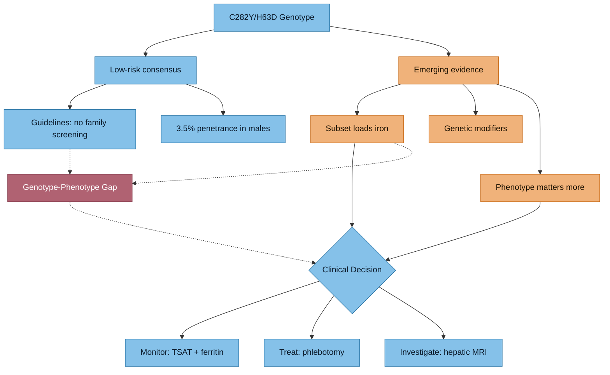

# HFE Compound Heterozygosity (C282Y/H63D)

## Your Genotype
You carry one copy of each major HFE variant:
- **p.Cys282Tyr (C282Y)** — pathogenic variant, disrupts HFE protein folding and its interaction with transferrin receptor 1
- **p.His63Asp (H63D)** — disease-associated polymorphism, milder effect on iron regulation

This makes you a **compound heterozygote**, distinct from C282Y homozygotes who carry the highest risk.

> [!info]- Colour Key
> 🔵 Consensus | 🟠 Emerging evidence | 🟢 Clinical decision | 🔴 Genotype-phenotype gap

## Population Prevalence
- C282Y allele frequency: ~6.2% in Northern European populations
- H63D allele frequency: ~14% in European populations
- C282Y/H63D compound heterozygote frequency: ~2% of Northern Europeans
- C282Y homozygote frequency: ~0.4% (1 in 250)

## Clinical Penetrance — What the Research Shows

### The "Low Risk" Consensus
The traditional view, reflected in your lab report, is that compound heterozygotes rarely develop clinical haemochromatosis:

> "C282Y/H63D compound heterozygotes are at low risk of hemochromatosis-related morbidity" — Gurrin et al., *Hepatology* 2009; 50(1):94-101. PMC3763940

- Large Australian study (HealthIron): compound hets had modestly elevated iron indices but very low rates of clinical disease
- BJH 2018 Guidelines (Fitzsimons et al., *Br J Haematol* 2018;181:293-303): family screening not recommended for compound hets

### The Emerging Nuance
Recent research challenges the blanket "benign" label:

> **"C282Y/H63D Compound Heterozygosity Is a Low Penetrance Genotype for Iron Overload-related Disease"** — Hasan et al., *J Can Assoc Gastroenterol* 2022;5(5):240-247. PMC9527664

Key finding: While penetrance is low overall, **a subset of compound heterozygotes DO develop clinically significant iron overload**, especially:
- Males over 40
- Those with co-existing liver disease or metabolic syndrome
- Those with additional genetic modifiers

> **Haemochromatosis UK (2025)**: "Recent publications have argued that the H63D variant lacks diagnostic or clinical utility... However, this interpretation risks overlooking patients with clinically relevant iron overload."

### Your Situation — The Phenotype Matters More Than Genotype

Your biochemistry tells a different story from the "low risk" label:
- **Transferrin saturation 60%** (above the 50% male threshold in EASL guidelines)
- **Ferritin previously 700 ug/L** (well above the 300 ug/L male threshold)
- **Ferritin still 380 ug/L** despite dietary modification

Per **EASL Clinical Practice Guidelines on Haemochromatosis (2022)**:
> In patients with high TSAT and elevated ferritin but non-C282Y homozygous genotypes, diagnosis requires hepatic iron overload on MRI or liver biopsy.

### UK Biobank Data (2025-2026)

> **BMC Genomics (March 2026)**: "Unraveling genotype-phenotype relationships in hereditary hemochromatosis through integrated biobank data analysis" — Large-scale analysis showing HH genotype-phenotype associations are difficult to predict due to variable penetrance and expressivity.

> **Pilling et al., medRxiv 2025**: Genetic and lifestyle modifiers affect penetrance in C282Y homozygotes. While focused on homozygotes, the principle that lifestyle/genetic modifiers affect penetrance applies to compound hets.

## Additional Genetic Modifiers to Consider

Your iron loading despite "low risk" genotype may be influenced by:
1. **Other iron-regulatory gene variants**: HAMP (hepcidin), HJV (hemojuvelin), TFR2 (transferrin receptor 2), SLC40A1 (ferroportin)
2. **TMPRSS6 variants**: affect hepcidin regulation
3. **Modifier genes**: matriptase-2, BMP pathway components
4. **Epigenetic factors**: inflammation, metabolic status, diet

> "Other causes of severe iron loading should also be investigated for possible other contributing iron overload genotypes" — from your lab report

## The 10% Gap
Your report notes: "Approximately 10% of HFE-related HH patients would not have variants detected by our tests." This means rarer HFE variants or non-HFE iron genes could contribute.

## Implications for You

1. **Your phenotype overrides your genotype** — you ARE loading iron, regardless of the statistical rarity
2. **Monitoring is warranted** despite guidelines not recommending family screening
3. **Consider**: requesting hepatic iron MRI (T2*/FerriScan) to quantify actual organ iron
4. **Consider**: genetic panel for additional iron-regulatory genes
5. **The compound het genotype may still affect [[HFE Variants and Brain Iron|brain iron homeostasis]]**

---

## Key References
1. Gurrin LC et al. HFE C282Y/H63D compound heterozygotes are at low risk of hemochromatosis-related morbidity. *Hepatology*. 2009;50(1):94-101. PMC3763940
2. Hasan SM et al. C282Y/H63D compound heterozygosity is a low penetrance genotype for iron overload-related disease. *J Can Assoc Gastroenterol*. 2022;5(5):240-247. PMC9527664
3. Fitzsimons EJ et al. Diagnosis and therapy of genetic haemochromatosis (review and 2017 update). *Br J Haematol*. 2018;181:293-303
4. EASL Clinical Practice Guidelines on haemochromatosis. *J Hepatol*. 2022;77(2):479-502
5. Lim DR et al. Clinical penetrance of hereditary hemochromatosis-related liver disease. *Clin Transl Gastroenterol*. 2020;11(11):e00249
6. BMC Genomics. Unraveling genotype-phenotype relationships in hereditary hemochromatosis. March 2026
7. Pilling LC et al. Genetic and lifestyle modifiers of haemochromatosis-related clinical outcomes. *medRxiv*. 2025
8. Anderson GJ. Revisiting hemochromatosis: genetic vs. phenotypic manifestations. *Ann Transl Med*
9. Toama W et al. Iron study is a weak indicator in symptomatic C282Y/H63D compound heterozygotes. 2015

---

## Cross-References
- [[Blood Results - March 2026]]
- [[Transferrin Saturation - Clinical Significance]]
- [[Iron Overload and NTBI]]
- [[HFE Variants and Brain Iron]]
- [[Dietary Management - Iron Overload]]
- [[Arthropathy and Back Pain]]
