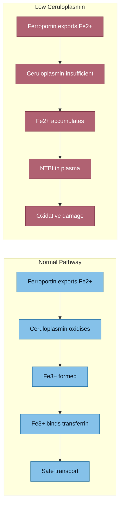

# Ceruloplasmin and Ferroxidase Activity

## Why This Axis Is Important
Ceruloplasmin is a copper-dependent ferroxidase that helps oxidize Fe2+ to Fe3+ during cellular iron export via ferroportin.

If this axis is impaired, iron can be trapped in tissue and dysregulated in plasma.

## Your Pattern
- Copper: 14.3 umol/L (low-normal)
- Ceruloplasmin: 0.206 g/L (low-normal)
- Iron metrics elevated (TSAT 60%)

This does **not** prove ceruloplasmin dysfunction, but it supports a biologically plausible contribution to persistent iron dysregulation.

## Mechanistic Summary
1. Ferroportin exports Fe2+
2. Ceruloplasmin/hephaestin oxidize Fe2+ to Fe3+
3. Fe3+ binds transferrin

> [!info]- Colour Key
> 🟢 Normal / safe | 🔴 Impaired / risk

When ferroxidase support is poor, efficient iron export/handling is compromised.

## Evidence Base
- Doguer C et al. *Compr Physiol* 2018;8(4):1433-1461 - iron-copper intersection in intestine/liver (PMC6460475)
- Chen Z et al. *Sci Rep* 2019;9:9437 - multicopper ferroxidase deficiency causes iron accumulation and oxidative injury (PMC6603037)
- Hellman NE, Gitlin JD. *Annu Rev Nutr* 2002;22:439-458 - classic ceruloplasmin metabolism/function review
- Linder MC. *Metallomics* 2016;8(9):887-905 - plasma copper-binding components update

## Clinical Notes
- Serum ceruloplasmin concentration is not the same as direct ferroxidase activity
- Ceruloplasmin is an acute-phase reactant; inflammation can alter interpretation
- Functional testing (if available) may add context when copper status is borderline

## Cross-References
- [[Copper-Zinc-Iron Interactions]]
- [[Transferrin Saturation - Clinical Significance]]
- [[Iron Overload and NTBI]]
- [[Blood Results - March 2026]]
