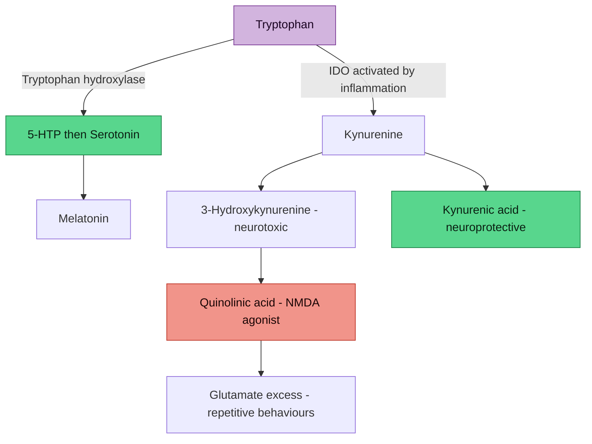

# Tryptophan-Kynurenine Pathway

## The Core Problem

Tryptophan is the precursor for **two competing pathways**:
1. **Serotonin pathway** → serotonin → melatonin (mood, sleep, social behaviour, impulse control)
2. **Kynurenine pathway** → kynurenine → quinolinic acid (neurotoxic) or kynurenic acid (neuroprotective)

When inflammation is present, the enzyme **indoleamine 2,3-dioxygenase (IDO)** is activated, shunting tryptophan **away from serotonin and towards kynurenine**. This is the inflammatory tryptophan steal.

## The Pathway

> [!info]- Colour Key
> 🟣 Source | 🟢 Protective | 🔴 Risk / damage

## Evidence in Autism

- **IDO activation found in 58.7% of individuals with ASD** (PMID: 38071324)
- IDO activation was associated with normoserotonemia — suggesting it **masks** what would otherwise be hyperserotonemia
- If IDO activation weren't present, hyperserotonemia could be present in ~94% of ASD individuals
- Increased kynurenine:tryptophan ratio documented in autistic adults and their first-degree relatives (Cambridge Core, CNS Spectrums)
- Decreased tryptophan metabolism overall in ASD patients (Mol Autism 2013;4:16)
- Quinolinic acid (downstream neurotoxic metabolite) is elevated → enhances glutamatergic neurotransmission → may drive repetitive behaviours

### Key Citations
- Gevi F et al. *Mol Autism* 2013;4:16 — decreased tryptophan metabolism in autism
- Bryn V et al. *PMID: 26497015* — altered kynurenine pathway metabolism, implications for glutamatergic activity
- Tryptophan metabolism review: *Mol Neurobiol* 2025 (Springer)

## Iron's Role in This Pathway

### Direct Effects
- **IDO is a heme-containing enzyme** — it requires iron for catalytic activity
- In iron overload, IDO may be more readily activated → greater tryptophan steal
- Iron-mediated oxidative stress → chronic low-grade inflammation → IDO activation
- This creates a **feed-forward loop**: iron overload → inflammation → IDO activation → serotonin depletion + glutamate excess

### Indirect Effects
- Iron overload → microglial activation → neuroinflammation → IDO activation in CNS
- Iron overload → gut dysbiosis → systemic inflammation → peripheral IDO activation
- NTBI (non-transferrin bound iron) → direct oxidative damage → inflammatory cytokine release → IDO

### Relevance for Anthony
His TSAT of 60% and ferritin of 380 represent a **chronic inflammatory stimulus** that may be:
1. Sustaining IDO activation
2. Depleting tryptophan away from serotonin
3. Increasing quinolinic acid → driving glutamate excitotoxicity → worsening TTM
4. Impairing melatonin production → disrupting sleep → worsening ADHD/autism symptoms

**Phlebotomy could interrupt this entire cascade at the source.**

## Therapeutic Implications

| Intervention | Target | Evidence |
|-------------|--------|----------|
| **Phlebotomy** | Reduce iron → reduce inflammation → reduce IDO activation | B — mechanistic + clinical case reports |
| **NAC** | Replenish glutathione → reduce oxidative stress → reduce IDO activation; also modulates glutamate | A for TTM; B for oxidative stress |
| **Omega-3 (DHA/EPA)** | Anti-inflammatory → reduce IDO activation | B — meta-analyses in ADHD |
| **Probiotics** | *L. plantarum* 299v may modulate kynurenine pathway | C — emerging |
| **Vitamin B6** | Cofactor for kynurenine aminotransferase (shifts kynurenine towards neuroprotective kynurenic acid) | C |
| **Tryptophan supplementation** | Increase substrate availability | D — caution: may increase kynurenine if inflammation unresolved |

## Open Questions

- What is Anthony's tryptophan:kynurenine ratio? (testable via blood/urine metabolomics)
- Does his iron overload correlate with elevated inflammatory markers (hsCRP, IL-6)?
- Would phlebotomy measurably shift serotonin:kynurenine balance?

## Verified Academic Citations

*Last verified: 2026-03-22*

### Kynurenine Pathway in Autism — Systematic Reviews and Meta-Analyses

1. **Almulla AF, Thipakorn Y, Tunvirachaisakul C, et al.** The tryptophan catabolite or kynurenine pathway in autism spectrum disorder: a systematic review and meta-analysis. *Autism Res.* 2024. PMID: [37909397](https://pubmed.ncbi.nlm.nih.gov/37909397/) | DOI: 10.1002/aur.3044
   - Meta-analysis confirming activated immune-inflammatory and nitro-oxidative pathways in ASD are accompanied by tryptophan depletion, increased competing amino acids, and kynurenine pathway activation.

2. **Santana-Coelho D.** Does the kynurenine pathway play a pathogenic role in autism spectrum disorder? *Brain Behav Immun Health.* 2024. PMID: [39263315](https://pubmed.ncbi.nlm.nih.gov/39263315/) | DOI: 10.1016/j.bbih.2024.100839
   - Reviews evidence that inflammation-driven kynurenine pathway activation contributes to ASD pathogenesis; discusses inhibition of IDO as potential therapeutic strategy.

### IDO Activation and Serotonin in Autism

3. **Launay JM, Delorme R, Pagan C, et al.** Impact of IDO activation and alterations in the kynurenine pathway on hyperserotonemia, NAD+ production, and AhR activation in autism spectrum disorder. *Transl Psychiatry.* 2023. PMID: [38071324](https://pubmed.ncbi.nlm.nih.gov/38071324/) | DOI: 10.1038/s41398-023-02687-w
   - **Key finding**: IDO activation found in 58.7% of ASD individuals; IDO activation masks what would otherwise be hyperserotonemia in ~94% of ASD; links kynurenine pathway to NAD+ production and aryl hydrocarbon receptor activation.

4. **Ishikawa M, Yamamoto Y, Wulaer B, et al.** Indoleamine 2,3-dioxygenase 2 deficiency associates with autism-like behavior via dopaminergic neuronal dysfunction. *FEBS J.* 2024. PMID: [38037233](https://pubmed.ncbi.nlm.nih.gov/38037233/) | DOI: 10.1111/febs.17019
   - IDO2 knockout mice display stereotyped behaviour, restricted interest, and social deficits (ASD traits); mechanism involves dopaminergic neuronal dysfunction — links kynurenine pathway to dopamine system.

### Gut Microbiota Regulation of Tryptophan Metabolism

5. **Agus A, Planchais J, Sokol H.** Gut microbiota regulation of tryptophan metabolism in health and disease. *Cell Host Microbe.* 2018. PMID: [29902437](https://pubmed.ncbi.nlm.nih.gov/29902437/) | DOI: 10.1016/j.chom.2018.05.003
   - Seminal review: gut bacteria directly modulate tryptophan availability and metabolism through three major pathways — serotonin, kynurenine, and indole; dysbiosis shifts balance towards kynurenine.

### Iron, Gut Dysbiosis, and Cognitive Function

6. **Suparan K, Trirattanapa K, Piriyakhuntorn P, et al.** Exploring alterations of gut/blood microbes in addressing iron overload-induced gut dysbiosis and cognitive impairment in thalassemia patients. *Sci Rep.* 2024. PMID: [39438708](https://pubmed.ncbi.nlm.nih.gov/39438708/) | DOI: 10.1038/s41598-024-76684-4
   - Iron overload causes gut dysbiosis and cognitive impairment via the gut-brain axis; supports the mechanistic chain: iron overload → dysbiosis → altered tryptophan metabolism → cognitive effects.

7. **Zhang Q, Ding H, Yu X, et al.** Plasma non-transferrin-bound iron uptake by the small intestine leads to intestinal injury and intestinal flora dysbiosis in an iron overload mouse model. *Sci China Life Sci.* 2023. PMID: [37452897](https://pubmed.ncbi.nlm.nih.gov/37452897/) | DOI: 10.1007/s11427-022-2347-0
   - NTBI damages intestinal epithelium and causes flora dysbiosis; directly relevant to Anthony's elevated transferrin saturation and the iron → gut damage → inflammation → IDO activation chain.

### Mitochondria, Kynurenine, and Neuropsychiatric Disorders

8. **Tanaka M, Szabó Á, Spekker E, et al.** Mitochondrial impairment: a common motif in neuropsychiatric presentation? The link to the tryptophan-kynurenine metabolic system. *Cells.* 2022. DOI: [10.3390/cells11162607](https://doi.org/10.3390/cells11162607) — 151 citations (OpenAlex)
   - Reviews how mitochondrial dysfunction and kynurenine pathway activation converge in neuropsychiatric conditions; quinolinic acid impairs mitochondrial function, creating a vicious cycle with iron-mediated oxidative stress.

### Immune Pathway and Tryptophan Metabolism

9. **Tanaka M, Tóth F, Polyák H, et al.** Immune influencers in action: metabolites and enzymes of the tryptophan-kynurenine metabolic pathway. *Biomedicines.* 2021. PMID: [34202246](https://pubmed.ncbi.nlm.nih.gov/34202246/) | DOI: 10.3390/biomedicines9070734
   - Comprehensive review of immune regulation of kynurenine pathway enzymes (IDO1, IDO2, TDO, KAT, KMO); relevance to neuroinflammation and neurodevelopmental conditions.

### Probiotics and Kynurenine Modulation

10. **Yang LL, Stiernborg M, Skott E, et al.** Effects of a synbiotic on plasma immune activity markers and short-chain fatty acids in children and adults with ADHD — A randomized controlled trial. *Nutrients.* 2023. PMID: [36904292](https://pubmed.ncbi.nlm.nih.gov/36904292/) | DOI: 10.3390/nu15051293
    - Synbiotic intervention in ADHD modulated SCFAs and immune markers (gut-brain mediators); reduced comorbid autistic traits — supports probiotics as indirect modulators of the kynurenine pathway via inflammation reduction.

---

## Cross-References
- [[Iron Overload and NTBI]]
- [[Gut-Brain Axis and Neurodevelopment]]
- [[Trichotillomania and Neurodevelopmental Links]]
- [[Fatigue and Burnout]]
- [[Genetic Architecture of AuDHD]]
- [[Ceruloplasmin and Ferroxidase Activity]]
- [[Action Items and Monitoring Plan]]
