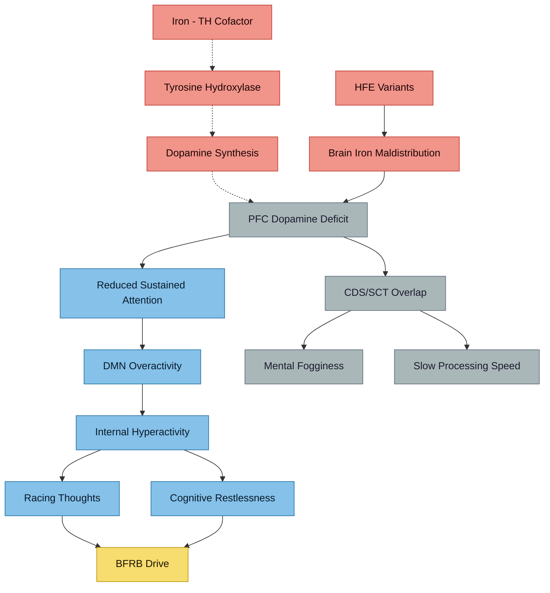

# ADHD-PI and Internal Hyperactivity

## The Presentation

Anthony's ADHD profile is **predominantly inattentive (ADHD-PI)** with a distinctive feature: **hyperactive internal thoughts** despite no external hyperactivity. This is not simply "quiet ADHD" — it suggests overlap with an emerging construct and specific neurobiological mechanisms.

## Pathway Overview

> [!info]- Colour Key
> 🟤 Deficit | 🔵 Internal | ⚫ CDS | 🟣 Iron | 🟢 Outcome

## Cognitive Disengagement Syndrome (CDS)

### What It Is
Previously called Sluggish Cognitive Tempo (SCT), CDS was renamed because the new name better describes the cognitive dimension (disengagement) and motor dimension (hypoactivity).

### Core Symptoms
- Frequently daydreaming, getting lost in thought
- Staring, zoning out
- Appearing sleepy or confused
- Taking longer to complete activities
- Mental fogginess
- Slow processing speed

### Prevalence Across Conditions
| Population | CDS Prevalence |
|-----------|---------------|
| Autism | 32% |
| ADHD-Inattentive | 27% |
| ADHD-Combined | 18% |
| General population children | 7% |

- **Autistic children with co-occurring ADHD have MORE cognitive CDS symptoms than children with ADHD alone**
- Baseline autism and insomnia symptoms predicted follow-up CDS above and beyond baseline CDS
- CDS is included in ICD (2022) but not yet in DSM

### Key Research
- Becker SP et al. *J Child Psychol Psychiatry* 2024 — CDS in autistic children with ADHD vs ADHD alone
- Becker SP et al. *J Abnorm Child Psychol* 2022 — Comparison of cognitive disengagement and hypoactivity components in autism, ADHD, and population-based samples
- Burns GL et al. *J Am Acad Child Adolesc Psychiatry* 2023 — Longitudinal prediction: autism and insomnia predict CDS in adolescence

## Internal Hyperactivity — Not a Contradiction

### The Paradox
ADHD-PI individuals often report intense internal mental activity that doesn't match their outward presentation:
- Racing thoughts while appearing calm or "zoned out"
- Cognitive restlessness without motor restlessness
- Rumination loops
- Mental hyperactivity that is **exhausting** but invisible to observers

### Neurobiology
- ADHD-PI involves **primarily prefrontal cortex** dopamine deficits
- The default mode network (DMN) may be overactive — explaining the internal "noise"
- The balance between task-positive networks and DMN is disrupted
- COMT Val158Met polymorphism may be relevant: COMT is the primary mechanism of dopamine clearance in prefrontal cortex (DAT is sparse in this region)
  - Val allele → more dopamine degradation → less prefrontal dopamine → potentially more inattention
  - Met allele → less degradation → more prefrontal dopamine → potentially better sustained attention but more anxiety
  - The polymorphism may influence which ADHD presentation predominates

### Iron and ADHD-PI
- Iron is a cofactor for tyrosine hydroxylase (rate-limiting enzyme for dopamine synthesis)
- Brain iron imaging consistently shows **lower striatal and thalamic iron** in medication-naïve ADHD patients (Adisetiyo et al. *Radiology* 2014;272:524-532)
- Region-specific brain iron deficiency in ADHD children, with anterior cingulate iron correlating with symptom severity (Chen et al. *Eur Radiol* 2022;32:3726-3733)
- **Paradox for Anthony**: systemic iron overload (TSAT 60%) may coexist with **functional brain iron distribution abnormalities** — HFE variants alter iron handling in both directions depending on the tissue

## Interaction with Autism

### How ADHD-PI + Autism Differs from ADHD-C + Autism
- Inattentive presentation less likely to prompt clinical referral → delayed diagnosis
- Internal hyperactivity may overlap with autistic **perseverative thinking**
- Executive dysfunction compounds autistic rigid thinking patterns
- The "quiet" external presentation + rich internal experience maps to the late-diagnosed autistic phenotype

### CDS, Autism, and the Diagnostic Cascade
- CDS symptoms in autism may be misattributed to "autistic withdrawal" rather than attentional dysfunction
- Treating the ADHD component (e.g., with Elvanse) may unmask autistic features that were previously obscured by inattentive fog
- This is exactly Anthony's experience

## Internal Hyperactivity and BFRBs

### Potential Link to Trichotillomania
Internal mental hyperactivity may drive body-focused repetitive behaviours through:
1. **Understimulation compensation** — when the internal noise becomes uncomfortable, BFRBs provide grounding sensory input
2. **Nervous system regulation** — hair-pulling may serve to down-regulate an overstimulated internal state
3. **Dopamine-seeking** — BFRBs activate reward circuitry, providing brief dopamine release
4. **Attentional channeling** — the repetitive physical act may help focus scattered internal attention

See [[Trichotillomania and Neurodevelopmental Links]] for full analysis.

## CDS Medication Response

- **Lisdexamfetamine (Elvanse) reduces CDS symptoms**: In a placebo-controlled trial, lisdexamfetamine reduced self-reported SCT/CDS symptoms by 30% and ADHD symptoms by 40% in adults with comorbid SCT and ADHD, with significant improvements in executive function (Hedges' g = 0.68). A 2026 systematic review and meta-analysis confirmed lisdexamfetamine had the largest effect on CDS among studied medications.
  - Adler LA et al. *J Clin Psychiatry* 2021;82(4)
  - Rubio-Morell B et al. *Front Psychiatry* 2026
- **CDS responds poorly to methylphenidate** — atomoxetine (a norepinephrine reuptake inhibitor) shows benefit for CDS symptoms, suggesting noradrenergic mechanisms may be more relevant to CDS than dopaminergic ones
  - Froehlich TE et al. *CNS Drugs* 2023;37(5):393-407. PMID: [37061629](https://pubmed.ncbi.nlm.nih.gov/37061629/)

## Racing Thoughts — The Evidence

Racing thoughts in adult ADHD are an integral, not peripheral, feature:
- **Weibel S et al.** *Psychiatry Res* 2021;301:113966. PMID: [34023673](https://pubmed.ncbi.nlm.nih.gov/34023673/) — Mental restlessness may be the adult manifestation of childhood motor hyperactivity, particularly related to cyclothymic temperament and anxiety
- **Kabore R et al.** *Front Psychol* 2023;14:1166602. [PMC10507474](https://pmc.ncbi.nlm.nih.gov/articles/PMC10507474/) — Racing thoughts (speed, pressure, involuntary quality) are distinguishable from mind wandering (attention decoupling); emotional lability contributes specifically to "racing/overactive thoughts"
- **Liao Y et al.** *Sci Rep* 2025;15:93053 — Hyperactive ADHD symptom dimensions predict greater variability in thought content, supporting internal hyperactivity as a dimension of hyperactivity-impulsivity even when motor hyperactivity is absent

## ADHD-PI vs ADHD-C Neurobiological Differences

### Distinct Brain Network Disruptions
- ADHD-C: disrupted frontostriatal-thalamic connectivity with default mode, cerebellar, and motor network alterations
- ADHD-PI: disrupted frontoparietal attention networks with cingulo-frontoparietal and visual network alterations
- ADHD-PI shows higher hippocampal connectivity; ADHD-C shows higher cerebellar connectivity

### Catecholamine Profiles
- **Norepinephrine is particularly important for ADHD-PI** — prefrontal cortex depends on noradrenergic stimulation of alpha-2A adrenoceptors for optimal function
- ADHD-C appears more associated with mesolimbic/striatal dopamine dysfunction (reward); ADHD-PI with mesocortical/prefrontal dopamine and norepinephrine dysfunction (sustained attention, working memory)
- The **ADHD-PI "restrictive" subtype** (ADHD-RI) — patients with inattention who have *never* had significant hyperactivity-impulsivity — may have genuinely different neurobiology with slower processing, more daydreaming, and less impulsivity

**Key citations:**
- Saad JF et al. *Front Integr Neurosci* 2020;14:31
- Arnsten AFT. *Pharmacol Biochem Behav* 2011;99(2):211-216. [PMC3129015](https://pmc.ncbi.nlm.nih.gov/articles/PMC3129015/)
- Sharma A & Bhargava S. *Neuropharmacology* 2024. [PMC11604610](https://pmc.ncbi.nlm.nih.gov/articles/PMC11604610/)

## Executive Function Profiles in ADHD-PI

- **Working memory deficits are central** to ADHD-PI (not inhibition), predicting difficulties in emotion regulation, academic achievement, and processing speed
- **Processing speed is distinctively impaired** — ADHD-PI patients tend to be slow but accurate, while ADHD-C patients tend to be fast but error-prone
- **High IQ does not protect** against EF deficits in ADHD — working memory, sustained attention, and processing speed impairments persist
- **CDS adds self-organisation deficits** on top of ADHD executive dysfunction
- **Comorbid autism compounds** executive dysfunction, particularly in cognitive flexibility and set-shifting

**Key citations:**
- Kofler MJ et al. *J Abnorm Child Psychol* 2019;47(2):273-286. [PMC6204311](https://pmc.ncbi.nlm.nih.gov/articles/PMC6204311/)
- Nigg JT et al. *J Abnorm Psychol* 2005;114(4):706-717. PMID: [16351391](https://pubmed.ncbi.nlm.nih.gov/16351391/)
- Craig F et al. *Neuropsychol Rev* 2024. [PMC11485171](https://pmc.ncbi.nlm.nih.gov/articles/PMC11485171/)

## ADHD-PI and Autism — Mechanism Differences

- **Inattention is the most prevalent ADHD symptom domain in autistic individuals** — 46% inattentive, 32% combined, 22% hyperactive alone (Canals J et al. *Autism Res* 2024)
- The mechanisms of inattention differ: ADHD impairment reflects difficulty detecting anticipatory cues, while ASD impairment relates to heightened perceptual capacity and weaker orientation toward new inputs
- **Sensory overload can mimic inattention** — autistic sensory overload produces apparent inattention through overwhelming sensory input consuming processing resources, rather than failure to sustain attention

## Iron Overload and Repetitive Behaviours

In animal models, iron overload in the brain was associated with altered dopamine metabolism and changes in repetitive behaviour, providing a direct mechanistic link between iron status, dopamine, and stereotyped behaviours.

**Citation:** Park JH et al. "Influence of Lead on Repetitive Behavior and Dopamine Metabolism in a Mouse Model of Iron Overload." *Toxicol Res* 2014;30(4):267-276

## Clinical Implications

1. **Elvanse is first-line for this presentation** — already prescribed, and evidence shows it also reduces CDS symptoms
2. **CDS symptoms may not fully respond to stimulants** — if residual fogginess persists, atomoxetine augmentation could be considered
3. **Iron status matters for ADHD-PI specifically** — dopamine synthesis depends on iron as cofactor
4. **The internal hyperactivity component** should be addressed separately from the inattention (mindfulness, structured routines, sensory strategies)
5. **Sleep quality is a key modifier** — insomnia predicts worsening CDS
6. **Working memory training and external organisational supports** may provide additional benefit beyond medication
7. **Distinguish autistic perseverative thinking** (repetitive thought loops about specific interests) from ADHD racing thoughts (rapid, shifting, pressured) — these may require different management

## Verified Academic Citations

### CDS Construct Definition and Consensus

1. **Becker SP, Willcutt EG, Leopold DR, et al.** Report of a Work Group on Sluggish Cognitive Tempo: Key Research Directions and a Consensus Change in Terminology to Cognitive Disengagement Syndrome. *J Am Acad Child Adolesc Psychiatry*. 2023;62(5):527-549. DOI: [10.1016/j.jaac.2022.07.821](https://doi.org/10.1016/j.jaac.2022.07.821) | PMID: [36007816](https://pubmed.ncbi.nlm.nih.gov/36007816/)
   - International Work Group consensus paper establishing the name change from SCT to CDS; summarises evidence that CDS is a distinct syndrome separable from ADHD inattention.

2. **Becker SP.** Cognitive disengagement syndrome: A construct at the crossroads. *Am Psychol*. 2025. DOI: [10.1037/amp0001517](https://doi.org/10.1037/amp0001517) | PMID: [40146579](https://pubmed.ncbi.nlm.nih.gov/40146579/)
   - Comprehensive review of CDS as comprising excessive daydreaming, mental confusion, and hypoactivity; discusses its transdiagnostic relevance and future directions.

3. **Fredrick JW, Becker SP.** Cognitive Disengagement Syndrome (Sluggish Cognitive Tempo) and Social Withdrawal: Advancing a Conceptual Model to Guide Future Research. *J Atten Disord*. 2023;27(1):38-45. DOI: [10.1177/10870547221114602](https://doi.org/10.1177/10870547221114602) | PMID: [35927980](https://pubmed.ncbi.nlm.nih.gov/35927980/)
   - Proposes mechanisms linking CDS to social withdrawal including task-unrelated thought and poorer social skills; relevant to the "quiet" ADHD-PI phenotype.

4. **Fredrick JW, Jacobson LA, Peterson RK, Becker SP.** Cognitive disengagement syndrome (sluggish cognitive tempo) and medical conditions: a systematic review and call for future research. *Child Neuropsychol*. 2024;30(4):625-656. DOI: [10.1080/09297049.2023.2256052](https://doi.org/10.1080/09297049.2023.2256052) | PMID: [37712631](https://pubmed.ncbi.nlm.nih.gov/37712631/)
   - First systematic review of CDS in medical populations; CDS symptoms are independently associated with functional impairment beyond ADHD inattention.

### CDS, Autism, and ADHD Overlap

5. **Mayes SD, Becker SP, Calhoun SL, Waschbusch DA.** Comparison of the Cognitive Disengagement and Hypoactivity Components of Sluggish Cognitive Tempo in Autism, ADHD, and Population-Based Samples of Children. *Res Child Adolesc Psychopathol*. 2023;51(1):65-78. DOI: [10.1007/s10802-022-00969-3](https://doi.org/10.1007/s10802-022-00969-3) | PMID: [36048375](https://pubmed.ncbi.nlm.nih.gov/36048375/)
   - Autistic children with co-occurring ADHD have more cognitive CDS symptoms than children with ADHD alone; validates the two-component model of CDS.

6. **Mayes SD, Waschbusch DA, Fernandez-Mendoza J, Calhoun SL.** Cognitive Disengagement Syndrome (CDS), Autism, and Insomnia Symptoms in Childhood Predict CDS in Adolescence: A Longitudinal Population-Based Study. *Child Psychiatry Hum Dev*. 2024;55(4):1016-1025. DOI: [10.1007/s10578-023-01565-2](https://doi.org/10.1007/s10578-023-01565-2) | PMID: [37391602](https://pubmed.ncbi.nlm.nih.gov/37391602/)
   - Baseline autism and insomnia symptoms predict future CDS above and beyond baseline CDS itself; supports sleep as a key modifier.

7. **Mayes SD, Becker SP, Waschbusch DA.** Cognitive Disengagement Syndrome and Autism Traits are Empirically Distinct from each Other and from Other Psychopathology Dimensions. *Res Child Adolesc Psychopathol*. 2025;53(4):567-578. DOI: [10.1007/s10802-024-01281-y](https://doi.org/10.1007/s10802-024-01281-y) | PMID: [39786640](https://pubmed.ncbi.nlm.nih.gov/39786640/)
   - CDS and autism traits are associated but empirically distinct constructs; overlap is not simply due to shared psychopathology.

8. **Carpenter KLH, Davis NO, Spanos M, et al.** Cognitive Disengagement Syndrome in Young Autistic Children, Children with ADHD, and Autistic Children with ADHD. *J Clin Child Adolesc Psychol*. 2024. DOI: [10.1080/15374416.2024.2361715](https://doi.org/10.1080/15374416.2024.2361715) | PMID: [38900723](https://pubmed.ncbi.nlm.nih.gov/38900723/)
   - CDS symptoms elevated in autistic children with ADHD compared to ADHD-only or autism-only groups, supporting additive effects of co-occurring conditions.

9. **Mayes SD, Calhoun SL, Waschbusch DA.** Agreement between mother, father, and teacher ratings of cognitive disengagement syndrome (sluggish cognitive tempo) in children with autism and children with ADHD. *Psychol Assess*. 2023;35(6):533-541. DOI: [10.1037/pas0001234](https://doi.org/10.1037/pas0001234) | PMID: [36996162](https://pubmed.ncbi.nlm.nih.gov/36996162/)
   - Multi-informant study showing CDS is reliably rated across raters in both autism and ADHD populations.

10. **Durak S, Tahillioglu A, Yazan Songur C, et al.** Differentiating pure cognitive disengagement syndrome and attention-deficit/hyperactivity disorder-restrictive inattentive presentation with respect to depressive symptoms, autistic traits, and neurocognitive profiles. *Appl Neuropsychol Child*. 2025. DOI: [10.1080/21622965.2025.2493812](https://doi.org/10.1080/21622965.2025.2493812) | PMID: [40287859](https://pubmed.ncbi.nlm.nih.gov/40287859/)
    - Pure CDS group had higher autistic traits and depressive symptoms than ADHD-RI; distinct neurocognitive profiles support CDS as separable from ADHD inattention.

11. **Karaca BS, Ozyurt G.** Social Communication Difficulties in Children with Autism Spectrum Disorder (ASD Level 1): The Mediating Role of Cognitive Disengagement Syndrome. *J Autism Dev Disord*. 2026. DOI: [10.1007/s10803-026-07215-5](https://doi.org/10.1007/s10803-026-07215-5) | PMID: [41546808](https://pubmed.ncbi.nlm.nih.gov/41546808/)
    - CDS mediates social communication difficulties in Level 1 autism; suggests treating CDS may improve social functioning.

12. **Tahillioglu A, Celik D, Huseynova S, et al.** The association between autistic-like traits and sluggish cognitive tempo symptoms in children with ADHD. *Int J Dev Disabil*. 2023. DOI: [10.1080/20473869.2023.2170485](https://doi.org/10.1080/20473869.2023.2170485) | PMID: [39712435](https://pubmed.ncbi.nlm.nih.gov/39712435/)
    - Autistic-like traits significantly associated with SCT/CDS symptoms in children with ADHD, especially social communication difficulties.

### CDS as Transdiagnostic Link

13. **Kamradt JM, Eadeh HM, Nikolas MA.** Sluggish Cognitive Tempo as a Transdiagnostic Link Between Adult ADHD and Internalizing Symptoms. *J Psychopathol Behav Assess*. 2022;44(3):753-764. DOI: [10.1007/s10862-021-09926-8](https://doi.org/10.1007/s10862-021-09926-8) | PMID: [38221987](https://pubmed.ncbi.nlm.nih.gov/38221987/)
    - SCT/CDS mediates the relationship between adult ADHD inattention and depression/anxiety; supports CDS as a transdiagnostic factor explaining internalising comorbidity in ADHD-PI.

### Internal Restlessness and Mental Hyperactivity

14. **Weyandt LL, Iwaszuk W, Fulton K, et al.** The internal restlessness scale: performance of college students with and without ADHD. *J Learn Disabil*. 2003;36(4):382-389. DOI: [10.1177/00222194030360040801](https://doi.org/10.1177/00222194030360040801) | PMID: [15490909](https://pubmed.ncbi.nlm.nih.gov/15490909/)
    - Foundational study developing the Internal Restlessness Scale; adults with ADHD report significantly higher internal restlessness (subjective mental hyperactivity) than controls; four-factor structure including cognitive and affective restlessness.

15. **Lanier J, Noyes E, Biederman J.** Mind wandering (internal distractibility) in ADHD: A literature review. *J Atten Disord*. 2021;25(6):885-890. DOI: [10.1177/1087054719865781](https://doi.org/10.1177/1087054719865781)
    - Review establishing mind wandering as a core feature of ADHD distinguishable from external distractibility; relevant to the internal hyperactivity construct.

### ADHD-PI Neurobiology and Default Mode Network

16. **Wu ZM, Wang P, Liu J, et al.** The clinical, neuropsychological, and brain functional characteristics of the ADHD restrictive inattentive presentation. *Front Psychiatry*. 2023;14:1099882. DOI: [10.3389/fpsyt.2023.1099882](https://doi.org/10.3389/fpsyt.2023.1099882) | PMID: [36937718](https://pubmed.ncbi.nlm.nih.gov/36937718/)
    - ADHD-RI distinguished from ADHD-I and ADHD-C by worse sustained attention, better response inhibition, and less impaired DMN connectivity; the absence of hyperactive symptoms may relate to less DMN disruption but more salience network impairment.

17. **Saad JF, Griffiths KR, Kohn MR, et al.** Intrinsic Functional Connectivity in the Default Mode Network Differentiates the Combined and Inattentive Attention Deficit Hyperactivity Disorder Types. *Front Hum Neurosci*. 2022;16:859538. DOI: [10.3389/fnhum.2022.859538](https://doi.org/10.3389/fnhum.2022.859538) | PMID: [35754775](https://pubmed.ncbi.nlm.nih.gov/35754775/)
    - Reduced within-DMN connectivity characterises ADHD-C but not ADHD-I, suggesting distinct neurobiological substrates between presentations; ADHD-I may have different patterns of DMN dysregulation.

### COMT Val158Met and Prefrontal Dopamine

18. **Bellgrove MA, Domschke K, Hawi Z, et al.** The methionine allele of the COMT polymorphism impairs prefrontal cognition in children and adolescents with ADHD. *Exp Brain Res*. 2005;163(2):233-239. DOI: [10.1007/s00221-004-2180-y](https://doi.org/10.1007/s00221-004-2180-y) | PMID: [15654584](https://pubmed.ncbi.nlm.nih.gov/15654584/)
    - Met allele (slower dopamine degradation) impaired sustained attention in ADHD; challenges simple models of COMT effects and supports an inverted-U model of prefrontal dopamine in ADHD.

19. **Jin J, Liu L, Gao Q, et al.** The divergent impact of COMT Val158Met on executive function in children with and without attention-deficit/hyperactivity disorder. *Genes Brain Behav*. 2016;15(2):271-279. DOI: [10.1111/gbb.12270](https://doi.org/10.1111/gbb.12270) | PMID: [26560848](https://pubmed.ncbi.nlm.nih.gov/26560848/)
    - COMT Val158Met has opposite effects on executive function in ADHD versus controls; in ADHD, Met allele associated with worse interference control, supporting context-dependent dopamine effects.

20. **Kereszturi E, Tarnok Z, Bognar E, et al.** Catechol-O-methyltransferase Val158Met polymorphism is associated with methylphenidate response in ADHD children. *Am J Med Genet B Neuropsychiatr Genet*. 2008;147B(8):1431-1435. DOI: [10.1002/ajmg.b.30704](https://doi.org/10.1002/ajmg.b.30704) | PMID: [18214865](https://pubmed.ncbi.nlm.nih.gov/18214865/)
    - Val/Val genotype associated with better methylphenidate response in ADHD; pharmacogenetic evidence supporting COMT's role in stimulant treatment outcomes.

### Brain Iron and ADHD

21. **Morandini HAE, Watson PA, Barbaro P, Rao P.** Brain iron concentration in childhood ADHD: A systematic review of neuroimaging studies. *J Psychiatr Res*. 2024;174:200-209. DOI: [10.1016/j.jpsychires.2024.03.035](https://doi.org/10.1016/j.jpsychires.2024.03.035) | PMID: [38547742](https://pubmed.ncbi.nlm.nih.gov/38547742/)
    - Systematic review of 7 neuroimaging studies: consistently reduced brain iron in medication-naive ADHD children; psychostimulants may normalise brain iron; potential biomarker.

22. **Chen Y, Su S, Dai Y, et al.** Quantitative susceptibility mapping reveals brain iron deficiency in children with attention-deficit/hyperactivity disorder: a whole-brain analysis. *Eur Radiol*. 2022;32(6):3726-3733. DOI: [10.1007/s00330-021-08516-2](https://doi.org/10.1007/s00330-021-08516-2) | PMID: [35064804](https://pubmed.ncbi.nlm.nih.gov/35064804/)
    - Region-specific brain iron deficiency in ADHD; anterior cingulate iron correlated with symptom severity (already cited in note body).

23. **Tang S, Zhang G, Ran Q, et al.** Quantitative susceptibility mapping shows lower brain iron content in children with attention-deficit hyperactivity disorder. *Hum Brain Mapp*. 2022;43(8):2495-2502. DOI: [10.1002/hbm.25798](https://doi.org/10.1002/hbm.25798) | PMID: [35107194](https://pubmed.ncbi.nlm.nih.gov/35107194/)
    - Confirmed lower brain iron in bilateral caudate, putamen, and globus pallidus in ADHD children; supports striatal iron deficiency hypothesis.

24. **Shvarzman R, Crocetti D, Rosch KS, et al.** Reduced basal ganglia tissue-iron concentration in school-age children with attention-deficit/hyperactivity disorder is localized to limbic circuitry. *Exp Brain Res*. 2023;241(1):189-200. DOI: [10.1007/s00221-022-06484-7](https://doi.org/10.1007/s00221-022-06484-7) | PMID: [36301336](https://pubmed.ncbi.nlm.nih.gov/36301336/)
    - ADHD-specific iron reduction localised to limbic basal ganglia circuitry (ventral striatum); links iron deficiency to reward/motivation dysfunction.

25. **Schulze M, Coghill D, Lux S, et al.** Assessing Brain Iron and Its Relationship to Cognition and Comorbidity in Children With ADHD With Quantitative Susceptibility Mapping. *Biol Psychiatry Cogn Neurosci Neuroimaging*. 2025;10(1):68-76. DOI: [10.1016/j.bpsc.2024.08.015](https://doi.org/10.1016/j.bpsc.2024.08.015) | PMID: [39218036](https://pubmed.ncbi.nlm.nih.gov/39218036/)
    - Brain iron linked to cognitive performance and comorbidity burden in ADHD; lower iron in specific regions predicted worse working memory and higher oppositional symptoms.

26. **Morandini HAE, Vos SB, Bhoyroo R, et al.** Clinical and cognitive profile of nigral iron content in children with ADHD. *J Affect Disord*. 2026;373:121329. DOI: [10.1016/j.jad.2026.121329](https://doi.org/10.1016/j.jad.2026.121329) | PMID: [41653994](https://pubmed.ncbi.nlm.nih.gov/41653994/)
    - Substantia nigra iron content associated with ADHD clinical and cognitive profiles; relevant to dopamine synthesis capacity at the source.

### Iron Deficiency Across Neurodevelopmental Disorders

27. **DelRosso LM, Estrada Chaverri L, Ceballos Fuentes FA.** Iron Deficiency Across Neurodevelopmental Disorders: Comparative Insights from ADHD and Autism Spectrum Disorder. *Children (Basel)*. 2026;13(2):180. DOI: [10.3390/children13020180](https://doi.org/10.3390/children13020180) | PMID: [41749537](https://pubmed.ncbi.nlm.nih.gov/41749537/)
    - Comparative review of iron's role in ADHD and ASD; iron deficiency affects neurotransmitter synthesis, myelination, and neuronal metabolism across both conditions.

### Iron Deficiency and CDS/SCT

28. **East PL, Doom JR, Blanco E, et al.** Iron Deficiency in Infancy and Sluggish Cognitive Tempo and ADHD Symptoms in Childhood and Adolescence. *J Clin Child Adolesc Psychol*. 2023;52(1):112-124. DOI: [10.1080/15374416.2021.1969653](https://doi.org/10.1080/15374416.2021.1969653) | PMID: [34519599](https://pubmed.ncbi.nlm.nih.gov/34519599/)
    - Infant iron deficiency predicted SCT/CDS symptoms in childhood and adolescence, establishing an early developmental link between iron status and cognitive disengagement.

### ADHD-PI Molecular Neurobiology

29. **Custodio RJP, Kim M, Chung YC, et al.** Thrsp Gene and the ADHD Predominantly Inattentive Presentation. *ACS Chem Neurosci*. 2023;14(4):610-621. DOI: [10.1021/acschemneuro.2c00710](https://doi.org/10.1021/acschemneuro.2c00710) | PMID: [36716294](https://pubmed.ncbi.nlm.nih.gov/36716294/)
    - Identifies Thrsp gene involvement specific to ADHD-PI presentation; Thrsp knockout mice show inattentive but not hyperactive phenotype, supporting distinct neurobiology for ADHD-PI.

---

## Cross-References
- [[Iron-Dopamine-ADHD Axis]]
- [[Late-Diagnosed Autism - Distinct Profile]]
- [[Trichotillomania and Neurodevelopmental Links]]
- [[Fatigue and Burnout]]
- [[Elvanse and Mineral Metabolism]]
- [[HFE Variants and Brain Iron]]
- [[Genetic Architecture of AuDHD]]

