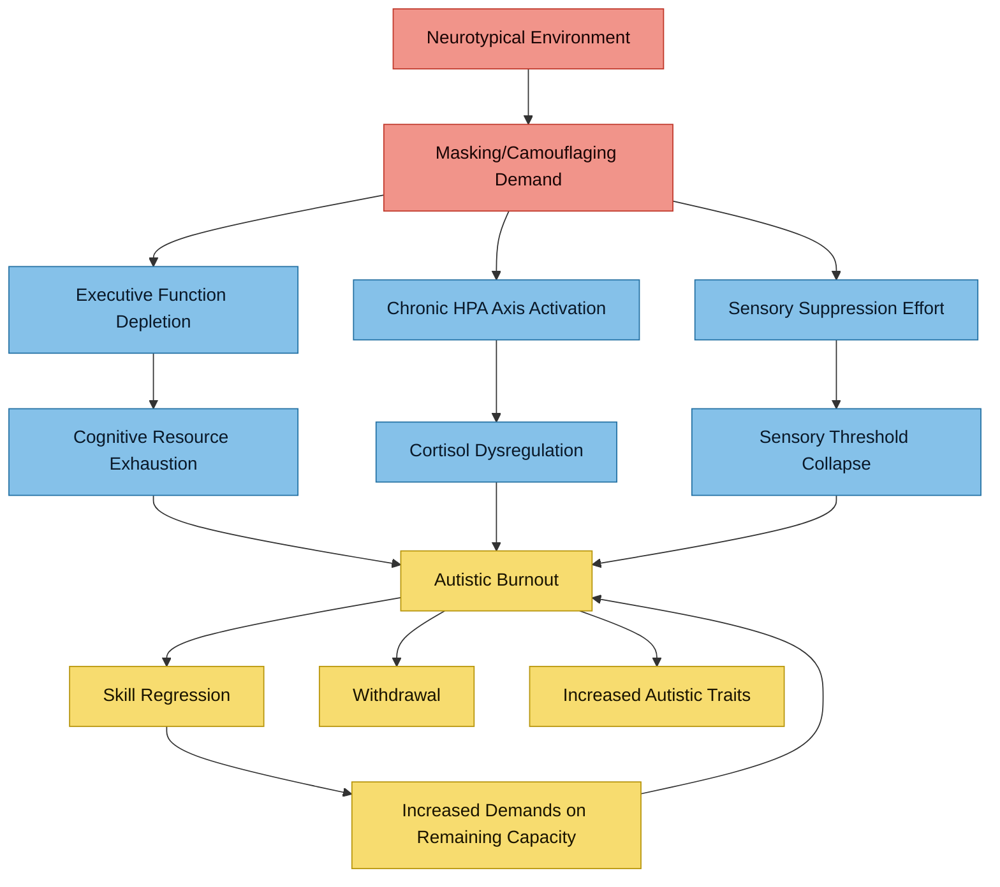

# Autistic Burnout — Neurobiological Mechanisms

Autistic burnout is increasingly recognised as a **distinct phenomenon** separate from occupational burnout, clinical depression, and chronic fatigue syndrome. This note synthesises the emerging evidence base — from community-driven definitions through to proposed neurobiological mechanisms — with specific attention to AuDHD vulnerability and the compounding role of iron overload.

> **Evidence Rating Key**
> **A** = Systematic review / meta-analysis
> **B** = Well-designed RCT or large cohort study
> **C** = Controlled observational / small experimental study
> **D** = Case report, narrative review, or theoretical paper

---

## 1. Definition and Conceptual Framework

### The Raymaker et al. (2020) Framework

The foundational academic definition emerged from community-based participatory research (CBPR):

> Autistic burnout is a syndrome conceptualised as resulting from **chronic life stress and a mismatch of expectations and abilities without adequate supports**. It is characterised by **pervasive, long-term (typically 3+ months) exhaustion, loss of function, and reduced tolerance to stimulus**.
> — Raymaker DM et al. *Autism in Adulthood* 2020;2(2):132-143. PMID: [32851204](https://pubmed.ncbi.nlm.nih.gov/32851204/) | **D**

Key elements:
- **Chronic exhaustion** — not relieved by rest in the usual way
- **Loss of skills** — previously mastered abilities become inaccessible (executive function, speech, self-care)
- **Reduced tolerance to stimulus** — sensory overload threshold drops dramatically
- **Caused by cumulative load** — not a single event but the weight of sustained demands exceeding capacity
- **Barriers to support** — inability to obtain relief from the load

### Three-Component Model

Subsequent work has refined the construct into three core dimensions:

1. **Exhaustion** — physical, cognitive, and emotional depletion beyond ordinary tiredness
2. **Withdrawal** — social retreat, avoidance of "autism-unfriendly" environments, reduced communication
3. **Increased autistic traits** — heightened sensory sensitivity, more pronounced stimming, reduced masking capacity

Arnold SRC et al. *Autism* 2023;27(7):1906-1918. PMID: [36637293](https://pubmed.ncbi.nlm.nih.gov/36637293/) | **C**

### Conceptual Model of Risk and Protective Factors

Mantzalas et al. developed a theoretical framework identifying:

- **Risk factors**: camouflaging, sensory overwhelm, lack of autism acceptance, life transitions, co-occurring conditions, alexithymia, inadequate support
- **Protective factors**: self-awareness, autistic identity, community belonging, accommodations, reduced masking demands, access to solitude and special interests
- The model emphasises that burnout is **not an individual failing** but a product of person-environment mismatch

Mantzalas J et al. *Autism Research* 2022;15(11):2013-2030. PMID: [35416430](https://pubmed.ncbi.nlm.nih.gov/35416430/) | **D**

---

## 2. Differential Diagnosis

### Autistic Burnout vs Depression

| Feature | Autistic Burnout | Major Depression |
|---------|-----------------|------------------|
| **Onset trigger** | Cumulative masking/demand load | Variable; can be endogenous |
| **Skill loss** | Prominent — previously mastered abilities lost | Possible psychomotor retardation but not skill regression |
| **Sensory changes** | Heightened sensitivity, reduced tolerance | Not typically a core feature |
| **Anhedonia** | May retain interest in special interests but lack capacity | Pervasive loss of interest |
| **Identity** | "I've lost myself" / "I can't function" | "I'm worthless" / "I'm hopeless" |
| **Response to rest** | Gradual recovery if demands genuinely reduced | Rest alone often insufficient |
| **PHQ-9 presentation** | May score high but pattern differs (fatigue, concentration dominant) | Broader symptom endorsement |

Arnold SRC et al. found that many autistic adults experiencing burnout had been **misdiagnosed with depression, anxiety, bipolar disorder, or borderline personality disorder** by clinicians unfamiliar with autistic burnout. PMID: [36637293](https://pubmed.ncbi.nlm.nih.gov/36637293/) | **C**

### Autistic Burnout vs Occupational Burnout

- Occupational burnout (Maslach model) involves **emotional exhaustion, depersonalisation, and reduced personal accomplishment** — specifically tied to workplace demands
- Autistic burnout encompasses **all of life**, not just work — it reflects the cost of existing in a neurotypically-structured world
- Autistic employees experience occupational burnout through similar JD-R (Job Demands-Resources) mechanisms but with **autism-specific demands** (sensory environment, social demands, masking load) that neurotypical frameworks miss

Tomczak MT, Kulikowski K. *Current Psychology* 2023;42:19956-19965. PMID: [37359683](https://pubmed.ncbi.nlm.nih.gov/37359683/) | **D**

### Autistic Burnout vs Chronic Fatigue Syndrome

- CFS/ME involves **post-exertional malaise** with specific immunological markers
- Autistic burnout involves **skill regression** and **increased autistic trait expression** not characteristic of CFS
- There may be genuine overlap — both conditions involve neuroinflammation and HPA axis disruption
- Comorbidity is possible and likely under-recognised

---

## 3. Neurobiological Mechanisms

### 3.1 The Masking → Depletion → Burnout Pathway

### 3.2 Allostatic Load

Allostatic load — the cumulative wear on the body from chronic stress adaptation — provides the strongest neurobiological framework for understanding autistic burnout.

**The allostatic load model applied to autism:**

1. **Repeated activation** of stress response systems (HPA axis, sympathetic nervous system) from daily masking, sensory overload, and social demands
2. **Failure to habituate** — autistic stress responses to social and sensory stimuli do not diminish with repeated exposure the way neurotypical responses do
3. **Failure to shut off** — prolonged cortisol elevation after stressors resolve
4. **Inadequate response** — eventual HPA axis blunting after chronic hyperactivation

Makris G et al. showed that children and adolescents with ASD exhibit **atypical HPA axis and autonomic nervous system function** both at rest and during social/sensory challenges, consistent with chronic allostatic loading.
*Frontiers in Neuroscience* 2022;16:818474. PMID: [35095389](https://pubmed.ncbi.nlm.nih.gov/35095389/) | **B**

### 3.3 HPA Axis Dysregulation

The evidence for HPA axis dysfunction in autism is substantial but complex:

- **Flattened diurnal cortisol rhythm** reported in autistic adolescents and young adults, associated with greater social difficulties and internalising symptoms
  - Ilen L et al. *Autism Research* 2024;17(10):2087-2101. PMID: [38973713](https://pubmed.ncbi.nlm.nih.gov/38973713/) | **C**

- **Cortisol awakening response (CAR) dysregulation** — variable findings, with some studies showing elevated and others blunted CAR in autism, likely reflecting different stages of allostatic adaptation
  - Taylor JL, Corbett BA. *Psychoneuroendocrinology* 2014;49:207-228. PMID: [25108163](https://pubmed.ncbi.nlm.nih.gov/25108163/) | **A**

- **Physiological stress from camouflaging** — a co-twin control study found that camouflaging autistic traits was associated with **increased hair cortisol concentration** (a biomarker of chronic stress over months), providing direct physiological evidence linking masking to HPA axis activation
  - Zubizarreta SC et al. *Molecular Autism* 2025;16:73. PMID: [41299653](https://pubmed.ncbi.nlm.nih.gov/41299653/) | **B**

The trajectory appears to be: initial **hyperactivation** (elevated cortisol from chronic masking demands) → eventual **blunting** (flattened diurnal curve, reduced cortisol reactivity) → **burnout** (system exhaustion). This mirrors the allostatic overload pattern seen in PTSD and chronic occupational stress.

### 3.4 Mitochondrial Allostatic Load

Mahony and O'Ryan proposed a molecular framework positioning **mitochondrial dysfunction as a mediator between autistic experiences and psychopathology**:

- Chronic stress from masking, sensory overload, and social demands generates sustained oxidative stress
- Mitochondria — the cell's energy producers — accumulate damage from this oxidative burden
- Mitochondrial dysfunction reduces cellular energy availability, manifesting as the exhaustion characteristic of burnout
- This framework integrates the **lived experience** of autistic burnout with measurable molecular pathology

Mahony C, O'Ryan C. *Frontiers in Psychiatry* 2022;13:985713. PMID: [36506457](https://pubmed.ncbi.nlm.nih.gov/36506457/) | **D**

### 3.5 Neuroinflammation

Neuroinflammation is well-documented in autism and may amplify burnout vulnerability:

- **Microglial activation and neuroinflammation** found in post-mortem brain tissue of autistic individuals, particularly in the cerebral cortex, white matter, and cerebellum
  - Vargas DL et al. *Annals of Neurology* 2005;57(1):67-81. PMID: [15546155](https://pubmed.ncbi.nlm.nih.gov/15546155/) | **B**

- Chronic stress further activates microglia through glucocorticoid-mediated priming, creating a **feed-forward loop**: stress → cortisol → microglial activation → neuroinflammation → reduced stress tolerance → more stress

- In the context of burnout, neuroinflammation may explain why recovery is not simply a matter of rest — the inflammatory state must resolve before function returns

---

## 4. The AuDHD Vulnerability

### Why Dual Diagnosis Increases Burnout Risk

AuDHD (ADHD + Autism) creates a **compound vulnerability** to burnout that exceeds the sum of its parts:

#### Executive Compensation Fatigue
- Autistic individuals use **executive function** to compensate for social-cognitive differences (scripting, rule-learning, monitoring behaviour)
- ADHD depletes the same executive function resources that autism requires for masking
- The result: a **double drain** on a shared, limited cognitive resource pool
- By the end of each day, executive reserves are more thoroughly depleted than in either condition alone

Turjeman-Levi Y et al. found that **executive function deficits mediate the relationship between ADHD and job burnout** — physical fatigue, cognitive weariness, and emotional exhaustion were all mediated through executive dysfunction.
*AIMS Public Health* 2024;11(1):116-130. PMID: [38617412](https://pubmed.ncbi.nlm.nih.gov/38617412/) | **C**

#### Compounding Mechanisms

| Factor | Autism Contribution | ADHD Contribution | Combined Effect |
|--------|-------------------|-------------------|-----------------|
| **Masking load** | Social scripting, suppressing stims | Suppressing impulsivity, managing restlessness | Double masking burden |
| **Executive demand** | Compensatory social cognition | Sustained attention, working memory | Shared resource depletion |
| **Sensory overload** | Heightened sensitivity, filtering failure | Attentional gating problems | Reduced sensory buffer |
| **Interoception** | Accuracy-sensibility mismatch | Attentional gating of body signals | Deeply unreliable internal monitoring |
| **Recovery capacity** | Need for solitude and routine | Difficulty with rest (restlessness, boredom) | Recovery strategies conflict |
| **Stimulant effects** | Can increase sensory sensitivity | Improves focus but may increase awareness of overload | Medication management is complex |

#### The ADHD-Specific Burnout Pathway
- ADHD independently increases burnout risk through **interest-based nervous system** dynamics: hyperfocusing on tasks depletes resources without the person noticing
- The ADHD tendency to **override fatigue signals** (poor interoception + attentional override) prevents early burnout detection
- Combined with autistic masking, this creates a pattern where **burnout is invisible until catastrophic**

---

## 5. Skill Regression During Burnout

### The Nature of Skill Loss

Autistic burnout is characterised by regression in previously mastered abilities:

- **Executive function**: planning, organising, task-switching, working memory
- **Speech and communication**: may become partially or fully non-speaking; word-finding difficulties; loss of scripted social responses
- **Self-care**: showering, cooking, cleaning become overwhelming
- **Sensory tolerance**: previously manageable environments become intolerable
- **Social capacity**: complete withdrawal from relationships and social obligations

Ali D et al. (2026) found that later-diagnosed autistic adults experienced burnout as a **loss of the very compensatory strategies** that had kept them functioning — the scripts, rules, and masking techniques that defined their adult identity became inaccessible.
*Autism* 2026. PMID: [41761756](https://pubmed.ncbi.nlm.nih.gov/41761756/) | **C**

### Temporary vs Permanent

- The **majority of skill loss appears to be temporary** — skills return when demands are sufficiently reduced and recovery time is adequate
- However, repeated burnout episodes may cause **cumulative damage** — each recovery is slower and less complete
- Some individuals report that certain skills **never fully return** to pre-burnout levels after severe or prolonged episodes
- This pattern is consistent with the allostatic load model: each overload event causes incremental wear that accumulates over the lifespan

Clarey MM et al. described autistic burnout on Reddit as a "Sisyphean struggle with daily tasks" — cyclical, exhausting, and with the constant threat that recovered capacity will be lost again.
*J Autism Dev Disord* 2025. PMID: [39985729](https://pubmed.ncbi.nlm.nih.gov/39985729/) | **D**

---

## 6. Interoception and Burnout Detection

Autistic burnout is intimately connected to interoceptive failure — the inability to detect internal states of exhaustion, stress, and overload before they reach crisis point. See [[Interoception in AuDHD - Research Review]] for the full evidence base.

### The Detection Failure Model

1. **Accumulating fatigue** generates body signals (muscle tension, elevated heart rate, cortisol-driven physiological changes)
2. **Poor interoceptive accuracy** (characteristic of both autism and ADHD) means these signals are not consciously registered
3. **Alexithymia** (~50% of autistic adults) compounds the problem — even when signals are detected, they cannot be identified or labelled
4. **Masking demands** consume the attentional resources that might otherwise be directed toward internal monitoring
5. **Burnout threshold** is crossed without warning — the person goes from "functioning" to "collapsed" with no perceived transition

This explains why autistic people frequently describe burnout as arriving **suddenly and without warning**, despite it being the product of months or years of accumulation. The interoceptive failure means the warning signs were never registered.

---

## 7. Iron Overload as a Compounding Factor

For individuals with HFE-related iron overload (such as compound heterozygosity C282Y/H63D), several mechanisms may amplify burnout vulnerability:

### Oxidative Stress Amplification
- Iron overload generates **reactive oxygen species (ROS)** through Fenton chemistry
- Chronic ROS production damages mitochondria — directly accelerating the mitochondrial allostatic load pathway described by Mahony & O'Ryan
- The brain is particularly vulnerable due to high metabolic demand and lipid-rich membranes susceptible to peroxidation
- See [[Iron Overload and NTBI]] and [[Ferroptosis and Neuronal Iron]]

### Neuroinflammation Enhancement
- Brain iron accumulation activates microglia and promotes neuroinflammatory cascades
- This adds to the baseline neuroinflammation already documented in autism
- The combined iron-driven and stress-driven neuroinflammation creates a **synergistic inflammatory burden**
- See [[HFE Variants and Brain Iron]]

### Fatigue Pathway Convergence
- Iron overload causes fatigue through mitochondrial dysfunction, oxidative stress, and endocrine disruption (pituitary iron deposition)
- Autistic burnout causes fatigue through allostatic overload, HPA axis dysregulation, and executive depletion
- These pathways **converge and amplify each other** — it becomes impossible to distinguish "iron fatigue" from "burnout fatigue" without addressing both
- See [[Fatigue and Burnout]] for the convergence model

### Functional Iron Blockade in Chronic Stress
Hauck (2025) proposed that chronic stress and neurodivergence may produce a state of **functional iron blockade** — where inflammation-driven hepcidin elevation sequesters iron despite adequate or elevated stores, creating a paradox of iron overload with functional deficiency in key tissues.
*Frontiers in Psychiatry* 2025;16:1701625. PMID: [41256943](https://pubmed.ncbi.nlm.nih.gov/41256943/) | **D**

---

## 8. Recovery Trajectories

### What the Evidence Shows

The Ali D et al. (2025) systematic review of 48 studies (~4,000 autistic participants) identified consistent recovery themes:

**What helps:**
- **Reduced demands** — the single most important factor; genuine reduction in expectations, not just time off while demands accumulate
- **Rest and solitude** — not social rest but genuine sensory and social withdrawal
- **Unmasking** — permission and safety to be autistic; dropping compensatory strategies
- **Autistic community** — connection with other autistic people reduces isolation without the masking cost of neurotypical socialisation
- **Sensory relief** — access to low-stimulation environments, noise-cancelling headphones, reduced visual clutter
- **Special interests** — engagement with deep interests as a restorative activity (not escapism but genuine neural restoration)
- **Accommodations** — workplace and life adjustments that reduce the demand-capacity gap

Ali D et al. *Clinical Psychology Review* 2025;122:102669. PMID: [41207162](https://pubmed.ncbi.nlm.nih.gov/41207162/) | **A**

**What does not help:**
- Being told to "push through" or "try harder"
- Generic wellbeing advice (exercise more, socialise more) without autism-specific adaptation
- Cognitive behavioural therapy approaches that frame burnout as a thinking problem rather than a demand-capacity mismatch
- Increasing masking effort to maintain appearances during burnout
- Antidepressant medication alone (may help co-occurring depression but does not address the masking-demand pathway)

### Typical Timelines

- **Duration of burnout episodes**: ranges from weeks to years; the modal experience described across studies is **months to over a year**
- Arnold SRC et al. found most participants reported burnout lasting **longer than 3 months**, with many describing episodes lasting **1-5 years**
  - PMID: [36637293](https://pubmed.ncbi.nlm.nih.gov/36637293/) | **C**
- **Recovery** is non-linear — fluctuating capacity with gradual overall improvement when demands are genuinely reduced
- **Repeat episodes** are common, often triggered by life transitions (new job, relationship changes, loss of accommodations)

---

## 9. Autistic Burnout and Posttraumatic Stress

Pagán et al. (2025) investigated the relationship between autistic burnout and posttraumatic stress symptoms (PTSS) in trauma-exposed autistic adults (n=91):

- Autistic burnout was **significantly correlated with PTSS** (r=0.70), depression (r=0.77), and anxiety (r=0.72)
- However, exploratory factor analysis demonstrated that autistic burnout items loaded onto a **separate factor from PTSS items**, supporting autistic burnout as a distinct construct
- The overlap raises important questions about whether chronic masking and environmental mismatch constitute a form of **ongoing traumatic stress** for autistic people

Pagán AF et al. *Research in Neurodiversity* 2025. PMID: [41473934](https://pubmed.ncbi.nlm.nih.gov/41473934/) | **C**

---

## 10. Measurement Tools

### AASPIRE Autistic Burnout Measure (ABM)

The primary validated tool, developed through community-based participatory research:

- **9-item self-report scale** measuring exhaustion, withdrawal, and reduced functioning
- Validated in two independent studies:
  - Arnold SRC et al. *Autism* 2023;27(7):1933-1948. PMID: [36637292](https://pubmed.ncbi.nlm.nih.gov/36637292/) | **C**
  - Bougoure M et al. *Autism* 2026;30(1):20-36. PMID: [40698409](https://pubmed.ncbi.nlm.nih.gov/40698409/) | **B** (n=379, excellent internal consistency)
- **Can discriminate** between currently experiencing and not currently experiencing burnout

### Autistic Burnout Measure (Mantzalas et al.)

- Alternative psychometric tool with 238 autistic adults
- Found strong correlations with depression, anxiety, stress, and fatigue but only **moderate correlations with camouflaging** — suggesting burnout has drivers beyond masking alone
- Mantzalas J et al. *Autism Research* 2024;17(7):1417-1449. PMID: [38660943](https://pubmed.ncbi.nlm.nih.gov/38660943/) | **B**

### Distinguishing from Standard Screening Tools

- **PHQ-9** (depression) and **GAD-7** (anxiety) will often score high during burnout but capture only part of the picture
- Autistic burnout-specific items (skill regression, sensory tolerance changes, increased autistic trait expression) are **not captured by PHQ-9/GAD-7**
- Clinical recommendation: use burnout-specific measures **alongside** standard screening to distinguish burnout from depression/anxiety

---

## 11. Workplace and Life Accommodations

### Evidence-Based Accommodations to Reduce Burnout Risk

The scoping review by Jahandideh et al. (2025) and the systematic review by Ali et al. (2025) converge on:

**Environmental:**
- Quiet workspace or noise-cancelling provision
- Flexible lighting (avoiding fluorescent)
- Reduced open-plan exposure
- Predictable routines and schedules
- Clear, written communication rather than verbal-only instructions

**Temporal:**
- Flexible working hours / compressed schedules
- Regular scheduled breaks (not just "take breaks when you need them" — poor interoception means needs are not detected)
- Reduced total working hours during high-demand periods
- Recovery time after social/sensory-intensive activities

**Social:**
- Reduced mandatory social events
- Permission to unmask (stimming, leaving meetings, declining small talk)
- Neurodiverse peer support
- Manager education about autistic needs

**Structural:**
- Clear expectations with written role descriptions
- Reduced ambiguity in tasks and responsibilities
- Advance notice of changes
- Single-tasking rather than multitasking expectations

Jahandideh P et al. *J Autism Dev Disord* 2025. PMID: [40317352](https://pubmed.ncbi.nlm.nih.gov/40317352/) | **B**

---

## 12. Clinical Relevance for Anthony

### Profile-Specific Risk Factors

Anthony presents with a **high-risk constellation** for autistic burnout:

1. **Late diagnosis (age 37)** — decades of unrecognised masking with no understanding of the cost. Later-diagnosed adults report burnout as the loss of compensatory strategies that defined their identity (Ali et al. 2026, PMID: [41761756](https://pubmed.ncbi.nlm.nih.gov/41761756/))

2. **AuDHD** — dual executive depletion from both autistic masking and ADHD compensation. Executive function deficits mediate ADHD-burnout relationship (Turjeman-Levi et al., PMID: [38617412](https://pubmed.ncbi.nlm.nih.gov/38617412/))

3. **HFE compound heterozygosity (C282Y/H63D)** — iron overload amplifies oxidative stress, neuroinflammation, and mitochondrial dysfunction, converging with burnout pathways

4. **Impaired interoception** — the AuDHD interoceptive profile (accuracy-sensibility mismatch + attentional gating failure) means burnout signals are not detected until crisis. See [[Interoception in AuDHD - Research Review]]

5. **Trichotillomania** — may serve as an unrecognised burnout indicator; BFRBs often intensify during periods of elevated stress and sensory dysregulation. See [[Trichotillomania and Neurodevelopmental Links]]

6. **Chronic fatigue** — already documented in [[Fatigue and Burnout]], with convergent pathways from iron overload, neurodivergent allostatic load, and circadian disruption

### Practical Recommendations

**Immediate:**
- Administer the AASPIRE Autistic Burnout Measure (ABM) to establish current burnout status
- Distinguish fatigue attributable to iron overload from fatigue attributable to burnout (iron management via phlebotomy addresses one axis; demand reduction addresses the other)
- Schedule structured breaks and recovery time — do not rely on interoceptive signals to indicate when rest is needed

**Medium-term:**
- Develop a "burnout early warning system" using external indicators (hair-pulling frequency, sleep quality, task completion rate, social withdrawal pattern) since internal detection is unreliable
- Negotiate workplace accommodations proactively, before burnout rather than in response to crisis
- Continue body scan practice to improve interoceptive accuracy over time (see [[Interoception in AuDHD - Research Review]])

**Long-term:**
- Reduce overall masking load — identify contexts where masking is genuinely necessary vs habitual
- Build autistic community connections as a low-cost social resource
- Monitor burnout trajectory over time using ABM at regular intervals (e.g., monthly)
- Integrate burnout monitoring into the broader [[Action Items and Monitoring Plan]]

### Differential Diagnostic Considerations for GP

When presenting fatigue to healthcare providers, it is important to note that Anthony's fatigue likely has **multiple concurrent drivers**:

1. **Iron overload** → treatable with phlebotomy and monitoring
2. **Possible endocrine disruption** → testable via hormone panel (see [[Endocrine Effects of HFE Iron Overload]])
3. **Autistic burnout** → addressable through demand reduction and accommodations
4. **Sleep disruption** → addressable through circadian and sleep hygiene interventions

These are **additive, not mutually exclusive** — all four should be investigated and addressed in parallel.

---

## Research Gaps

- No published neuroimaging studies of autistic burnout (brain activity changes during burnout episodes are entirely unstudied)
- No studies specifically examining burnout in AuDHD populations vs autism-only
- No longitudinal biomarker studies tracking cortisol, inflammatory markers, or iron metabolism across burnout episodes
- The relationship between autistic burnout and CFS/ME is unexplored
- No intervention RCTs for autistic burnout recovery
- The role of iron metabolism in burnout recovery has not been investigated
- No studies on whether phlebotomy improves burnout symptoms in autistic individuals with iron overload

---

## Verified Academic Citations

### Defining and Characterising Autistic Burnout

1. **Raymaker DM, Teo AR, Steckler NA, et al.** "Having All of Your Internal Resources Exhausted Beyond Measure and Being Left with No Clean-Up Crew": Defining Autistic Burnout. *Autism in Adulthood* 2020;2(2):132-143. PMID: [32851204](https://pubmed.ncbi.nlm.nih.gov/32851204/). **D** — Foundational CBPR study establishing the three-component definition.

2. **Ali D, Bougoure M, Cooper B, et al.** Burnout as experienced by autistic people: A systematic review. *Clinical Psychology Review* 2025;122:102669. PMID: [41207162](https://pubmed.ncbi.nlm.nih.gov/41207162/). **A** — Largest systematic review (48 studies, ~4,000 participants).

3. **Arnold SRC, Higgins JM, Weise J, et al.** Confirming the nature of autistic burnout. *Autism* 2023;27(7):1906-1918. PMID: [36637293](https://pubmed.ncbi.nlm.nih.gov/36637293/). **C** — Confirmed burnout characteristics in 141 autistic adults.

4. **Arnold SRC, Higgins JM, Weise J, et al.** Towards the measurement of autistic burnout. *Autism* 2023;27(7):1933-1948. PMID: [36637292](https://pubmed.ncbi.nlm.nih.gov/36637292/). **C** — Development of AASPIRE Autistic Burnout Measure.

5. **Mantzalas J, Richdale AL, Dissanayake C.** A conceptual model of risk and protective factors for autistic burnout. *Autism Research* 2022;15(11):2013-2030. PMID: [35416430](https://pubmed.ncbi.nlm.nih.gov/35416430/). **D** — Theoretical risk/protective factor framework.

6. **Mantzalas J, Richdale AL, Adikari A, et al.** What Is Autistic Burnout? A Thematic Analysis of Posts on Two Online Platforms. *Autism in Adulthood* 2022;4(1):52-65. PMID: [36605565](https://pubmed.ncbi.nlm.nih.gov/36605565/). **D** — Thematic analysis of online burnout narratives.

7. **Jahandideh P, Seyedmirzaei H, Rasoulian P, et al.** Low Battery Alarm; A Scoping Review of Autistic Burnout. *J Autism Dev Disord* 2025. PMID: [40317352](https://pubmed.ncbi.nlm.nih.gov/40317352/). **B** — Scoping review identifying key concepts and gaps.

8. **Ali D, Mandy W, Happé F.** How does 'autistic burnout' feel? A qualitative study exploring experiences of earlier and later-diagnosed autistic adults. *Autism* 2026. PMID: [41761756](https://pubmed.ncbi.nlm.nih.gov/41761756/). **C** — Qualitative comparison of burnout in early vs late diagnosis.

9. **Clarey MM, Abel S, Ireland MJ, et al.** Autistic Burnout on Reddit: A Sisyphean Struggle with Daily Tasks. *J Autism Dev Disord* 2025. PMID: [39985729](https://pubmed.ncbi.nlm.nih.gov/39985729/). **D** — Analysis of broader burnout experiences from online narratives.

10. **Violland P, Gagliardi A.** Autistic burnout: concrete elements to understand it. *Revue Médicale Suisse* 2025;21(924):1155-1159. PMID: [40509724](https://pubmed.ncbi.nlm.nih.gov/40509724/). **D** — Clinical summary for practitioners.

### Measurement and Validation

11. **Bougoure M, Zhuang S, Brett JD, et al.** Measuring autistic burnout: A psychometric validation of the AASPIRE Autistic Burnout Measure in autistic adults. *Autism* 2026;30(1):20-36. PMID: [40698409](https://pubmed.ncbi.nlm.nih.gov/40698409/). **B** — Independent validation (n=379).

12. **Mantzalas J, Richdale AL, Li X, et al.** Measuring and validating autistic burnout. *Autism Research* 2024;17(7):1417-1449. PMID: [38660943](https://pubmed.ncbi.nlm.nih.gov/38660943/). **B** — Alternative measure validation (n=238).

13. **Schoondermark F, Spek A, Kiep M.** Evaluating an Autistic Burnout Measurement in Women. *J Autism Dev Disord* 2024. PMID: [38916695](https://pubmed.ncbi.nlm.nih.gov/38916695/). **C** — Gender-specific validation.

### Neurobiological Mechanisms

14. **Mahony C, O'Ryan C.** A molecular framework for autistic experiences: Mitochondrial allostatic load as a mediator between autism and psychopathology. *Frontiers in Psychiatry* 2022;13:985713. PMID: [36506457](https://pubmed.ncbi.nlm.nih.gov/36506457/). **D** — Mitochondrial allostatic load framework.

15. **Makris G, Agorastos A, Chrousos GP, et al.** Stress System Activation in Children and Adolescents With Autism Spectrum Disorder. *Frontiers in Neuroscience* 2022;16:818474. PMID: [35095389](https://pubmed.ncbi.nlm.nih.gov/35095389/). **B** — HPA axis and ANS dysregulation review.

16. **Taylor JL, Corbett BA.** A review of rhythm and responsiveness of cortisol in individuals with autism spectrum disorders. *Psychoneuroendocrinology* 2014;49:207-228. PMID: [25108163](https://pubmed.ncbi.nlm.nih.gov/25108163/). **A** — Comprehensive cortisol review across lifespan.

17. **Ilen L, Delavari F, Feller C, et al.** Diurnal cortisol profiles in autistic adolescents and young adults: Associations with social difficulties and internalizing mental health symptoms. *Autism Research* 2024;17(10):2087-2101. PMID: [38973713](https://pubmed.ncbi.nlm.nih.gov/38973713/). **C** — Flattened diurnal cortisol in autistic young adults.

18. **Zubizarreta SC, Isaksson J, Faresjö Å, et al.** The impact of camouflaging autistic traits on psychological and physiological stress: a co-twin control study. *Molecular Autism* 2025;16:73. PMID: [41299653](https://pubmed.ncbi.nlm.nih.gov/41299653/). **B** — Hair cortisol evidence for masking → chronic stress.

19. **Vargas DL, Nascimbene C, Krishnan C, et al.** Neuroglial activation and neuroinflammation in the brain of patients with autism. *Annals of Neurology* 2005;57(1):67-81. PMID: [15546155](https://pubmed.ncbi.nlm.nih.gov/15546155/). **B** — Foundational neuroinflammation evidence in autism.

### ADHD and Burnout

20. **Turjeman-Levi Y, Itzchakov G, Engel-Yeger B.** Executive function deficits mediate the relationship between employees' ADHD and job burnout. *AIMS Public Health* 2024;11(1):116-130. PMID: [38617412](https://pubmed.ncbi.nlm.nih.gov/38617412/). **C** — Executive dysfunction as burnout mediator in ADHD.

21. **Tomczak MT, Kulikowski K.** Toward an understanding of occupational burnout among employees with autism – the Job Demands-Resources theory perspective. *Current Psychology* 2023;42:19956-19965. PMID: [37359683](https://pubmed.ncbi.nlm.nih.gov/37359683/). **D** — JD-R framework applied to autistic employees.

### Related Constructs

22. **Pagán AF, Bruce MJ, Vanderburg JL, et al.** An analysis of how autistic burnout relates to posttraumatic stress in autistic adults. *Research in Neurodiversity* 2025. PMID: [41473934](https://pubmed.ncbi.nlm.nih.gov/41473934/). **C** — Burnout-PTSS relationship and distinctiveness.

23. **Hauck S.** Functional iron blockade in chronic stress and neurodivergence: a perspective on adaptive stress physiology. *Frontiers in Psychiatry* 2025;16:1701625. PMID: [41256943](https://pubmed.ncbi.nlm.nih.gov/41256943/). **D** — Iron blockade in chronic stress/neurodivergence.

---

## Cross-References

- [[Fatigue and Burnout]] — convergence model of multifactorial fatigue
- [[Late-Diagnosed Autism - Distinct Profile]] — masking cost, late diagnosis phenotype, and burnout risk
- [[Interoception in AuDHD - Research Review]] — why burnout signals are not detected
- [[ADHD-PI and Internal Hyperactivity]] — executive depletion and cognitive restlessness
- [[Iron-Dopamine-ADHD Axis]] — iron's role in dopamine synthesis and ADHD mechanisms
- [[HFE Variants and Brain Iron]] — brain iron accumulation and neuroinflammation
- [[Ferroptosis and Neuronal Iron]] — iron-mediated neuronal damage pathways
- [[Iron Overload and NTBI]] — oxidative stress from non-transferrin-bound iron
- [[Trichotillomania and Neurodevelopmental Links]] — BFRB intensification as burnout indicator
- [[Endocrine Effects of HFE Iron Overload]] — pituitary iron deposition and fatigue
- [[Autonomic Nervous System and Vagal Tone in AuDHD]] — autonomic dysregulation in stress
- [[Action Items and Monitoring Plan]] — clinical next steps
