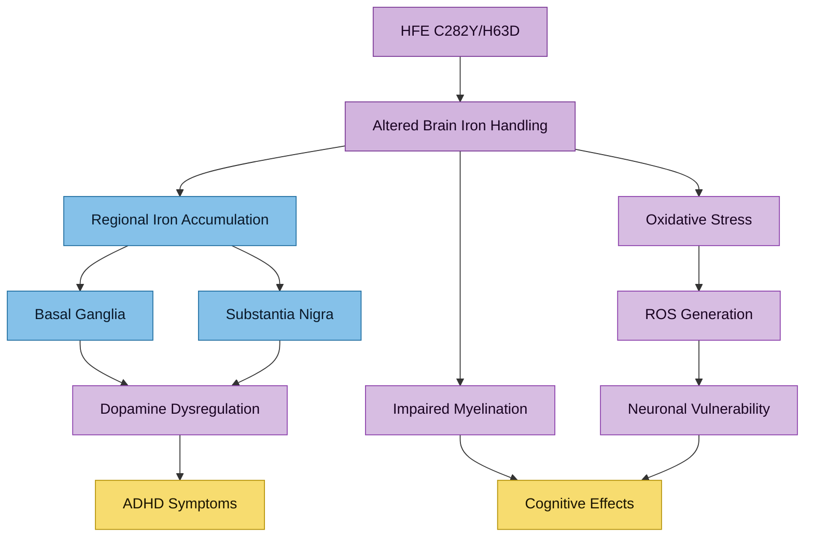

# HFE Variants and Brain Iron

## Key Point
HFE variants are not just liver/iron-panel variants. They can influence brain iron distribution and neurobiology.

## Pathway Overview

> [!info]- Colour Key
> 🟤 HFE | 🔵 Brain region | 🟣 Effect | ⚫ Outcome

## Evidence
- Kalpouzos G et al. *Neuropsychopharmacol Rep* 2021;41(3):393-404 (PMC8411306)
  - C282Y and/or H63D carriage associated with altered blood and brain iron measures
  - Associations with cognitive/motor outcomes examined in healthy adults

- Connor JR. PMID: 21346098
  - HFE variants linked to altered brain iron handling and oxidative stress models

- Kim Y, Connor JR. *Mol Aspects Med* 2020;75:100867
  - HFE genotype modifies mechanisms and presentation across neurological conditions

- Marshall Moscon SL, Connor JR. *Int J Mol Sci* 2024;25(6):3334
  - Review on HFE mutations in neurodegeneration and hormesis framework

## Relevance To Your Context
Your C282Y/H63D genotype plus ADHD/autism and fatigue may involve overlapping pathways:
- peripheral iron loading tendency
- potential CNS iron-handling differences
- oxidative stress vulnerability

This is hypothesis-generating and should not be over-interpreted clinically without targeted imaging/neurology context.

## Cross-References
- [[HFE Compound Heterozygosity]]
- [[Iron-Dopamine-ADHD Axis]]
- [[Fatigue and Burnout]]
