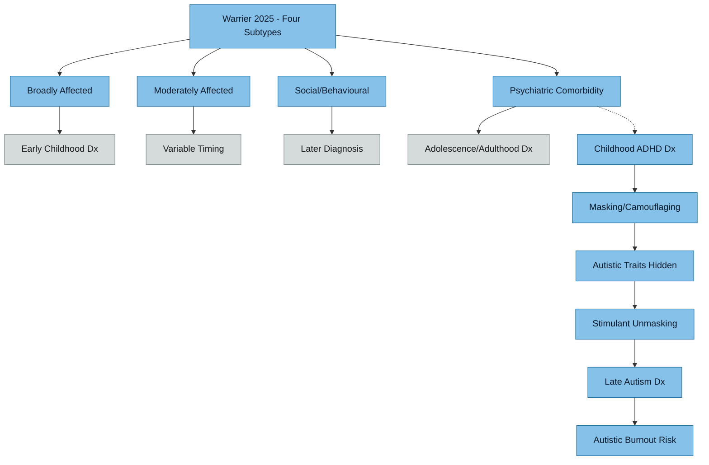

# Late-Diagnosed Autism — A Distinct Profile

## Key Finding

Recent large-scale genetic research (2025) demonstrates that late-diagnosed autism is not simply "mild autism missed" — it represents a **biologically distinct subtype** with its own genetic architecture, comorbidity profile, and developmental trajectory.

## Diagnostic Pathway and Subtypes

> [!info]- Colour Key
> 🔵 Subtype | ⚫ Timing | 🟣 Pathway | 🟡 Link

## The Princeton/Simons Foundation Study (2025)

Warrier V et al. *Nature* 2025 (SPARK cohort, n=18,965; iPSYCH cohort, n=28,165)

### Four Clinically Distinct Subtypes Identified

| Subtype | Key Features | Diagnosis Timing |
|---------|-------------|-----------------|
| Broadly Affected | Language/motor delays, intellectual disability | Early childhood |
| Moderately Affected | Mixed developmental and psychiatric features | Variable |
| Social and Behavioural Challenges | Few developmental delays, social difficulties | Later diagnosis |
| Psychiatric Comorbidity | ADHD, anxiety, OCD, depression prominent | Adolescence/adulthood |

### Critical Insights
- **Age at diagnosis was the strongest predictor of subtype**
- Early-diagnosed children had delays in language, motor skills, and overall development
- Late-diagnosed individuals were more likely to have **ADHD, OCD, anxiety, and depression**
- Each subtype had its own **biological signature with little to no overlap** in impacted pathways
- The genetic profiles of early vs. late diagnosis were "only moderately correlated with each other"
- Common SNPs accounted for 11% of diagnostic age variance
- **No link** between rare de novo variants and age at diagnosis — suggesting late diagnosis is driven by common genetic variation, not simply "less severe" rare mutations

### Relevance to Anthony's Profile
The "Psychiatric Comorbidity" and "Social and Behavioural Challenges" subtypes map closely to Anthony's presentation:
- Late diagnosis (age 37)
- ADHD as the leading comorbidity
- Anxiety and compulsive features (trichotillomania)
- No language or motor delays in childhood
- Unmasking via ADHD medication rather than early developmental flags

## Masking and Camouflaging

### Definition
Camouflaging refers to the conscious or unconscious strategies autistic people use to hide or compensate for autistic traits in social situations. This includes:
- **Compensation**: learning social scripts, rehearsing responses, intellectual analysis of social cues
- **Masking**: suppressing stimming, forcing eye contact, mimicking neurotypical behaviour
- **Assimilation**: structuring environment to avoid situations that would reveal differences

### Cognitive Cost of Masking
- Masking is cognitively expensive — it depletes executive function resources
- Hull L et al. *Autism* 2017;21(8):1097-1106 — first systematic qualitative study of camouflaging, identified motivations (conventional, relational, safety) and consequences (exhaustion, identity confusion, delayed diagnosis)
- Livingston LA et al. *J Child Psychol Psychiatry* 2019;60(5):572-583 — proposed compensatory cognitive mechanisms that allow some autistic individuals to achieve typical social behaviour scores despite atypical neural processing

### Male Masking Patterns
Males are often assumed to present "obviously" autistic, but late-diagnosed males frequently:
- Developed intellectual compensatory strategies that obscured social difficulties
- Were labelled as "quirky", "intense", or "socially awkward" rather than autistic
- Had ADHD symptoms that dominated clinical attention
- Presented with internalising rather than externalising behaviours

## Stimulant-Mediated Unmasking

When ADHD medication reduces the "noise" of ADHD symptoms:
- Executive function improves → capacity for masking decreases (paradoxically)
- ADHD symptoms that overshadowed autistic traits are controlled → autistic traits become visible
- Enhanced focus can increase **awareness** of sensory sensitivities and social differences
- The individual may notice stimming urges, sensory overload, and social exhaustion that were previously attributed to ADHD

### Mechanism
- Stimulants primarily enhance dopaminergic and noradrenergic transmission
- In AuDHD, ADHD symptoms may have functioned as a "mask over the mask" — the distractibility and impulsivity of ADHD ironically helped avoid the social and sensory situations that would reveal autistic traits
- When stimulants bring focus, the autistic neurology becomes the predominant experience

## AuDHD — The Dual Diagnosis

### Prevalence
- 20-50% of children with ADHD meet criteria for ASD (Canals et al. *Autism Research* 2024)
- 30-80% of ASD children meet criteria for ADHD
- AuDHD prevalence in general population estimated at 0.51% (0.28-0.74%)
- Significant sex difference: 0.16% in females, 0.89% in males

### Distinct Challenges
- AuDHD is not simply "autism + ADHD" — the conditions interact in complex ways
- Stimulants work differently in AuDHD vs ADHD-only populations
- More effective for those with higher IQs and lower autism support needs
- Can increase sensory sensitivity, rigid thinking, and perseverative thoughts
- First-line treatment remains methylphenidate or lisdexamfetamine (Elvanse)

### Genetic Overlap
- Shared GWAS loci identified between autism and ADHD
- Distinct from simple additive genetic risk — suggests shared neurobiological pathways
- Late-diagnosis genetic group showed stronger correlations with ADHD than early-diagnosis group (Warrier et al. 2025)

## Implications for Anthony

1. **His late diagnosis is not a diagnostic error or "borderline" autism** — it likely represents a genetically distinct subtype
2. **The ADHD-first diagnostic pathway is typical** for this subtype
3. **Elvanse unmasking autistic traits is a recognised phenomenon**, not a medication side effect
4. **His fatigue may partly reflect the cumulative cost of decades of masking** — autistic burnout from prolonged camouflaging
5. **Treatment approach should address both conditions** — ADHD medication alone will not resolve autistic needs (sensory management, social energy budgeting, burnout prevention)

## The Two-Factor Genetic Model (Havdahl et al. 2025)

A separate 2025 *Nature* paper extends the subtype findings by demonstrating that the polygenic architecture of autism decomposes into **two modestly genetically correlated factors**:

- **Factor 1 (early-diagnosed):** Associated with earlier diagnosis, lower social and communication abilities in early childhood, only moderately correlated with ADHD and mental health conditions.
- **Factor 2 (late-diagnosed):** Associated with later diagnosis, increased socioemotional and behavioural difficulties emerging in **adolescence**, and moderate-to-high positive genetic correlations with **ADHD and mental health conditions**.

Using longitudinal data from four independent birth cohorts, the study demonstrates two different socioemotional and behavioural trajectories associated with age at diagnosis. Anthony's profile maps precisely onto Factor 2.

**Citation:** Havdahl A, et al. "Polygenic and developmental profiles of autism differ by age at diagnosis." *Nature* (2025). DOI: [10.1038/s41586-025-09542-6](https://www.nature.com/articles/s41586-025-09542-6)

## Differential Stimulant Response in AuDHD

- **75% of ADHD-only** individuals respond positively to stimulants, but only **49% of AuDHD** individuals do
- Autistic individuals show heightened sensitivity to stimulant side effects
- The most frequently prescribed stimulants in AuDHD populations are lisdexamfetamine (19%) and methylphenidate ER (19%)

**Citation:** Mahfouda S, et al. "Understanding the Diversity of Pharmacotherapeutic Management of ADHD With Co-occurring Autism." *Frontiers in Psychiatry* (2022). DOI: [10.3389/fpsyt.2022.914668](https://www.frontiersin.org/journals/psychiatry/articles/10.3389/fpsyt.2022.914668/full)

## Physiological Stress of Masking

Camouflaging has documented physiological effects beyond subjective exhaustion:
- Associated with **increased hair cortisol concentration** (a biomarker of chronic stress), particularly in autistic and adult subsamples — direct physiological evidence that masking produces measurable chronic stress responses
- Meta-analysis of 16 studies (n=5,897) found **significant moderate positive relationships** between camouflaging and anxiety, depression, and social anxiety, with effects unrelated to participant age, sex, or diagnosis status

**Citations:**
- "The impact of camouflaging autistic traits on psychological and physiological stress: a co-twin control study." *PMC* (2025). [PMC12659362](https://pmc.ncbi.nlm.nih.gov/articles/PMC12659362/)
- Khudiakova N, et al. "A systematic review and meta-analysis of mental health outcomes associated with camouflaging in autistic people." *Research in Autism Spectrum Disorders* (2024). [ScienceDirect](https://www.sciencedirect.com/science/article/pii/S1750946724001673)

## Male Late-Diagnosis Patterns

Males are missed for different reasons than females:
- Behaviours dismissed as typical gender-conforming activities (hyperactivity, intense hobby focus, preference for solitary activities) mask underlying autistic traits
- The stereotype that "male autism is obvious" paradoxically causes clinicians to assume a man not diagnosed as a child cannot be autistic
- ~50% of autistic individuals experience **alexithymia** (difficulty identifying and describing emotions), compared to ~5% of the general population — this prevents self-recognition of difficulties and delays help-seeking
- Individual differences in camouflaging are **independent of IQ** — high intelligence does not explain masking; it is a separate, socially driven compensatory process

**Citations:**
- Stagg SD, Belcher H. "Late diagnosis of autism: exploring experiences of males diagnosed with autism in adulthood." *Current Psychology* (2022). DOI: [10.1007/s12144-022-03514-z](https://link.springer.com/article/10.1007/s12144-022-03514-z)
- Kinnaird E, et al. "Investigating alexithymia in autism: A systematic review and meta-analysis." *PMC* (2019). [PMC6331035](https://pmc.ncbi.nlm.nih.gov/articles/PMC6331035/)
- Lai MC, et al. "Quantifying and exploring camouflaging in men and women with autism." *Autism* (2017). [PMC5536256](https://pmc.ncbi.nlm.nih.gov/articles/PMC5536256/)

## Compensatory Strategies Taxonomy

Compensatory strategies that delay diagnosis fall into several categories:
- **Behavioural masking:** Suppressing stimming, atypical reactions, genuine responses
- **Scripting:** Planning and rehearsing conversations in advance
- **Rule learning:** Memorising verbal and non-verbal social rules
- **Accommodation:** Structuring environments to reduce demand

In one study of 126 formally diagnosed autistic adults, 111 (88%) reported delayed diagnosis into adulthood. Compensation improves social relationships and employment outcomes but comes at the cost of poor mental health and delayed diagnosis.

**Citation:** Livingston LA, et al. "Quantifying compensatory strategies in adults with and without diagnosed autism." *Molecular Autism* (2019). DOI: [10.1186/s13229-019-0308-y](https://molecularautism.biomedcentral.com/articles/10.1186/s13229-019-0308-y)

## Open Questions
- Would formal assessment of masking/camouflaging burden help quantify burnout risk?
- Does the genetic subtype classification have implications for iron metabolism or HFE variant penetrance?
- Are there intervention approaches specifically designed for the late-diagnosed AuDHD phenotype?
- Would alexithymia screening inform therapeutic approach and explain difficulty with emotional self-report?

---

## Verified Academic Citations

Citations verified via PubMed and OpenAlex on 2026-03-22. Organised by topic relevance to Anthony's case.

### Genetic Architecture and Autism Subtypes

1. **Warrier V, Zhang X, Reed P, et al.** "Genetic correlates of phenotypic heterogeneity in autism." *Nature Genetics* 2022;54(9):1293-1304. PMID: [35654973](https://pubmed.ncbi.nlm.nih.gov/35654973/). DOI: 10.1038/s41588-022-01072-5.
   - *Relevance*: Foundational study (n=12,893 autistic individuals, SPARK/iPSYCH cohorts) demonstrating that common genetic variants — not rare de novo mutations — drive phenotypic differences including age at diagnosis. Higher autism PGS associated with lower likelihood of co-occurring intellectual disability. Directly supports the note's claim that late diagnosis reflects distinct genetic architecture rather than "mild" autism.

2. **Rolland T, Cliquet F, Anney RJL, et al.** "Phenotypic effects of genetic variants associated with autism." *Nature Medicine* 2023;29(7):1671-1680. PMID: [37365347](https://pubmed.ncbi.nlm.nih.gov/37365347/). DOI: 10.1038/s41591-023-02408-2.
   - *Relevance*: Study of >13,000 autistic and 210,000 undiagnosed individuals showing that rare LoF variants in autism-associated genes produce measurable effects (fluid intelligence, qualifications) even in individuals without an autism diagnosis. Underscores that autism-related genetic variation operates on a spectrum, supporting the concept of distinct phenotypic subtypes including those diagnosed later.

3. **Leblond CS, Rolland T, Barthome E, et al.** "A Genetic Bridge Between Medicine and Neurodiversity for Autism." *Annual Review of Genetics* 2024;58. DOI: 10.1146/annurev-genet-111523-102614.
   - *Relevance*: Review bridging the genetic architecture of autism with the neurodiversity framework. Distinguishes between individuals with large-effect rare variants (often with ID, early diagnosis) and those with common polygenic risk (often without ID, later diagnosis) — the latter mapping to Anthony's profile.

### AuDHD and Co-occurring ADHD

4. **Michelini G, Carlisi CO, Eaton NR, et al.** "Where do neurodevelopmental conditions fit in transdiagnostic psychiatric frameworks? Incorporating a new neurodevelopmental spectrum." *World Psychiatry* 2024;23(3):333-357. PMID: [39279404](https://pubmed.ncbi.nlm.nih.gov/39279404/). DOI: 10.1002/wps.21225.
   - *Relevance*: Landmark paper proposing a "neurodevelopmental spectrum" dimension that accounts for the high co-occurrence of autism and ADHD. Argues that dimensional approaches better capture the AuDHD phenotype than categorical diagnoses alone. Supports understanding Anthony's combined presentation as a position on this spectrum rather than two discrete conditions.

5. **Zaleski AL, Craig KJT, Khan R, et al.** "Real-world evaluation of prevalence, cohort characteristics, and healthcare utilization and expenditures among adults and children with autism spectrum disorder, attention-deficit hyperactivity disorder, or both." *BMC Health Services Research* 2025;25(1):1048. PMID: [40783757](https://pubmed.ncbi.nlm.nih.gov/40783757/). DOI: 10.1186/s12913-025-13296-2.
   - *Relevance*: Large-scale real-world data (n=2,392,855) from a national payor. Found AuDHD prevalence of 0.1% in adults and 0.6% in children. AuDHD individuals had highest healthcare utilisation and behavioural health comorbidity burden, confirming the clinical complexity of the dual diagnosis.

6. **Brancati GE, De Rosa U, Magnesa A, et al.** "Autism spectrum traits in adults with attention-deficit/hyperactivity disorder (ADHD): a hidden multifaceted phenotype marked by affective comorbidity, emotional dysregulation, and chronobiological disturbances." *European Archives of Psychiatry and Clinical Neuroscience* 2025. PMID: [40960503](https://pubmed.ncbi.nlm.nih.gov/40960503/). DOI: 10.1007/s00406-025-02114-9.
   - *Relevance*: Directly relevant — found that 21.9% of adults with ADHD screened positive for ASD. Those with comorbid ASD traits had higher age at first clinical referral, greater emotional dysregulation, more mood/anxiety comorbidity, and evening chronotype. Describes the "hidden phenotype" of autism in adults diagnosed with ADHD, paralleling Anthony's trajectory.

7. **Craddock E.** "Being a Woman Is 100% Significant to My Experiences of Attention Deficit Hyperactivity Disorder and Autism: Exploring the Gendered Implications of an Adulthood Combined Autism and Attention Deficit Hyperactivity Disorder Diagnosis." *Qualitative Health Research* 2024;34(14):1442-1455. PMID: [39025117](https://pubmed.ncbi.nlm.nih.gov/39025117/). DOI: 10.1177/10497323241253412.
   - *Relevance*: First IPA study of adulthood AuDHD diagnosis. While focused on women, establishes key concepts: the "gendered burden" of masking, epistemic injustice of not knowing one is neurodivergent, and the trauma of late identification. The masking and epistemic injustice themes apply across genders.

8. **Craddock E.** "Navigating residual diagnostic categories: The lived experiences of women diagnosed with autism and ADHD in adulthood." *Health (London)* 2026;30(2):235-257. PMID: [40258189](https://pubmed.ncbi.nlm.nih.gov/40258189/). DOI: 10.1177/13634593251336163.
   - *Relevance*: Introduces the concept of AuDHD as a "residual diagnostic category" not formally represented in DSM/ICD, generating identity ambivalence. Describes the tension between ADHD and autism as "two separate parts of my brain" vs "two sides of the same coin." Relevant to understanding the identity integration challenges of a new dual diagnosis.

9. **Christiansen GB, Petersen LV, Chatwin H, et al.** "The role of co-occurring conditions and genetics in the associations of eating disorders with attention-deficit/hyperactivity disorder and autism spectrum disorder." *Molecular Psychiatry* 2025;30(5):2127-2136. PMID: [39543370](https://pubmed.ncbi.nlm.nih.gov/39543370/). DOI: 10.1038/s41380-024-02825-w.
   - *Relevance*: Large Danish population study (iPSYCH) demonstrating genetic overlap between ASD/ADHD and other psychiatric conditions, with mood/anxiety disorders mediating 44-100% of associations. Supports the observation that psychiatric comorbidities in Anthony's profile may share underlying genetic architecture with his neurodevelopmental conditions.

### Late Diagnosis

10. **Russell AS, McFayden TC, McAllister M, et al.** "Who, when, where, and why: A systematic review of 'late diagnosis' in autism." *Autism Research* 2025;18(1):22-36. PMID: [39579014](https://pubmed.ncbi.nlm.nih.gov/39579014/). DOI: 10.1002/aur.3278.
    - *Relevance*: Comprehensive systematic review (N=420 studies, 1989-2024) finding no consensus on what constitutes "late" diagnosis — cutoffs ranged from 2 to 55 years with a bimodal distribution at ages 3 and 18. Only 34.7% of studies defined the threshold. Contextualises Anthony's diagnosis at 37 as clearly within the adult late-diagnosis category.

11. **Kentrou V, Livingston LA, Grove R, et al.** "Perceived misdiagnosis of psychiatric conditions in autistic adults." *EClinicalMedicine* 2024;71:102586. PMID: [38596613](https://pubmed.ncbi.nlm.nih.gov/38596613/). DOI: 10.1016/j.eclinm.2024.102586.
    - *Relevance*: Study of 1,211 autistic adults finding that 24.6% reported at least one prior psychiatric diagnosis perceived as a misdiagnosis. Personality disorders, anxiety, mood disorders, and ADHD were the most common perceived misdiagnoses. Men reported perceived misdiagnosis at 16.7%. Demonstrates how the ADHD-first pathway common in late-diagnosed adults can delay autism recognition.

12. **Au-Yeung SK, Bradley L, Robertson AE, et al.** "Experience of mental health diagnosis and perceived misdiagnosis in autistic, possibly autistic and non-autistic adults." *Autism* 2019;23(6):1508-1518. PMID: [30547677](https://pubmed.ncbi.nlm.nih.gov/30547677/). DOI: 10.1177/1362361318818167.
    - *Relevance*: Earlier foundational study showing autistic adults were more likely than non-autistic adults to receive mental health diagnoses but less likely to agree with them. Participants reported autism characteristics being confused with mental health conditions. Highlights the clinical barriers of poor autism awareness in healthcare professionals.

### Camouflaging and Masking

13. **Zhuang S, Tan DW, Reddrop S, et al.** "Psychosocial factors associated with camouflaging in autistic people and its relationship with mental health and well-being: A mixed methods systematic review." *Clinical Psychology Review* 2023;105:102335. PMID: [37741059](https://pubmed.ncbi.nlm.nih.gov/37741059/). DOI: 10.1016/j.cpr.2023.102335.
    - *Relevance*: Major systematic review (58 studies, n=6,588) identifying camouflaging as a socially motivated response linked to adverse psychosocial outcomes. Predominantly featured White, late-diagnosed autistic adults — closely matching Anthony's demographic. Identifies social norms, acceptance/rejection, and self-esteem as key correlates of camouflaging.

14. **Klein J, Krahn R, Howe S, et al.** "A systematic review of social camouflaging in autistic adults and youth: Implications and theory." *Development and Psychopathology* 2025;37(3):1320-1334. PMID: [39370528](https://pubmed.ncbi.nlm.nih.gov/39370528/). DOI: 10.1017/S0954579424001159.
    - *Relevance*: Systematic review finding bidirectional associations between camouflaging and mental health, cognition, and age of diagnosis. Self-protection and desire for social connection motivate camouflaging. Notes that females were more likely to camouflage. Contextualises the higher-than-expected masking burden in late-diagnosed males like Anthony who developed intellectual compensatory strategies.

15. **Moore HL, Cassidy S, Rodgers J.** "Exploring the mediating effect of camouflaging and the moderating effect of autistic identity on the relationship between autistic traits and mental wellbeing." *Autism Research* 2024;17(7):1391-1406. PMID: [38108621](https://pubmed.ncbi.nlm.nih.gov/38108621/). DOI: 10.1002/aur.3073.
    - *Relevance*: Study of 627 autistic adults finding that "assimilation" (putting on an act) was the specific camouflaging facet that mediated the relationship between autistic traits and all measures of mental wellbeing. Autistic identity was not a significant moderator. Suggests that reducing the need for assimilation, rather than simply fostering identity, is the key therapeutic target.

16. **Khudiakova V, Alexandrovsky M, Ai W, Lai MC.** "What We Know and Do Not Know About Camouflaging, Impression Management, and Mental Health and Wellbeing in Autistic People." *Autism Research* 2025;18(2):273-280. PMID: [39719862](https://pubmed.ncbi.nlm.nih.gov/39719862/). DOI: 10.1002/aur.3299.
    - *Relevance*: Review proposing a transactional impression management framework for understanding camouflaging. Notes camouflaging is linked to anxiety, depression, suicidality, and autistic burnout, but acknowledges positive outcomes (employment, relationships). Advocates studying context-sensitive camouflaging across social environments.

### Autistic Burnout

17. **Ali D, Bougoure M, Cooper B, et al.** "Burnout as experienced by autistic people: A systematic review." *Clinical Psychology Review* 2025;122:102669. PMID: [41207162](https://pubmed.ncbi.nlm.nih.gov/41207162/). DOI: 10.1016/j.cpr.2025.102669.
    - *Relevance*: Largest systematic review of autistic burnout to date (48 studies, ~4,000 autistic people). Describes burnout as debilitating exhaustion and increased disability, which can be chronic with intermittent crises. Identifies sensory/social overwhelm, camouflaging, stigma, and alexithymia as contributors. Recovery requires rest, solitude, sensory relief, and community support. Directly relevant to Anthony's fatigue concerns and burnout prevention.

18. **Arnold SRC, Higgins JM, Weise J, et al.** "Confirming the nature of autistic burnout." *Autism* 2023;27(7):1906-1918. PMID: [36637293](https://pubmed.ncbi.nlm.nih.gov/36637293/). DOI: 10.1177/13623613221147410.
    - *Relevance*: Survey of 141 autistic adults with burnout experience. Many had been misdiagnosed with depression, anxiety, bipolar disorder, or borderline personality disorder. Burnout leads to exhaustion, withdrawal, and avoidance of "autism unfriendly places." Highlights the need for increased clinical awareness to distinguish autistic burnout from depression.

19. **Arnold SRC, Higgins JM, Weise J, et al.** "Towards the measurement of autistic burnout." *Autism* 2023;27(7):1933-1948. PMID: [36637292](https://pubmed.ncbi.nlm.nih.gov/36637292/). DOI: 10.1177/13623613221147401.
    - *Relevance*: Companion paper developing and testing the AASPIRE Autistic Burnout Measure. Found burnout was connected to masking and depression. Describes autistic burnout as a combination of exhaustion, withdrawal, and cognitive difficulties linked to daily life stress — distinct from occupational burnout.

20. **Mantzalas J, Richdale AL, Li X, Dissanayake C.** "Measuring and validating autistic burnout." *Autism Research* 2024;17(7):1417-1449. PMID: [38660943](https://pubmed.ncbi.nlm.nih.gov/38660943/). DOI: 10.1002/aur.3129.
    - *Relevance*: Psychometric validation of the ABM with 238 autistic adults. Found strong correlations between burnout and depression, anxiety, stress, and fatigue, but only moderate correlations with camouflaging — suggesting burnout has additional drivers beyond masking. The overlap between burnout and depression/fatigue is an important consideration for Anthony's [[Fatigue and Burnout]] assessment.

21. **Bougoure M, Zhuang S, Brett JD, et al.** "Measuring autistic burnout: A psychometric validation of the AASPIRE Autistic Burnout Measure in autistic adults." *Autism* 2026;30(1):20-36. PMID: [40698409](https://pubmed.ncbi.nlm.nih.gov/40698409/). DOI: 10.1177/13623613251355255.
    - *Relevance*: Validation study (n=379) confirming the ABM has excellent internal consistency and can discriminate between currently-experiencing and not-currently-experiencing burnout. Could be a useful self-monitoring tool for Anthony to quantify burnout risk over time.

### Trichotillomania and Autism

22. **Aldakhil AF.** "Sensory-integrated habit reversal intervention for hair pulling and classroom engagement in children with autism: A multiple-baseline pilot study." *Research in Developmental Disabilities* 2026;169:105229. PMID: [41558242](https://pubmed.ncbi.nlm.nih.gov/41558242/). DOI: 10.1016/j.ridd.2026.105229.
    - *Relevance*: Pilot study demonstrating that hair pulling in autistic individuals can be effectively addressed with sensory-integrated habit reversal, combining standard HRT with individualised sensory-regulation strategies. Conceptualises hair pulling as a "developmentally mediated self-regulatory behaviour" — a framing relevant to understanding Anthony's [[Trichotillomania and Neurodevelopmental Links|trichotillomania]] as connected to his autistic sensory profile.

### Suicide Risk in Autism

23. **Reid M, Delgado D, Heinly J, et al.** "Suicidal Thoughts and Behaviors in People on the Autism Spectrum." *Current Psychiatry Reports* 2024;26(11):563-572. PMID: [39348035](https://pubmed.ncbi.nlm.nih.gov/39348035/). DOI: 10.1007/s11920-024-01533-0.
    - *Relevance*: Review identifying autistic burnout, diagnosis timing, and emotion dysregulation as risk factors for suicidality in autistic individuals. Recommends community-partnered, strength-based prevention approaches. Relevant to the broader clinical picture of late-diagnosed adults navigating identity reconstruction.

---

## Cross-References
- [[Iron-Dopamine-ADHD Axis]]
- [[Fatigue and Burnout]]
- [[Elvanse and Mineral Metabolism]]
- [[ADHD-PI and Internal Hyperactivity]]
- [[Trichotillomania and Neurodevelopmental Links]]
- [[HFE Compound Heterozygosity]]
- [[Action Items and Monitoring Plan]]
