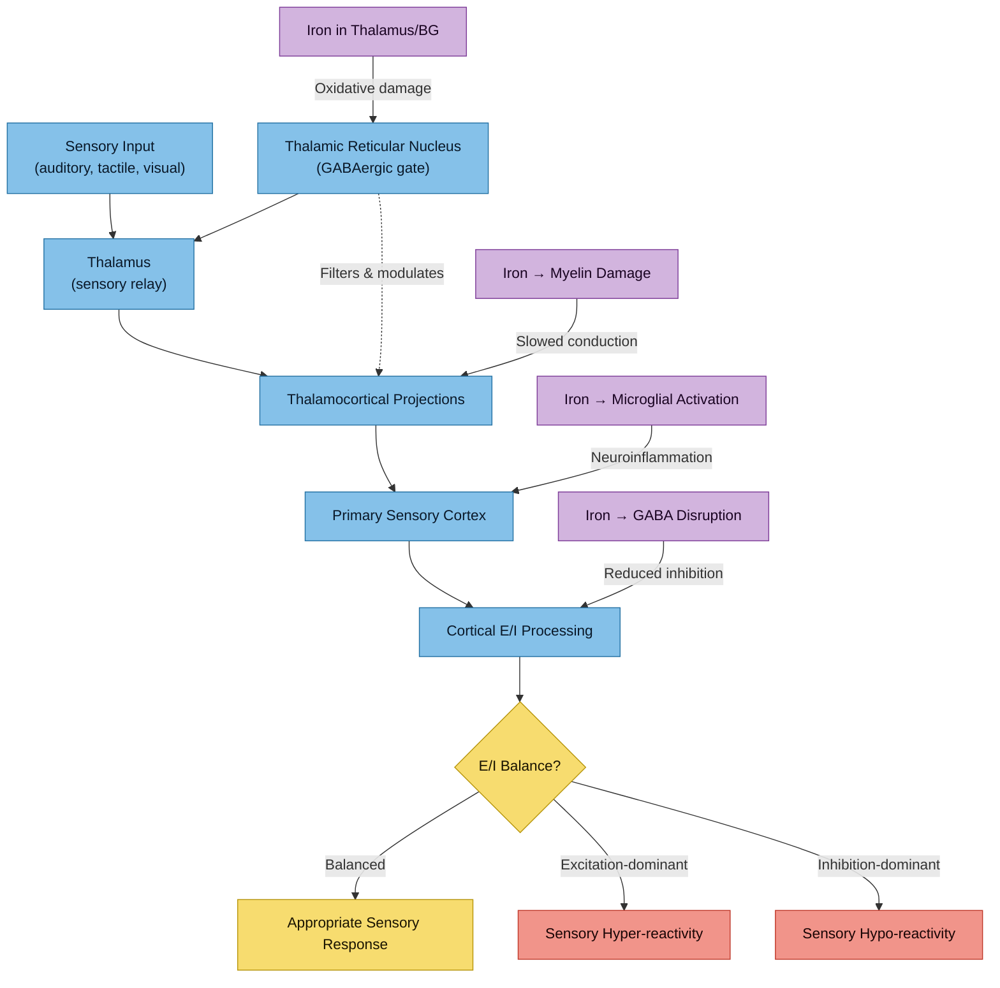
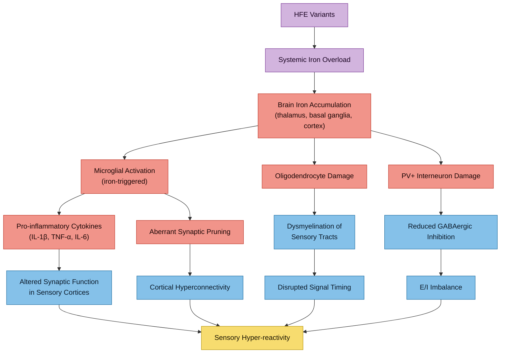

# Sensory Processing, Neuroinflammation, and Iron in Autism

This note covers **exteroceptive** sensory processing (auditory, tactile, visual, olfactory hypersensitivity) and its intersection with neuroinflammation and brain iron dysregulation. For **interoceptive** processing (internal body sensing), see [[Interoception in AuDHD - Research Review]].

> **Evidence Rating Key**
> **A** = Systematic review / meta-analysis
> **B** = Well-designed RCT or large cohort study
> **C** = Controlled observational / small experimental study
> **D** = Case report, narrative review, or theoretical paper

---

## 1. Sensory Processing Differences in Autism

Sensory differences are now a diagnostic criterion for ASD in DSM-5 (Criterion B4: "Hyper- or hyporeactivity to sensory input or unusual interest in sensory aspects of the environment"). Up to 90% of autistic individuals experience some form of atypical sensory processing.

### Sensory Subtypes

Three core patterns are described across the literature:

| Pattern | Description | Example |
|---------|-------------|---------|
| **Hyper-reactivity** | Exaggerated or aversive response to sensory input | Covering ears at moderate noise; pain from clothing textures; overwhelmed by fluorescent lighting |
| **Hypo-reactivity** | Diminished or delayed response to sensory input | High pain threshold; not noticing name being called; apparent indifference to temperature |
| **Sensory seeking** | Active pursuit of intense sensory experiences | Spinning; deep pressure seeking; fascination with visual patterns |

These are not mutually exclusive — most autistic individuals show a mixed profile across modalities.

> **He JL, Williams ZJ, Harris A et al.** "A working taxonomy for describing the sensory differences of autism." *Mol Autism*. 2023;14:15. **PMID: [37041612](https://pubmed.ncbi.nlm.nih.gov/37041612/)** **[D]**
> - Proposes a standardised taxonomy distinguishing sensory sensitivity, reactivity, and perception
> - Argues existing measures conflate distinct constructs, hindering mechanistic understanding
> - Calls for neural marker-based classification rather than behavioural subtypes alone

> **Cheung PPP, Lau BWM.** "Neurobiology of sensory processing in autism spectrum disorder." *Prog Mol Biol Transl Sci*. 2020;173:161-181. **PMID: [32711809](https://pubmed.ncbi.nlm.nih.gov/32711809/)** **[D]**
> - Reviews neurobiological underpinnings across auditory, tactile, visual, and olfactory modalities
> - Identifies altered cortical processing, thalamocortical connectivity, and multisensory integration as core mechanisms

### Neurobiology of Sensory Processing

> [!info]- Colour Key
> 🔵 Normal pathway | 🔴 Disruption | 🟡 Iron effect | 🟣 Outcome



---

## 2. Thalamic Gating and Thalamocortical Connectivity

The **thalamus** acts as the brain's sensory relay station, filtering and modulating all incoming sensory information before it reaches cortical processing areas. The **thalamic reticular nucleus (TRN)** — a thin shell of GABAergic neurons surrounding the thalamus — provides inhibitory gating that determines which sensory signals pass through and which are suppressed.

### Evidence for Disrupted Thalamic Gating in Autism

> **Wood ET, Cummings KK, Jung J et al.** "Sensory over-responsivity is related to GABAergic inhibition in thalamocortical circuits." *Transl Psychiatry*. 2021;11:39. **PMID: [33436538](https://pubmed.ncbi.nlm.nih.gov/33436538/)** **[C]**
> - Sensory over-responsivity correlated with reduced GABA concentration in thalamocortical circuits
> - Lower thalamic GABA predicted greater sensory over-responsivity in youth with ASD
> - Directly implicates GABAergic inhibition in the thalamus as a mechanism for sensory hypersensitivity

> **Green SA, Hernandez L, Bookheimer SY, Dapretto M.** "Reduced modulation of thalamocortical connectivity during exposure to sensory stimuli in ASD." *Autism Res*. 2017;10(5):801-809. **PMID: [27896947](https://pubmed.ncbi.nlm.nih.gov/27896947/)** **[C]**
> - fMRI during mildly aversive sensory stimulation showed reduced modulation of thalamocortical connectivity in ASD
> - Suggests the thalamic "volume control" is impaired — the brain fails to dynamically adjust sensory throughput

> **Linke AC, Chen B, Olson L et al.** "Sleep problems in preschoolers with ASD are associated with sensory sensitivities and thalamocortical overconnectivity." *Biol Psychiatry Cogn Neurosci Neuroimaging*. 2023;8(1):21-29. **PMID: [34343726](https://pubmed.ncbi.nlm.nih.gov/34343726/)** **[C]**
> - Thalamocortical overconnectivity in ASD children correlated with both sensory sensitivities and sleep problems
> - Suggests a shared neural substrate linking sensory processing difficulties and sleep disturbance

> **Wagner L, Banchik M, Okada NJ et al.** "Associations between thalamocortical functional connectivity and sensory over-responsivity in infants at high likelihood for ASD." *Cereb Cortex*. 2023;33(12):7793-7804. **PMID: [37005061](https://pubmed.ncbi.nlm.nih.gov/37005061/)** **[C]**
> - Altered thalamocortical connectivity detectable as early as infancy in those at high likelihood for ASD
> - Suggests thalamic gating differences are present from early development, not secondary adaptations

### Relevance of Thalamic Iron

The thalamus is an iron-rich brain structure. In conditions with brain iron accumulation, thalamic iron deposition can impair the function of GABAergic neurons in the TRN. For someone with [[HFE Variants and Brain Iron|HFE variants]], this creates a plausible mechanism by which systemic iron overload could worsen thalamic sensory gating.

---

## 3. Cortical Excitation/Inhibition (E/I) Balance

The E/I balance hypothesis is one of the most influential frameworks in autism neurobiology: ASD involves a shift toward excitation (glutamate) relative to inhibition (GABA), producing cortical hyperexcitability that manifests as sensory over-responsivity, seizure susceptibility, and difficulty filtering irrelevant stimuli.

### MR Spectroscopy Evidence

> **He JL, Oeltzschner G, Mikkelsen M et al.** "Region-specific elevations of glutamate + glutamine correlate with the sensory symptoms of autism spectrum disorders." *Transl Psychiatry*. 2021;11:411. **PMID: [34326312](https://pubmed.ncbi.nlm.nih.gov/34326312/)** **[C]**
> - MRS showed elevated Glx (glutamate + glutamine) in sensory cortices of autistic adults
> - Glx elevations correlated with self-reported sensory sensitivity scores
> - First direct evidence linking regional glutamate excess to specific sensory symptoms in ASD

> **Johnson AJ, Shankland E, Richards T et al.** "Relationships between GABA, glutamate, and GABA/glutamate and social and olfactory processing in children with ASD." *Psychiatry Res Neuroimaging*. 2024;337:111753. **PMID: [37956467](https://pubmed.ncbi.nlm.nih.gov/37956467/)** **[C]**
> - Reduced GABA/glutamate ratio in ASD children correlated with social and olfactory processing difficulties
> - Confirms E/I imbalance is measurable and functionally relevant in ASD

> **Sapey-Triomphe LA, Puts NAJ, Costa TL et al.** "GABA and Glx predict EEG responses of visual sensitivity in autism." *Autism Res*. 2024;17(5):963-977. **PMID: [38576253](https://pubmed.ncbi.nlm.nih.gov/38576253/)** **[C]**
> - Combined MRS-EEG study: both GABA levels and Glx predicted visual cortical responses in autism
> - Demonstrates that the E/I ratio is a measurable predictor of sensory processing at the cortical level

> **Chen C, Tsai SY, Tahamata VM et al.** "Decoding the brain's excitatory-inhibitory metabolite balance in relation to sensory responsivity and autistic traits." *Neuroimage*. 2025;303:120917. **PMID: [40962237](https://pubmed.ncbi.nlm.nih.gov/40962237/)** **[C]**
> - E/I metabolite balance in sensory cortices predicted individual differences in sensory responsivity
> - Relationship held across both autistic and non-autistic individuals, suggesting a dimensional mechanism

> **Kubota M, Yoshihara Y, Uwatoko T et al.** "Elevated brain glutamine levels in adults with autism spectrum disorder: A 7T MRS study." *Mol Psychiatry*. 2025. **PMID: [41455837](https://pubmed.ncbi.nlm.nih.gov/41455837/)** **[C]**
> - Ultra-high-field 7T MRS revealed elevated glutamine (a glutamate precursor/metabolite) in adult ASD
> - Supports the glutamate excess hypothesis extending into adulthood

### The E/I Balance Framework

> **Sohal VS, Rubenstein JLR.** "Excitation-inhibition balance as a framework for investigating mechanisms in neuropsychiatric disorders." *Mol Psychiatry*. 2019;24:1248-1257. **PMID: [31089192](https://pubmed.ncbi.nlm.nih.gov/31089192/)** **[D]**
> - Influential review arguing E/I imbalance is a cross-diagnostic mechanism across ASD, schizophrenia, and epilepsy
> - Emphasises that parvalbumin-positive (PV+) GABAergic interneurons are critical regulators of E/I balance

> **Ferguson BR, Gao WJ.** "PV interneurons: Critical regulators of E/I balance for prefrontal cortex-dependent behavior and psychiatric disorders." *Front Neural Circuits*. 2018;12:37. **PMID: [29867371](https://pubmed.ncbi.nlm.nih.gov/29867371/)** **[D]**
> - PV+ interneurons are the most metabolically demanding neurons in the cortex
> - Their high mitochondrial content makes them **critically dependent on iron** for electron transport chain function
> - PV+ interneuron dysfunction is a convergent mechanism across ASD, ADHD, and schizophrenia

---

## 4. Iron and the E/I Balance — A Novel Connection

Iron connects to sensory processing through multiple convergent pathways. The existing vault note [[Iron and GABAergic Function]] details iron's indirect effects on GABA signalling. Here we extend this specifically to sensory circuits.

### 4.1 Iron and Parvalbumin Interneurons

PV+ GABAergic interneurons — the fast-spiking inhibitory neurons responsible for cortical gamma oscillations and sensory filtering — are among the most iron-dependent neurons in the brain:

- They have extremely high metabolic demands (high mitochondrial density)
- Mitochondrial electron transport chain complexes I, II, and III require iron-sulphur clusters
- Both iron deficiency (impairing mitochondrial function) and iron overload (oxidative damage) can disable PV+ interneurons

> **Boksa P, Zhang Y, Bhatt D.** "Early development of parvalbumin-, somatostatin-, and cholecystokinin-expressing neurons in rat brain following prenatal immune activation and maternal iron deficiency." *Dev Neurosci*. 2016;38(5):342-353. **PMID: [28214898](https://pubmed.ncbi.nlm.nih.gov/28214898/)** **[C]**
> - Maternal iron deficiency significantly reduced PV+ interneuron density in offspring hippocampus and cortex
> - Combined with immune activation, effects were additive
> - Establishes that iron status during development directly affects the inhibitory interneuron population that regulates E/I balance

### 4.2 Iron, GAD, and GABA Synthesis

GABA is synthesised from glutamate by **glutamic acid decarboxylase (GAD)**, which uses **pyridoxal phosphate (vitamin B6)** as its primary cofactor — not iron directly. However, iron modulates GABA synthesis indirectly:

1. **Monoamine oxidase (MAO)** activity is iron-sensitive — altered MAO affects serotonin and dopamine turnover, both of which modulate GABAergic interneuron function
2. **Tryptophan hydroxylase** (iron-dependent) controls serotonin synthesis, and serotonin extensively modulates GABA interneurons
3. Iron overload in iron-rich structures (globus pallidus, substantia nigra) can selectively damage GABAergic output neurons through oxidative stress

The question "does too much iron produce excess GABA?" has a nuanced answer: iron overload is more likely to **damage GABAergic neurons** through oxidative stress than to increase GABA production, producing a net reduction in inhibitory tone — exactly the direction that worsens sensory hyper-reactivity. See [[Iron and GABAergic Function]] for full mechanistic detail.

### 4.3 Iron and Glutamate Excitotoxicity in Sensory Circuits

Iron overload drives extracellular glutamate accumulation via upregulation of the **System Xc- antiporter** (see [[Iron Glutamate and Excitotoxicity]] for full mechanism). In sensory cortices, elevated extracellular glutamate would:

- Increase excitatory drive at the cortical level
- Compound the E/I imbalance already present in autism
- Potentially produce excitotoxic damage to sensory cortex neurons
- Create a vicious cycle: iron → oxidative stress → System Xc- upregulation → glutamate export → excitotoxicity → mitochondrial damage → more iron release

### 4.4 Iron and Myelination of Sensory Tracts

Oligodendrocytes are the most iron-rich cells in the brain, and iron is required for myelin production (see [[Iron and Myelination]]). Sensory processing depends on precise timing of neural signals — myelination ensures rapid, synchronised conduction along sensory white matter tracts.

In HFE compound heterozygosity:
- **Dysregulated brain iron distribution** could impair oligodendrocyte function regionally
- **Iron overload in oligodendrocytes** (ferroportin trapping) causes myelination deficits and cell death
- **Dysmyelination of thalamocortical tracts** would disrupt the temporal precision of sensory relay, potentially producing both delayed processing and aberrant signal propagation

> **Zhou X, Deng YY, Qian L et al.** "Alterations in brain iron and myelination in children with ASD." *NeuroImage*. 2025;304. **PMID: [40057287](https://pubmed.ncbi.nlm.nih.gov/40057287/)** **[B]**
> - First study using susceptibility source separation to separately quantify iron and myelin in ASD children
> - Both brain iron and myelin alterations co-occurred and correlated with clinical symptom severity
> - Directly establishes the co-occurrence of iron and myelin pathology in ASD brains

---

## 5. Neuroinflammation and Sensory Sensitivity

Neuroinflammation is well-established in autism and creates a direct pathway to altered sensory processing.

### Microglial Activation in Autism

> **Vargas DL, Nascimbene C, Krishnan C et al.** "Neuroglial activation and neuroinflammation in the brain of patients with autism." *Ann Neurol*. 2005;57(1):67-81. **PMID: [15546155](https://pubmed.ncbi.nlm.nih.gov/15546155/)** **[C]**
> - Landmark postmortem study: active neuroinflammation with microglial and astroglial activation across multiple brain regions in ASD
> - Elevated pro-inflammatory cytokines (MCP-1, IL-6, TGF-beta) in cerebrospinal fluid

> **Liao X, Liu Y, Fu X, Li Y.** "Postmortem studies of neuroinflammation in autism spectrum disorder: a systematic review." *Mol Neurobiol*. 2020;57(8):3424-3438. **PMID: [32529489](https://pubmed.ncbi.nlm.nih.gov/32529489/)** **[A]**
> - Systematic review confirming consistent microglial activation across postmortem ASD brain studies
> - Neuroinflammation affects cortical regions involved in sensory and cognitive processing

> **Hu C, Li H, Li J et al.** "Microglia: Synaptic modulator in autism spectrum disorder." *Front Psychiatry*. 2022;13:958661. **PMID: [36465285](https://pubmed.ncbi.nlm.nih.gov/36465285/)** **[D]**
> - Microglia regulate synaptic pruning — aberrant microglial activation alters synaptic density and connectivity
> - Impaired synaptic pruning could contribute to the cortical hyperconnectivity seen in ASD sensory circuits

> **Canada K, Evans TM, Pelphrey KA.** "Microglial regulation of white matter development and its disruption in autism spectrum disorder." *Cereb Cortex*. 2025;35(4). **PMID: [40302613](https://pubmed.ncbi.nlm.nih.gov/40302613/)** **[D]**
> - Microglia regulate white matter (myelin) development
> - Disrupted microglial function in ASD affects both grey and white matter organisation

### Iron Drives Microglial Activation

Iron and neuroinflammation form a bidirectional amplification loop:

> **Ward RJ, Dexter DT, Crichton RR.** "Iron, neuroinflammation and neurodegeneration." *Int J Mol Sci*. 2022;23(13):7267. **PMID: [35806270](https://pubmed.ncbi.nlm.nih.gov/35806270/)** **[D]**
> - Comprehensive review: excess iron activates microglia and promotes pro-inflammatory (M1) polarisation
> - Activated microglia release more iron from ferritin stores, creating a positive feedback loop
> - Iron-driven neuroinflammation is a convergent mechanism across multiple neurological conditions

> **Urrutia PJ, Borquez DA, Nunez MT.** "Inflaming the brain with iron." *Antioxidants (Basel)*. 2021;10(1):61. **PMID: [33419006](https://pubmed.ncbi.nlm.nih.gov/33419006/)** **[D]**
> - Iron overload activates microglia via Fenton chemistry-generated ROS
> - Pro-inflammatory microglia release cytokines (IL-1beta, TNF-alpha, IL-6) that disrupt neuronal function
> - These cytokines can alter neurotransmitter metabolism and synaptic plasticity in sensory circuits

> **McCarthy RC, Sosa JC, Gardeck AM et al.** "Inflammation-induced iron transport and metabolism by brain microglia." *J Biol Chem*. 2018;293(20):7853-7863. **PMID: [29610275](https://pubmed.ncbi.nlm.nih.gov/29610275/)** **[C]**
> - Inflammatory stimuli dramatically increased iron uptake by microglia
> - Activated microglia sequester iron, potentially creating regional iron redistribution
> - This could simultaneously produce iron excess in some brain regions and functional iron deficiency in others

> **Liu S, Gao X, Zhou S.** "New target for prevention and treatment of neuroinflammation: microglia iron accumulation and ferroptosis." *ASN Neuro*. 2022;14:17590914221133236. **PMID: [36285433](https://pubmed.ncbi.nlm.nih.gov/36285433/)** **[D]**
> - Iron-loaded microglia can undergo ferroptosis, releasing their iron contents and amplifying local inflammation
> - Proposes microglial iron management as a therapeutic target for neuroinflammation

### The Iron-Neuroinflammation-Sensory Cascade



---

## 6. ADHD and Sensory Processing — Distinct from Autistic?

Sensory processing differences are common in ADHD but less well-characterised than in autism. The question of how dual diagnosis (AuDHD) affects sensory profile is clinically important.

### ADHD Sensory Profile

> **Li J, Gao Y, Dong M et al.** "The relationship of sensory processing with ADHD and its co-occurring behavioural symptoms based on both undirected and directed network analysis." *BMC Psychiatry*. 2025;25:932. **PMID: [41257654](https://pubmed.ncbi.nlm.nih.gov/41257654/)** **[C]**
> - Sensory processing abnormalities are integral to ADHD, not merely co-occurring
> - Network analysis showed sensory processing directly drives certain ADHD behavioural symptoms
> - Auditory and tactile sensitivity were prominent in ADHD samples

> **Lau-Zhu A, Fritz A, McLoughlin G.** "Overlaps and distinctions between ADHD and ASD in young adulthood: Systematic review and guiding framework for EEG-imaging research." *Neurosci Biobehav Rev*. 2019;96:93-115. **PMID: [30367918](https://pubmed.ncbi.nlm.nih.gov/30367918/)** **[A]**
> - Systematic review of 75 EEG studies: ADHD and ASD show overlapping but distinct neural processing patterns
> - Both conditions show altered early sensory processing (P1, N1 components) but through different mechanisms
> - ADHD: impaired **attentional gating** (failure to allocate attention to relevant sensory streams)
> - ASD: impaired **sensory filtering** (failure to suppress irrelevant sensory input at the thalamic/cortical level)

### AuDHD: Compounding Mechanisms

In co-occurring autism + ADHD, sensory difficulties are expected to be more severe because two distinct mechanisms compound:

1. **Autistic mechanism**: Impaired thalamic gating and E/I imbalance → too much sensory input reaches cortex
2. **ADHD mechanism**: Impaired attentional control → inability to selectively attend to relevant sensory streams amidst the excess input
3. **Combined effect**: Flooded with unfiltered sensory input AND unable to prioritise within that flood

This predicts that AuDHD individuals should report more severe sensory difficulties than either condition alone — consistent with clinical observation but under-studied empirically.

---

## 7. Sensory Overload → Stress → Iron Redistribution Feedback Loop

Sensory overload is not merely unpleasant — it triggers a physiological stress cascade with implications for iron metabolism.

### The Proposed Cascade

```
Sensory overload
    → Autonomic stress response (sympathetic activation)
        → HPA axis activation → cortisol release
            → Cortisol upregulates hepcidin
                → Hepcidin blocks ferroportin
                    → Iron trapped in cells (including brain cells)
                        → Increased intracellular iron
                            → More oxidative stress
                                → More neuroinflammation
                                    → Worsened sensory sensitivity
                                        → More sensory overload
```

### Supporting Evidence

> **Lydon S, Healy O, Reed P et al.** "A systematic review of physiological reactivity to stimuli in autism." *Dev Neurorehabil*. 2016;19(6):335-355. **PMID: [25356589](https://pubmed.ncbi.nlm.nih.gov/25356589/)** **[A]**
> - Systematic review confirming altered physiological reactivity (cortisol, heart rate, electrodermal) to sensory stimuli in autism
> - Sensory stimulation produces measurable stress responses in autistic individuals

> **Salami A et al.** "Elevated neuroinflammation contributes to the deleterious impact of iron overload on brain function in aging." *Neuroimage*. 2021;230:117792. **PMID: [33497770](https://pubmed.ncbi.nlm.nih.gov/33497770/)** **[B]**
> - Brain iron overload triggers neuroinflammation (elevated myo-inositol) which mediates iron's negative impact on frontostriatal brain function
> - Establishes the iron → neuroinflammation → brain dysfunction pathway in humans

The stress-hepcidin-iron link is mechanistically plausible but not yet directly studied in the context of sensory overload. This represents a hypothesis-generating connection between the existing vault notes on [[Autonomic Nervous System and Vagal Tone in AuDHD|autonomic function]], [[research/Hepcidin and Brain Iron Regulation|hepcidin]], and sensory processing. **Evidence level: D (hypothesis).**

---

## 8. Sensory Processing, Sleep, and Burnout

Sensory processing difficulties do not exist in isolation — they interact with sleep and contribute to autistic burnout.

> **Linke AC, Chen B, Olson L et al.** "Sleep problems in preschoolers with ASD are associated with sensory sensitivities and thalamocortical overconnectivity." *Biol Psychiatry Cogn Neurosci Neuroimaging*. 2023;8(1):21-29. **PMID: [34343726](https://pubmed.ncbi.nlm.nih.gov/34343726/)** **[C]**
> - Shared thalamocortical connectivity underlies both sensory sensitivity and sleep problems in ASD

> **Tzischinsky O, Meiri G, Manelis L et al.** "Sleep disturbances are associated with specific sensory sensitivities in children with autism." *Mol Autism*. 2018;9:29. **PMID: [29610657](https://pubmed.ncbi.nlm.nih.gov/29610657/)** **[C]**
> - Tactile and auditory hypersensitivity specifically associated with sleep onset and maintenance difficulties
> - Sensory sensitivity in the sleeping environment directly disrupts sleep architecture

> **Lane SJ, Leao MA, Spielmann V.** "Sleep, sensory integration/processing, and autism: A scoping review." *Front Psychol*. 2022;13:877527. **PMID: [35656493](https://pubmed.ncbi.nlm.nih.gov/35656493/)** **[A]**
> - Scoping review: bidirectional relationship between sensory processing difficulties and sleep disturbance in autism
> - Poor sleep worsens sensory tolerance the following day; sensory overload impairs sleep onset

### The Burnout Cycle

Chronic sensory overload depletes cognitive and emotional resources, contributing to [[Fatigue and Burnout|autistic burnout]]. The cycle: sensory overload → stress response → poor sleep → reduced sensory tolerance → more overload → burnout. For someone with HFE iron overload, iron-mediated neuroinflammation and oxidative stress add a biological substrate that amplifies every step of this cycle. See also [[Poor Sleep and AuDHD-HFE Interactions]].

---

## 9. Does Phlebotomy Improve Sensory Symptoms?

### Direct Evidence

There are **no published studies** specifically examining the effect of phlebotomy or iron reduction on sensory processing in autism or in HFE carriers with sensory difficulties. This represents a significant evidence gap.

### Indirect Evidence

> **McDonnell SM, Preston BL, Jewell SA et al.** "A survey of 2,851 patients with hemochromatosis: symptoms and response to treatment." *Am J Med*. 1999;106(6):619-624. **PMID: [10378618](https://pubmed.ncbi.nlm.nih.gov/10378618/)** **[B]**
> - Large survey of haemochromatosis patients: fatigue and cognitive symptoms showed variable improvement with phlebotomy
> - Joint pain and liver abnormalities responded better than neurological/cognitive symptoms
> - Suggests that once iron has caused CNS changes, peripheral iron reduction may have limited central effects

> **Brown S, Torrens LA.** "Ironing out the rough spots — cognitive impairment in haemochromatosis." *BMJ Case Rep*. 2012. **PMID: [22761228](https://pubmed.ncbi.nlm.nih.gov/22761228/)** **[D]**
> - Case report documenting cognitive impairment in haemochromatosis with improvement following venesection
> - Suggests that at least some CNS effects of iron overload may be partially reversible

### Mechanistic Reasoning

Phlebotomy reduces systemic iron, which would be expected to:
1. Reduce circulating NTBI (non-transferrin-bound iron) that can cross the blood-brain barrier
2. Lower systemic inflammation (iron drives inflammatory cytokine production)
3. Reduce oxidative stress substrate (less Fenton chemistry)
4. Potentially improve microglial activation state over time

However, brain iron regulation is partly independent of peripheral iron (the blood-brain barrier provides some compartmentalisation), and HFE variants may affect brain iron handling independently. **The net effect of phlebotomy on brain-mediated sensory symptoms in HFE carriers is unknown. Evidence level: D (mechanistic hypothesis).**

---

## 10. Practical Management: Sensory Environment Optimisation

While the iron-neuroinflammation connection is being addressed through medical management, environmental and behavioural strategies can reduce sensory load.

### Evidence-Based Strategies

| Strategy | Mechanism | Evidence |
|----------|-----------|----------|
| **Noise-reducing headphones / ear defenders** | Reduces auditory input at source | Widely recommended in autism clinical guidelines |
| **Sensory audit of home/work environment** | Identifies and eliminates avoidable triggers (fluorescent lighting, background noise, strong scents) | Occupational therapy best practice |
| **Weighted blanket / deep pressure** | Activates proprioceptive system, reduces sympathetic arousal | Moderate evidence for anxiety reduction in ASD |
| **Sunglasses / tinted lenses** | Reduces visual overwhelm from bright or flickering light | Limited but positive evidence for visual sensitivity |
| **Sensory breaks / quiet space** | Allows nervous system recovery between exposures | Clinical consensus, limited formal evidence |
| **Sleep environment optimisation** | Blackout curtains, white noise, cool temperature, sensory-friendly bedding | Supported by sleep-sensory research (Tzischinsky et al.) |
| **Exercise** | Modulates autonomic tone, reduces cortisol, consumes iron via haemoglobin turnover | See [[Exercise as Medicine for AuDHD-HFE]] |

### Pharmacological Considerations

- **Phlebotomy** — addresses iron overload at source; may reduce neuroinflammation over time
- **NAC** — reduces glutamate excitotoxicity (System Xc- bypass) and restores GSH; see [[NAC and Iron Metabolism]]
- **Sulforaphane** — Nrf2 activator with evidence in ASD; see [[Iron and Oxidative Stress in Autism]]
- **Magnesium** — NMDA receptor modulation; commonly used for sensory sensitivity in clinical practice (limited formal evidence in ASD)

---

## Clinical Relevance for Anthony

Anthony's profile — AuDHD with HFE C282Y/H63D compound heterozygosity, ferritin 380, TSAT 60% — places him at the intersection of multiple sensory processing risk pathways:

1. **Autistic E/I imbalance**: Reduced GABA/glutamate ratio in sensory cortices → cortical hyperexcitability → sensory hyper-reactivity
2. **ADHD attentional gating**: Impaired selective attention → inability to filter the excess sensory input
3. **Iron-driven neuroinflammation**: Excess brain iron → microglial activation → pro-inflammatory cytokines → further disruption of sensory circuits
4. **Iron and PV+ interneurons**: Iron overload-mediated oxidative stress → damage to the fast-spiking inhibitory neurons that maintain E/I balance
5. **Myelination effects**: Dysregulated iron in oligodendrocytes → potential dysmyelination of thalamocortical sensory tracts → disrupted signal timing
6. **Glutamate excitotoxicity**: HFE-driven System Xc- upregulation → elevated extracellular glutamate in sensory cortices → compounded E/I imbalance
7. **Stress-iron feedback**: Sensory overload → cortisol → hepcidin → iron redistribution → more neuroinflammation → worsened sensitivity

### Priority Actions

1. **Commence phlebotomy** to reduce peripheral iron load and circulating NTBI — this is the single highest-impact intervention for breaking the iron-neuroinflammation cycle
2. **Continue NAC supplementation** — mechanistically addresses both glutamate dysregulation and glutathione depletion
3. **Sensory environment audit** — identify and modify the top 3-5 sensory triggers in home and work environments
4. **Sleep environment optimisation** — given the bidirectional sleep-sensory relationship and existing sleep difficulties
5. **Discuss with GP**: Request MR spectroscopy if available (measure GABA/Glx in sensory cortex) as a potential baseline before iron reduction therapy
6. **Monitor**: Track sensory sensitivity subjectively (e.g., Sensory Profile questionnaire) before and during phlebotomy to detect any changes

### Evidence Gaps Specific to This Profile

- No studies on sensory processing in HFE carriers specifically
- No studies on phlebotomy effects on sensory symptoms
- No studies on E/I balance in AuDHD (co-occurring diagnosis)
- No studies on brain iron in late-diagnosed autistic adults
- The sensory overload → cortisol → hepcidin → iron redistribution loop is hypothesis-generating only

---

## Research Gaps

- Absence of studies on exteroceptive sensory processing specifically in AuDHD (dual diagnosis)
- No direct studies on brain iron and sensory processing in autism
- No intervention studies examining whether iron reduction improves sensory symptoms
- Limited MRS studies of E/I balance in autistic adults (most research in children)
- The role of thalamic iron in sensory gating has not been studied in autism
- Sensory overload → stress → iron redistribution pathway remains theoretical
- No pharmacogenomic studies linking HFE genotype to sensory phenotype

---

## Cross-References

- [[Interoception in AuDHD - Research Review]] — interoceptive (internal) sensory processing
- [[Iron and GABAergic Function]] — E/I balance and iron's effects on GABA
- [[Iron Glutamate and Excitotoxicity]] — iron-driven glutamate excess via System Xc-
- [[Iron and Myelination]] — oligodendrocyte iron dependency and white matter deficits
- [[Iron and Oxidative Stress in Autism]] — Nrf2 pathway and glutathione depletion
- [[HFE Variants and Brain Iron]] — brain iron handling in HFE compound heterozygosity
- [[Ferroptosis and Neuronal Iron]] — iron-dependent cell death in neurons and glia
- [[Autonomic Nervous System and Vagal Tone in AuDHD]] — stress response and sensory processing
- [[Late-Diagnosed Autism - Distinct Profile]] — diagnostic context
- [[Poor Sleep and AuDHD-HFE Interactions]] — sleep-sensory bidirectional relationship
- [[ADHD-PI and Internal Hyperactivity]] — attentional processing in ADHD-PI
- [[Iron and OCD-Spectrum Repetitive Behaviours]] — basal ganglia iron and repetitive behaviours
- [[NAC and Iron Metabolism]] — NAC as glutamate modulator and antioxidant
- [[Exercise as Medicine for AuDHD-HFE]] — exercise as iron management and sensory regulation
- [[Health Research MOC]] — main index
