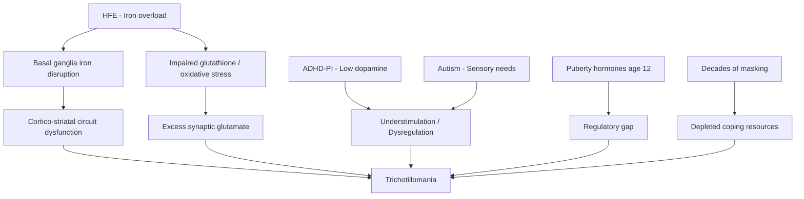

# Trichotillomania and Neurodevelopmental Links

## Overview

Trichotillomania (TTM) is a body-focused repetitive behaviour (BFRB) characterised by recurrent, compulsive hair pulling resulting in hair loss. Anthony's onset at age 12 (puberty) and 25-year history places this within a neurodevelopmental-endocrine framework, not simply "bad habit" or OCD.

## Classification and Reclassification

### Not Simply OCD
- DSM-5 classifies TTM under "Obsessive-Compulsive and Related Disorders" but **distinct from OCD proper**
- TTM lacks the classic obsessive thought → compulsive action cycle of OCD
- BFRBs are increasingly understood as a **separate category** with different neurobiology
- The BFRB spectrum includes: trichotillomania, excoriation (skin picking), onychophagia (nail biting), cheek chewing

### Neuroimaging Differences from OCD
MRI studies show people with TTM have increased grey matter and decreased cerebellar volume compared to controls — a pattern not seen in OCD. Caudate nucleus abnormalities characteristic of OCD are not found in TTM. (Chamberlain SR et al. *Br J Psychiatry* 2008;193(3):216-221. PMID: 18757980)

### A Neurodevelopmental Condition?
Growing evidence suggests TTM should be understood as neurodevelopmental:
- Typical onset at late childhood/early adolescence (puberty)
- High comorbidity with ADHD and autism
- Involves basal ganglia and cortico-striatal circuitry — same circuits implicated in ADHD and autism
- Self-regulatory function rather than anxiety-driven compulsion
- 79% of people with TTM have one or more mental health comorbidities (anxiety, depression, OCD, PTSD, ADHD)

## Links to ADHD

### Dopamine and Understimulation
- Individuals with ADHD have **lower dopamine** in the central nervous system
- BFRBs can be seen as **self-stimulating behaviour** that provides temporary dopamine release
- The "understimulation model": when internal arousal is too low, BFRBs provide sensory input to up-regulate the nervous system
- When arousal is too high (overwhelm), BFRBs down-regulate — creating a **bidirectional regulatory function**

### The Stimulus Regulation Model
Penzel's model defines BFRBs as efforts to regulate internal sensory imbalance:
- **Understimulated** → BFRB provides sensory activation
- **Overstimulated** → BFRB provides grounding/soothing
- This maps directly onto ADHD's arousal dysregulation

### Internal Hyperactivity Connection
Anthony's ADHD-PI with internal hyperactivity creates a specific risk profile:
- Racing internal thoughts → need for grounding → hair pulling as tactile anchor
- See [[ADHD-PI and Internal Hyperactivity]] for mechanism detail

## Links to Autism

### BFRBs vs Stimming
| Feature | Stimming | BFRB |
|---------|---------|------|
| Purpose | Self-regulation, expression | Self-regulation |
| Harm | Usually non-damaging | Results in physical damage |
| Awareness | Variable | Often unaware during episodes |
| Control | Can be voluntary | Difficult to control |
| Distress | Usually not distressing | Distressing due to consequences |

### Prevalence of TTM in Autism
- In a study of 112 children with ASD, the 3-month point prevalence of TTM was 3.9% — nearly twice the general population rate (Simonoff E et al. *J Am Acad Child Adolesc Psychiatry* 2008;47(8):921-929. PMID: 18645422)
- 24.7% of autistic subjects had comorbidity with Tourette syndrome, chronic tics, or trichotillomania (Canitano R, Vivanti G. *Autism* 2007;11(1):19-28. PMID: 17175571)
- Autistic adults describe stimming as an important adaptive self-regulatory mechanism for managing intense emotions, sensory overload, and anxiety (Kapp SK et al. *Autism* 2019;23(7):1782-1792. PMC6728747)

### Overlap
- BFRBs may represent a form of **dysregulated stimming** — the same self-regulatory drive but with harmful execution
- In undiagnosed autistic individuals, the absence of acceptable stim outlets may channel self-regulation into BFRBs
- Sensory-seeking component: the tactile sensation of hair pulling may fulfil an unmet sensory need
- Higher BFRB rates in autism than general population

### Why CBT Failed
Anthony tried CBT for trich before knowing about his AuDHD. Standard Habit Reversal Training (HRT) often fails in neurodivergent populations because:
1. **It ignores the regulatory function** — simply replacing the behaviour doesn't address the underlying sensory/arousal need
2. **Executive function demands** — HRT requires self-monitoring and response inhibition, both compromised in ADHD
3. **Doesn't account for masking fatigue** — autistic people may lack cognitive resources for additional self-monitoring
4. **No sensory alternative** — standard competing responses may not match the sensory profile needed
5. **CBT assumes neurotypical emotional processing** — may not translate well to autistic internal experience

## Puberty Onset — Why Age 12?

### Hormonal Triggers
- Puberty brings massive neurohormonal changes
- **Testosterone** increases dopaminergic activity but also changes reward sensitivity
- **Cortisol axis** maturation alters stress responses
- The prefrontal cortex is still developing while hormonal drives increase — creating a regulatory gap
- Lower progesterone was associated with more severe TTM symptoms in adolescent females; puberty hormones and stress hormones may trigger hair pulling in genetically predisposed individuals (Chamberlain SR et al. *Psychiatry Res* 2018;267:190-194. PMID: 29753253)
- In adolescents, the prevalence of ADHD among TTM patients was 39.9% versus 19.9% in controls (Stein DJ et al. *J Am Acad Child Adolesc Psychiatry* 2023;62(10):S282-S283)

### Neurodevelopmental Timing
- Late childhood/early adolescence is when social demands escalate
- For an undiagnosed autistic individual, social masking demands peak at this age
- The increased cognitive load of masking + hormonal changes + ADHD executive dysfunction creates a perfect storm for BFRB emergence
- Hair pulling may have emerged as an unconscious coping mechanism for an overwhelmed nervous system

## Iron, Minerals, and Trichotillomania

### Iron
- Basal ganglia have the highest iron concentration in the brain
- OCD-spectrum conditions show altered iron deposition in globus pallidi (decreased T2 relaxation values suggesting increased iron)
- Anthony's iron overload (TSAT 60%) may contribute to basal ganglia dysfunction affecting cortico-striatal circuits
- **Hypothesis**: excess iron in basal ganglia could disrupt the reward/habit circuitry that underlies BFRBs
- NBIA disorders (genetic conditions causing brain iron accumulation in basal ganglia) feature prominent OCD, hyperactivity, impulsivity, vocal/motor tics, and compulsive behaviours — demonstrating the principle that excessive iron in basal ganglia drives compulsive behaviours (Gregory A, Hayflick SJ. *GeneReviews*. PMID: 20301750)
- In C282Y/H63D compound heterozygotes, brain iron MRI measures show associations with altered iron distribution, though with smaller effect sizes than C282Y homozygotes (Atkins JL et al. *J Alzheimers Dis* 2021;79(3):1203-1211. PMC7990419)
- Haemochromatosis patients are at greater risk of poor mental health; case reports document bipolar disorder, major depression, and psychosis that partially or completely resolved after phlebotomy

### Zinc
- Anthony's zinc is low-normal (12.5 umol/L, 12% into range)
- Zinc is a cofactor for over 300 enzymes including those in neurotransmitter synthesis
- Zinc deficiency is associated with impaired impulse control
- Zinc modulates glutamate receptors (NMDA) — and the glutamate hypothesis is central to TTM

### Vitamin D
- TTM was significantly associated with vitamin D deficiency (OR 4.2)
- Case reports show resolution of TTM symptoms with vitamin D3 supplementation over 3-4 months
- Anthony's vitamin D status is **untested** — this should be checked
- See [[Action Items and Monitoring Plan]] — vitamin D was already flagged as not yet tested

## Neurobiology — The Glutamate Hypothesis

### Central Role of Glutamate
- TTM involves dysregulation of glutamatergic signalling in cortico-striatal-thalamic circuits
- Excessive glutamate in the nucleus accumbens and striatum drives compulsive behaviours
- The glutamate transporter system (particularly in astrocytes) is impaired
- This creates an excitatory/inhibitory imbalance

### The Cystine-Glutamate Antiporter (System Xc-)
- System Xc- exchanges extracellular cystine for intracellular glutamate
- In TTM, this system may be dysregulated → excess synaptic glutamate
- **NAC (N-acetylcysteine) targets this system directly** — see treatment section

### Iron's Role in Glutamate
- Glutamate-cysteine ligase (the rate-limiting enzyme in glutathione synthesis) is iron-dependent
- Iron overload may impair glutathione production → impaired glutamate clearance → excitotoxicity loop
- This provides a mechanistic link between Anthony's iron overload and his trichotillomania

## Genetics of Trichotillomania

| Gene | Function | Relevance |
|------|----------|-----------|
| SAPAP3 (DLGAP3) | Post-synaptic scaffold at glutamate synapses | Animal knockouts show compulsive grooming |
| SLITRK1 | Neurite outgrowth in cortico-striatal circuits | Associated with TTM and Tourette's |
| SLC6A4 | Serotonin transporter | Modulates serotonergic tone; BFRB associations |
| HoxB8 | Expressed in microglia and cortico-striatal circuits | HoxB8 knockout mice show excessive grooming |
| SLC1A1 | Neuronal glutamate transporter | OCD-spectrum associations |
| GRIN2B | NMDA receptor subunit | Glutamate signalling in reward/habit circuits |

## Evidence-Based Treatments

### NAC (N-Acetylcysteine)
**Mechanism**: Restores cystine-glutamate antiporter function → reduces excess synaptic glutamate → normalises cortico-striatal signalling

**Evidence**:
- Grant JE et al. *Arch Gen Psychiatry* 2009;66(7):756-763 — **56% of adults** improved on NAC vs 16% on placebo in RCT (PMID: 19581567)
- Typical dose: 1200-2400mg/day
- Onset: 4-9 weeks for effect
- **Note**: paediatric trial (Bloch MH et al. 2013) showed no benefit in children age 8-17 — the adult evidence is stronger

**Additional Benefits for Anthony's Profile**:
- NAC is also a glutathione precursor → addresses oxidative stress from iron overload
- NAC has evidence in autism for reducing irritability
- NAC may improve mitochondrial function
- **Multi-target molecule** hitting TTM, iron-related oxidative stress, and neuroinflammation

### Inositol
- Regulates serotonergic receptor signalling (phosphoinositide second messenger system)
- Evidence in OCD: as effective as SSRIs in small studies (Fux M et al. 1996)
- Anecdotal evidence in TTM at 18g/day doses
- Mechanism distinct from NAC — targets serotonin rather than glutamate
- Could potentially complement NAC

### Memantine (Glutamate Confirmation)
- RCT of memantine (another glutamate modulator) in 100 adults with TTM or skin-picking disorder: **60.5% improved on memantine vs. 8.3% on placebo** (NNT=1.9), strongly supporting the glutamate hypothesis for BFRBs with a second agent
- Grant JE et al. *Am J Psychiatry* 2023;180(5):348-356. PMID: [36856701](https://pubmed.ncbi.nlm.nih.gov/36856701/) — already cited in Verified Citations section

### Comprehensive Behavioural Treatment (ComB)
- Addresses sensory, cognitive, affective, and motor factors individually rather than treating TTM as a unitary habit
- 35% clinical response in RCT (Falkenstein MJ et al. *Behav Ther* 2022;53(2):361-373. PMID: 34656205)

### ACT-Enhanced Behaviour Therapy
- Combines HRT with acceptance and commitment therapy to address emotional drivers and psychological inflexibility
- Citation: Woods DW, Twohig MP. *Trichotillomania: An ACT-enhanced Behavior Therapy Approach*. Oxford University Press, 2008

### Modified CBT/HRT for Neurodivergent People
- Standard HRT should be adapted for AuDHD:
  - Incorporate sensory alternatives that match the specific sensory profile
  - Account for executive function limitations
  - Address the underlying regulatory need, not just the behaviour
  - Use external cues rather than relying on self-monitoring
  - Consider fidget tools, textured objects, or other sensory substitutes

### Stimulant Medication
- Elvanse may partially help TTM by improving dopamine tone and reducing understimulation-driven pulling
- Some individuals report reduced BFRBs on stimulant medication
- Others report worsening (increased focus on the pulling sensation)
- Effect is variable and should be monitored

## Summary Model

---

## Verified Academic Citations

Citations verified via PubMed and OpenAlex on 2026-03-22. Organised by topic area.

### TTM-ADHD Comorbidity

1. **Chesivoir EK, Valle S, Grant JE.** Comorbid trichotillomania and attention-deficit hyperactivity disorder in adults. *Compr Psychiatry*. 2022;116:152317. PMID: [35512574](https://pubmed.ncbi.nlm.nih.gov/35512574/) | DOI: 10.1016/j.comppsych.2022.152317
   - Of 308 adults with TTM, **15.3% met clinical threshold for ADHD**. Comorbid ADHD was associated with significantly higher impulsivity across all domains (attentional, motor, non-planning; all p < .0001). Stimulant medication for ADHD did **not** worsen TTM severity.

2. **Grant JE, Chamberlain SR.** Natural recovery in trichotillomania. *Aust N Z J Psychiatry*. 2022;56(10):1357-1362. PMID: [34903086](https://pubmed.ncbi.nlm.nih.gov/34903086/) | DOI: 10.1177/00048674211066004
   - Large epidemiological sample (n=10,169). 24.9% of people with lifetime TTM experienced natural recovery. Those who did **not** recover had significantly higher rates of comorbid ADHD, OCD, panic disorder, skin picking, and tics.

3. **Golubchik P, Sever J, Weizman A, Zalsman G.** Methylphenidate treatment in pediatric patients with ADHD and comorbid trichotillomania: a preliminary report. *Clin Neuropharmacol*. 2011;34(3):108-110. PMID: [21586916](https://pubmed.ncbi.nlm.nih.gov/21586916/) | DOI: 10.1097/WNF.0b013e31821f4da9
   - 9 children/adolescents with ADHD+TTM treated with methylphenidate for 12 weeks. ADHD symptoms improved significantly (p < .003), but hair pulling did not significantly change overall. Non-response of TTM to MPH was associated with higher stressful life event history.

### TTM-Autism and Neurodevelopmental Links

4. **Grant JE, Chamberlain SR.** Autistic traits in trichotillomania. *Brain Behav*. 2022;12(7):e2663. PMID: [35674478](https://pubmed.ncbi.nlm.nih.gov/35674478/) | DOI: 10.1002/brb3.2663
   - 50 adults with DSM-5 TTM screened using the AQ-10. **14.6% scored at or above the ASD screening threshold** (score >=6). Autism scores correlated with family dysfunction but not with TTM severity or impulsivity. Highlights need to screen for autistic traits in TTM.

5. **Farhat LC, Isomura K, Fernandez de la Cruz L, et al.** Sociodemographic and clinical characteristics of 1,234 individuals diagnosed with trichotillomania in the Swedish National Patient Register. *Sci Rep*. 2025;15:10396. PMID: [40140525](https://pubmed.ncbi.nlm.nih.gov/40140525/) | DOI: 10.1038/s41598-025-95416-w
   - Largest register-based TTM study (n=1,234). 79% had comorbid psychiatric disorders. **Neurodevelopmental disorders (including ADHD) were present in 39%** of TTM patients. Anxiety (65%), depression (48%), and NDDs (39%) were the three most common comorbidity categories.

6. **Lin A, Farhat LC, Flores JM, et al.** Characteristics of trichotillomania and excoriation disorder across the lifespan. *Psychiatry Res*. 2023;322:115120. PMID: [36842397](https://pubmed.ncbi.nlm.nih.gov/36842397/) | DOI: 10.1016/j.psychres.2023.115120
   - Cross-sectional survey of TTM and excoriation disorder (ages 4-67). **ADHD rates ranged from 12-32%** across groups. Severity peaked at the transition from adolescence to adulthood. Pulling/picking styles shifted across the lifespan.

### NAC and Glutamate Modulation

7. **Grant JE, Odlaug BL, Kim SW.** N-acetylcysteine, a glutamate modulator, in the treatment of trichotillomania: a double-blind, placebo-controlled study. *Arch Gen Psychiatry*. 2009;66(7):756-763. PMID: [19581567](https://pubmed.ncbi.nlm.nih.gov/19581567/) | DOI: 10.1001/archgenpsychiatry.2009.60
   - Landmark RCT (n=50, 12 weeks). **56% of NAC-treated adults were "much or very much improved" vs. 16% on placebo** (p = .003). NAC dose 1200-2400 mg/day. Improvement first noted at 9 weeks. No adverse events in the NAC group.

8. **Grant JE, Chesivoir E, Valle S, et al.** Double-blind placebo-controlled study of memantine in trichotillomania and skin-picking disorder. *Am J Psychiatry*. 2023;180(5):348-356. PMID: [36856701](https://pubmed.ncbi.nlm.nih.gov/36856701/) | DOI: 10.1176/appi.ajp.20220737
   - RCT of memantine (another glutamate modulator) in 100 adults with TTM or skin-picking disorder. **60.5% improved on memantine vs. 8.3% on placebo** (NNT=1.9). Supports the glutamate hypothesis for BFRBs with a second agent.

9. **Lee DK, Lipner SR.** The potential of N-acetylcysteine for treatment of trichotillomania, excoriation disorder, onychophagia, and onychotillomania: an updated literature review. *Int J Environ Res Public Health*. 2022;19(11):6370. PMID: [35681955](https://pubmed.ncbi.nlm.nih.gov/35681955/) | DOI: 10.3390/ijerph19116370
   - Updated review of 24 studies (RCTs, cohort studies, case reports) of NAC in BFRBs. NAC shows promise but evidence still derives from small trials. Larger, longer-duration studies are needed.

10. **Goldin D, Salani DA, Valdes B.** N-Acetylcysteine (NAC) for trichotillomania and excoriation disorder: an overview. *J Psychosoc Nurs Ment Health Serv*. 2026;64(1):15-23. PMID: [40359441](https://pubmed.ncbi.nlm.nih.gov/40359441/) | DOI: 10.3928/02793695-20250506-04
   - Clinical overview of NAC's mechanism in BFRBs: maintains glutamate homeostasis in the brain, reducing compulsive and habitual behaviours. NAC is well-tolerated and accessible as a dietary supplement.

11. **Hoffman J, Williams T, Rothbart R, et al.** Pharmacotherapy for trichotillomania. *Cochrane Database Syst Rev*. 2021;9:CD007662. PMID: [34582562](https://pubmed.ncbi.nlm.nih.gov/34582562/) | DOI: 10.1002/14651858.CD007662.pub3
   - Cochrane meta-analysis of 12 RCTs. Preliminary evidence supports **NAC** (RR 3.5 vs placebo in adults), **clomipramine**, and **olanzapine**. NAC showed no benefit in the child/adolescent trial. SSRIs showed no clear efficacy for TTM.

12. **Deepmala, Slattery J, Kumar N, et al.** Clinical trials of N-acetylcysteine in psychiatry and neurology: a systematic review. *Neurosci Biobehav Rev*. 2015;55:294-321. PMID: [25957927](https://pubmed.ncbi.nlm.nih.gov/25957927/) | DOI: 10.1016/j.neubiorev.2015.04.015
   - Systematic review finding favourable evidence for NAC in trichotillomania, autism, OCD, bipolar disorder, and depression. NAC targets oxidative stress, mitochondrial dysfunction, neuroinflammation, and glutamate/dopamine dysregulation.

### SAPAP3/DLGAP3 and Compulsive Grooming Neurobiology

13. **Soto JS, Jami-Alahmadi Y, Chacon J, et al.** Astrocyte-neuron subproteomes and obsessive-compulsive disorder mechanisms. *Nature*. 2023;616(7958):764-773. PMID: [37046092](https://pubmed.ncbi.nlm.nih.gov/37046092/) | DOI: 10.1038/s41586-023-05927-7
   - Discovered that **SAPAP3 (DLGAP3) is expressed at high levels in striatal astrocytes**, not just neurons. Both astrocytic and neuronal SAPAP3 contribute to OCD-like phenotypes in Sapap3 knockout mice. Implies astrocyte-targeted therapies may be relevant for compulsive grooming.

14. **Soto JS, Neupane C, Kaur M, et al.** Astrocyte Gi-GPCR signaling corrects compulsive-like grooming and anxiety-related behaviors in Sapap3 knockout mice. *Neuron*. 2024;112(20):3412-3423.e6. PMID: [39163865](https://pubmed.ncbi.nlm.nih.gov/39163865/) | DOI: 10.1016/j.neuron.2024.07.019
   - Normalising striatal astrocyte morphology and function via Gi-GPCR chemogenetics **corrected compulsive grooming** in Sapap3 KO mice. Supports an astrocytic pharmacological strategy for compulsive behaviour disorders.

15. **Piantadosi SC, Manning EE, Chamberlain BL, et al.** Hyperactivity of indirect pathway-projecting spiny projection neurons promotes compulsive behavior. *Nat Commun*. 2024;15:4434. PMID: [38789416](https://pubmed.ncbi.nlm.nih.gov/38789416/) | DOI: 10.1038/s41467-024-48331-z
   - Contrary to prevailing models, **indirect pathway (not direct pathway) hyperactivity** drove compulsive grooming in Sapap3 KO mice. Suppressing this pathway with optogenetics or fluoxetine reduced grooming.

16. **Mondragon-Gonzalez SL, Schreiweis C, Burguiere E.** Closed-loop recruitment of striatal interneurons prevents compulsive-like grooming behaviors. *Nat Neurosci*. 2024;27(6):1148-1156. PMID: [38693349](https://pubmed.ncbi.nlm.nih.gov/38693349/) | DOI: 10.1038/s41593-024-01633-3
   - Real-time closed-loop optogenetic stimulation of striatal parvalbumin interneurons (triggered by OFC biomarkers) reduced compulsive grooming in Sapap3 KO mice to wild-type levels with 87% less stimulation time.

17. **Gattuso JJ, Wilson C, Hannan AJ, Renoir T.** Psilocybin reduces grooming in the SAPAP3 knockout mouse model of compulsive behaviour. *Neuropharmacology*. 2025;262:110202. PMID: [39489287](https://pubmed.ncbi.nlm.nih.gov/39489287/) | DOI: 10.1016/j.neuropharm.2024.110202
   - Acute psilocybin (single dose) produced **enduring reductions in compulsive grooming** up to 1 week post-injection in Sapap3 KO mice, without affecting anxiety. Suggests serotonergic psychedelics as potential novel treatment.

### TTM Genetics

18. **Reid M, Lin A, Farhat LC, et al.** The genetics of trichotillomania and excoriation disorder: a systematic review. *Compr Psychiatry*. 2024;133:152506. PMID: [38833896](https://pubmed.ncbi.nlm.nih.gov/38833896/) | DOI: 10.1016/j.comppsych.2024.152506
   - Systematic review of 109 genetic studies. Genetic factors play an important role in TTM and excoriation disorder, some shared with OCD spectrum. **No high-confidence specific risk genes identified yet.** Calls for larger GWAS and whole-genome sequencing studies.

19. **Halvorsen MW, Garrett ME, Cuccaro ML, et al.** Genomic analysis of trichotillomania. *Am J Med Genet B Neuropsychiatr Genet*. 2025;198(7):120-125. PMID: [40511557](https://pubmed.ncbi.nlm.nih.gov/40511557/) | DOI: 10.1002/ajmg.b.33035
   - First formal GWAS of TTM (101 cases vs. 488 controls). No genome-wide significant common variants found. TTM cases carried **higher polygenic risk for psychiatric disorders** (p = 0.008) and rare CNVs in neuropsychiatric genes (NRXN1, CSMD1, 15q11.2 deletions).

### BFRB Neurobiology and Dopamine

20. **Okumus HG, Akdemir D.** Body focused repetitive behavior disorders: behavioral models and neurobiological mechanisms. *Turk Psikiyatri Derg*. 2023;34(1):50-59. PMID: [36970962](https://pubmed.ncbi.nlm.nih.gov/36970962/) | DOI: 10.5080/u26213
   - Review of BFRB etiopathogenesis. Identified roles for **glutamate and dopamine systems**, cognitive flexibility and motor inhibition defects, and **cortico-striato-thalamo-cortical circuit abnormalities** in neuroimaging. BFRBs are inherited at a high rate.

### TTM and Minerals/Vitamins

21. **Parikh AK, Musolff N, Tchack M, Rao B.** A case-control study of trichotillomania patients using a national database. *Skin Appendage Disord*. 2025;11(4):379-384. PMID: [40771450](https://pubmed.ncbi.nlm.nih.gov/40771450/) | DOI: 10.1159/000543503
   - Case-control study (40 TTM vs. 400 controls) from the All of Us database. TTM was significantly associated with OCD (OR 18.3), borderline personality disorder (OR 15), anxiety (OR 10.2), depression (OR 5.89), **ADHD**, and **vitamin D deficiency (OR 4.2)** (all p < 0.01).

22. **Akaltun I.** Trichotillomania triggered by vitamin D deficiency and resolving dramatically with vitamin D therapy. *Clin Neuropharmacol*. 2019;42(1):20-21. PMID: [30649027](https://pubmed.ncbi.nlm.nih.gov/30649027/) | DOI: 10.1097/WNF.0000000000000317
   - Case report: 4-year-old girl with TTM triggered by vitamin D deficiency. TTM resolved with vitamin D supplementation.

23. **Titus-Lay E, Eid TJ, Kreys TJ, et al.** Trichotillomania associated with a 25-hydroxy vitamin D deficiency: a case report. *Ment Health Clin*. 2020;10(1):38-43. PMID: [31942278](https://pubmed.ncbi.nlm.nih.gov/31942278/) | DOI: 10.9740/mhc.2020.01.038
   - Two female patients with TTM and documented vitamin D deficiency. Supplementation with vitamin D3 1000 IU/day produced **marked improvement over 3-4 months** on the MGH Hair Pulling Scale, correlating with normalising serum 25(OH)D levels.

24. **Kalyoncu T, Cildir DA, Ozbaran B.** Trichotillomania in celiac disease patient refractory to iron replacement. *Int J Adolesc Med Health*. 2019;31(4). PMID: [28779566](https://pubmed.ncbi.nlm.nih.gov/28779566/) | DOI: 10.1515/ijamh-2017-0027
   - Case of 11-year-old with celiac disease and TTM. TTM was more likely caused by behavioural disorders secondary to celiac disease rather than iron deficiency alone, illustrating the complex gut-brain-behaviour interplay.

### Comprehensive Case-Control and Epidemiological

25. **Silva B, Canas-Simiao H, Cavanna AE.** Neuropsychiatric aspects of impulse control disorders. *Psychiatr Clin North Am*. 2020;43(2):249-262. PMID: [32439020](https://pubmed.ncbi.nlm.nih.gov/32439020/) | DOI: 10.1016/j.psc.2020.02.001
   - Review noting that impulse control disorders (including TTM) play a significant role as comorbidities in **neurodevelopmental disorders (ADHD, Tourette syndrome)** and neurodegenerative disorders. Supports framing TTM within a neurodevelopmental context.

---

## Cross-References
- [[ADHD-PI and Internal Hyperactivity]]
- [[Late-Diagnosed Autism - Distinct Profile]]
- [[Iron-Dopamine-ADHD Axis]]
- [[Iron Overload and NTBI]]
- [[Copper-Zinc-Iron Interactions]]
- [[Fatigue and Burnout]]
- [[Genetic Architecture of AuDHD]]
- [[Gut-Brain Axis and Neurodevelopment]]
- [[Diet and Supplement Strategy]]
- [[Action Items and Monitoring Plan]]

