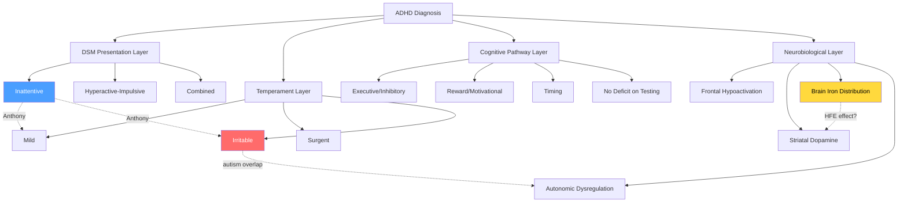

# ADHD Heterogeneity — Mapping the Many ADHDs

## Why This Matters

Anthony has ADHD-PI (predominantly inattentive) co-occurring with autism — a profile that sits at the intersection of multiple layers of ADHD heterogeneity. Understanding that "ADHD" is not one thing but many overlapping dimensions is critical for:

- Interpreting why his presentation doesn't match "classic ADHD"
- Understanding variable stimulant response across individuals
- Connecting iron metabolism and emotional dysregulation pathways
- Informing future treatment decisions beyond one-size-fits-all dosing

The field is converging on a view that DSM presentations (inattentive, hyperactive-impulsive, combined) are inadequate — the real heterogeneity lies in **temperament profiles**, **cognitive pathway deficits**, and **neurobiological substrates** that cut across diagnostic categories.

---

## 1. The Problem with DSM Presentations

### DSM-5 Presentations Are Not Stable Subtypes

The DSM-5 deliberately changed "subtypes" to "presentations" because longitudinal data showed that children frequently shift between categories over time. A child diagnosed with combined-type at age 8 may present as predominantly inattentive by age 14 — not because they improved, but because external hyperactivity often declines with age while inattention persists.

**Key limitations of the DSM approach:**

- **Poor temporal stability** — up to 50% of children switch presentations over 2-5 years
- **Weak biological validity** — neuroimaging finds inconsistent differences between presentations
- **Masking heterogeneity** — two people with "ADHD-PI" can have completely different underlying cognitive and neurobiological profiles
- **Missing emotional dimension** — DSM criteria capture attention and hyperactivity but omit emotional dysregulation, which affects ~25-45% of individuals with ADHD

> [!important] Clinical Relevance
> Anthony's ADHD-PI diagnosis tells us his *behavioural presentation*, but not which cognitive pathways are impaired, which neurobiological substrates are involved, or why his iron status might interact differently with his ADHD than it would for someone with combined-type.

---

## 2. Temperament-Based Subtypes (Karalunas/Nigg Framework)

The most replicated alternative subtyping system comes from Karalunas, Nigg, and colleagues at Oregon Health & Science University, who used **community detection algorithms** on temperament dimensions to identify three biologically valid ADHD profiles.

### The Three Temperament Profiles

| Profile | Core Feature | Prevalence in ADHD | Key Characteristics |
|---------|-------------|-------------------|---------------------|
| **Mild** | Normative emotion regulation | ~35-40% | ADHD symptoms present but emotional reactivity within normal range; best prognosis |
| **Surgent** | Extreme positive approach-motivation | ~25-30% | High reward-seeking, sensation-seeking; strong drive but poor self-regulation; risk for substance use |
| **Irritable** | Extreme negative emotionality | ~30-35% | Anger proneness, poor soothability, frustration intolerance; worst clinical outcomes |

### Biological Validation

These profiles are not just clinical observations — each shows **distinct neurobiological signatures**:

- **Cardiac physiology**: Different patterns of respiratory sinus arrhythmia (RSA) and pre-ejection period (PEP), reflecting distinct autonomic profiles
- **Resting-state fMRI**: Unique functional connectivity patterns — the irritable group showed distinct fronto-limbic connectivity
- **Longitudinal stability**: Profiles were moderately stable over 1-2 years and predicted clinical outcomes better than DSM presentations
- **Independence from DSM**: The three profiles cut across inattentive, hyperactive-impulsive, and combined presentations

**Karalunas et al. (2014)** — JAMA Psychiatry, n=437, community detection algorithm identified three temperament-based types with distinct cardiac physiology, resting-state functional connectivity, and clinical trajectories
- PMID: [25006969](https://pubmed.ncbi.nlm.nih.gov/25006969/) | Evidence: **B**

**Karalunas et al. (2019)** — replication in independent sample, n=186; confirmed three profiles; irritable group not reducible to ADHD + ODD or ADHD + DMDD; trait anger uniquely predicted outcomes
- PMID: [30359050](https://pubmed.ncbi.nlm.nih.gov/30359050/) | Evidence: **B**

> [!note] Anthony's Likely Profile
> Given his [[ADHD-PI and Internal Hyperactivity|ADHD-PI presentation]], high masking, [[neurodevelopment/Autistic Burnout - Neurobiological Mechanisms|burnout vulnerability]], and reported frustration sensitivity — he may sit between the mild and irritable profiles, though autism-related alexithymia may mask emotional dysregulation from external observation. His [[research/Autonomic Nervous System and Vagal Tone in AuDHD|autonomic profile]] (likely low vagal tone in AuDHD) adds another layer.

---

## 3. Cognitive Pathway Models — Multiple Roads to ADHD

### Sonuga-Barke's Triple Pathway Model

Moving beyond the original dual-pathway model (executive dysfunction vs. delay aversion), Sonuga-Barke et al. demonstrated that **three separable cognitive deficits** each independently contribute to ADHD:

| Pathway | Brain System | Core Deficit | Behavioural Expression |
|---------|-------------|-------------|----------------------|
| **Executive/Inhibitory** | Dorsolateral PFC → striatum | Response inhibition, working memory | Disorganisation, impulsivity, cognitive failures |
| **Reward/Motivational** | Ventral striatum → OFC | Delay aversion, reward sensitivity | "Want it now", frustration with waiting, risk-taking |
| **Timing** | Cerebellum → supplementary motor area | Temporal processing, rhythm | Inconsistent performance, time blindness, variable reaction times |

**Sonuga-Barke et al. (2010)** — demonstrated dissociation of timing, inhibitory, and delay-related impairments in ADHD; 73% of children showed impairment in only one pathway
- DOI: 10.1016/j.jaac.2009.12.018 | Evidence: **B**

### Latent Class Confirmation

**van Hulst et al. (2015)** used latent class analysis in 96 ADHD subjects and confirmed separable subgroups with deficits in cognitive control and timing respectively. Crucially, some ADHD subgroups had profiles similar to controls (quantitative difference) while one subgroup had no equivalent in controls (qualitative difference).
- PMID: [25099923](https://pubmed.ncbi.nlm.nih.gov/25099923/) | Evidence: **B**

### Adult Cognitive Heterogeneity

**Mostert et al. (2015)** — systematic analysis of neuropsychological functioning in 133 adults with ADHD found impaired EF, increased impulsivity, and greater response variability compared to controls — but effect sizes were small to moderate (0.05-0.70) and **11% of patients showed no neuropsychological dysfunctioning at all**. The best diagnostic model required measures from **multiple cognitive domains** (82.1% specificity, 64.9% sensitivity).
- PMID: [26336867](https://pubmed.ncbi.nlm.nih.gov/26336867/) | Evidence: **B**

> [!warning] The "No Deficit" Subgroup
> ~11-35% of people diagnosed with ADHD perform normally on standard neuropsychological batteries. This does not mean they don't have ADHD — it means our tests don't capture their specific dysfunction. This group may have deficits in emotional regulation, motivation, or real-world executive function not captured by lab tasks.

---

## 4. Emotional Dysregulation as a Core (Not Comorbid) Feature

A major shift in ADHD research recognises **emotional dysregulation** not as a comorbidity (like ODD or anxiety) but as a core feature of ADHD itself.

**Shaw et al. (2014)** — landmark review in Am J Psychiatry:
- Emotional dysregulation is **prevalent throughout the ADHD lifespan** and a **major contributor to impairment**
- May arise from deficits in orienting toward, recognising, and/or allocating attention to emotional stimuli
- Shares neural substrates with ADHD core symptoms (PFC-amygdala-striatal circuits)
- Cited >1,100 times; fundamentally shifted the field
- DOI: 10.1176/appi.ajp.2013.13070966 | Evidence: **A**

**Nigg et al. (2020)** — the field is "on the cusp of justifying an emotionally dysregulated subprofile in ADHD" useful for clinical prediction and treatment testing
- PMID: [32305325](https://pubmed.ncbi.nlm.nih.gov/32305325/) | Evidence: **B**

### Implication for AuDHD

In AuDHD, emotional dysregulation has **two potential sources**: ADHD-related (impulsive, frustration-driven) and autism-related (meltdowns from sensory overload, routine disruption, social overwhelm). These can be **phenomenologically identical** but arise from different mechanisms — making the heterogeneity problem even more complex. See [[Trichotillomania and Neurodevelopmental Links|BFRBs as emotional regulation failure]] for how this intersects with trichotillomania.

---

## 5. Neuroimaging Evidence for Heterogeneity

### Frontal Hypoactivation — The One Consistent Finding

**McCarthy et al. (2014)** — meta-analysis of 20 fMRI studies (334 ADHD, 372 controls) found consistent **frontal lobe hypoactivation** across Go/No-go, Stop, and N-back tasks. However:
- Higher percentage of combined-type → less superior and inferior frontal gyrus activation
- Different IQ scores between groups → reduced right caudate activity
- Less medication exposure → less medial frontal cortex activation (suggesting stimulants partially normalise frontal function)
- PMID: [23663382](https://pubmed.ncbi.nlm.nih.gov/23663382/) | Evidence: **A**

### Distinct Neural Signatures by Presentation

**Fair et al. (2013)** — after controlling for micro-movements (critical in a hyperkinetic disorder), found distinct resting-state functional connectivity signatures for ADHD subtypes. ADHD-PI showed different network disruptions than combined-type, particularly in default mode network and frontoparietal control network interactions.
- DOI: 10.3389/fnsys.2012.00080 | Evidence: **B**

### Brain Iron and ADHD Subtype Specificity

**Shvarzman et al. (2022)** — repurposed DTI to examine iron deposition in basal ganglia of children with ADHD (ages 8-12):
- **Reduced iron** in bilateral **limbic striatum** in ADHD vs. controls
- Lower limbic striatal iron correlated with greater ADHD symptom severity
- Lower limbic striatal iron also correlated with anxious, depressive, and affective symptoms
- Males showed additional iron reduction in sensorimotor striatal subregion regardless of diagnosis
- PMID: [36301336](https://pubmed.ncbi.nlm.nih.gov/36301336/) | Evidence: **C**

> [!important] Iron Paradox for Anthony
> Most ADHD research finds **low** brain iron associated with symptoms (dopamine synthesis requires iron). Anthony has **systemic iron overload** from HFE compound heterozygosity. This creates an unusual situation: does excess peripheral iron translate to excess or normal brain iron? Or could HFE variants paradoxically alter brain iron distribution? See [[research/NTBI in the Brain|NTBI and brain iron toxicity]] and [[research/Iron and OCD-Spectrum Repetitive Behaviours|basal ganglia iron and repetitive behaviours]] for the competing mechanisms. QSM brain imaging could resolve this — see [[research/HFE and Long-Term Neurodegeneration Risk#Brain QSM Imaging|QSM recommendation]].

---

## 6. Cognitive Disengagement Syndrome — A Distinct Entity?

CDS (formerly sluggish cognitive tempo) has reached formal recognition as a **distinct syndrome** that is closely associated with but separable from ADHD-PI.

**Becker et al. (2022)** — consensus work group report establishing:
- CDS is characterised by excessive daydreaming, mental fogginess, sluggish behaviour, and slow processing speed
- CDS is **not simply severe ADHD-PI** — it loads on separate factors and has distinct functional impairments
- CDS has unique associations with **internalising** problems (depression, anxiety) whereas ADHD is more linked to **externalising** problems
- ~32% of autistic individuals meet criteria — see [[ADHD-PI and Internal Hyperactivity|existing avenue 38]]
- DOI: 10.1016/j.jaac.2022.07.821 | Evidence: **B**

---

## 7. Towards Precision ADHD Medicine

### The Biomarker Problem

**Thome et al. (2012)** — WFSBP consensus report concluded that **no reliable single ADHD biomarker exists**. The problem is sample heterogeneity due to aetiological and phenotypic complexity. A combination of markers across domains is likely needed.
- PMID: [22834452](https://pubmed.ncbi.nlm.nih.gov/22834452/) | Evidence: **B**

### Emerging Stratification Approaches

**Sonuga-Barke et al. (2022)** — Annual Research Review in JCPP argued that despite enormous progress in characterising ADHD, **translation to clinical benefit has been limited**. The path forward requires:
1. Moving from group-level to individual-level characterisation
2. Using computational approaches (machine learning, normative modelling)
3. Integrating genetic, neuroimaging, cognitive, and environmental data
4. Testing whether subgroups predict **differential treatment response**
- DOI: 10.1111/jcpp.13696 | Evidence: **B**

### What Stratification Could Mean for AuDHD + HFE

| Dimension | Anthony's Profile | Implication |
|-----------|------------------|-------------|
| DSM presentation | ADHD-PI | External hyperactivity minimal; internal restlessness prominent |
| Temperament profile | Likely mild-irritable boundary | Emotional dysregulation may be masked by alexithymia |
| Cognitive pathway | Unknown — untested | Timing deficits and reward sensitivity both plausible given AuDHD overlap |
| CDS overlap | Possible — daydreaming, fog | May be distinct from or additive to ADHD-PI |
| Iron status | HFE iron overload (ferritin 380, TSAT 60%) | Paradox: most ADHD-iron research studies deficiency, not excess |
| Autonomic | Likely low vagal tone (AuDHD pattern) | Matches irritable temperament profile physiology |
| Genetic architecture | [[Genetic Architecture of AuDHD\|Shared ADHD-autism loci]] | Shared loci may select for specific heterogeneity profile |

---

## 8. Integrated Model — ADHD Heterogeneity Layers

---

## Evidence Gaps

1. **Iron overload + ADHD**: Virtually all ADHD-iron research focuses on deficiency. No studies examine ADHD symptom patterns in HFE heterozygotes with iron overload — a critical gap for Anthony's case
2. **Adult AuDHD heterogeneity**: Most ADHD subtyping studies are in children. Adult data is limited; adult AuDHD data is essentially absent
3. **Temperament profiles in AuDHD**: The Karalunas framework has not been tested in dual-diagnosis AuDHD samples — autism-related alexithymia could confound temperament classification
4. **Treatment response by subtype**: The key clinical question — whether subtypes predict differential treatment response — remains largely unanswered
5. **CDS and autistic inertia**: Whether CDS overlaps with the "inertia" commonly described in autism is an unresearched question with high clinical relevance

---

## Clinical Implications

> [!tip] Actionable Takeaways
> 1. **Don't assume one ADHD model fits** — Anthony's ADHD-PI + autism + HFE creates a unique profile that no single study population matches
> 2. **Emotional dysregulation is not "just anxiety"** — if present, it may be a core ADHD feature requiring specific intervention (not just anxiolytics)
> 3. **Brain iron imaging (QSM) would be uniquely informative** — resolving the deficiency-vs-overload paradox in his specific basal ganglia and limbic circuits
> 4. **Neuropsychological testing limitations** — normal test scores would not rule out ADHD-related dysfunction; real-world EF may be impaired while lab EF is preserved
> 5. **Treatment monitoring should be multi-dimensional** — tracking attention, emotional reactivity, timing/organisation, and reward sensitivity separately rather than using a single "ADHD symptom" score

---

## Cross-References

- [[ADHD-PI and Internal Hyperactivity]] — avenue 3, CDS overlap
- [[research/Autonomic Nervous System and Vagal Tone in AuDHD]] — vagal tone and temperament profiles
- [[Iron-Dopamine-ADHD Axis]] — dopaminergic substrate
- [[research/Iron and OCD-Spectrum Repetitive Behaviours]] — basal ganglia iron
- [[research/NTBI in the Brain]] — brain iron paradox
- [[research/HFE and Long-Term Neurodegeneration Risk]] — QSM imaging recommendation
- [[Trichotillomania and Neurodevelopmental Links]] — emotional dysregulation and BFRBs
- [[Genetic Architecture of AuDHD]] — shared genetic architecture
- [[neurodevelopment/Autistic Burnout - Neurobiological Mechanisms]] — burnout as heterogeneity modifier
- [[research/Elvanse Pharmacokinetics and Iron Overload]] — treatment response and iron
- [[Health Research MOC]]
- [[research/Research Avenues Tracker]]
