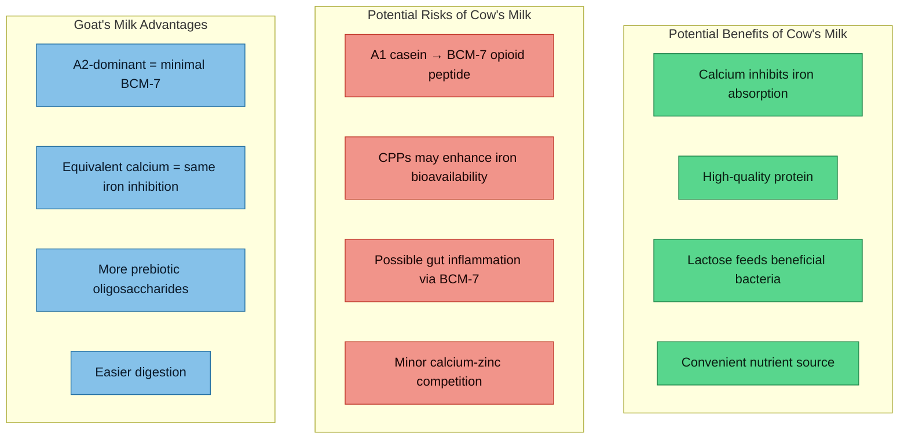

# Cow's Milk and Neurodevelopmental-Iron Conditions

## Why This Matters

Anthony was drinking large quantities of organic semi-skimmed cow's milk and has switched to goat's milk. Given his HFE compound heterozygosity (ferritin 380, TSAT 60%), AuDHD, trichotillomania, borderline low copper (14.3 umol/L) and zinc (12.5 umol/L), and low folate — the question of whether cow's milk is net positive or net negative is genuinely complex. The answer depends on which mechanism dominates.

---

## 1. Iron Interaction — Cow's Milk as an Iron Absorption Inhibitor

### Calcium Inhibits Both Heme and Non-Heme Iron

Calcium is **unique among dietary iron inhibitors** because it inhibits both heme and non-heme iron absorption. Tea, phytates, and polyphenols only inhibit non-heme iron.

**Hallberg et al. (1991)** — the landmark single-meal study — demonstrated a clear dose-response:
- **300 mg calcium** (approx. one large glass of milk, ~250 ml) reduced non-heme iron absorption by **40%** and heme iron absorption by **30-40%**
- The inhibitory effect plateaus above ~300-600 mg calcium per meal
- The mechanism involves calcium blocking the mucosal transfer step shared by both heme and non-heme iron pathways
- PMID: [1984335](https://pubmed.ncbi.nlm.nih.gov/1984335/) | Evidence: **A**

**However — the long-term picture is more nuanced:**
- **Grinder-Pedersen et al. (2004)** found that calcium from milk or calcium-fortified foods did **not** inhibit non-heme iron absorption when measured over a 4-day whole-diet period, suggesting acute single-meal effects may not translate to sustained iron reduction
- PMID: [15277162](https://pubmed.ncbi.nlm.nih.gov/15277162/) | Evidence: **A**
- **Gaitan et al. (2011)** found calcium doses below 800 mg did not significantly inhibit absorption of 5 mg of non-heme or heme iron in non-pregnant women
- PMID: [21795430](https://pubmed.ncbi.nlm.nih.gov/21795430/) | Evidence: **A**

**Net assessment for Anthony**: The acute inhibitory effect of calcium on iron absorption is real and well-replicated at the single-meal level. Whether it meaningfully reduces iron loading over weeks and months in haemochromatosis is less certain. The body may compensate by upregulating absorption at other meals. Still, as an adjunctive strategy alongside [[Dietary Management - Iron Overload|other iron inhibitors]] (tea, phytates), it contributes to the overall inhibitory meal environment.

### Quantification Per Glass

| Milk Type | Calcium per 250 ml | Expected Acute Iron Absorption Reduction |
|-----------|-------------------|----------------------------------------|
| Cow's milk (semi-skimmed) | ~300 mg | ~30-40% for that meal |
| Goat's milk | ~325 mg | ~30-40% for that meal |
| Fortified plant milk | 300-400 mg (variable) | Similar if calcium carbonate/citrate added |

### Lactoferrin in Cow's Milk

Bovine lactoferrin is an iron-binding glycoprotein present in cow's milk, though at **much lower concentrations** in pasteurised commercial milk than in raw milk or colostrum.

- Lactoferrin can bind both heme and non-heme iron and suppress reactive oxygen species generated by free iron (PMID: [25280951](https://pubmed.ncbi.nlm.nih.gov/25280951/))
- Bovine lactoferrin supplementation (200 mg/day) reduced serum ferritin by **52%** (p < 0.001) in hyperferritinemic patients (Canadian Journal of Biochemistry and Cell Biology, 2024. DOI: 10.1139/bcb-2024-0061) — already cited in [[Gut-Brain Axis and Neurodevelopment]]
- Commercial pasteurised milk contains very little bioactive lactoferrin — the therapeutic effect requires supplemental doses
- Evidence: **B** (for supplemental lactoferrin); **D** (for lactoferrin in commercial milk as clinically meaningful)

### Casein and Iron Binding

Caseinophosphopeptides (CPPs) — phosphorylated fragments of casein released during digestion — can **bind** iron and other minerals.

- **Ait-Oukhatar et al. (2002)**: CPP-bound iron had **enhanced bioavailability** in animal models — meaning casein may actually *increase* iron uptake, not decrease it
- PMID: [12389027](https://pubmed.ncbi.nlm.nih.gov/12389027/) | Evidence: **C**
- **Garcia-Nebot et al. (2015)**: CPPs from alpha-s and beta-casein increased iron bioavailability in HuH7 liver cells
- PMID: [26154705](https://pubmed.ncbi.nlm.nih.gov/26154705/) | Evidence: **C**

**This is a cautionary finding**: while calcium in milk inhibits iron absorption, the casein protein itself may **enhance** iron bioavailability through CPPs. The net effect likely still favours inhibition (calcium effect dominates at the whole-food level), but it is not as straightforward as "dairy blocks iron."

---

## 2. Autism and Cow's Milk

### A1 vs A2 Beta-Casein and BCM-7

This is the most relevant axis for Anthony's autism.

**Background**: Beta-casein makes up ~37% of total casein in cow's milk. There are two common variants:
- **A1 beta-casein**: contains histidine at position 67. Digestion produces **beta-casomorphin-7 (BCM-7)**, a 7-amino-acid opioid peptide
- **A2 beta-casein**: contains proline at position 67. Proline resists enzymatic cleavage, so BCM-7 is released in much smaller quantities

Most conventional cow's milk (especially from Holstein-Friesian breeds) contains a **mixture of A1 and A2** casein. Goat, sheep, and human milk are predominantly **A2**.

### BCM-7 — Evidence for Harm

BCM-7 acts as a mu-opioid receptor agonist and has been implicated in:

1. **Gut inflammation**: BCM-7 increased myeloperoxidase activity and inflammatory markers in animal models; A1 casein consumption was associated with slower gastrointestinal transit and increased gut inflammation compared to A2 (Brooke-Taylor et al. *Adv Nutr.* 2017;8(5):739-748. DOI: 10.3945/an.116.013953 | Evidence: **B**)

2. **Gut permeability**: BCM-7 may compromise intestinal barrier function, potentially allowing LPS translocation. This is directly relevant to Anthony's gut-brain axis concerns — see [[Gut-Brain Axis and Neurodevelopment]]

3. **Neurological effects**: BCM-7 crosses the blood-brain barrier in neonatal animal models and can alter dopamine and serotonin metabolism. In SH-SY5Y human neuroblastoma cells, casein-derived opioid peptides caused epigenetic changes including altered DNA methylation (Trivedi et al. *Nutr Metab.* 2015;12:54. DOI: 10.1186/s12986-015-0050-1 | Evidence: **C**)

4. **Opioid receptor activation**: Comprehensive review confirms BCM-7 modulates GI proinflammatory responses and may trigger digestive symptoms (Bolat et al. *Molecules.* 2024;29(9):2161. DOI: 10.3390/molecules29092161 | Evidence: **B** for GI effects; **C** for neurological)

5. **DPP-IV connection**: Dipeptidyl peptidase-IV (DPP-IV) normally degrades BCM-7. Some autistic individuals show **reduced DPP-IV activity**, potentially increasing exposure to intact BCM-7 (Ciesli&nacute;ska et al. *Peptides.* 2015;65:6-13. PMID: [25625371](https://pubmed.ncbi.nlm.nih.gov/25625371/) | Evidence: **C**)

### Important Caveats on BCM-7

- **EFSA (2009)** concluded there was **insufficient evidence** to establish a causal link between A1 beta-casein/BCM-7 and any disease outcome in humans
- **De Vasconcelos et al. (2023)** highlighted major methodological difficulties in establishing adverse effects of BCM-7, including inconsistent study designs, animal-to-human extrapolation, and confounding variables (DOI: 10.3390/foods12173151 | Evidence: **B** — as a critical review)
- **Kay et al. (2021)** in the *Journal of Nutrition* concluded benefits of A2-only milk remain "largely unsubstantiated" by high-quality evidence (PMID: [33693747](https://pubmed.ncbi.nlm.nih.gov/33693747/) | Evidence: **B**)
- Most human evidence comes from GI symptom studies in self-reported milk-intolerant individuals, not neurodevelopmental populations

### The Opioid Excess Theory in Autism

**Panksepp (1979)** first proposed that autism involved excess opioid activity. **Shattock & Whiteley (2002)** expanded this, proposing that casein-derived (and gluten-derived) opioid peptides, leaking through a permeable gut, contribute to autistic symptoms.

- PMID: [12223079](https://pubmed.ncbi.nlm.nih.gov/12223079/) — Shattock & Whiteley's review
- The theory is biologically plausible but **not strongly supported** by clinical evidence
- Urinary opioid peptide studies that initially supported this theory have been **poorly replicated**
- Evidence: **D** (hypothesis with limited clinical support)

### Gluten-Free Casein-Free (GFCF) Diet in Autism — What Do the RCTs Show?

This is where the rubber meets the road:

- **Cochrane Review (Millward et al., 2008)**: Only 2 small RCTs met inclusion criteria. "The evidence for efficacy of these diets is poor." PMID: [18425890](https://pubmed.ncbi.nlm.nih.gov/18425890/) | Evidence: **A** (as a systematic review methodology; the underlying evidence is weak)

- **Piwowarczyk et al. (2018)**: Systematic review of GFCF diets in ASD children. Found **no significant improvements** in core autism symptoms across included studies. PMID: [28612113](https://pubmed.ncbi.nlm.nih.gov/28612113/) | Evidence: **A**

- **Adams et al. (2018)**: Comprehensive nutritional intervention (including GFCF as one component among many) showed improvements, but could not isolate the GFCF element. PMID: [29562612](https://pubmed.ncbi.nlm.nih.gov/29562612/) | Evidence: **B**

- **Akhter et al. (2022)**: Narrative review noting anecdotal reports of improvement but acknowledging weak trial evidence. PMID: [36660995](https://pubmed.ncbi.nlm.nih.gov/36660995/) | Evidence: **C**

**Bottom line**: The GFCF diet is one of the most popular parental interventions in autism, but RCT evidence for benefit is **weak to absent**. This does not mean individual responses are impossible — it means the intervention does not produce consistent, measurable group-level benefit. A subgroup with genuine casein sensitivity may exist but has not been reliably identified.

### IgG Food Sensitivity Testing — Clinical Relevance

IgG antibodies to food proteins (including casein) are frequently marketed as indicators of "food intolerance."

- **Every major allergy/immunology society** (EAACI, AAAAI, BSACI, ASCIA) has issued position statements **against** the use of IgG food sensitivity testing for diagnosing food intolerance or guiding elimination diets
- IgG to food proteins reflects **normal immune exposure**, not pathology
- IgG4 specifically may represent **tolerance**, not sensitivity
- Mullin et al. (2010) reviewed food reaction testing and classified IgG panels as lacking clinical validity. PMID: [20413700](https://pubmed.ncbi.nlm.nih.gov/20413700/)
- Evidence for clinical utility: **D** (no credible evidence of diagnostic validity)

---

## 3. ADHD and Dairy

### Elimination Diet Studies

The evidence for dairy as an ADHD trigger comes primarily from **oligoantigenic/few-foods diet** studies, not dairy-specific trials:

- **Pelsser et al. (2011) — the INCA study**: Landmark RCT in *The Lancet*. A restricted elimination diet (rice, turkey, pears, lettuce, water — a "few foods" approach) significantly reduced ADHD symptoms in 64% of children. When individual foods were reintroduced, dairy was among the **top triggers** in responsive children. PMID: [21296237](https://pubmed.ncbi.nlm.nih.gov/21296237/) | Evidence: **A**

- **Huberts-Bosch et al. (2023)**: Short-term elimination diet showed ADHD symptom improvements comparable to the INCA study. PMID: [37430148](https://pubmed.ncbi.nlm.nih.gov/37430148/) | Evidence: **A**

- **Sonuga-Barke et al. (2013)**: Meta-analysis of non-pharmacological ADHD interventions. Elimination diets showed the **strongest effect** among dietary interventions, but effects were attenuated when only blinded assessments were considered. PMID: [23360949](https://pubmed.ncbi.nlm.nih.gov/23360949/) | Evidence: **A**

**Key nuance**: These studies do not prove dairy *causes* ADHD. They suggest that in a **subgroup** of (mostly paediatric) ADHD patients, certain foods including dairy can worsen symptoms. The effect is individual-specific and requires supervised elimination/reintroduction to identify. There are **no adult ADHD elimination diet RCTs**.

### Organic vs Conventional Milk

- Organic milk avoids synthetic pesticides and hormones (rBST/rBGH — not permitted in the UK regardless)
- No high-quality evidence links artificial additives in conventional milk specifically to ADHD
- Anthony's choice of organic milk removes this variable
- Evidence: **D** (for additives-in-milk-specifically as an ADHD factor)

---

## 4. Gut-Brain Axis Effects

### Cow's Milk Protein and Gut Microbiome

- **Aslam et al. (2020)**: Systematic review of dairy effects on gut microbiota found that fermented dairy generally supported beneficial microbes (Bifidobacterium, Lactobacillus), while effects of unfermented milk were less consistent. PMID: [32835617](https://pubmed.ncbi.nlm.nih.gov/32835617/) | Evidence: **B**

- Lactose in milk can act as a **prebiotic** in lactose-tolerant individuals, feeding Bifidobacterium and other beneficial bacteria
- However, undigested lactose in lactose-intolerant individuals feeds gas-producing bacteria and causes dysbiosis

### A1 Casein, BCM-7, and the Gut-Serotonin Axis

The proposed pathway is:
```
A1 casein → BCM-7 → mu-opioid receptor activation in gut
→ slowed GI transit + gut inflammation
→ altered tryptophan metabolism → serotonin disruption
→ potential neuroinflammation via gut-brain axis
```

- **Woodford (2021)** reviewed casomorphin and gliadorphin effects across gut, brain, and internal organs. Found evidence for systemic effects when gut permeability is increased and DPP-IV activity is reduced — both conditions more common in autism. DOI: 10.3390/ijerph18157911 | Evidence: **C**
- This pathway is biologically plausible but remains **largely theoretical** in humans

### A2 Milk and Gut Microbiome — RCT Evidence

- **Song et al. (2025)**: Randomised, double-blind, crossover study found that A2-only milk consumption **increased beneficial gut bacteria** (Bifidobacterium, Akkermansia) and **decreased potentially harmful bacteria** compared to conventional A1/A2 milk. PMID: [40338897](https://pubmed.ncbi.nlm.nih.gov/40338897/) | Evidence: **B**

This is the most directly relevant finding for the cow-vs-goat question, as goat's milk is naturally A2-dominant.

---

## 5. Mineral Interactions

### Calcium-Zinc Competition

This is a real concern for Anthony given his zinc at 12.5 umol/L (12% into range):

- Calcium and zinc compete for absorption, though via partially different mechanisms than iron-zinc competition
- **Sandstrom (2001)**: Micronutrient interactions review confirmed calcium can reduce zinc bioavailability at high doses, though the effect is modest compared to iron-zinc competition. PMID: [11509108](https://pubmed.ncbi.nlm.nih.gov/11509108/) | Evidence: **B**
- The effect is dose-dependent — **300 mg calcium per meal** (one glass of milk) has minimal impact on zinc absorption
- Heavy dairy intake (multiple glasses/day) could cumulatively suppress zinc status

### Calcium-Copper Interactions

- Limited direct evidence for calcium-copper competition
- The primary mechanism by which dairy may affect copper is via **casein binding** — casein can complex with copper in the gut, potentially reducing absorption
- The effect is much smaller than iron-copper competition via DMT1
- See [[Copper-Zinc-Iron Interactions]] for the broader mineral competition context
- Evidence: **D** (insufficient data for strong conclusions)

### Phosphorus in Milk

- Cow's milk contains significant phosphorus (~95 mg/100 ml)
- Phosphorus can complex with calcium and reduce its inhibitory effect on iron
- However, the **calcium:phosphorus ratio** in cow's milk (~1.3:1) is considered favourable
- Goat's milk has a similar ratio
- Evidence: **C** (mechanistic data, limited clinical relevance)

### Does High Dairy Intake Worsen Anthony's Already-Low Copper and Zinc?

At moderate intake (1-2 glasses/day), the mineral competition effects of dairy are **unlikely to be clinically significant** for copper and zinc beyond what his iron overload already causes. The dominant factor suppressing his copper and zinc is **iron overload competing via DMT1**, not dietary calcium. Heavy dairy intake (>3 glasses/day) could contribute marginally. See [[Copper-Zinc-Iron Interactions]].

---

## 6. Trichotillomania and Dairy

### Direct Evidence

There is **no published research** directly linking dairy consumption to trichotillomania or BFRB symptom severity. Search terms across PubMed and OpenAlex returned zero results.

### Indirect Pathways

The potential connection is through inflammation:
1. If A1 casein → BCM-7 → gut inflammation → systemic inflammation → neuroinflammation
2. And neuroinflammation → altered glutamate/serotonin balance → worsened cortico-striatal dysfunction
3. Then dairy *could* theoretically amplify BFRB urges

This chain has multiple unproven links and is **speculative**. See [[Trichotillomania and Neurodevelopmental Links]] for the glutamate/inflammation model.

### Dietary Triggers Reported for BFRBs

- Anecdotal reports in BFRB communities mention sugar, caffeine, and dairy as triggers
- No controlled studies support any specific dietary trigger for BFRBs
- The strongest dietary evidence for TTM relates to **vitamin D deficiency** (OR 4.2) and **zinc status** — both of which are addressed by other interventions
- Evidence: **D** (anecdotal only)

---

## 7. Cow's Milk vs Goat's Milk — Comparison

### Nutrient Profile per 100 ml

| Nutrient | Cow's Milk (semi-skimmed) | Goat's Milk (whole) | Clinical Note |
|----------|--------------------------|--------------------|-|
| Energy (kcal) | 50 | 69 | Goat is higher-calorie |
| Protein (g) | 3.4 | 3.6 | Similar |
| Fat (g) | 1.8 | 4.1 | Goat's fat globules are smaller |
| Calcium (mg) | 120 | 130 | Both adequate for iron inhibition |
| Iron (mg) | 0.03 | 0.05 | Both negligible |
| Zinc (mg) | 0.4 | 0.3 | Both low; not a useful zinc source |
| Copper (mg) | 0.01 | 0.05 | Both negligible |
| Phosphorus (mg) | 95 | 111 | Similar |

### Key Differences Beyond Nutrients

| Feature | Cow's Milk | Goat's Milk |
|---------|-----------|-------------|
| **Beta-casein type** | Mixed A1/A2 (typically ~60% A1 in Holstein) | Predominantly A2 (~95%) |
| **BCM-7 production** | Higher | Much lower |
| **Fat globule size** | Larger (3-5 um) | Smaller (2-3 um) — easier digestion |
| **Casein micelle size** | Larger | Smaller — forms softer curd |
| **Alpha-s1 casein** | High | Low — less allergenic |
| **Oligosaccharides** | ~0.03-0.06 g/L | ~0.25-0.30 g/L (4-5x more) |
| **Lactose** | 4.7 g/100ml | 4.1 g/100ml | Slightly less |

### Goat's Milk Oligosaccharides — Prebiotic Effect

Goat's milk contains 4-5x more oligosaccharides than cow's milk, structurally similar to human milk oligosaccharides (HMOs):

- **Van Leeuwen et al. (2020)**: Comprehensive analysis of goat milk oligosaccharides. Found structural similarity to HMOs and evidence for prebiotic and anti-infective properties. PMID: [33141570](https://pubmed.ncbi.nlm.nih.gov/33141570/) | Evidence: **B**
- **Liu et al. (2025)**: Goat milk oligosaccharides regulated infant immunity through gut microbiota modulation — increased Bifidobacterium and Lactobacillus. PMID: [40035489](https://pubmed.ncbi.nlm.nih.gov/40035489/) | Evidence: **C** (infant/animal models)
- **Leong et al. (2019)**: Oligosaccharides in goat milk-based formula had prebiotic and anti-infection properties. PMID: [31196229](https://pubmed.ncbi.nlm.nih.gov/31196229/) | Evidence: **B**

### Is the Switch Evidence-Based?

The switch from cow's milk to goat's milk is **partially evidence-based**:

| Claimed Benefit | Evidence Level | Verdict |
|----------------|---------------|---------|
| Avoids A1 casein / BCM-7 | B | **Supported** — goat's milk is naturally A2-dominant |
| Easier digestion | B | **Supported** — smaller fat globules, softer curd |
| Better for gut microbiome | C | **Plausible** — more prebiotic oligosaccharides |
| Better for autism symptoms | D | **Unproven** — no direct studies |
| Better for iron inhibition | N/A | **Equivalent** — similar calcium content |
| Better for mineral status | D | **Negligible difference** — neither is a significant source of copper/zinc |

---

## 8. Clinical Relevance for Anthony

### Risk-Benefit Analysis



### Net Assessment

**For someone without Anthony's specific conditions**, cow's milk is nutritious and the risks from A1 casein are uncertain and probably small for most people.

**For Anthony specifically**, the calculus shifts:

1. **Iron overload**: The calcium-mediated iron inhibition is BENEFICIAL but not unique to cow's milk — goat's milk provides equivalent calcium
2. **Autism + gut permeability concerns**: The A1 casein/BCM-7 pathway is the biggest concern. While evidence is not conclusive, the mechanism (opioid peptide + gut inflammation + neuroinflammation) is biologically plausible, and Anthony's autism places him in a potentially susceptible population. The precautionary principle favours avoiding A1 casein
3. **Trichotillomania**: No direct evidence, but reducing systemic inflammation is generally advisable given the neuroinflammatory component of BFRBs
4. **Mineral status**: Both milks have similar mineral profiles; neither significantly worsens copper/zinc status at moderate intake
5. **Gut microbiome**: Goat's milk offers modest advantages (A2 casein, more oligosaccharides, smaller fat globules)

### Verdict: The Switch to Goat's Milk Is Reasonable

**Goat's milk retains all the benefits of cow's milk** (calcium for iron inhibition, protein, nutrients) **while eliminating the primary concern** (A1 casein/BCM-7). The evidence is not strong enough to say cow's milk is definitively harmful for Anthony, but it is strong enough to say the switch removes a plausible risk factor at no nutritional cost.

This is a case where the **precautionary principle applies**: the potential downside of cow's milk (neuroinflammation via BCM-7 in a neurodevelopmentally vulnerable individual) exceeds the potential downside of switching (essentially none, except cost).

### Practical Recommendations

1. **Continue with goat's milk** — it provides equivalent iron inhibition via calcium while avoiding A1 casein
2. **Drink with iron-containing meals** — the calcium inhibitory effect is greatest when consumed alongside iron sources (as per [[Dietary Management - Iron Overload]])
3. **Do not exceed 2-3 glasses/day** — heavy dairy intake could marginally worsen zinc absorption
4. **Separate from zinc supplementation** — take zinc picolinate at bedtime, not with dairy-heavy meals
5. **Consider fermented dairy** (goat's milk kefir/yoghurt) — fermented dairy has stronger evidence for gut microbiome benefits than liquid milk
6. **Bovine lactoferrin supplementation** could be considered as a separate intervention for iron reduction (see [[Gut-Brain Axis and Neurodevelopment]] for evidence) — this is independent of milk consumption
7. **If cow's milk A2-only is available** (sold as "A2 milk" in UK supermarkets) and cheaper than goat's milk, it would be an acceptable alternative — it eliminates BCM-7 while retaining cow's milk pricing
8. **Do not pursue IgG food sensitivity testing** for casein — it has no clinical validity

### What Would Change This Assessment?

- If a high-quality RCT demonstrated that A1 casein avoidance improved neurodevelopmental symptoms in autistic adults, this would upgrade the recommendation from "reasonable precaution" to "evidence-based intervention"
- If iron status normalises after phlebotomy, the iron-inhibition benefit of dairy becomes less important
- If gut microbiome testing reveals significant dysbiosis, the prebiotic advantage of goat's milk oligosaccharides becomes more relevant

---

## Evidence Gaps

| Question | Status |
|----------|--------|
| Does A1 casein avoidance improve ASD symptoms in adults? | **No RCTs in adults** |
| Does BCM-7 worsen ADHD specifically? | **No studies** |
| Does dairy affect trichotillomania? | **No studies** |
| Long-term calcium effect on iron loading in haemochromatosis? | **No longitudinal studies** |
| Does goat's milk genuinely improve gut microbiome vs cow's milk in neurodevelopmental populations? | **No head-to-head RCTs** |
| Optimal dairy intake for iron overload management? | **No dose-finding studies** |

---

## Key References

1. Hallberg L et al. Calcium: effect of different amounts on nonheme- and heme-iron absorption in humans. *Am J Clin Nutr.* 1991;54(2):425-428. PMID: 1984335
2. Grinder-Pedersen L et al. Calcium from milk does not inhibit nonheme-iron absorption over 4 days. *Am J Clin Nutr.* 2004;80(2):404-409. PMID: 15277162
3. Gaitan D et al. Calcium does not inhibit 5mg iron at doses less than 800mg. *J Nutr.* 2011;141(9):1652-1656. PMID: 21795430
4. Brooke-Taylor S et al. Systematic review of GI effects of A1 vs A2 beta-casein. *Adv Nutr.* 2017;8(5):739-748
5. Sun J et al. A2 milk vs A1/A2 milk: GI physiology and cognitive behavior. *Nutr J.* 2016;15:35. DOI: 10.1186/s12937-016-0147-z
6. Song CH et al. A2 beta-casein milk improves gut microbiota. *PLoS One.* 2025. PMID: 40338897
7. Bolat E et al. BCM-7: opioid-like peptide with potential role in disease. *Molecules.* 2024;29(9):2161
8. Kay SS et al. A2 beta-casein protein: myth or reality? *J Nutr.* 2021;151(5):1061-1072. PMID: 33693747
9. De Vasconcelos ML et al. Difficulties establishing adverse effects of BCM-7. *Foods.* 2023;12(17):3151
10. Piwowarczyk A et al. GF/CF diet and ASD in children: systematic review. *Eur J Nutr.* 2018;57(2):433-440. PMID: 28612113
11. Millward C et al. GF/CF diets for ASD. *Cochrane Database Syst Rev.* 2008;(2):CD003498. PMID: 18425890
12. Pelsser LM et al. Effects of restricted elimination diet on ADHD (INCA study). *Lancet.* 2011;377(9764):494-503. PMID: 21296237
13. Sonuga-Barke EJ et al. Nonpharmacological ADHD interventions: meta-analysis. *Am J Psychiatry.* 2013;170(3):275-289. PMID: 23360949
14. Aslam H et al. Dairy and gut microbiota: systematic review. *Gut Microbes.* 2020;12(1):1791725. PMID: 32835617
15. Van Leeuwen SS et al. Goat milk oligosaccharides compared to human milk. *J Agric Food Chem.* 2020;68(47):13469-13485. PMID: 33141570
16. Shattock P, Whiteley P. Opioid-excess theory in autism. *Expert Opin Ther Targets.* 2002;6(2):175-183. PMID: 12223079
17. Woodford KB. Casomorphins and gliadorphins: diverse systemic effects. *Int J Environ Res Public Health.* 2021;18(15):7911
18. Trivedi M et al. Epigenetic effects of casein-derived opioid peptides. *Nutr Metab.* 2015;12:54
19. Roy D et al. Milk from different species: composition and digestive dynamics. *Front Nutr.* 2020;7:577759
20. Sandstrom B. Micronutrient interactions: absorption and bioavailability. *Br J Nutr.* 2001;85(S2):S181-S185. PMID: 11509108

---

## Cross-References

- [[Dietary Management - Iron Overload]]
- [[Gut-Brain Axis and Neurodevelopment]]
- [[Copper-Zinc-Iron Interactions]]
- [[Trichotillomania and Neurodevelopmental Links]]
- [[Diet and Supplement Strategy]]
- [[Iron Overload and NTBI]]
- [[Tryptophan-Kynurenine Pathway]]
- [[Action Items and Monitoring Plan]]
- [[Blood Results - March 2026]]
