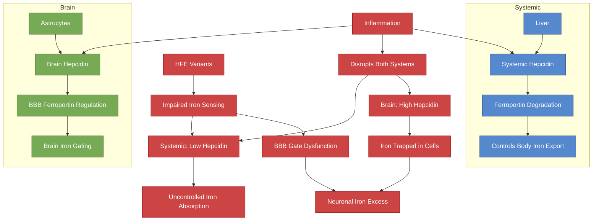

# Hepcidin and Brain Iron Regulation

## The Dual Hepcidin System

Hepcidin is the master regulator of systemic iron. But the brain has its **own local hepcidin system**, produced by astrocytes, that regulates iron entry at the blood-brain barrier (BBB) independently of liver-derived hepcidin.

This means: **systemic iron overload and brain iron status can diverge**.

> [!info]- Colour Key
> 🔵 Systemic | 🟢 Brain | 🔴 Pathological



## Brain Hepcidin Sources

Two sources of hepcidin affect the brain:

1. **Systemic hepcidin** (from liver) — can cross the BBB as an antimicrobial peptide family member
2. **Local brain hepcidin** (from astrocytes) — produced within the CNS, acts at BBB endothelial cells

> **You L et al.** "Astrocyte-derived hepcidin controls iron traffic at the blood-brain-barrier via regulating ferroportin 1 of microvascular endothelial cells." *Cell Death Dis*. 2022;13(8):667. PMC9343463
> - Astrocyte endfeet contact BBB endothelial cells
> - Astrocytes sense intracellular iron levels and adjust hepcidin secretion
> - Astrocyte-derived hepcidin degrades **ferroportin 1 (FPN1)** on brain microvascular endothelial cells (BMVECs)
> - This controls how much iron enters the brain parenchyma from the blood

### The BBB Iron Gate

```
Blood -> BMVEC (takes up iron via TfR1) -> Ferroportin exports into brain
                                                    ^
                                                    |
                                          Astrocyte hepcidin degrades FPN1
                                          (reduces iron entry into brain)
```

> **Raha-Chowdhury R et al.** "Hepcidin, an emerging and important player in brain iron homeostasis." *J Transl Med*. 2018;16:25. PMC5803919
> - Brain hepcidin is produced by multiple cell types including astrocytes, microglia, and neurons
> - Both inflammation and iron-load induce brain hepcidin expression
> - The CNS develops its own regulatory mechanisms independent of peripheral hepcidin

## The Dual Role of Hepcidin in the Brain

> **Vela D.** "The dual role of hepcidin in brain iron load and inflammation." *Front Neurosci*. 2018;12:740. PMC6196657
> - **In non-inflammatory conditions**: hepcidin reduces iron import into neurons and from blood vessels into brain parenchyma — protective
> - **In inflammatory conditions**: hepcidin is upregulated by neuroinflammation, which can trap iron in cells (reducing export) — potentially harmful
> - Dual role makes therapeutic targeting complex

## Hepcidin in Neuroinflammation

> **Jia X et al.** "HMGB1 induces hepcidin upregulation in astrocytes and causes an acute iron surge and subsequent ferroptosis in the postischemic brain." *Exp Mol Med*. 2023;55:2545-2555. DOI: 10.1038/s12276-023-01111-z
> - Neuroinflammatory signal HMGB1 induces hepcidin in astrocytes
> - This causes acute iron surge followed by ferroptosis
> - Demonstrates how neuroinflammation can weaponise the hepcidin system to cause iron-dependent cell death

## Hepcidin Overexpression — Neuroprotection

> **Xu Y et al.** "Hepcidin overexpression in astrocytes alters brain iron metabolism and protects against amyloid-beta induced brain damage in mice." *Cell Death Discov*. 2020;6:113. PMC7603348
> - Astrocyte-specific hepcidin overexpression reduced brain iron content
> - Protected against amyloid-beta-induced neuronal damage
> - Suggests brain hepcidin augmentation could be neuroprotective

## Relevance to HFE Variants and Neurodevelopment

### The HFE-Hepcidin Interaction

HFE protein normally acts as an iron sensor that helps regulate hepcidin production. In the liver, HFE mutations reduce hepcidin response to iron loading. But in the brain:

- **Does brain hepcidin respond to HFE mutations?** This is not fully established
- The [[HFE Variants and Brain Iron|H63D variant]] alters brain iron handling — possibly through effects on local hepcidin regulation
- If astrocyte hepcidin regulation is impaired by HFE variants, the BBB iron gate may not function properly

### Implications for ADHD/Autism with HFE Variants

1. **Peripheral iron overload** (high TSAT) provides more iron at the BBB
2. If **brain hepcidin regulation is impaired** by HFE variants, more iron may enter the brain
3. This creates regional brain iron excess despite the BBB's normal gatekeeping
4. Regional iron excess drives oxidative stress, ferroptosis, and neurotransmitter dysregulation

### CSF Transferrin Saturation

A critical fact: unlike serum transferrin (30-40% saturated), **CSF transferrin is 100% saturated**. The brain has very limited capacity to buffer excess iron in its extracellular space. Any iron that gets past the BBB is either taken up by cells or remains as toxic free iron.

---

## Cross-References
- [[HFE Variants and Brain Iron]]
- [[Iron Overload and NTBI]]
- [[NTBI in the Brain]]
- [[Ferroptosis and Neuronal Iron]]
- [[HFE Compound Heterozygosity]]
- [[Health Research MOC]]
