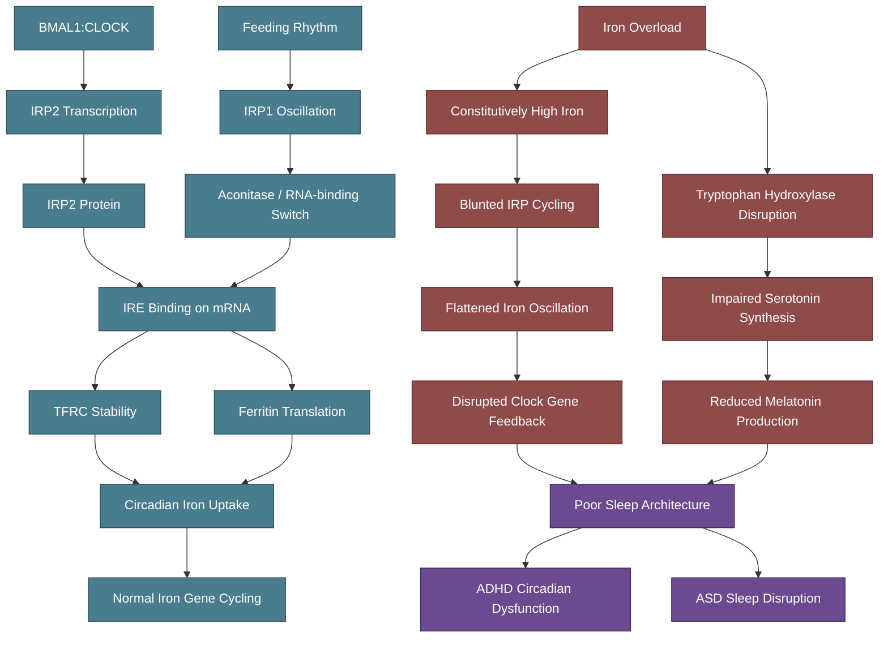

# Iron and Circadian Rhythm

## IRP1/IRP2 and the Circadian Clock

Iron regulatory proteins are not static sensors — they oscillate with daily rhythms, creating a direct molecular link between iron metabolism and the circadian system.

### IRP1: The Bifunctional Iron/Aconitase Sensor

> **Dib L et al.** "Diurnal control of iron responsive element containing mRNAs through iron regulatory proteins IRP1 and IRP2 is mediated by feeding rhythms." *Genome Biol*. 2024;25:138. PMID: 38773499
> - High-amplitude diurnal oscillations in IRP1 and IRP2 regulation of IRE-containing transcripts
> - Maximal IRP activity at the onset of the dark phase (active period)
> - Key discovery: diurnal regulation of IRE-containing mRNAs can **continue without a functional circadian clock** as long as feeding is rhythmic
> - This means **feeding patterns** are the primary driver, not the molecular clock itself

IRP1 has a dual function:
- **Iron-replete**: IRP1 binds a [4Fe-4S] cluster and functions as **cytosolic aconitase** (enzyme)
- **Iron-depleted**: IRP1 loses its iron-sulphur cluster and binds IREs on mRNA (regulatory function)

This switching between enzyme and RNA-binding protein is itself rhythmic — oscillating with feeding/fasting cycles.

### Clock Gene Regulation of IRP2

> The **Ireb2 gene** (encoding IRP2) is circadianly transcribed through **BMAL1:CLOCK** heterodimers in certain tissues
> - BMAL1 and CLOCK are core circadian clock transcription factors
> - They drive rhythmic IRP2 expression, which then rhythmically regulates transferrin receptor (TFRC) mRNA stability
> - This creates a direct link: **clock genes -> IRP2 -> iron uptake regulation**

> [!info]- Colour Key
> 🔵 Clock | 🔴 Damage | 🟣 Outcome

## Iron-Dependent Neurotransmitter Synthesis and Circadian Rhythms

Iron is a cofactor for three hydroxylases that synthesise circadian-relevant neurotransmitters:

| Enzyme | Iron Role | Product | Circadian Relevance |
|--------|-----------|---------|-------------------|
| Tyrosine hydroxylase | Fe2+ cofactor | L-DOPA -> Dopamine | Alertness, reward, activity cycles |
| Tryptophan hydroxylase | Fe2+ cofactor | 5-HTP -> Serotonin -> Melatonin | Sleep initiation, circadian phase |
| Phenylalanine hydroxylase | Fe2+ cofactor | Tyrosine (dopamine precursor) | Upstream of dopamine pathway |

> **DelRosso LM et al.** "Iron deficiency across neurodevelopmental disorders." *Children*. 2026;13(2):180. PMC12938977
> - Iron-dependent enzymes catalyse formation of catecholamines that regulate attention, mood, movement, and **circadian rhythms**
> - Iron deficiency during sensitive developmental windows alters neuronal excitability, synaptic pruning, and dopaminergic signalling

### The Serotonin-Melatonin Pathway

Serotonin is converted to melatonin (the sleep hormone) in the pineal gland. Since serotonin synthesis requires iron-dependent tryptophan hydroxylase, **iron dysregulation can impair melatonin production** and disrupt sleep-wake cycles.

## Sleep Disruption in ADHD and Autism

### ADHD as a Circadian Disorder

> **Van der Heijden KB et al.** "ADHD 24/7: Circadian clock genes, chronotherapy and sleep/wake cycle insufficiencies in ADHD." *J Atten Disord*. 2018. PMID: 30234417
> - Circadian rhythm dysfunction is a clinically significant and highly prevalent phenotype in ADHD
> - Delayed sleep phase is common in ADHD
> - Associations between ADHD and clock gene variants (CLOCK, PER2, BMAL1)

> **Coogan AN et al.** "ADHD as a circadian rhythm disorder: evidence and implications for chronotherapy." *Front Psychiatry*. 2025;16:1697900. PMC12728042
> - Comprehensive review establishing ADHD-circadian dysfunction link
> - Proposes chronotherapy as adjunctive treatment

### Iron, Sleep Movements, and Neurodevelopment

> **Dosman CF et al.** "Evaluation of periodic limb movements in sleep and iron status in children with autism." *Clin Pediatr*. 2015. PMC4610130
> - Higher than expected rates of periodic limb movements in sleep (PLMS) in children with ASD
> - Both low serum iron levels and higher sleep disorder rates reported in ASD
> - Iron supplementation improved sleep quality in 29% of 24 ASD participants with low ferritin

> **Cortese S et al.** "Restless legs syndrome and ADHD." *Sleep Med Rev*. 2023. DOI: 10.1016/j.smrv.2023.101746
> - 44% of children with ADHD may have restless legs syndrome (RLS) vs ~1% of general child population
> - RLS is linked to brain iron deficiency, particularly in the substantia nigra
> - Iron supplementation improved RLS symptoms in ADHD cohorts

> **DelRosso LM et al.** "Restless sleep disorder and the role of iron in other sleep-related movement disorders and ADHD." *Sleep Med Clin*. 2022;7(3):18
> - Iron acts as a regulator of dopamine signalling in the brain
> - Iron deficiency decreases dopamine receptor density and transporter in the striatum
> - Altered dopaminergic signalling is integral to both RLS and ADHD

## The Overload Paradox for Sleep

Most sleep-iron research focuses on deficiency. But for HFE carriers with iron overload:

1. **Brain iron distribution may be uneven** — some regions iron-replete, others functionally depleted
2. **Oxidative stress from excess iron** could damage dopaminergic neurons in the substantia nigra, paradoxically creating functional dopamine/iron deficiency in that region
3. **Neuroinflammation** from iron overload disrupts sleep architecture independently
4. **IRP1/IRP2 oscillations** may be dysregulated by constitutively elevated iron, flattening the normal diurnal iron cycling
5. **Melatonin synthesis** could be impaired if tryptophan hydroxylase function is altered by iron dysregulation

## Clinical Implications

1. **Sleep quality assessment** (polysomnography, actigraphy) is important for ADHD/autism patients with iron dysregulation
2. **PLMS screening** should be considered, especially given the RLS-ADHD-iron triad
3. **Melatonin supplementation** may partly compensate for impaired endogenous production
4. **Meal timing** may affect IRP oscillations — regular feeding rhythms could support iron metabolism regulation
5. **Chronotherapy** (timed light exposure, fixed sleep/wake times) addresses the circadian component

---

## Cross-References
- [[Iron-Dopamine-ADHD Axis]]
- [[HFE Variants and Brain Iron]]
- [[Iron and GABAergic Function]]
- [[Elvanse and Mineral Metabolism]]
- [[Fatigue and Burnout]]
- [[Health Research MOC]]
