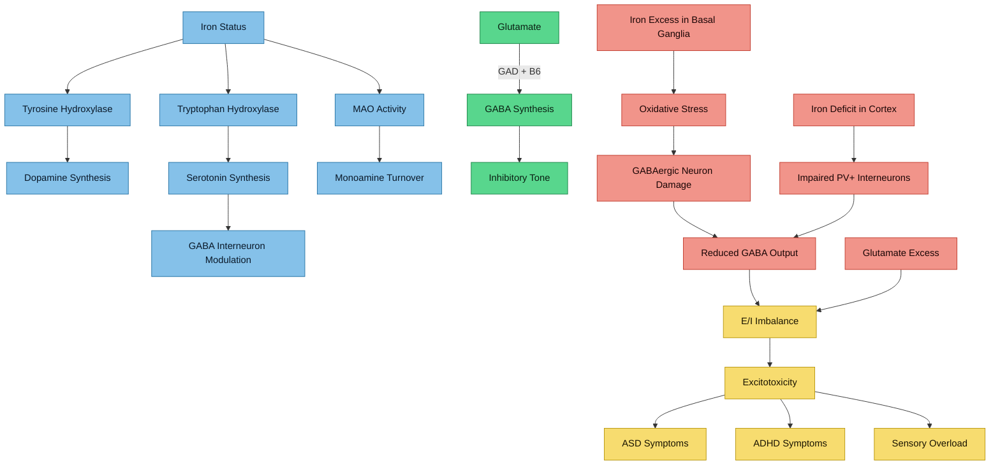

# Iron and GABAergic Function

## The E/I Balance Problem in Autism

A leading hypothesis in autism neurobiology is that ASD involves a disturbed **excitatory/inhibitory (E/I) balance** — specifically, reduced GABAergic (inhibitory) tone relative to glutamatergic (excitatory) signalling.

> **Cellot G, Bhatt DK et al.** "GABAergic system dysfunction in autism spectrum disorders." *Front Cell Dev Biol*. 2022;9:781327. PMC8858939
> - Genetic variations in GABA system genes implicated in ASD pathogenesis
> - Children with ASD have significantly lower brain GABA levels vs typically developing children
> - Dysfunction of GABAergic interneurons proposed as a core mechanism

> **Li Q et al.** "A comprehensive review of GABA in autism spectrum disorders: associations, mechanisms, and therapeutic implications." *Front Psychiatry*. 2025;16:1587432. PMC12589001
> - GABA deficit is increasingly recognised as central to ASD neurobiology
> - Links GABA to sensory processing abnormalities, social cognition deficits, and repetitive behaviours

> [!info]- Colour Key
> 🔵 Normal | 🔴 Damage | 🟣 Outcome | 🟢 GABA

## How Iron Affects GABAergic Signalling

Iron's relationship with GABA is **indirect but significant** at multiple levels:

### 1. GABA Synthesis Pathway

GABA is synthesised from glutamate by **glutamic acid decarboxylase (GAD)**, which requires **pyridoxal phosphate (vitamin B6)** as its cofactor — not iron directly. However:

- The **supply of glutamate** (GABA's precursor) is modulated by iron-dependent enzymes
- **Monoamine oxidase (MAO)** activity is reduced in iron deficiency, altering overall monoamine/amino acid neurotransmitter balance

### 2. Monoamine Oxidase and Iron

> **Youdim MB, Green AR.** "Iron deficiency and neurotransmitter synthesis and function." *Proc Nutr Soc*. 1978. PMID: cited in ResearchGate
> - MAO activity is lower in iron-deficient humans and rats
> - Though MAO uses FAD (not iron) as its primary cofactor, iron status affects MAO expression and activity
> - Reduced MAO alters the turnover of serotonin, dopamine, and norepinephrine — all of which modulate GABAergic interneuron function

### 3. Iron in Tryptophan Hydroxylase (Serotonin Synthesis)

> **Walther DJ, Bader M.** "Tryptophan hydroxylase and serotonin synthesis regulation." *Handb Behav Neurosci*. 2020.
> - Tryptophan hydroxylase (TPH) is an **iron-dependent** enzyme (nonheme iron, like tyrosine hydroxylase)
> - TPH is the rate-limiting enzyme for serotonin synthesis
> - Serotonin modulates GABAergic interneuron activity extensively
> - Iron dysregulation -> serotonin dysregulation -> altered GABA modulation

### 4. Basal Ganglia GABAergic Output

The **globus pallidus** — the major output nucleus of the basal ganglia — is GABAergic and has the highest iron concentration of any brain structure.

- Iron overload in the globus pallidus could directly impair GABAergic output neurons
- This connects to OCD-spectrum conditions (see [[Iron and OCD-Spectrum Repetitive Behaviours]])
- Altered globus pallidus function affects thalamic gating and cortical excitability

### 5. Iron and Inhibitory Interneuron Development

During brain development, iron is required for the proper maturation of **parvalbumin-positive (PV+) GABAergic interneurons** — the fast-spiking inhibitory neurons that are critical for:
- Cortical gamma oscillations
- Sensory processing
- Working memory
- E/I balance maintenance

PV+ interneurons are among the most metabolically demanding neurons. Their high mitochondrial content makes them particularly dependent on iron for electron transport chain function and particularly vulnerable to iron-mediated oxidative stress.

## The Iron Overload Paradox for GABA

**Iron deficiency** reduces GABA-related enzyme activities and serotonin synthesis, weakening inhibitory tone.

**Iron overload** damages GABAergic neurons (especially in iron-rich basal ganglia) through oxidative stress and potentially ferroptosis.

Either direction of iron dysregulation disrupts E/I balance.

For HFE carriers with autism:
- Systemic iron overload with possible brain iron maldistribution
- Some regions may have excess iron (damaging GABAergic neurons)
- Other regions may have functional iron insufficiency (impairing GABAergic development)
- Net result: worsened E/I imbalance

## Clinical Implications

1. **E/I balance** in ASD is measurable via MR spectroscopy (GABA and glutamate levels) and EEG (gamma oscillation power)
2. **Iron status optimisation** — not just correction of deficiency, but also management of overload — may help restore inhibitory tone
3. **GABAergic medications** (e.g., bumetanide trials in ASD) are being studied; iron status may modify their efficacy
4. **Serotonin modulation** by iron status connects to SSRI response in autism/OCD — iron status could be a pharmacogenomic modifier

---

## Cross-References
- [[Iron-Dopamine-ADHD Axis]]
- [[Iron and OCD-Spectrum Repetitive Behaviours]]
- [[Iron Glutamate and Excitotoxicity]]
- [[Iron and Oxidative Stress in Autism]]
- [[HFE Variants and Brain Iron]]
- [[Health Research MOC]]
