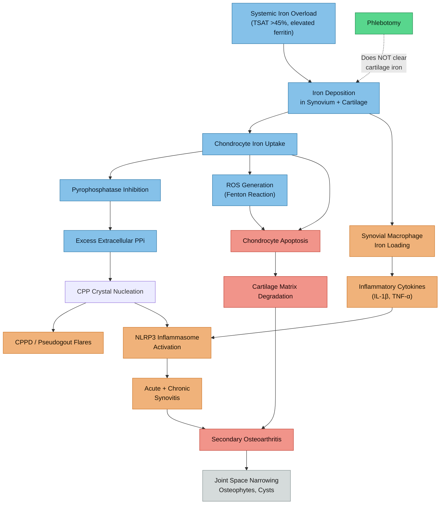

# Iron-Mediated Joint Pathology in Haemochromatosis

## Overview

Arthropathy is the most common clinical manifestation of hereditary haemochromatosis (HH), affecting 30-50% of C282Y homozygotes at presentation and occurring in compound heterozygotes with elevated iron parameters. Unlike hepatic and cardiac complications, joint disease frequently does not respond to phlebotomy and may progress even after iron normalisation. This note provides a mechanistic deep-dive into how iron damages joints, with particular attention to relevance for [[HFE Compound Heterozygosity|C282Y/H63D compound heterozygotes]].

> [!info]- Colour Key
> 🔵 Mechanism | 🟠 Inflammatory | 🔴 Irreversible | 🟢 Treatable | ⚪ Imaging

---

## 1. Calcium Pyrophosphate Deposition Disease (CPPD) in Haemochromatosis

### The Iron-Pyrophosphatase-Crystal Pathway

CPPD (pseudogout) is strongly associated with haemochromatosis. The mechanistic link centres on how iron disrupts pyrophosphate metabolism in cartilage:

1. **Iron deposits in chondrocytes.** In HH, iron accumulates within articular chondrocytes as ferritin and haemosiderin. Schumacher (1982) demonstrated iron in chondrocytes in 3 of 4 haemochromatosis cartilage specimens, with calcium pyrophosphate dihydrate (CPPD) or apatite crystals present in all specimens. PMID: [7150378](https://pubmed.ncbi.nlm.nih.gov/7150378/). **Evidence: B**

2. **Iron inhibits pyrophosphatases.** Inorganic pyrophosphate (PPi) is normally broken down by pyrophosphatase enzymes. Iron (Fe2+ and Fe3+) inhibits these enzymes, leading to accumulation of extracellular PPi in the cartilage matrix. When PPi exceeds a saturation threshold in the presence of calcium, CPP crystals nucleate. **Evidence: B** (Rachow & Ryan, *Rheum Dis Clin North Am* 1988. PMID: [2845490](https://pubmed.ncbi.nlm.nih.gov/2845490/))

3. **CPP crystals trigger inflammation.** Once formed, CPP crystals activate the NLRP3 inflammasome in synovial macrophages, driving IL-1-beta release and acute inflammatory flares (pseudogout attacks). **Evidence: A** (Pascart et al., *Lancet Rheumatol* 2024;6:e791-e804. PMID: [39089298](https://pubmed.ncbi.nlm.nih.gov/39089298/))

### Prevalence of CPPD in Haemochromatosis

- Chondrocalcinosis (radiographic CPPD) is found in approximately 30-50% of HH patients at diagnosis
- CPPD is "uncommonly associated with metabolic conditions" in the general population, but haemochromatosis is one of the strongest known metabolic associations (Pascart et al. 2024)
- In the Rotterdam Study, H63D homozygotes aged 65 or younger had a **4.7-fold increased risk** of chondrocalcinosis in hip or knee joints (OR 4.7; 95% CI 1.2-18.5). **Compound heterozygotes** had a **6.5-fold increased risk** of chondrocalcinosis specifically in hip joints (OR 6.5; 95% CI 1.8-22.3), though this appeared at later ages (>65 years). PMID: [17284543](https://pubmed.ncbi.nlm.nih.gov/17284543/). **Evidence: B**

### Shared Pathogenic Pathways: HH Arthropathy and CPPD

A key 2022 review by Mitton-Fitzgerald et al. identified that haemochromatosis arthropathy (HHA) and CPPD share pathogenic mechanisms beyond crystal deposition:

- Similar joint distribution patterns
- Low-grade synovial inflammation
- Generalised bone loss
- Decreased osteoblast alkaline phosphatase activity
- Increased osteoclastogenesis
- Impaired joint repair processes

The authors concluded that shared pathways "relate more to bone and abnormal damage/repair mechanisms than direct damage to articular cartilage." PMID: [35143028](https://pubmed.ncbi.nlm.nih.gov/35143028/). **Evidence: B**

---

## 2. The Classic Haemochromatosis Arthropathy Pattern

### Joint Distribution

HH arthropathy has a distinctive pattern that differs from typical age-related osteoarthritis:

| Joint | Frequency | Notes |
|-------|-----------|-------|
| **2nd and 3rd MCP joints** | Most characteristic | "Sentinel sign" — highly suggestive of HH when present in a young/middle-aged adult |
| **Wrists** | Common | Radiocarpal and intercarpal involvement |
| **Knees** | Common | Both femorotibial and patellofemoral compartments |
| **Hips** | Common | May progress to requiring arthroplasty |
| **Ankles** | Underrecognised | Associated with H63D specifically (Carroll 2006) |
| **Shoulders** | Less common | Documented in UK Biobank data |
| **Lumbar spine** | Documented | See spinal section below |
| **Cervical spine** | Documented | Less studied than peripheral joints |

> "Arthropathy is a prominent but still underappreciated aspect of haemochromatosis... Virtually any joint can be involved and can be a presenting clue to the underlying disease."
> — Schumacher HR, *Baillieres Best Pract Res Clin Rheumatol* 2000. PMID: [10925745](https://pubmed.ncbi.nlm.nih.gov/10925745/). **Evidence: B**

### Imaging Findings

Adamson et al. (1983) established the distinctive radiographic features that distinguish HH arthropathy from idiopathic CPPD:

- **Hook-like osteophytes** on the radial aspect of metacarpal heads — highly characteristic of HH
- **MCP joint space narrowing** (including 4th and 5th digits, unlike idiopathic CPPD)
- **Subcortical cysts** (large, prominent)
- **Exuberant osteophytes** — more florid than typical OA
- **Chondrocalcinosis** — calcification of fibrocartilage and hyaline cartilage visible on X-ray
- Less scapholunate dissociation than in idiopathic CPPD

PMID: [6300958](https://pubmed.ncbi.nlm.nih.gov/6300958/). **Evidence: B**

---

## 3. Lumbar Spine Involvement

### Iron Deposition in the Spine

Spinal involvement in HH is less studied than hand and wrist disease but is documented and clinically significant:

- **Intervertebral disc degeneration** — iron deposition in disc tissue accelerates degeneration. In thalassaemia intermedia (another iron-loading condition), disc calcification correlates with iron overload severity (Aessopos et al., *Eur J Haematol* 2008. PMID: [18028418](https://pubmed.ncbi.nlm.nih.gov/18028418/)). **Evidence: C**
- **Facet joint arthropathy** — synovial joints of the spine are susceptible to the same iron-mediated chondrocyte damage and CPPD deposition as peripheral joints
- **Paraspinal soft tissue iron loading** — may contribute to stiffness and pain
- **CPPD in spinal ligaments** — crowned dens syndrome (calcification of the transverse ligament around the odontoid) is a recognised CPPD manifestation; CT is the preferred imaging modality for axial CPPD (Pascart et al. 2024)

### Why Lumbar Spine Is Relevant at Age 37

- Typical age-related lumbar disc degeneration becomes symptomatic in the 40s-50s
- HH arthropathy presents at a **younger than expected age** (Kiely 2018)
- Iron-accelerated degeneration could explain early-onset back pain in the context of elevated iron parameters
- The facet joints, being synovial joints, are susceptible to exactly the same CPPD mechanism as MCPs and knees

---

## 4. Inflammatory vs Degenerative Components

HH arthropathy has both inflammatory and degenerative features:

### Degenerative Component (Predominant)
- Cartilage matrix degradation from chondrocyte death
- Secondary osteoarthritis pattern on imaging
- Progressive joint space narrowing
- Osteophyte formation
- This component is largely **irreversible**

### Inflammatory Component
- **Acute CPPD flares** (pseudogout) — acute monoarticular or oligoarticular inflammation triggered by CPP crystal shedding
- **Chronic low-grade synovitis** — iron-loaded macrophages produce inflammatory cytokines
- **NLRP3 inflammasome activation** — CPP crystals activate the same pathway as MSU crystals in gout
- This component is potentially **treatable**

Van Vulpen et al. (2015) compared haemochromatosis arthropathy with haemophilic arthropathy and noted that while both involve iron-mediated joint destruction, haemochromatosis has **minimal inflammatory signalling** compared to haemophilia. The synovial inflammation in HH is "low-grade" rather than the florid synovitis seen in haemophilia. PMID: [25897098](https://pubmed.ncbi.nlm.nih.gov/25897098/). **Evidence: B**

---

## 5. Why Arthropathy Persists After Phlebotomy

This is one of the most clinically important and counterintuitive aspects of HH arthropathy:

### The Evidence for Non-Response

> "Phlebotomies, although valuable to treat or prevent other features, do not predictably benefit the arthropathy."
> — Schumacher HR, *Baillieres Best Pract Res Clin Rheumatol* 2000. PMID: [10925745](https://pubmed.ncbi.nlm.nih.gov/10925745/)

> "The arthropathy differs from the other features in not responding to de-ironing, new joints becoming affected once patients are in maintenance."
> — Kiely PDW, *J R Coll Physicians Edinb* 2018. PMID: [30191911](https://pubmed.ncbi.nlm.nih.gov/30191911/)

Harty et al. (2011) studied joint symptom prevalence and response to venesection in HH patients and found that joint symptoms frequently persisted or progressed despite successful iron depletion. PMID: [21617548](https://pubmed.ncbi.nlm.nih.gov/21617548/). **Evidence: B**

### Why Phlebotomy Fails to Help Joints

1. **Iron in cartilage is inaccessible to phlebotomy.** Cartilage is avascular — it has no blood supply. Once iron is deposited in chondrocytes, reducing serum iron and ferritin via phlebotomy does not extract iron from cartilage tissue.
2. **Damage is structural and irreversible.** By the time arthropathy is clinically apparent, cartilage matrix degradation and subchondral bone changes have already occurred. These structural changes cannot be reversed.
3. **CPP crystals persist.** No treatment currently dissolves CPP crystals once deposited (Pascart et al. 2024). They continue to trigger inflammation regardless of iron status.
4. **New joint involvement occurs during maintenance.** Kiely (2018) noted that patients develop arthropathy in new joints even while on maintenance phlebotomy, raising the question of whether HFE mutations have an arthritogenic effect independent of systemic iron levels.

### The Kiely Hypothesis: HFE-Independent Arthropathy?

Kiely (2018) raised a provocative question: classic HH arthropathy occurs in patients with HFE mutations who do **not** have systemic iron overload. This raises the possibility that:
- HFE protein itself may have a direct role in chondrocyte function
- The arthropathy may not be purely iron-mediated
- HFE mutations may alter local joint iron metabolism independently of systemic iron status

PMID: [30191911](https://pubmed.ncbi.nlm.nih.gov/30191911/). **Evidence: C** (hypothesis based on clinical observations)

**Clinical implication:** This does NOT mean phlebotomy is pointless — it prevents liver, cardiac, and endocrine damage. But it means **joint protection must be pursued in parallel**, not deferred until after de-ironing.

---

## 6. Compound Heterozygotes: Arthropathy Prevalence

### Is Arthropathy Prevalence Lower in C282Y/H63D Than C282Y Homozygotes?

Yes, but compound heterozygotes are not zero-risk:

**Rotterdam Study (Alizadeh et al. 2007)**
- **C282Y/H63D compound heterozygotes** (aged >65 years) had significantly higher frequency of:
  - Arthralgia: OR 2.9 (95% CI 1.0-9.3)
  - Chondrocalcinosis in hip joints: OR 6.5 (95% CI 1.8-22.3)
  - Increased osteophytes in knee joints
- Effects were more pronounced with age in compound hets
- PMID: [17284543](https://pubmed.ncbi.nlm.nih.gov/17284543/). **Evidence: B**

**UK Biobank (Banfield et al. 2023)**
- Male C282Y homozygotes had clearly elevated musculoskeletal risk: OA HR 2.12, hip replacement HR 1.84, knee replacement HR 1.54
- **Male C282Y/H63D compound heterozygotes** had a modest increased risk of hip replacement (HR 1.17; 95% CI 1.02-1.33; p=0.02) — but this did not survive multiple testing correction
- This suggests compound het arthropathy risk is **real but substantially lower** than C282Y homozygotes
- PMID: [37808392](https://pubmed.ncbi.nlm.nih.gov/37808392/). **Evidence: A** (large cohort, 451,143 participants, 11.5-year follow-up)

**Scottish Rheumatology Clinic Study (Donnelly et al. 2010)**
- C282Y carrier frequency was 1 in 5.2 among rheumatology/joint replacement clinic attendees versus 1 in 8.1 in controls (p<0.005)
- 8 of 161 unselected rheumatology patients were compound heterozygotes
- PMID: [20218273](https://pubmed.ncbi.nlm.nih.gov/20218273/). **Evidence: B**

**H63D-Specific Arthropathy (Carroll 2006)**
- H63D mutations independently associated with MCP joint OA and a polyarticular OA phenotype
- Higher synovial fluid ferritin in OA patients with HFE mutations
- PMIDs: [16583477](https://pubmed.ncbi.nlm.nih.gov/16583477/), [16755236](https://pubmed.ncbi.nlm.nih.gov/16755236/), [20560808](https://pubmed.ncbi.nlm.nih.gov/20560808/). **Evidence: B**

### Summary: Compound Het Arthropathy Risk

| Feature | C282Y/C282Y | C282Y/H63D |
|---------|-------------|------------|
| Overall arthropathy prevalence | 30-50% at presentation | Lower, but not quantified precisely |
| OA risk (UK Biobank) | HR 2.12 (males) | Not significantly elevated for OA specifically |
| Hip replacement risk | HR 1.84 | HR 1.17 (modest, borderline significant) |
| Chondrocalcinosis | Very common | OR 6.5 for hip CC (Rotterdam, aged >65) |
| MCP pattern OA | Characteristic | Documented with H63D mutations |

---

## 7. Age of Onset — Is 37 Early or Typical?

### What the Literature Says

- **Classic HH arthropathy** typically presents in the **4th-5th decade** (age 40-60) in C282Y homozygotes
- Kiely (2018) describes HH arthropathy as presenting at a **"younger than expected age"** compared to typical OA
- Von Kempis (2001) emphasised that early identification before clinical symptoms is key, as "early initiation of iron depletion therapy... might prevent the manifestation of arthropathy or reduce its severity." PMID: [11148720](https://pubmed.ncbi.nlm.nih.gov/11148720/). **Evidence: B**
- In the Rotterdam Study, H63D-associated joint pathology was most prominent in subjects **aged 65 or younger**
- Banfield et al. (2023) studied participants aged 40-70 at baseline, so data on onset before 40 is limited in that cohort

### At Age 37 With Ferritin 380 and TSAT 60%

- Age 37 is at the **early end** of the typical HH arthropathy onset window
- However, Anthony's ferritin reached 700 previously — years of elevated iron exposure may have already seeded joint damage
- Compound heterozygotes who DO load iron (Anthony is in this minority per [[HFE Compound Heterozygosity|Gallego et al. 2015]]) may follow a similar timeline to milder C282Y homozygote presentations
- Lower back pain at 37 cannot be attributed solely to HH — but in the context of confirmed iron overload, it warrants investigation for iron-mediated joint pathology

---

## 8. Treatment Options

### Acute CPPD Flares (Pseudogout)

| Treatment | Evidence | Notes |
|-----------|----------|-------|
| **Oral corticosteroids (prednisone)** | Best benefit-risk ratio per Pascart et al. 2024 | Short course, e.g. 20-30mg tapering over 7-10 days |
| **Low-dose colchicine** | Effective for acute flares and prophylaxis | 0.5mg BD; risk of mild diarrhoea |
| **NSAIDs** | Effective for acute pain | Short-course; consider GI and renal risk |
| **Intra-articular corticosteroid injection** | Effective for monoarticular flares | Avoids systemic effects |
| **Ice and rest** | Adjunctive | For acute flares |

**Evidence: A** for corticosteroids and colchicine in acute CPPD (Pascart et al. 2024)

### Chronic / Prophylactic Management

| Treatment | Evidence | Notes |
|-----------|----------|-------|
| **Colchicine 0.5mg daily** | Prophylaxis against recurrent flares | **Evidence: B** |
| **Low-dose methotrexate** | For persistent CPP-crystal inflammatory arthritis | **Evidence: C** (limited data) |
| **Hydroxychloroquine** | For persistent inflammatory component | **Evidence: C** |
| **IL-1 or IL-6 inhibitors** | Refractory disease | **Evidence: C** (biologics, specialist use) |

### Joint Protection Strategies

- **Exercise** — strengthening periarticular muscles protects joint surfaces; swimming and cycling are low-impact options (see [[Exercise as Medicine for AuDHD-HFE]])
- **Weight management** — reduces mechanical load on weight-bearing joints
- **Ergonomics** — particularly relevant for back pain and MCP joints
- **Activity modification** — avoid high-impact activities that stress affected joints
- **Physiotherapy** — targeted rehabilitation for specific joint involvement

### Phlebotomy: Joint-Specific Expectations

Phlebotomy **should still be pursued** because:
1. It prevents further iron deposition in joints (even if it cannot reverse existing deposits)
2. It protects liver, heart, and endocrine organs
3. Early intervention may slow arthropathy progression even if it cannot halt it entirely
4. Von Kempis (2001) suggested that pre-symptomatic iron depletion "might prevent the manifestation of arthropathy or reduce its severity"

But patients should be counselled that **joint symptoms may not improve** and may progress despite successful de-ironing.

---

## 9. Clinical Relevance for Anthony

### Current Situation
- **Genotype:** C282Y/H63D compound heterozygote
- **Iron status:** Ferritin 380 (previously 700), TSAT 60%
- **Symptom:** Persistent lower back pain
- **Age:** 37 — early end of HH arthropathy onset window

### Key Considerations

1. **The back pain warrants investigation for iron-mediated pathology.** While many causes of back pain exist at age 37 (postural, muscular, disc-related), the combination of confirmed iron overload and lower back symptoms should prompt imaging. The [[Action Items and Monitoring Plan]] already recommends hand and spine imaging.

2. **Imaging priorities:**
   - **X-ray hands (AP)** — look for hook-like osteophytes at 2nd/3rd MCPs, joint space narrowing
   - **X-ray lumbar spine** — facet joint changes, disc space narrowing, chondrocalcinosis
   - **MRI lumbar spine** — if X-ray is abnormal or pain persists, to assess for disc and facet iron-related changes
   - **Ultrasound of knees/wrists** — increasingly used for CPPD detection (Pascart et al. 2024)

3. **Compound het arthropathy is real but lower risk.** Anthony is not at the same risk as a C282Y homozygote, but he is in the phenotypically affected minority of compound heterozygotes. His prior ferritin of 700 represents years of potential joint iron exposure.

4. **Phlebotomy is urgent for joint protection.** While existing joint damage may not reverse, starting phlebotomy now may prevent further iron deposition and slow progression. Every month of continued iron overload is additional exposure for cartilage.

5. **If acute joint flares occur** (sudden-onset hot, swollen joint), consider CPPD/pseudogout as a differential. Synovial fluid aspiration with crystal analysis would be diagnostic.

6. **The AuDHD context matters:**
   - Sedentary patterns from executive dysfunction increase back pain risk
   - Stimulant medication (Elvanse) can increase muscle tension
   - Autistic proprioceptive differences may affect posture and ergonomics
   - Interoceptive differences ([[Interoception in AuDHD - Research Review]]) may mean pain is underreported or atypically perceived

7. **Monitor for the characteristic MCP pattern.** Any stiffness or pain in the 2nd/3rd finger joints should prompt imaging, as this is the sentinel sign of HH arthropathy.

### What to Discuss With GP

> "I'm experiencing persistent lower back pain alongside confirmed iron overload (ferritin 380, TSAT 60%, HFE compound heterozygote). Haemochromatosis arthropathy can affect the spine as well as hands and large joints, and can present in the late 30s. I'd like X-rays of my hands and lumbar spine to check for iron-related joint changes such as chondrocalcinosis or early osteoarthritis. The EASL guidelines note that arthropathy is one of the most common manifestations of haemochromatosis and may not respond to phlebotomy, making early detection important."

---

## Key References

1. Schumacher HR. Articular cartilage in the degenerative arthropathy of hemochromatosis. *Arthritis Rheum*. 1982;25(12):1460-8. PMID: [7150378](https://pubmed.ncbi.nlm.nih.gov/7150378/)
2. Adamson TC et al. Hand and wrist arthropathies of hemochromatosis and CPPD: distinct radiographic features. *Radiology*. 1983;147(2):377-81. PMID: [6300958](https://pubmed.ncbi.nlm.nih.gov/6300958/)
3. Rachow JW, Ryan LM. Inorganic pyrophosphate metabolism in arthritis. *Rheum Dis Clin North Am*. 1988;14(2):289-302. PMID: [2845490](https://pubmed.ncbi.nlm.nih.gov/2845490/)
4. Schumacher HR. Haemochromatosis. *Baillieres Best Pract Res Clin Rheumatol*. 2000;14(2):277-84. PMID: [10925745](https://pubmed.ncbi.nlm.nih.gov/10925745/)
5. Von Kempis J. Arthropathy in hereditary hemochromatosis. *Curr Opin Rheumatol*. 2001;13(1):80-3. PMID: [11148720](https://pubmed.ncbi.nlm.nih.gov/11148720/)
6. Carroll GJ. HFE gene mutations are associated with osteoarthritis in the index or middle finger MCP joints. *J Rheumatol*. 2006;33(4):749-53. PMID: [16583477](https://pubmed.ncbi.nlm.nih.gov/16583477/)
7. Carroll GJ. Primary OA in the ankle joint is associated with finger MCP OA and H63D. *J Clin Rheumatol*. 2006;12(3):109-13. PMID: [16755236](https://pubmed.ncbi.nlm.nih.gov/16755236/)
8. Alizadeh BZ et al. The H63D variant predisposes to arthralgia, chondrocalcinosis and OA. *Ann Rheum Dis*. 2007;66(11):1436-42. PMID: [17284543](https://pubmed.ncbi.nlm.nih.gov/17284543/)
9. Carroll GJ et al. Ferritin concentrations in synovial fluid are higher in OA patients with HFE mutations. *Scand J Rheumatol*. 2010;39(5):413-6. PMID: [20560808](https://pubmed.ncbi.nlm.nih.gov/20560808/)
10. Donnelly SC et al. Prevalence of genetic haemochromatosis in patients attending rheumatology clinics. *Scott Med J*. 2010;55(1):14-6. PMID: [20218273](https://pubmed.ncbi.nlm.nih.gov/20218273/)
11. Harty LC et al. Prevalence and progress of joint symptoms in HH and response to venesection. *J Clin Rheumatol*. 2011;17(4):220-2. PMID: [21617548](https://pubmed.ncbi.nlm.nih.gov/21617548/)
12. Van Vulpen LFD et al. The detrimental effects of iron on the joint: haemochromatosis vs haemophilia. *J Clin Pathol*. 2015;68(8):592-600. PMID: [25897098](https://pubmed.ncbi.nlm.nih.gov/25897098/)
13. Kiely PDW. Haemochromatosis arthropathy — a conundrum of the Celtic curse. *J R Coll Physicians Edinb*. 2018;48(3):233-238. PMID: [30191911](https://pubmed.ncbi.nlm.nih.gov/30191911/)
14. Nowak P. Hemochromatosis related arthropathy. *Ther Umsch*. 2018;75(4):235-239. PMID: [30468115](https://pubmed.ncbi.nlm.nih.gov/30468115/)
15. Simao M et al. Intracellular iron uptake is favored in Hfe-KO mouse primary chondrocytes mimicking an OA-related phenotype. *Biofactors*. 2019;45(4):583-597. PMID: [31132316](https://pubmed.ncbi.nlm.nih.gov/31132316/)
16. Mitton-Fitzgerald E et al. Common pathogenic pathways in HH arthritis and CPPD: a review. *Curr Rheumatol Rep*. 2022;24(2):40-45. PMID: [35143028](https://pubmed.ncbi.nlm.nih.gov/35143028/)
17. EASL Clinical Practice Guidelines on haemochromatosis. *J Hepatol*. 2022;77(2):479-502. PMID: [35662478](https://pubmed.ncbi.nlm.nih.gov/35662478/)
18. Banfield LR et al. HH genetic variants and musculoskeletal outcomes: 11.5-year UK Biobank follow-up. *JBMR Plus*. 2023;7(10):e10794. PMID: [37808392](https://pubmed.ncbi.nlm.nih.gov/37808392/)
19. Calori S et al. Overview of ankle arthropathy in hereditary hemochromatosis. *Med Sci (Basel)*. 2023;11(3):51. PMID: [37606430](https://pubmed.ncbi.nlm.nih.gov/37606430/)
20. Pascart T et al. Calcium pyrophosphate deposition disease. *Lancet Rheumatol*. 2024;6:e791-e804. PMID: [39089298](https://pubmed.ncbi.nlm.nih.gov/39089298/)

---

## Cross-References

- [[Arthropathy and Back Pain]] — symptom-level note and clinical overview
- [[HFE Compound Heterozygosity]] — genotype context and penetrance data
- [[HFE Compound Het - Disease Associations Beyond Iron]] — broader disease mapping including arthritis
- [[Iron Overload and NTBI]] — systemic iron overload mechanisms
- [[Transferrin Saturation - Clinical Significance]] — TSAT thresholds and NTBI formation
- [[Action Items and Monitoring Plan]] — imaging and phlebotomy recommendations
- [[Exercise as Medicine for AuDHD-HFE]] — joint-protective exercise approaches
- [[Interoception in AuDHD - Research Review]] — pain perception differences
- [[Blood Results - March 2026]] — current iron parameters
