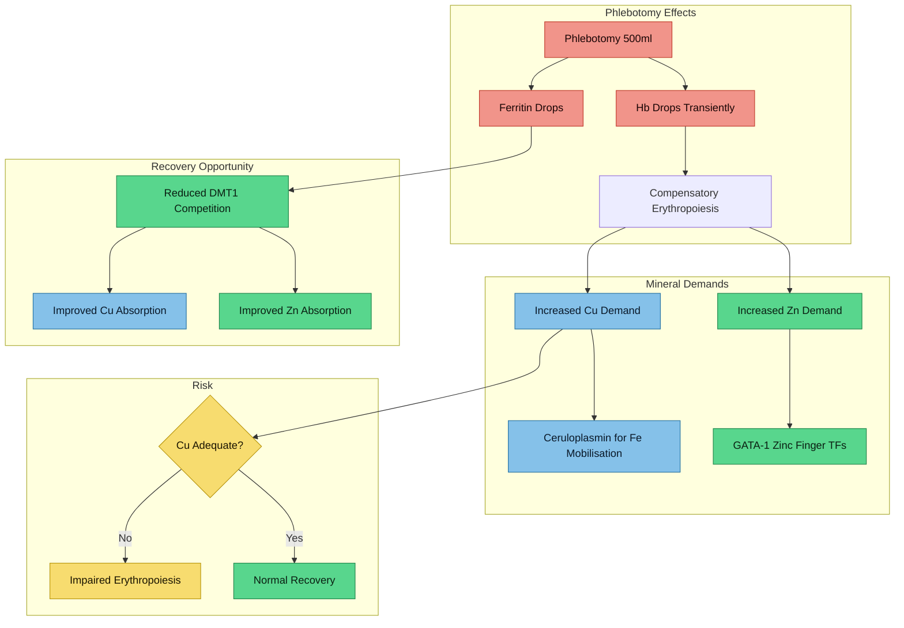

# Mineral Rebalancing During Active Phlebotomy

## Why This Matters

Therapeutic phlebotomy removes 200–250 mg of iron per 500 ml session. This drives compensatory erythropoiesis, which increases demand for copper (ceruloplasmin-dependent iron mobilisation), zinc (erythrocyte zinc finger transcription factors), and other cofactors. For someone starting phlebotomy with **already borderline copper (14.3 umol/L) and zinc (12.5 umol/L)**, the risk of functional deficiency during active treatment is real and under-discussed in clinical practice.

> [!info]- Colour Key
> 🟠 Iron | 🔵 Copper | 🟢 Zinc | 🟡 Magnesium | 🔴 Risk

---

## The Bolann Study — Direct Evidence

The single most relevant study is Bolann et al. (2015), which directly measured trace element changes in 26 hemochromatosis patients (including 7 compound heterozygotes) before and after completion of phlebotomy treatment.

> **Bolann BJ, Distante S, Mørkrid L, Ulvik RJ.** "Bloodletting therapy in hemochromatosis: Does it affect trace element homeostasis?" *J Trace Elem Med Biol*. 2015;31:225-229. PMID: [25175510](https://pubmed.ncbi.nlm.nih.gov/25175510/)
> **Evidence: B** (prospective clinical study, n=26, mixed HFE genotypes)

Key findings:
- **Serum copper increased** from 16.2 to 17.6 umol/L after phlebotomy completion (p < 0.05)
- **Serum zinc did NOT significantly change** — suggesting zinc recovery may require supplementation or longer follow-up
- **Cobalt increased** from 5.6 to 11.5 nmol/L (concerning — potentially toxic element absorbed via DMT1 when iron stores drop)
- **Manganese decreased** slightly
- Selenium, barium, molybdenum, and strontium were unchanged

### Interpretation for Anthony
Starting copper of 14.3 umol/L is lower than the study's pre-treatment mean of 16.2. If phlebotomy produces a similar ~1.4 umol/L increase, Anthony might reach ~15.7 — still in the lower quarter of the 12–26 range. **Copper supplementation should be considered if levels do not improve after the first 2–3 phlebotomy sessions.** The lack of zinc improvement in this study reinforces the need for continued zinc supplementation.

---

## Mechanism: How Iron Depletion Affects Other Minerals

### DMT1 Competition Decreases

As iron stores fall, the body upregulates DMT1 expression to absorb more iron. Paradoxically, this also increases the absorption capacity for other divalent metals transported by DMT1, including copper and zinc.

> **Rolić T, Yazdani M, Mandić S, Distante S.** "Iron Metabolism, Calcium, Magnesium and Trace Elements: A Review." *Biol Trace Elem Res*. 2025;203:2216-2225. PMID: [38969940](https://pubmed.ncbi.nlm.nih.gov/38969940/) | PMC11920315
> **Evidence: B** (narrative review with mechanistic detail)
> - Iron removal by phlebotomy in hemochromatosis patients increases levels of cadmium and lead
> - Excess iron antagonises copper metabolism and reduces ceruloplasmin
> - Low magnesium concentrations can exacerbate iron deficiency
> - Calcium inhibits DMT1 in a dose-dependent manner

> **Scheers N.** "Regulatory effects of Cu, Zn, and Ca on Fe absorption." *Nutrients*. 2013;5(3):957-970. PMC3705329
> **Evidence: B** (review of transport mechanisms)

### The Two Competing Forces During Phlebotomy

1. **Benefit**: Reduced iron load means less competitive displacement of Cu/Zn at DMT1 → improved absorption
2. **Risk**: Accelerated erythropoiesis demands more Cu (for ceruloplasmin/iron mobilisation) and Zn (for GATA-1 and other zinc finger proteins driving red cell production) → increased consumption

The net effect depends on **how fast iron is depleted** and **whether existing copper/zinc stores can meet the increased erythropoietic demand**.

---

## Copper During Phlebotomy

### Why Copper Demand Increases

Phlebotomy triggers compensatory erythropoiesis. This increases demand for copper through two pathways:

1. **Ceruloplasmin**: Copper-dependent ferroxidase that oxidises Fe2+ to Fe3+ for transferrin binding. As iron needs to be mobilised from stores to feed new red cells, ceruloplasmin activity becomes critical. See [[Ceruloplasmin and Ferroxidase Activity]].

2. **Hephaestin**: Copper-dependent ferroxidase in intestinal enterocytes that facilitates iron export. Required for the increased dietary iron absorption that occurs during iron depletion.

> **Doguer C et al.** "Intersection of iron and copper metabolism in the mammalian intestine and liver." *Compr Physiol*. 2018;8(4):1433-1461. PMC6460475
> **Evidence: B** (comprehensive review)

### Risk of Copper Deficiency

Copper deficiency during active phlebotomy can cause:
- **Anemia refractory to phlebotomy cessation** — because copper is needed to mobilise iron for new red cells
- **Neutropenia** — copper is essential for normal granulopoiesis
- **Sideroblastic features on marrow examination** — iron accumulates in mitochondria when ceruloplasmin is insufficient

> **Zidar BL, Shadduck RK, Zeigler Z, Winkelstein A.** "Observations on the anemia and neutropenia of human copper deficiency." *Am J Hematol*. 1977;3:177-185. PMID: [304669](https://pubmed.ncbi.nlm.nih.gov/304669/)
> **Evidence: C** (case report with mechanistic confirmation)
> - Copper deficiency caused severe anemia and neutropenia
> - Copper supplementation produced marked reticulocytosis and full hematologic recovery

> **Kumar N, Elliott MA, Hoyer JD, et al.** "'Myelodysplasia,' myeloneuropathy, and copper deficiency." *Mayo Clin Proc*. 2005;80(7):943-946. PMID: [16007901](https://pubmed.ncbi.nlm.nih.gov/16007901/)
> **Evidence: C** (case report, Mayo Clinic)
> - Copper deficiency mimicked myelodysplastic syndrome
> - Prompt and complete reversal of hematologic abnormalities with copper replacement
> - Hyperzincemia was an accompanying abnormality

### Copper Supplementation Protocol

| Parameter | Recommendation |
|-----------|---------------|
| **When to supplement** | If serum copper remains < 15 umol/L after 2–3 phlebotomy sessions, OR if Hb recovery is sluggish |
| **Dose** | 1–2 mg elemental copper/day (as copper bisglycinate or copper gluconate) |
| **When to hold** | If serum copper > 20 umol/L; if ceruloplasmin rises above mid-range |
| **Monitoring threshold** | Recheck copper + ceruloplasmin every 6–8 weeks during active phlebotomy |
| **Timing** | Take with a meal, separated from zinc by at least 2 hours |
| **Upper limit** | Do not exceed 2 mg/day without clinical supervision; UL is 10 mg but toxicity risk increases with liver iron loading |

> **Important**: Anthony's copper at 14.3 umol/L with ceruloplasmin at 0.206 g/L suggests borderline functional status. Starting phlebotomy without addressing copper could lead to **impaired iron mobilisation**, paradoxically slowing iron depletion and causing refractory anemia.

---

## Zinc During Phlebotomy

### Zinc's Role in Erythropoiesis

> **Takahashi A.** "Role of Zinc and Copper in Erythropoiesis in Patients on Hemodialysis." *J Ren Nutr*. 2022;32(6):650-657. PMID: [35248722](https://pubmed.ncbi.nlm.nih.gov/35248722/)
> **Evidence: B** (review focusing on Zn/Cu in erythropoiesis)
> - Erythropoietin regulates erythrocyte precursor proliferation via zinc finger transcription factors (GATA-1, GATA-2)
> - Zinc antagonises uptake of iron and copper in erythrocyte precursors
> - In patients with copper deficiency, copper must be repleted FIRST, then zinc supplementation can begin
> - Serum zinc and copper measurements needed at 2–3 month intervals during zinc supplementation

### The Zinc-Copper Antagonism Risk

High-dose zinc (>40 mg/day) induces metallothionein in enterocytes, which traps copper and leads to its excretion when enterocytes are shed. This is the mechanism used therapeutically in Wilson's disease but is an **unwanted side effect** during phlebotomy when copper demand is already elevated.

> **Watanabe T, Yonemoto S, Ikeda Y, et al.** "Copper deficiency anemia due to zinc supplementation in a chronic hemodialysis patient." *CEN Case Rep*. 2024;13(6):440-444. PMID: [38520630](https://pubmed.ncbi.nlm.nih.gov/38520630/) | PMC11608200
> **Evidence: C** (case report)
> - Standard-dose zinc (50 mg/day) caused marked copper deficiency
> - Copper and ceruloplasmin dropped to undetectable levels
> - Copper supplementation restored anemia and neutropenia
> - Copper supplementation also improved iron status (TSAT and ferritin)

### Zinc Supplementation: Form, Dose, and Timing

| Parameter | Recommendation |
|-----------|---------------|
| **Form** | Zinc picolinate (highest bioaccessibility — see below) |
| **Dose** | 15–30 mg elemental zinc/day |
| **Timing** | Bedtime, away from meals, iron sources, and copper supplements |
| **Ceiling** | Do not exceed 40 mg/day to avoid copper depletion |
| **Monitoring** | Serum zinc every 8–12 weeks; copper every 6–8 weeks during supplementation |

#### Zinc Form Comparison

> **Tokarczyk J, Jaworowska A, Kowalczyk D, et al.** "Influence of Diet on the Bioaccessibility of Zn from Dietary Supplements." *Nutrients*. 2025;18(1):94. PMID: [41515211](https://pubmed.ncbi.nlm.nih.gov/41515211/) | PMC12788010
> **Evidence: B** (in vitro digestion model, 2025)
> - Zinc picolinate showed **highest bioaccessibility** (up to 36%) across all diet types
> - Zinc oxide had lowest bioaccessibility (as low as 1%)
> - High-fibre diets significantly reduced zinc bioaccessibility — relevant given iron-reducing diet emphasises whole grains and phytates

| Form | Bioaccessibility | Notes |
|------|-----------------|-------|
| **Zinc picolinate** | ~36% | Highest; recommended |
| Zinc citrate | ~15–25% | Reasonable alternative |
| Zinc gluconate | ~10–20% | Adequate; widely available |
| Zinc oxide | ~1–5% | Avoid — very poor absorption |

**Current status**: Anthony is already taking zinc picolinate in a 3-in-1 Mg/Zn formula. This is appropriate. Ensure the dose provides at least 15 mg elemental zinc, ideally 25–30 mg during active phlebotomy when erythropoietic demand is elevated.

---

## Magnesium Considerations

### Iron-Magnesium Interaction

Magnesium and iron have a bidirectional relationship:

> **Rolić T et al.** (2025, cited above)
> - Low magnesium concentrations can exacerbate iron deficiency
> - Iron overload may impair magnesium absorption through shared transporter competition
> - Calcium inhibits DMT1 transport of iron — but magnesium's interaction with DMT1 is less well characterised

> **Goyer RA.** "Toxic and essential metal interactions." *Annu Rev Nutr*. 1997;17:37-50. PMID: [9240918](https://pubmed.ncbi.nlm.nih.gov/9240918/)
> **Evidence: B** (classic review of metal-metal interactions)
> - Calcium deficiency with low dietary magnesium may contribute to toxic metal absorption
> - Iron deficiency increases absorption of toxic metals — relevant as phlebotomy depletes iron

### Practical Magnesium Protocol

| Parameter | Recommendation |
|-----------|---------------|
| **Why** | Cofactor for >300 enzymes; ADHD association; may support sleep; potentially depleted under iron overload |
| **Test** | Request serum magnesium at next blood draw (never tested in Anthony's panels) |
| **Dose** | 200–400 mg elemental magnesium/day |
| **Form** | Magnesium glycinate (good absorption, gentle on gut) or magnesium threonate (crosses BBB — relevant for ADHD) |
| **Timing** | Evening/bedtime — may support sleep quality |
| **Note** | Anthony already takes a Mg 3-in-1 supplement; verify elemental dose is adequate |

---

## Vitamin C: A Nuanced Position

### During Active Iron Loading (Pre-Phlebotomy / Early Depletion)

Vitamin C is **contraindicated** as a supplement when iron stores are elevated:

> **Gerster H.** "High-dose vitamin C: a risk for persons with high iron stores?" *Int J Vitam Nutr Res*. 1999;69(2):67-82. PMID: [10218143](https://pubmed.ncbi.nlm.nih.gov/10218143/)
> **Evidence: B** (comprehensive review)
> - Vitamin C enhances non-heme iron absorption
> - Non-transferrin-bound iron (NTBI) in iron-overloaded serum induces lipid peroxidation with subsequent consumption of antioxidants including vitamin C
> - Patients with pathological iron overload should avoid any possibility of facilitated iron absorption
> - High-dose vitamin C in iron-loaded patients can mobilise iron from stores, increasing labile iron pool

> **Darvishi Khezri H et al.** "Is Vitamin C Supplementation in Patients with β-Thalassemia Major Beneficial or Detrimental?" *Hemoglobin*. 2016;40(4):293-294. PMID: [27492769](https://pubmed.ncbi.nlm.nih.gov/27492769/)
> **Evidence: C** (commentary/review on thalassemia)
> - Vitamin C reduces Fe3+ to Fe2+, increasing reactive iron species
> - In iron-overloaded patients, vitamin C can worsen oxidative damage
> - May facilitate iron accessibility to chelators — but this is relevant to chelation therapy, not phlebotomy

### During Maintenance Phase (Ferritin < 100 ug/L, TSAT Normalised)

Once iron stores are depleted to target range:
- The primary risk of vitamin C (enhancing iron absorption when stores are already high) is largely eliminated
- Moderate dietary vitamin C (from food sources) becomes safe
- Supplemental vitamin C (250–500 mg/day) may be cautiously reintroduced for its antioxidant benefits and role as a cofactor for dopamine beta-hydroxylase (see [[Copper-Zinc-Iron Interactions]])
- **Vitamin C is a cofactor for DBH** alongside copper — both needed for norepinephrine synthesis

| Phase | Vitamin C Guidance |
|-------|-------------------|
| **Iron loading** (ferritin > 300, TSAT > 50%) | AVOID supplements; limit large citrus at meals |
| **Active depletion** (ferritin dropping, TSAT > 50%) | AVOID supplements; dietary sources OK in moderation |
| **Near target** (ferritin 100–200, TSAT normalising) | Cautious dietary liberalisation |
| **Maintenance** (ferritin 50–100, TSAT < 50%) | Moderate supplementation (250–500 mg) permissible; monitor TSAT |

---

## Monitoring Schedule During Active Phlebotomy

### EASL 2022 Guideline Framework

> **European Association for the Study of the Liver.** "EASL Clinical Practice Guidelines on haemochromatosis." *J Hepatol*. 2022;77(2):479-502. PMID: [35662478](https://pubmed.ncbi.nlm.nih.gov/35662478/)
> **Evidence: A** (international clinical practice guideline)
> - Induction target: ferritin < 50 ug/L
> - Maintenance target: ferritin < 100 ug/L
> - Phlebotomy: 400–500 ml every 1–2 weeks during induction
> - Check ferritin every 2–4 phlebotomies
> - **Hb must remain > 110 g/L** (some centres use > 120 g/L) before each session

### Recommended Monitoring Protocol

| Test | Frequency | Target / Threshold | Rationale |
|------|-----------|-------------------|-----------|
| **Ferritin** | Every 2–4 phlebotomies | < 50 (induction), < 100 (maintenance) | Primary endpoint |
| **TSAT** | Every 2–4 phlebotomies | < 50% | NTBI risk marker |
| **Haemoglobin** | Before EVERY phlebotomy | > 120 g/L (defer if < 110) | Prevent over-depletion |
| **Reticulocyte count** | Baseline + if Hb slow to recover | Elevated = appropriate response | Confirms marrow is responding |
| **Serum copper** | Baseline, then every 6–8 weeks | > 16 umol/L (mid-range) | Detect functional deficiency early |
| **Ceruloplasmin** | With copper | > 0.20 g/L | Functional copper marker |
| **Serum zinc** | Baseline, then every 8–12 weeks | > 14 umol/L (mid-range) | Track recovery with supplementation |
| **Serum magnesium** | Baseline (untested) | 0.7–1.0 mmol/L | Identify hidden deficiency |
| **Full blood count** | Every 2–4 phlebotomies | Normal WCC, platelets | Detect copper-deficiency neutropenia early |

> **Red flag**: If haemoglobin fails to recover between phlebotomy sessions despite adequate intervals, **check copper and reticulocyte count** before assuming simple iron deficiency. Copper-deficient erythropoiesis can mimic iron-deficiency anemia.

---

## Dietary Strategy by Phase

### Phase 1: Active Iron Loading → Start of Phlebotomy (Current)
**Ferritin 380, TSAT 60%**

- Continue [[Dietary Management - Iron Overload|iron-reducing diet]]: tea/coffee with meals, dairy at meals, minimise red meat
- Zinc picolinate 25–30 mg at bedtime (continue current supplement)
- Magnesium at bedtime (continue current supplement; verify dose)
- **No vitamin C supplements**
- **No copper supplement yet** — recheck after 2–3 phlebotomies to see if natural recovery occurs

### Phase 2: Active Depletion (Ferritin 200–380, TSAT Dropping)
**Typically weeks 4–12 of weekly/fortnightly phlebotomy**

- Continue iron-reducing diet but less strictly (phlebotomy is now the primary depletor)
- **Add copper 1–2 mg/day** if serum copper has not risen above 16 umol/L
- Continue zinc 25–30 mg at bedtime (separate from copper by 2+ hours)
- Continue magnesium
- Monitor Hb before every session; defer if < 120 g/L
- Increase protein intake — erythropoiesis requires amino acids

### Phase 3: Approaching Target (Ferritin 50–200, TSAT < 50%)
**Typically months 3–6**

- Begin dietary liberalisation: can relax strict iron inhibition strategies
- Copper: reassess — may be able to reduce or stop if levels normalised
- Zinc: continue maintenance dose (15 mg/day)
- Moderate dietary vitamin C now permissible (whole fruits, vegetables)
- Monitor minerals every 8–12 weeks

### Phase 4: Maintenance (Ferritin 50–100, TSAT < 50%)
**Ongoing — phlebotomy every 3–6 months**

- Normal varied diet with awareness of iron-rich foods
- Zinc 15 mg/day maintenance (or reassess based on levels)
- Copper: only if levels remain < 16 umol/L
- Vitamin C supplementation (250–500 mg) permissible if desired
- Annual mineral panel (copper, zinc, magnesium, ferritin, TSAT)
- See [[Action Items and Monitoring Plan]] for full monitoring schedule

---

## Clinical Relevance for Anthony

### Starting Position

| Parameter | Value | Concern |
|-----------|-------|---------|
| Ferritin | 380 ug/L | ~280 above induction target |
| TSAT | 60% | Above NTBI threshold |
| Copper | 14.3 umol/L | 16% into range — borderline |
| Ceruloplasmin | 0.206 g/L | Low-normal; may limit iron mobilisation |
| Zinc | 12.5 umol/L | 12% into range — borderline |
| Magnesium | Not tested | Unknown — needs baseline |
| Hb | ~168 g/L (Dec 2025) | Adequate for phlebotomy |

### Estimated Phlebotomy Course

At ~250 mg iron removed per session and an estimated excess of ~1.5–2 g body iron:
- **Approximately 6–8 phlebotomy sessions** to reach ferritin < 50 ug/L
- At fortnightly intervals: **12–16 weeks** for the induction phase
- At weekly intervals (if tolerated): **6–8 weeks**

### Practical Protocol Table

| Week | Action | Supplements | Monitor |
|------|--------|-------------|---------|
| **0** (pre-phlebotomy) | GP appointment; request baseline Mg, reticulocyte count | Zn picolinate 25–30 mg bedtime, Mg 200–400 mg bedtime, NAC, creatine, fish oil (current stack) | Ferritin, TSAT, Cu, Zn, Mg, FBC |
| **1–2** | Phlebotomy #1 + #2 | Continue current stack; no copper yet | Hb before each session |
| **4** | Phlebotomy #3 + #4 | **Recheck copper/ceruloplasmin**. Add Cu 1–2 mg if Cu < 16 | Ferritin, TSAT, Cu, FBC |
| **6–8** | Phlebotomy #5–#6 | Adjust Cu/Zn based on results | Hb, ferritin, reticulocytes if Hb sluggish |
| **10–12** | Phlebotomy #7–#8 (if needed) | Review all minerals | Full panel: Fe studies, Cu, Zn, Mg, FBC |
| **16** | Assess if target reached | Begin dietary liberalisation | Ferritin target < 50–100 |
| **Maintenance** | Every 3–6 months | Zn 15 mg, Mg ongoing, Cu PRN | Annual minerals; ferritin + TSAT each visit |

### Key Warnings

1. **Do not start high-dose zinc (>40 mg) during phlebotomy** — risk of worsening copper deficiency via metallothionein induction
2. **If Hb fails to recover**, check copper before blaming iron deficiency — copper-deficiency anemia during phlebotomy is a recognised but under-diagnosed complication
3. **Do not take vitamin C supplements** until ferritin < 100 and TSAT < 50%
4. **Take zinc and copper at different times** — at least 2 hours apart to minimise antagonism
5. **Request FBC before each phlebotomy** — not just Hb; neutropenia would flag copper deficiency

---

## Evidence Gaps

| Gap | Status |
|-----|--------|
| No RCTs of mineral supplementation during phlebotomy for hemochromatosis | **Evidence: D** — only the Bolann observational study directly addresses this |
| Timeline for copper/zinc normalisation after iron depletion | **Not studied** — Bolann showed modest Cu increase but Zn unchanged |
| Optimal zinc dose during active erythropoiesis | **Not studied** — extrapolated from hemodialysis literature |
| Magnesium-iron interaction during phlebotomy | **Evidence: D** — mechanistic plausibility but no clinical data |
| Vitamin C safety threshold during maintenance phase | **Evidence: C** — based on physiological reasoning, not hemochromatosis-specific trials |

These gaps highlight that **much of the mineral management protocol during phlebotomy is based on mechanistic reasoning and extrapolation from adjacent clinical scenarios** (hemodialysis, thalassemia, copper deficiency case reports) rather than direct hemochromatosis phlebotomy trials. This is an area where careful monitoring is more important than rigid protocol adherence.

---

## Key References

1. Bolann BJ, Distante S, Mørkrid L, Ulvik RJ. Bloodletting therapy in hemochromatosis: trace element homeostasis. *J Trace Elem Med Biol*. 2015;31:225-229. PMID: 25175510
2. European Association for the Study of the Liver. EASL Clinical Practice Guidelines on haemochromatosis. *J Hepatol*. 2022;77(2):479-502. PMID: 35662478
3. Rolić T, Yazdani M, Mandić S, Distante S. Iron metabolism, calcium, magnesium and trace elements. *Biol Trace Elem Res*. 2025;203:2216-2225. PMID: 38969940
4. Takahashi A. Role of zinc and copper in erythropoiesis in hemodialysis patients. *J Ren Nutr*. 2022;32(6):650-657. PMID: 35248722
5. Zidar BL et al. Anemia and neutropenia of human copper deficiency. *Am J Hematol*. 1977;3:177-185. PMID: 304669
6. Kumar N et al. Myelodysplasia, myeloneuropathy, and copper deficiency. *Mayo Clin Proc*. 2005;80(7):943-946. PMID: 16007901
7. Watanabe T et al. Copper deficiency anemia due to zinc supplementation. *CEN Case Rep*. 2024;13(6):440-444. PMID: 38520630
8. Gerster H. High-dose vitamin C: a risk for persons with high iron stores? *Int J Vitam Nutr Res*. 1999;69(2):67-82. PMID: 10218143
9. Doguer C et al. Intersection of iron and copper metabolism. *Compr Physiol*. 2018;8(4):1433-1461. PMC6460475
10. Tokarczyk J et al. Bioaccessibility of Zn from dietary supplements. *Nutrients*. 2025;18(1):94. PMID: 41515211
11. Scheers N. Regulatory effects of Cu, Zn, and Ca on Fe absorption. *Nutrients*. 2013;5(3):957-970. PMC3705329
12. Goyer RA. Toxic and essential metal interactions. *Annu Rev Nutr*. 1997;17:37-50. PMID: 9240918
13. Darvishi Khezri H et al. Vitamin C supplementation in β-thalassemia major. *Hemoglobin*. 2016;40(4):293-294. PMID: 27492769

---

## Cross-References
- [[Copper-Zinc-Iron Interactions]]
- [[Ceruloplasmin and Ferroxidase Activity]]
- [[Action Items and Monitoring Plan]]
- [[Diet and Supplement Strategy]]
- [[Dietary Management - Iron Overload]]
- [[Blood Results - March 2026]]
- [[HFE Compound Heterozygosity]]
- [[Iron Overload and NTBI]]
- [[Transferrin Saturation - Clinical Significance]]
- [[Elvanse and Mineral Metabolism]]
- [[Iron-Dopamine-ADHD Axis]]
- [[NAC and Iron Metabolism]]
