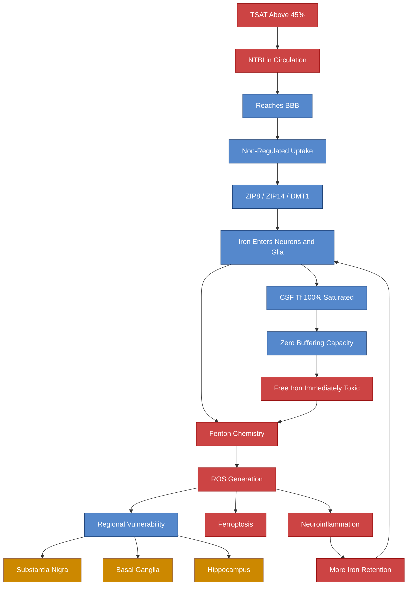

# NTBI in the Brain

## Extending the NTBI Story to the CNS

The existing note on [[Iron Overload and NTBI]] covers systemic NTBI. This note focuses specifically on whether and how NTBI reaches the brain, and what happens when it does.

> [!info]- Colour Key
> 🔴 Pathological | 🟠 Vulnerable | 🔵 Neutral

## Does NTBI Cross the Blood-Brain Barrier?

**Yes, but slowly and via specific mechanisms.**

> **Tripathi AK et al.** "Transport of non-transferrin bound iron to the brain: implications for Alzheimer's disease." *J Alzheimers Dis*. 2017;58(4):1109-1119. PMC5637099
> - Iron-labeled NTBI was detected in the brain **ventricular system after 2 hours** and **brain parenchyma after 24 hours**
> - NTBI is transported to the brain at a **much slower rate** than transferrin-bound iron
> - But it enters via **unregulated pathways** — not subject to the normal transferrin receptor-mediated control

### Transport Mechanisms

> **Knutson MD.** "Non-transferrin-bound iron transporters." *Free Radic Biol Med*. 2019;133:101-111. DOI: 10.1016/j.freeradbiomed.2018.10.413
> - NTBI uptake involves:
>   - **Reduction** of extracellular Fe3+ to Fe2+ by ferrireductases
>   - **Import via ZIP8 (SLC39A8)** and **ZIP14 (SLC39A14)** — divalent metal ion transporters
>   - **DMT1** in some cell types
> - These transporters are NOT regulated by cellular iron levels the way TfR1 is
> - Cells cannot shut off NTBI uptake when iron-replete

### Brain Cell-Type Uptake

> **Bishop GM et al.** "Accumulation of non-transferrin-bound iron by neurons, astrocytes, and microglia." *Neurotox Res*. 2011;19(3):443-451. DOI: 10.1007/s12640-010-9195-x
> - All three major brain cell types can accumulate NTBI
> - Neurons, astrocytes, and microglia take up NTBI through distinct mechanisms
> - NTBI uptake is **not downregulated** when cells are iron-loaded — a critical vulnerability

## CSF Transferrin — Zero Buffer Capacity

A critically important fact:

> Unlike **serum transferrin** (30-40% saturated), **CSF transferrin is 100% saturated**.

This means:
- Any iron released into the CSF or brain extracellular space **cannot be buffered by transferrin**
- Free iron in the brain extracellular space is immediately toxic via Fenton chemistry
- The brain relies entirely on cellular uptake, ferritin storage, and local hepcidin regulation to manage iron

## NTBI and Neuroinflammation

> **Urrutia PJ et al.** "Aberrant cerebral iron trafficking co-morbid with chronic inflammation: molecular mechanisms and pharmacologic intervention." *Front Neurol*. 2022;13:855751
> - Chronic neuroinflammation alters iron trafficking at the BBB
> - Inflammatory cytokines increase iron retention in brain endothelial cells
> - Creates conditions where more iron enters the brain parenchyma
> - NTBI generation within the brain (from damaged cells releasing iron) amplifies the process

## Relevance to HFE Carriers

For someone with [[HFE Compound Heterozygosity|C282Y/H63D]] and [[Transferrin Saturation - Clinical Significance|TSAT 60%]]:

1. **TSAT 60% is in the range where circulating NTBI appears** (typically >45-50%)
2. Circulating NTBI can reach the BBB and slowly enter the brain
3. Once in the brain, NTBI enters cells via **unregulated** ZIP8/ZIP14/DMT1 pathways
4. Brain cells **cannot refuse NTBI entry** — no downregulation mechanism
5. CSF provides **zero buffering** for any iron released extracellularly
6. This creates a slow but relentless accumulation of brain iron in overload states

### Regional Vulnerability

Brain regions with the highest baseline iron (basal ganglia, substantia nigra) are likely most affected because:
- They already have high metabolic iron turnover
- More iron means more potential for NTBI formation locally (when cells are damaged or release iron)
- Less reserve capacity to buffer additional iron

## NTBI Generation Within the Brain

NTBI is not only imported from blood — it can be **generated within the brain**:
- **Ferroptotic neurons** release iron as they die
- **Haemorrhage** (even microhaemorrhage) releases haemoglobin-derived iron
- **Demyelination** releases iron from oligodendrocytes
- This locally-generated NTBI is immediately toxic in the zero-buffer CSF environment

## Verified Academic Citations

> **You L, Yu PP, Dong T et al.** "Astrocyte-derived hepcidin controls iron traffic at the blood-brain-barrier via regulating ferroportin 1 of microvascular endothelial cells." *Cell Death Dis*. 2022;13(8):689. PMID: 35915080
> - Demonstrated that **astrocyte-derived hepcidin** regulates ferroportin on BBB endothelial cells, controlling iron entry into the brain
> - When astrocytic hepcidin is upregulated (e.g., by inflammation), ferroportin is degraded and iron is trapped in endothelial cells or released into the brain parenchyma
> - Establishes the brain hepcidin-ferroportin axis as a local regulatory mechanism distinct from systemic hepcidin

> **Duck KA, Simpson IA, Connor JR.** "Regulatory mechanisms for iron transport across the blood-brain barrier." *Biochem Biophys Res Commun*. 2017;494(1-2):70-75. PMID: 29054412
> - Demonstrated that BBB endothelial cells have their own iron requirements separate from their transport function
> - Regional regulation of brain iron uptake involves neuron-to-endothelial signalling — neurons can signal increased iron demand
> - Current BBB iron transport models are incomplete and do not account for regional or cell-type-specific regulation

> **Baringer SL, Palsa K, Simpson IA, Connor JR.** "Apo- and holo-transferrin differentially interact with ferroportin and hephaestin to regulate iron release at the blood-brain barrier." *Mol Brain*. 2023. PMID: 36712094
> - Apo-transferrin (iron-free) and holo-transferrin (iron-loaded) have **opposite effects** on iron release from BBB endothelial cells
> - Apo-transferrin stimulates iron release from the abluminal side (into brain), while holo-transferrin inhibits it
> - This is a sensing mechanism: when brain iron is low (more apo-Tf), more iron is released into the brain; when brain iron is adequate (more holo-Tf), release is suppressed
> - Relevant to HFE carriers: high systemic TSAT means more holo-Tf at the BBB, which should suppress iron release — but HFE variants may disrupt this feedback

> **Mezzanotte M, Ammirata G, Boido M et al.** "Activation of the Hepcidin-Ferroportin1 pathway in the brain and astrocytic-neuronal crosstalk to counteract iron dyshomeostasis during aging." *Sci Rep*. 2022;12:11724. PMID: 35810203
> - Brain hepcidin-ferroportin pathway becomes activated during ageing as a compensatory response to increasing brain iron
> - Astrocyte-neuron crosstalk is central to this regulation
> - Age-related failure of this compensatory mechanism may explain progressive brain iron accumulation in neurodegenerative conditions

> **Wei B, Liu W, Jin L et al.** "Hepcidin depending on astrocytic NEO1 ameliorates blood-brain barrier dysfunction after subarachnoid hemorrhage." *Cell Death Dis*. 2024;15:575. PMID: 39107268
> - Astrocytic hepcidin protects BBB integrity after haemorrhagic injury via NEO1-dependent signalling
> - Brain hepcidin has neuroprotective functions beyond iron regulation — it directly maintains BBB structural integrity
> - Relevant to NTBI: BBB disruption from any cause increases NTBI entry into the brain parenchyma

---

## Cross-References
- [[Iron Overload and NTBI]]
- [[Hepcidin and Brain Iron Regulation]]
- [[Ferroptosis and Neuronal Iron]]
- [[HFE Variants and Brain Iron]]
- [[Transferrin Saturation - Clinical Significance]]
- [[Health Research MOC]]
