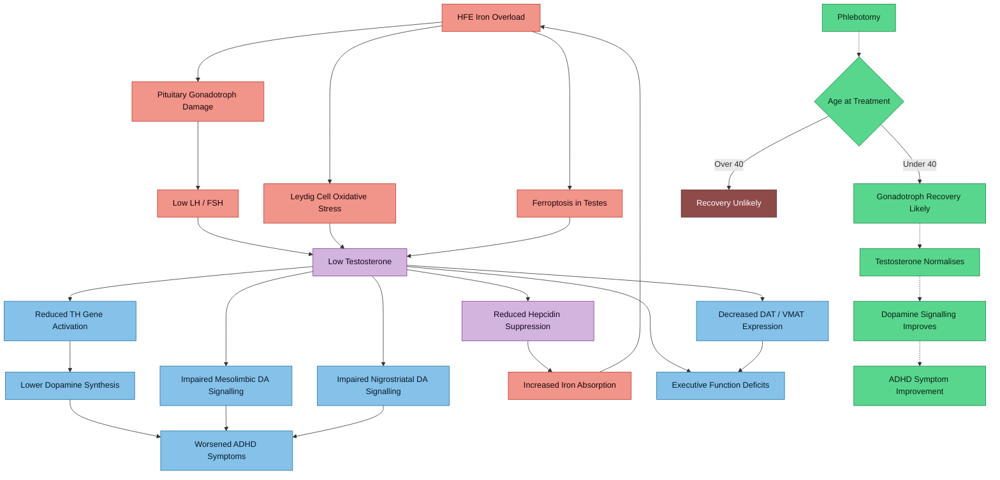

# Testosterone-Dopamine-Iron Interactions in AuDHD + HFE Iron Overload

> **Clinical context**: 37-year-old male, AuDHD (ADHD-PI + Autism), HFE C282Y/H63D compound heterozygote, TSAT 60%, ferritin 380 ug/L, on Elvanse 70mg. Upcoming endocrine panel. This note extends the [[Iron-Dopamine-ADHD Axis]] by adding the testosterone dimension.

## Evidence Rating Key

| Grade | Meaning |
|-------|---------|
| **A** | Systematic review / meta-analysis / large RCT |
| **B** | Well-designed cohort study, large case series, or high-quality review |
| **C** | Small case series, cross-sectional study, or narrative review |
| **D** | Case report, expert opinion, or animal/in-vitro only |

---

> [!info]- Colour Key
> 🟡 Iron | 🔴 Damage | 🔵 Dopamine | 🟣 Testosterone | 🟢 Recovery



---

## 1. Iron Overload Damages the Testosterone Axis at Two Levels

Iron overload in hereditary haemochromatosis (HH) suppresses testosterone through two distinct but concurrent mechanisms: **pituitary iron deposition** (central/hypogonadotropic) and **direct testicular iron toxicity** (primary/hypergonadotropic). In practice, many patients have elements of both. See [[Endocrine Effects of HFE Iron Overload]] for the full endocrine picture.

### 1a. Pituitary Gonadotroph Damage (Central Hypogonadism)

Iron selectively accumulates in gonadotropic cells of the anterior pituitary, suppressing LH and FSH secretion. The gonadotroph is the most iron-sensitive pituitary cell type — more vulnerable than thyrotrophs, corticotrophs, or somatotrophs.

**Charbonnel B, Chupin M, Le Grand A, Guillon J.** Pituitary function in idiopathic haemochromatosis. *Acta Endocrinol (Copenh)*. 1981;98(2):178-183. **PMID: [6794282](https://pubmed.ncbi.nlm.nih.gov/6794282/)**
- In 36 male HH patients, 47% had low testosterone with low LH/FSH. Gonadotroph deficiency was the **only indisputable** pituitary insufficiency.
- **Evidence**: B

**Duranteau L, Chanson P, Blumberg-Tick J, et al.** Non-responsiveness of serum gonadotropins and testosterone to pulsatile GnRH in hemochromatosis. *Acta Endocrinol (Copenh)*. 1993;128(4):351-354. **PMID: [8498154](https://pubmed.ncbi.nlm.nih.gov/8498154/)**
- Chronic pulsatile GnRH did not restore LH pulsatility or testosterone, confirming primary **pituitary** (not hypothalamic) damage.
- **Evidence**: C

### 1b. Direct Testicular Iron Toxicity (Leydig and Sertoli Cells)

**Harrer A, Meyron-Holtz EG, Meinhardt A.** The role of iron in normal and impaired testicular function. *Andrology*. 2025. **PMID: [40464377](https://pubmed.ncbi.nlm.nih.gov/40464377/)**
- Leydig cells depend on iron-dependent enzymes for testosterone biosynthesis, but excess iron induces oxidative stress, lipid peroxidation, and **ferroptosis** in testicular tissue. HH and beta-thalassemia are both associated with disrupted hormonal profiles and impaired spermatogenesis.
- **Evidence**: B (comprehensive review)

**McNeil LW, McKee LC Jr, Lorber D, Rabin D.** The endocrine manifestations of hemochromatosis. *Am J Med Sci*. 1983;285(3):7-13. **PMID: [6342390](https://pubmed.ncbi.nlm.nih.gov/6342390/)**
- Both pituitary **and** primary testicular (Leydig cell) dysfunction were observed simultaneously in some patients.
- **Evidence**: C

### 1c. The Vicious Cycle: Low Testosterone Promotes Further Iron Loading

**Bachman E, Travison TG, Basaria S, et al.** Testosterone induces erythrocytosis via increased erythropoietin and suppressed hepcidin. *J Gerontol A Biol Sci Med Sci*. 2014;69(6):725-735. **PMID: [24158761](https://pubmed.ncbi.nlm.nih.gov/24158761/)**
- Testosterone suppresses hepcidin, the master regulator of iron absorption. When testosterone is low (from pituitary iron damage), hepcidin is less suppressed — but the dysregulated HFE-hepcidin axis in compound heterozygotes already permits excessive iron absorption. The net effect: low testosterone may **accelerate iron loading** through impaired hepcidin signalling.
- **Evidence**: B

**Hennigar SR, Berryman CE, Harris MN, et al.** Testosterone administration during energy deficit suppresses hepcidin and increases iron availability for erythropoiesis. *J Clin Endocrinol Metab*. 2020;105(4):e1652-e1663. **PMID: [31894236](https://pubmed.ncbi.nlm.nih.gov/31894236/)**
- Confirmed that testosterone directly suppresses hepcidin and increases iron availability, independent of erythropoietin.
- **Evidence**: B (RCT)

> **Key implication**: In HFE compound heterozygotes, iron damages the pituitary, lowering testosterone, which alters hepcidin regulation, potentially creating a self-reinforcing iron-loading cycle. Breaking this cycle with phlebotomy is the primary intervention.

---

## 2. Testosterone Modulates Dopamine Signalling

Testosterone is not merely a reproductive hormone. It is a direct modulator of dopaminergic neurotransmission in the brain circuits most relevant to ADHD: the **mesocorticolimbic** (VTA → NAc → mPFC) and **nigrostriatal** (SNc → dorsal striatum) pathways.

### 2a. Androgen Receptors in Dopamine Circuits

**Tobiansky DJ, Wallin-Miller KG, Floresco SB, et al.** Androgen regulation of the mesocorticolimbic system and executive function. *Front Endocrinol (Lausanne)*. 2018;9:279. **PMID: [29922228](https://pubmed.ncbi.nlm.nih.gov/29922228/)**
- Androgen receptors (AR) are expressed in the VTA, nucleus accumbens (NAc), medial prefrontal cortex (mPFC), and orbitofrontal cortex (OFC) — the core circuit for executive function, reward processing, and behavioural flexibility.
- Testosterone modulates dopamine release, reuptake, and receptor expression in these regions.
- Both too much and too little androgen signalling impair executive function — an **inverted-U relationship**.
- **Evidence**: B (comprehensive integrative review)

**Seib DR, Tobiansky DJ, Meitzen J, et al.** Neurosteroids and the mesocorticolimbic system. *Neurosci Biobehav Rev*. 2023;153:105356. **PMID: [37567491](https://pubmed.ncbi.nlm.nih.gov/37567491/)**
- The mesocorticolimbic system produces its own testosterone locally (neuroandrogens) and expresses steroid receptors. This means dopamine circuits are sensitive to both systemic testosterone levels and locally synthesised androgens.
- **Evidence**: B

### 2b. Testosterone Directly Regulates Tyrosine Hydroxylase (The Dopamine Synthesis Enzyme)

**Jeong H, Kim MS, Kwon J, et al.** Regulation of the transcriptional activity of the tyrosine hydroxylase gene by androgen receptor. *Neurosci Lett*. 2006;396(1):57-61. **PMID: [16356647](https://pubmed.ncbi.nlm.nih.gov/16356647/)**
- The androgen receptor directly **transactivates the tyrosine hydroxylase (TH) promoter** in a ligand-dependent manner. This means testosterone directly upregulates the rate-limiting enzyme of dopamine synthesis.
- **Evidence**: D (in vitro, but mechanistically important)

**Purves-Tyson TD, Owens SJ, Double KL, et al.** Testosterone induces molecular changes in dopamine signaling pathway molecules in the adolescent male rat nigrostriatal pathway. *PLoS One*. 2014;9(3):e91151. **PMID: [24618531](https://pubmed.ncbi.nlm.nih.gov/24618531/)**
- Testosterone increased DAT (dopamine transporter) and VMAT (vesicular monoamine transporter) mRNAs in the substantia nigra. Gonadectomy increased dopamine turnover (suggesting compensatory activity from reduced signalling efficiency), which was **prevented by testosterone replacement**.
- **Evidence**: D (animal, but directly relevant mechanism)

**Purves-Tyson TD, Handelsman DJ, Double KL, et al.** Testosterone regulation of sex steroid-related mRNAs and dopamine-related mRNAs in adolescent male rat substantia nigra. *BMC Neurosci*. 2012;13:95. **PMID: [22867132](https://pubmed.ncbi.nlm.nih.gov/22867132/)**
- Androgens increased TH protein in the substantia nigra and increased COMT, MAOA, and MAOB mRNAs, suggesting testosterone increases both dopamine **synthesis and metabolism**, shifting the system toward higher dopamine throughput.
- **Evidence**: D (animal)

### 2c. Testosterone and Behavioural Flexibility (Executive Function)

**Tomm RJ, Seib DR, Kachkovski GV, et al.** Androgen synthesis inhibition increases behavioural flexibility and mPFC tyrosine hydroxylase in gonadectomized male rats. *J Neuroendocrinol*. 2022;34(6):e13128. **PMID: [35583989](https://pubmed.ncbi.nlm.nih.gov/35583989/)**
- Blocking androgen synthesis (with abiraterone) in gonadectomised rats **increased** behavioural flexibility and increased TH immunoreactivity in mPFC. This suggests a complex relationship: neurally-produced androgens modulate executive function, and the relationship is not simply "more testosterone = better cognition."
- **Evidence**: D (animal, but important nuance)

**Low KL, Tomm RJ, Ma C, et al.** Effects of aging on testosterone and androgen receptors in the mesocorticolimbic system of male rats. *Horm Behav*. 2020;120:104689. **PMID: [31954104](https://pubmed.ncbi.nlm.nih.gov/31954104/)**
- With aging, both systemic and local (mesocorticolimbic) testosterone levels decline, and AR immunoreactivity decreases in the mPFC. This age-related androgen decline may contribute to age-related executive function changes.
- **Evidence**: D (animal)

---

## 3. Low Testosterone and Cognitive/Executive Function in Humans

### 3a. Hypogonadism Impairs Cognition

**Lašaitė L, Ceponis J, Preikša RT, et al.** Impaired emotional state, quality of life and cognitive functions in young hypogonadal men. *Andrologia*. 2014;46(10):1107-1112. **PMID: [24313565](https://pubmed.ncbi.nlm.nih.gov/24313565/)**
- 34 young hypogonadal men (mean age 29) vs 34 controls: hypogonadal men had significantly **worse Trail Making Test scores** (a measure of executive function, set-shifting, and processing speed), worse mood, and lower quality of life.
- **Evidence**: C

**Lašaitė L, Čeponis J, Preikša RT, et al.** Effects of two-year testosterone replacement therapy on cognition, emotions and quality of life in young and middle-aged hypogonadal men. *Andrologia*. 2017;49(3):e12633. **PMID: [27545990](https://pubmed.ncbi.nlm.nih.gov/27545990/)**
- After 2 years of testosterone replacement in hypogonadotropic hypogonadism patients, **cognitive function improved** (Trail Making Test), alongside improvements in mood and quality of life.
- **Evidence**: C (prospective, uncontrolled)

### 3b. Androgen Deprivation Therapy (ADT) as a Natural Experiment

The ADT literature in prostate cancer provides the strongest human evidence for testosterone's role in cognition, because it creates a controlled testosterone-depletion state.

**Gunlusoy B, Ceylan Y, Koskderelioglu A, et al.** Cognitive effects of androgen deprivation therapy in men with advanced prostate cancer. *Urology*. 2017;103:167-172. **PMID: [28188757](https://pubmed.ncbi.nlm.nih.gov/28188757/)**
- Prospective study: men on ADT showed significant declines in **attention, working memory, and executive function** compared to controls after 6 months.
- **Evidence**: B

**Salminen E, Portin R, Korpela J, et al.** Androgen deprivation and cognition in prostate cancer. *Br J Cancer*. 2003;89(6):971-976. **PMID: [12966411](https://pubmed.ncbi.nlm.nih.gov/12966411/)**
- 12-month longitudinal study: ADT impaired **attentional performance** measured with reaction time and vigilance tasks, with deterioration evident at 6 months and persisting at 12 months.
- **Evidence**: B

**Reiss AB, Saeedullah U, Grossfeld DJ, et al.** Prostate cancer treatment and the relationship of androgen deprivation therapy to cognitive function. *Clin Transl Oncol*. 2022;24(5):873-881. **PMID: [34743290](https://pubmed.ncbi.nlm.nih.gov/34743290/)**
- Review: 25-50% of men on ADT develop some form of cognitive dysfunction, particularly in **verbal memory, visuospatial ability, and executive function**. The mechanism likely involves testosterone's effects on dopaminergic and cholinergic systems.
- **Evidence**: B

**Bassyouny NM, Gouda MM, Ezz El Din MM, et al.** Impact of androgen deprivation therapy on cognitive function of elderly men with prostate cancer. *Cureus*. 2024;16(9):e70223. **PMID: [39398693](https://pubmed.ncbi.nlm.nih.gov/39398693/)**
- ADT significantly impaired Montreal Cognitive Assessment (MoCA) scores in elderly men, with **attention and executive function** domains most affected.
- **Evidence**: C

### 3c. Meta-Analytic Evidence on Testosterone Supplementation and Cognition

**Tan S, Sohrabi HR, Weinborn M, et al.** Effects of testosterone supplementation on separate cognitive domains in cognitively healthy older men: a meta-analysis of current randomized clinical trials. *Am J Geriatr Psychiatry*. 2019;27(11):1232-1246. **PMID: [31296441](https://pubmed.ncbi.nlm.nih.gov/31296441/)**
- Meta-analysis of RCTs: testosterone supplementation in healthy older men did **not** significantly improve overall cognition, but there was a trend toward improvement in **executive function** and a significant improvement in **psychomotor speed** in some subgroup analyses.
- **Evidence**: A (meta-analysis, but note: this studied eugonadal or mildly hypogonadal older men, not severely hypogonadal younger men — less applicable to the iron overload scenario)

---

## 4. Testosterone, ADHD, and Stimulant Medication

### 4a. Direct Evidence: Testosterone Improving ADHD Symptoms

**Rogne A, Hassel B.** Improvement of attention deficit/hyperactivity disorder (ADHD) in three adult men during testosterone treatment: a case series. *J Med Case Rep*. 2022;16(1):425. **PMID: [36397172](https://pubmed.ncbi.nlm.nih.gov/36397172/)**
- Three adult men (ages 24, 37, and 43) with ADHD who had side effects from stimulants experienced **sustained ADHD symptom improvement** with testosterone gel monotherapy, lasting 4.5-5 years.
- All had testosterone in the low-normal range (12-16 nmol/L) with low testosterone/SHBG ratios (suggesting low free testosterone).
- The authors proposed that low free testosterone may contribute to ADHD symptoms in some adult men via effects on the dopaminergic system.
- **Evidence**: D (case series, but directly relevant and with long follow-up)

> **Note for Anthony's case**: One of the patients in this case series was **37 years old** — the same age. The pre-treatment testosterone levels (12-16 nmol/L with low free testosterone) are plausible findings in iron-overload-induced subclinical hypogonadism.

### 4b. Testosterone-Stimulant Interaction

No direct studies examine the interaction between testosterone levels and lisdexamfetamine/amphetamine efficacy. However, the mechanistic evidence allows inference:

1. **Amphetamines increase dopamine release** by reversing the dopamine transporter (DAT) and inhibiting vesicular monoamine transporter (VMAT).
2. **Testosterone upregulates DAT and VMAT expression** (Purves-Tyson 2014, PMID 24618531).
3. Therefore, low testosterone may **reduce the molecular targets** through which stimulants exert their effects — potentially diminishing stimulant efficacy.
4. Conversely, testosterone restoration could **enhance stimulant response** by increasing the density of dopamine transport machinery.

This is a plausible but unproven mechanism. **Evidence**: D (mechanistic inference from animal data)

---

## 5. Recovery Timeline After Phlebotomy

### 5a. Evidence for Testosterone Recovery with Iron Depletion

**Siemons LJ, Mahler CH.** Hypogonadotropic hypogonadism in hemochromatosis: recovery of reproductive function after iron depletion. *J Clin Endocrinol Metab*. 1987;65(3):585-587. **PMID: [3624416](https://pubmed.ncbi.nlm.nih.gov/3624416/)**
- A **37-year-old man** with HH-induced hypogonadotropic hypogonadism had **complete recovery** of testosterone, LH, FSH, and fertility after 16 months of aggressive phlebotomy. He fathered a child at 20 months post-diagnosis.
- **Evidence**: D (case report, but age-matched to Anthony)

**Cundy T, Butler J, Bomford A, Williams R.** Reversibility of hypogonadotrophic hypogonadism associated with genetic haemochromatosis. *Clin Endocrinol (Oxf)*. 1993;38(6):617-620. **PMID: [8334747](https://pubmed.ncbi.nlm.nih.gov/8334747/)**
- Prospective study: only 1/6 hypogonadal HH men showed partial recovery after phlebotomy — and he was the youngest at **age 33**. The 5 men aged 47-66 had no improvement. **No documented reversals after age 40.**
- **Evidence**: C

### 5b. Evidence from Thalassemia (Higher Iron Burden Model)

**De Sanctis V, Soliman AT, Yassin MA, et al.** Hypogonadism in male thalassemia major patients: pathophysiology, diagnosis and treatment. *Acta Biomed*. 2018;89(2-S):6-15. **PMID: [29451224](https://pubmed.ncbi.nlm.nih.gov/29451224/)**
- Hypogonadism affects 40-80% of thalassemia major patients. Damage is attributed to chronic anaemia **and** iron deposition in both pituitary and testes. Early and efficient chelation from childhood is critical to prevent **permanent** endocrine damage.
- **Evidence**: B

**Gamberini MR, De Sanctis V, Gilli G.** Hypogonadism, diabetes mellitus, hypothyroidism, hypoparathyroidism: incidence and prevalence related to iron overload and chelation therapy. *Pediatr Endocrinol Rev*. 2008;6 Suppl 1:158-169. **PMID: [19337172](https://pubmed.ncbi.nlm.nih.gov/19337172/)**
- In 273 thalassemia major patients, serum ferritin levels of approximately **2000 ng/mL** correlated with hypogonadism onset. With improved chelation over the decades, pubertal development in males improved significantly.
- **Evidence**: B

### 5c. Ferritin Thresholds and the Recovery Window

Synthesising the evidence:

| Factor | Favours Recovery | Against Recovery |
|--------|-----------------|------------------|
| **Age** | Under 40 at treatment start | Over 40 |
| **Ferritin at diagnosis** | < 1000 ug/L | > 2000 ug/L |
| **Duration of iron exposure** | Recent / short duration | Decades of untreated overload |
| **Type of hypogonadism** | Pure central (low LH/FSH) | Mixed central + primary |
| **Speed of iron depletion** | Aggressive phlebotomy to target | Slow or incomplete depletion |
| **Ferritin target** | < 50-100 ug/L maintained | Residual elevation |

> **Evidence for these thresholds**: C (extrapolated from case series and thalassemia data)

---

## 6. Age 37: The Critical Window

The convergence of evidence points to **age 37 as being within the window for potential reversibility**:

1. **Siemons case** (PMID 3624416): Full recovery at age 37 after 16 months of phlebotomy.
2. **Cundy study** (PMID 8334747): Only recovery was at age 33; no recovery after 40.
3. **Thalassemia literature**: Improved outcomes with earlier chelation.
4. **Ferritin 380**: Substantially lower than the ~2000 ug/L threshold associated with hypogonadism onset in thalassemia, suggesting potentially less severe tissue damage.

The biological rationale: pituitary gonadotrophs can regenerate if iron-induced damage is limited to **functional suppression** (reversible) rather than **fibrotic replacement** (irreversible). Younger tissue has greater regenerative capacity. At ferritin 380, the iron burden is moderate — damage may still be at the functional rather than structural stage.

**However**, there is an important caveat: Anthony's iron exposure duration is unknown. HFE compound heterozygotes accumulate iron slowly over decades. If TSAT has been elevated since early adulthood (even if ferritin was not measured), cumulative pituitary iron exposure could be longer than the current ferritin suggests.

---

## 7. The Triple Interaction: Iron → Testosterone → Dopamine → ADHD

Integrating all evidence streams:

```
Iron Overload (HFE C282Y/H63D)
    ↓
Pituitary gonadotroph damage + Leydig cell oxidative stress
    ↓
Low testosterone (possibly subclinical — low free T, normal total T)
    ↓
Three downstream effects on dopamine:
    1. Reduced TH gene activation → less dopamine synthesis
    2. Reduced DAT/VMAT expression → altered dopamine transport
    3. Impaired mesocorticolimbic signalling → worse executive function
    ↓
Amplification of existing ADHD-PI symptoms:
    - Worsened inattention
    - Reduced working memory
    - Impaired behavioural flexibility
    - Increased fatigue and reduced motivation
    ↓
Potential reduction in stimulant efficacy:
    - Fewer molecular targets (DAT/VMAT) for amphetamine action
    - Suboptimal dopamine tone for stimulant augmentation
```

This creates a scenario where iron overload could be **silently worsening ADHD symptoms** through an endocrine intermediary, in a way that is difficult to distinguish from primary ADHD or general fatigue.

---

## Clinical Relevance for Anthony

### What This Means for Your Upcoming Endocrine Panel

1. **Free testosterone is the critical test**, not total testosterone. Iron overload raises SHBG, which binds testosterone and can make total testosterone appear normal when free testosterone is actually low (Cundy 1989, PMID [2732293](https://pubmed.ncbi.nlm.nih.gov/2732293/)).

2. **If free testosterone is low with low/normal LH and FSH**, this confirms iron-induced hypogonadotropic hypogonadism — and you are in the age window where phlebotomy may restore it.

3. **If testosterone is normal**, the iron-dopamine connection still applies directly (see [[Iron-Dopamine-ADHD Axis]]), but the testosterone-mediated amplification pathway can be ruled out.

4. **The Rogne case series** (PMID 36397172) is directly relevant: a 37-year-old man with ADHD and low-normal testosterone experienced sustained ADHD improvement with testosterone treatment. This does not mean TRT is indicated — phlebotomy to remove the *cause* of low testosterone is the first-line approach.

### Implications for Elvanse (Lisdexamfetamine)

- Elvanse works by increasing synaptic dopamine via DAT reversal and VMAT modulation.
- If testosterone is low, the expression of DAT and VMAT may be reduced (based on animal data), potentially **reducing the molecular substrate** that Elvanse acts on.
- Correcting testosterone (via iron depletion) could theoretically improve stimulant response.
- Elvanse may currently be **masking** hypogonadal fatigue and cognitive symptoms through its catecholaminergic stimulation, making subjective detection of hypogonadism harder.

### Recommended Approach

1. **Complete the endocrine panel** (free testosterone, total testosterone, LH, FSH, SHBG — early morning, before 10am).
2. **If hypogonadal**: aggressive phlebotomy targeting ferritin < 50-100 ug/L, then repeat hormonal assessment at 3 and 6 months post-depletion.
3. **Do not initiate TRT before iron depletion** — address the root cause first. TRT while iron-loaded could worsen erythrocytosis and suppress hepcidin further, accelerating iron loading.
4. **Track ADHD symptom severity** before, during, and after iron depletion — this will help distinguish iron-mediated ADHD worsening from baseline ADHD.
5. **If testosterone does not recover after full iron depletion**: reassess for TRT at that point, with endocrinology input.

### Evidence Gaps

- No studies directly examine testosterone-dopamine-iron interactions in ADHD populations.
- No RCTs of testosterone treatment for ADHD (only the Rogne case series).
- The testosterone-stimulant interaction is mechanistically plausible but unproven in humans.
- Recovery thresholds are extrapolated from small case series — individual variation is likely substantial.
- The effect of HFE compound heterozygosity specifically (vs C282Y homozygosity) on pituitary iron deposition is understudied.

---

## Search Strategy

**Databases**: PubMed, OpenAlex, Google Scholar
**Search terms**: testosterone dopamine mesolimbic nigrostriatal; androgen mesocorticolimbic executive function; hemochromatosis hypogonadism phlebotomy recovery; testosterone tyrosine hydroxylase dopamine regulation; androgen deprivation cognitive impairment; testosterone hepcidin iron; iron overload testicular Leydig cell; testosterone ADHD; hypogonadism cognitive function
**Date**: March 2026
**Limitations**: Limited direct evidence linking all three domains (iron, testosterone, dopamine) in a single study; reliance on triangulation across iron-overload endocrinology, neuroendocrinology, and ADHD literature.

---

## Cross-References

- [[Iron-Dopamine-ADHD Axis]] — the iron-dopamine connection without the testosterone dimension
- [[Endocrine Effects of HFE Iron Overload]] — full endocrine picture including thyroid, insulin, cortisol
- [[HFE Compound Heterozygosity]] — genotype context
- [[Elvanse and Mineral Metabolism]] — stimulant-mineral interactions
- [[Action Items and Monitoring Plan]] — clinical next steps including endocrine panel
- [[Fatigue and Burnout]] — overlapping symptom analysis
- [[Ferroptosis and Neuronal Iron]] — ferroptosis mechanism relevant to testicular and neuronal damage
- [[Copper-Iron-Dopamine Triangle]] — dopamine synthesis cofactor interactions
- [[Blood Results - March 2026]] — current iron parameters
