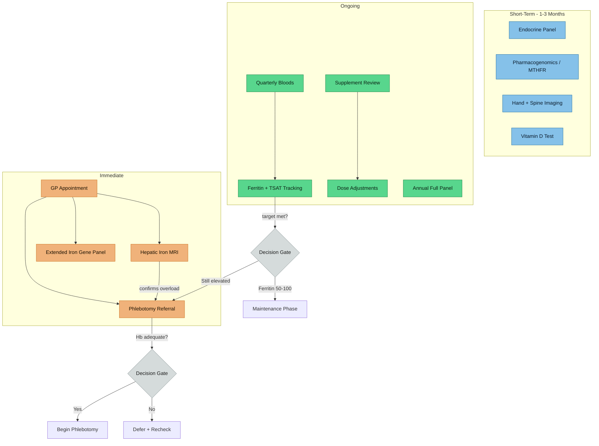

---
{"dg-publish":true,"permalink":"/action-items-and-monitoring-plan/","tags":["action-items","monitoring","clinical-plan","phlebotomy","investigations"],"dg-note-properties":{"date":"2026-03-17","type":"action-plan","status":"active","tags":["action-items","monitoring","clinical-plan","phlebotomy","investigations"],"summary":"Tiered clinical action plan — MRI, phlebotomy, investigations, dietary actions, and GP script","aliases":["Next Steps","Clinical Plan"],"permalink":"action-items-and-monitoring-plan"}}
---

# Action Items and Monitoring Plan

## Priority Cascade

> [!info]- Colour Key
> 🟠 Immediate | 🔵 Short-Term | 🟢 Ongoing | 🟤 Gate

## Priority Assessment

Based on synthesis across all research notes, your situation is:
- **Genotype**: "low risk" compound heterozygote ([[genetics/HFE Compound Heterozygosity\|HFE Compound Heterozygosity]])
- **Phenotype**: actively loading iron despite dietary changes ([[lab-results/Blood Results - March 2026\|Blood Results - March 2026]])
- **Symptoms**: fatigue, burnout, lower back pain ([[symptoms/Fatigue and Burnout\|Fatigue and Burnout]], [[symptoms/Arthropathy and Back Pain\|Arthropathy and Back Pain]])
- **Complicating factors**: ADHD/autism, Elvanse 70mg, borderline copper/zinc

**Your phenotype overrides your genotype.** You need management as someone with iron overload, not reassurance based on statistics.

---

## Tier 1 — Discuss With GP/Haematologist Urgently

### 1. Request Hepatic Iron MRI (T2* / FerriScan)
- **Why**: EASL guidelines state non-C282Y homozygotes with elevated TSAT + ferritin need hepatic iron quantification for diagnosis
- **What it shows**: liver iron concentration (LIC) in umol/g dry weight
- **Normal**: < 36 umol/g; significant overload: > 80 umol/g
- **Non-invasive**, widely available in NHS, no contrast needed
- **Reference**: EASL Guidelines on Haemochromatosis, *J Hepatol* 2022

### 2. Discuss Therapeutic Phlebotomy
- **Why**: ferritin 380, TSAT 60%, previously 700 — diet alone has plateaued
- **Target**: ferritin 50-100 ug/L, TSAT < 50%
- **Typical regime**: 450-500ml blood every 2-4 weeks initially; maintenance every 3-6 months
- **Even in compound hets**: phlebotomy is indicated when biochemical iron overload is confirmed
- **Bonus**: reducing iron stores may improve copper and zinc status ([[minerals/Copper-Zinc-Iron Interactions\|Copper-Zinc-Iron Interactions]])
- **Reference**: Adams PC. *Blood* 2010;116(3):317-325

### 3. Investigate Other Iron-Loading Genes
- Your report states: "Other causes of severe iron loading should also be investigated"
- **Request**: extended iron-gene panel (HAMP, HJV, TFR2, SLC40A1, TMPRSS6)
- **Why**: your phenotype exceeds what C282Y/H63D alone typically produces

---

## Tier 2 — Investigate Within 1-3 Months

### 4. Lumbar Spine and Hand Imaging
- **X-ray hands** (AP): look for hook-like osteophytes at 2nd/3rd MCPs (haemochromatosis sign)
- **X-ray or MRI lumbar spine**: assess for iron-related degenerative changes
- **Reference**: [[symptoms/Arthropathy and Back Pain\|Arthropathy and Back Pain]]

### 5. Recheck Minerals With Functional Tests
- **Erythrocyte zinc** (more reliable than serum zinc)
- **24-hour urinary copper** (rules out excess excretion)
- **Ceruloplasmin oxidase activity** (functional, not just protein concentration)
- **Serum magnesium** (not tested; relevant to ADHD and fatigue)
- **Vitamin D** (not tested; commonly low, affects iron metabolism)

### 6. Full Blood Count + Reticulocytes
- Ensure haemoglobin is adequate before starting phlebotomy
- Reticulocyte count as baseline for monitoring response

---

## Tier 3 — Ongoing Monitoring

### Regular Blood Panel (Every 6 Months During Active Management)
| Test | Target | Notes |
|------|--------|-------|
| Ferritin | 50-100 ug/L | Primary monitoring metric during phlebotomy |
| Transferrin saturation | < 50% | Key risk marker for NTBI |
| Serum iron | Mid-range | |
| Full blood count | Hb > 120 g/L (pre-phlebotomy) | Ensure not over-depleting |
| ALT | < 50 iu/L | Hepatocyte integrity |

### Annual
| Test | Purpose |
|------|---------|
| Liver function panel | Screen for emerging hepatic damage |
| Copper + zinc | Track recovery after iron reduction |
| Fasting glucose / HbA1c | Iron overload increases diabetes risk |
| Cardiac review if symptoms | Iron cardiomyopathy (rare in compound hets but worth baseline awareness) |

---

## Dietary Actions (Immediate, Ongoing)

See [[diet-management/Dietary Management - Iron Overload\|Dietary Management - Iron Overload]] for full detail.

### Quick Wins
- [ ] Tea or coffee **with** every meal (not between meals)
- [ ] Dairy at meals (calcium inhibits both heme and non-heme iron)
- [ ] Minimise red meat — replace with poultry, fish, legumes, eggs
- [ ] No vitamin C supplements; no large citrus juice volumes at meals
- [ ] No raw shellfish (Vibrio vulnificus risk in iron-loaded patients)
- [ ] Minimise or eliminate alcohol
- [ ] Check breakfast cereal for iron fortification — switch if needed
- [ ] Avoid cast iron cookware for acidic dishes

### Mineral Considerations
- [ ] Consider zinc supplementation (15-30mg zinc picolinate) **at bedtime** — away from iron-rich meals and inhibitors
- [ ] Consider copper (1-2mg) **only if confirmed deficient** on repeat testing
- [ ] Track food diversity while on Elvanse (appetite suppression risk)

---

## ADHD/Autism-Specific Considerations

- [[neurodevelopment/Iron-Dopamine-ADHD Axis\|Iron-Dopamine-ADHD Axis]]: iron status directly affects dopamine synthesis
- [[neurodevelopment/Elvanse and Mineral Metabolism\|Elvanse and Mineral Metabolism]]: monitor nutrition under appetite suppression
- [[symptoms/Fatigue and Burnout\|Fatigue and Burnout]]: multiple overlapping causes — iron treatment may improve but won't eliminate neurodivergent burnout
- **Sleep**: assess sleep quality — ADHD sleep issues + iron dysregulation can compound fatigue
- **Exercise**: regular moderate exercise helps with back pain, mood, AND iron metabolism (muscle is a major iron consumer)

---

## What to Say to Your GP

> "My genetics came back as C282Y/H63D compound heterozygote, which the lab says is usually benign. However, my transferrin saturation is 60% and ferritin is 380 despite dietary changes (down from 700). The EASL guidelines recommend hepatic iron MRI for non-C282Y homozygotes with these iron parameters. I'd like to discuss MRI assessment and whether phlebotomy is appropriate."

This frames your request within clinical guidelines and avoids the conversation being dismissed based on genotype alone.

---

## Tracking Template (For Your Records)

| Date | Ferritin | TSAT | Iron | Copper | Zinc | Hb | Notes |
|------|----------|------|------|--------|------|----|-------|
| Dec 2025 | 738 | — | 26 | — | — | 168 | Baseline; thyroid normal; folate LOW (6.8); RHR 88; see [[lab-results/Blood Results - December 2025\|Blood Results - December 2025]] |
| Mar 2026 | 380 | 60% | 32 | 14.3 | 12.5 | — | ↓48% ferritin; TSAT above NTBI threshold; see [[lab-results/Blood Results - March 2026\|Blood Results - March 2026]] |
| Next test | | | | | | | Target: post-MRI/phlebotomy decision |

---

## Cross-References
- [[lab-results/Blood Results - March 2026\|Blood Results - March 2026]]
- [[genetics/HFE Compound Heterozygosity\|HFE Compound Heterozygosity]]
- [[iron-metabolism/Transferrin Saturation - Clinical Significance\|Transferrin Saturation - Clinical Significance]]
- [[iron-metabolism/Iron Overload and NTBI\|Iron Overload and NTBI]]
- [[minerals/Copper-Zinc-Iron Interactions\|Copper-Zinc-Iron Interactions]]
- [[iron-metabolism/Ceruloplasmin and Ferroxidase Activity\|Ceruloplasmin and Ferroxidase Activity]]
- [[neurodevelopment/Iron-Dopamine-ADHD Axis\|Iron-Dopamine-ADHD Axis]]
- [[neurodevelopment/Elvanse and Mineral Metabolism\|Elvanse and Mineral Metabolism]]
- [[symptoms/Fatigue and Burnout\|Fatigue and Burnout]]
- [[symptoms/Arthropathy and Back Pain\|Arthropathy and Back Pain]]
- [[diet-management/Dietary Management - Iron Overload\|Dietary Management - Iron Overload]]
