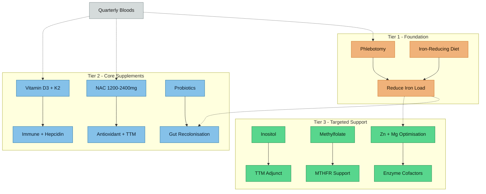

---
{"dg-publish":true,"permalink":"/diet-management/diet-and-supplement-strategy/","tags":["diet","supplements","NAC","omega-3","magnesium","zinc","treatment","creatine","probiotics","vitamin-D"],"dg-note-properties":{"type":"practical","status":"active","date":"2026-03-21","tags":["diet","supplements","NAC","omega-3","magnesium","zinc","treatment","creatine","probiotics","vitamin-D"],"summary":"Evidence-based diet and supplement strategy for AuDHD, trichotillomania, and iron overload — current stack review and optimisation recommendations","permalink":"diet-management/diet-and-supplement-strategy"}}
---

# Diet and Supplement Strategy

## Treatment Hierarchy

> [!info]- Colour Key
> 🟠 Tier 1 | 🔵 Tier 2 | 🟢 Tier 3 | 🟤 Monitor

## Current Supplement Stack — Review

### What Anthony Currently Takes

| Supplement | Product | Dose | Evidence Rating | Verdict |
|-----------|---------|------|----------------|---------|
| **Magnesium 3-in-1** | Nutrition Geeks | Unknown exact dose | B for ADHD | KEEP — likely beneficial; 72% of ADHD children are Mg-deficient |
| **Zinc Picolinate 3-in-1** | Nutrition Geeks | Unknown exact dose | B for ADHD; C for TTM | KEEP — low-normal zinc (12.5 umol/L); picolinate is well-absorbed |
| **Bovine Collagen** | Unknown brand | Unknown dose | C for gut health | KEEP — glycine/proline support gut lining; may reduce gut permeability |
| **Folate** | Holland & Barrett | Unknown dose/form | B if MTHFR variant present | **ACTION NEEDED** — Dec 2025 bloods show folate 6.8 nmol/L (below range) despite supplementation. Strongly suggests MTHFR variant or wrong form. **Switch to methylfolate (5-MTHF) 400–800 µg/day immediately.** Get MTHFR tested. See [[lab-results/Blood Results - December 2025\|Blood Results - December 2025]] |
| **Creatine Monohydrate** | Unknown brand | 3000mg/day | B for cognition | KEEP — supports brain energy metabolism; 2024 meta-analysis shows benefits for memory, attention, processing speed |
| **Fish Oil (high DPA/DHA)** | Unknown brand | Unknown dose | B for ADHD; B for inflammation | KEEP — ensure ≥750mg EPA+DHA/day; higher EPA may help if inflammatory markers elevated |

### Stack Assessment
The current stack is **reasonable and well-constructed**. No harmful interactions identified. Key gaps are identified below.

## Recommended Additions

### 1. NAC (N-Acetylcysteine) — HIGH PRIORITY

**Why**: Multi-target molecule addressing three of Anthony's core issues simultaneously.

| Target | Mechanism | Evidence |
|--------|-----------|----------|
| **Trichotillomania** | Restores cystine-glutamate antiporter → reduces excess synaptic glutamate | A — 56% response in adult RCT (Grant et al. *Arch Gen Psychiatry* 2009) |
| **Iron-related oxidative stress** | Glutathione precursor → scavenges ROS from iron overload | B — established biochemistry |
| **Neuroinflammation** | Reduces inflammatory cytokines → may reduce IDO activation → preserve serotonin | B — multiple studies |
| **Autism irritability** | Glutamate modulation | B — paediatric studies |

**Dose**: 1200mg–2400mg/day, split into two doses
**Onset**: 4–9 weeks for TTM benefit
**Timing**: Can be taken with or without food; separate from Elvanse by ~1 hour (good practice, no known interaction)
**Safety**: Generally well-tolerated; mild GI effects possible; may increase the effect of some medications on blood pressure. Safe in iron-loaded patients — see [[research/NAC and Iron Metabolism\|NAC and Iron Metabolism]] for full evidence review including thalassemia RCT safety data.
**Note**: NAC is also a mucolytic — may cause mild increase in mucus clearance initially

#### Buying Guide (UK)

Standard NAC (N-acetyl-L-cysteine) capsules are sufficient — no need for "sustained release" or premium formulations. The Grant 2009 TTM trial used plain NAC capsules. Choose 600mg capsules for easy dose titration.

| Product | Dose/Cap | Approx. Daily Cost | Notes |
|---------|----------|-------------------|-------|
| **NOW Foods NAC 600mg** | 600mg | ~£0.15 | **Recommended** — clean formula with selenium (supports GPX4, the key ferroptosis defence enzyme) and molybdenum (supports sulfite metabolism from NAC thiol chemistry); widely available on Amazon UK |
| Nutricost NAC 600mg | 600mg | ~£0.10 | Budget option; 240 caps; no fillers |
| Jarrow Formulas NAC Sustain 600mg | 600mg | ~£0.25 | Sustained-release bilayer; good if GI sensitivity is an issue |
| Life Extension NAC 600mg | 600mg | ~£0.30 | Pharmaceutical-grade; trusted brand |

**Starting protocol**: 600mg morning + 600mg evening (1200mg/day) for 2 weeks, then increase to 1200mg morning + 1200mg evening (2400mg/day) if tolerated. Monitor at next quarterly bloods — not for NAC-specific concerns but as standard HFE practice.

### 2. Vitamin D3 — HIGH PRIORITY

**Why**: Untested in Anthony's blood work, and has strong associations with all his conditions.

| Association | Evidence |
|------------|---------|
| TTM and Vitamin D deficiency | OR 4.2 (significant); case reports of resolution with supplementation |
| ADHD and Vitamin D deficiency | Meta-analysis: significantly lower 25-OH-D in ADHD vs controls |
| Autism and Vitamin D | Evidence of association but causal link debated |
| UK latitude | High prevalence of deficiency; especially in autumn/winter |
| Iron overload interaction | Vitamin D modulates hepcidin expression; deficiency may worsen iron regulation |

**Action**: **Test 25-OH vitamin D first** — then supplement based on results
**Typical dose if deficient**: 2000–4000 IU/day for maintenance; higher loading dose if severely deficient
**Cofactors**: Vitamin K2 (MK-7) should accompany high-dose D3 to direct calcium to bones

### 3. Probiotics — MODERATE PRIORITY

**Why**: Iron overload suppresses beneficial gut bacteria (especially Lactobacilli); probiotics may help recolonise.

**Recommended strains**:
- *Lactobacillus rhamnosus* GG — gut barrier support, GABA modulation
- *Bifidobacterium longum* — stress resilience, cortisol reduction
- *Lactobacillus plantarum* 299v — may modulate kynurenine pathway

**Timing**: Consider starting **after phlebotomy begins** (reducing iron load first improves gut environment for colonisation)
**Note**: Lactobacilli don't require iron for growth → may thrive even in current iron-loaded gut

### 4. Inositol — MODERATE PRIORITY (for TTM)

**Why**: Targets serotonergic signalling via phosphoinositide pathway — different mechanism than NAC.

**Evidence**: As effective as SSRIs for OCD in small studies; anecdotal evidence in TTM at 18g/day
**Dose**: Start at 2g/day, titrate up to 12–18g/day for TTM
**Consideration**: High doses needed for effect; may cause GI upset initially
**Strategy**: Try NAC first (better evidence for TTM specifically); add inositol if NAC alone is insufficient

## Daily Supplement Protocol

*Confirmed March 2026. Products verified against blood results and research notes.*

| Time | Supplement | Product | Dose | Why This Timing |
|------|-----------|---------|------|----------------|
| **Wake** | Elvanse | Prescribed | 70mg | Consistent absorption; start 14hr clearance clock before sleep |
| **Breakfast** | Fish oil | Nutravita 2000mg (660 EPA / 440 DHA) | 1 serving | Fat-soluble — needs dietary fat |
| | Creatine | MyVitamins Creatine Monohydrate | 3g (3 tabs) | Stomach-friendly with food; timing non-critical |
| | 5-MTHF | Thorne 5-MTHF 1mg (Metafolin) | 1 cap (1mg) | B-vitamins absorb well with meals |
| | Collagen | NG Collagen Glow Up | 1 scoop (~12.6g) | Flexible — just consistent daily intake |
| **~1hr post-Elvanse** | NAC | NOW Foods NAC 600mg | 1 cap (600mg) | Separate from Elvanse; glutamate modulation through the day |
| **Evening meal** | Vitamin D3 + K2 | Evo D3 4000 IU + K2 400µg | 1 cap | Fat-soluble — needs dietary fat |
| | NAC | NOW Foods NAC 600mg | 1 cap (600mg) | Split dose for sustained glutathione support |
| **Bedtime** | Magnesium 3-in-1 | NG Mag (glycinate 1000mg, malate 400mg, citrate 400mg) | 1 tab | Glycinate supports sleep; malate for overnight muscle recovery |
| | Zinc picolinate | Thorne Zinc Picolinate | 1 cap (15mg) | Empty stomach — away from iron, calcium, phytates for ZIP4 absorption |

### NAC Titration

Start at 2 caps/day (1200mg) for 2 weeks. If tolerated, increase to 4 caps/day (2400mg) — add a second cap at breakfast and a second at evening meal. Monitor at next quarterly bloods.

### Key Rules

- **Tea or coffee WITH meals** — tannins inhibit iron absorption (therapeutic in iron overload)
- **No vitamin C supplements** — dietary intake is sufficient; supplemental doses enhance iron absorption
- **Zinc and magnesium** both compete for absorption — the small gap at bedtime helps
- **Front-load protein at breakfast** before Elvanse appetite suppression kicks in

### Stopped / Not Taking

| Product | Reason |
|---------|--------|
| NG Zinc 3-in-1 (96.4mg Zn + 2mg Cu) | 2.4× upper tolerable limit; copper suppression risk with borderline Cu 14.3 µmol/L |
| Holland & Barrett Folic Acid | Replaced by Thorne 5-MTHF — folic acid ineffective (folate 6.8 despite supplementation) |
| Solgar Vitamin E 268mg (400 IU) | Increased all-cause mortality at this dose (PMID: 15537682); may enhance iron absorption |
| Solgar Chelated Manganese 8mg | Competes with iron on DMT1; neurotoxic accumulation risk in basal ganglia — same regions affected by iron overload |

## Dietary Considerations

### Iron-Reducing Diet (Continue)
See [[diet-management/Dietary Management - Iron Overload\|Dietary Management - Iron Overload]] for full detail. Key principles:
- Tea/coffee **with** meals (tannins inhibit iron absorption)
- Calcium-rich foods at meals (dairy, fortified alternatives)
- Minimise red meat; prefer poultry, fish, legumes, eggs
- No vitamin C supplements; avoid large citrus at meals
- No raw shellfish (Vibrio risk)
- Check cereals for iron fortification
- Avoid cast iron cookware for acidic dishes

### AuDHD-Specific Dietary Considerations

#### Protein Adequacy
- Elvanse appetite suppression can reduce overall intake
- Protein is essential for neurotransmitter precursors (tyrosine → dopamine; tryptophan → serotonin)
- **Ensure adequate protein intake** despite appetite suppression
- Bovine collagen contributes to amino acid intake (glycine, proline) but is not a complete protein

#### Omega-3 Optimisation
- Current fish oil (high DPA/DHA) is good
- Ensure **EPA component** is adequate — EPA may be more relevant for ADHD than DHA
- Target: ≥750mg combined EPA+DHA daily
- Higher EPA doses (1200mg/day) if inflammatory markers are elevated

#### Fibre for Gut Health
- Increased fibre → increased SCFA production → better gut barrier → reduced inflammation
- Prebiotic fibres (inulin, FOS) feed beneficial bacteria
- Particularly important given iron overload's effect on gut microbiome

#### Meal Timing with Elvanse
- Appetite suppression typically strongest 2–6 hours post-dose
- **Front-load protein** at breakfast (before Elvanse kicks in)
- Use calorie-dense snacks when appetite is low
- Don't skip meals even when not hungry

## What NOT to Add

| Supplement | Why Avoid |
|-----------|-----------|
| Iron supplements | Contraindicated — already iron-overloaded |
| Vitamin C (high dose) | Enhances iron absorption |
| Copper (unless confirmed deficient) | Already low-normal; excess copper is toxic |
| 5-HTP | Serotonin precursor but risks serotonin excess; unpredictable with TTM |
| St. John's Wort | Induces CYP enzymes; may interact with Elvanse metabolism |

## Treatment Hierarchy — Priority Order

Based on evidence strength, multi-target potential, and clinical urgency:

1. **Phlebotomy** — addresses iron overload, reduces oxidative stress, improves mineral balance, may improve gut microbiome, reduce neuroinflammation (see [[Action Items and Monitoring Plan\|Action Items and Monitoring Plan]])
2. **Vitamin D testing and supplementation** — simple, high-impact if deficient, addresses TTM (OR 4.2), ADHD, and autism associations
3. **NAC 1200–2400mg/day** — multi-target for TTM, oxidative stress, glutamate, neuroinflammation
4. **Switch to methylfolate NOW** — Dec 2025 bloods confirm folate 6.8 nmol/L (LOW) despite folic acid supplementation → strong MTHFR suspicion; switch to methylfolate 5-MTHF 400–800 µg/day immediately; get MTHFR tested
5. **Continue current stack** — Mg, Zn, creatine, fish oil, collagen all have supporting evidence
6. **Probiotics** — after phlebotomy begins, to support gut recolonisation
7. **Inositol** — if NAC alone insufficient for TTM after 8–12 weeks
8. **Comprehensive stool analysis** — to assess gut microbiome status

## Monitoring Schedule

| Timepoint | Tests | Purpose |
|-----------|-------|---------|
| **Now** | Vitamin D (25-OH), MTHFR genotyping | Baseline for new interventions |
| **After 3 months NAC** | TTM symptom assessment (MGH-HPS scale) | Evaluate NAC response |
| **After phlebotomy series** | Ferritin, TSAT, copper, zinc, full blood count | Iron reduction progress |
| **6 months** | Repeat vitamin D, minerals, ferritin | Track overall trajectory |
| **12 months** | Comprehensive review | Adjust strategy based on results |

---

## Verified Academic Citations

Citations verified via PubMed and OpenAlex on 2026-03-22. Organised by supplement/intervention.

### NAC (N-Acetylcysteine)

1. **Grant JE, Odlaug BL, Kim SW.** N-acetylcysteine, a glutamate modulator, in the treatment of trichotillomania: a double-blind, placebo-controlled study. *Arch Gen Psychiatry*. 2009;66(7):756-763. PMID: [19581567](https://pubmed.ncbi.nlm.nih.gov/19581567/) | DOI: 10.1001/archgenpsychiatry.2009.60
   - 12-week RCT, n=50. 56% response rate on NAC 1200-2400 mg/d vs 16% placebo (P=.003). First RCT of a glutamatergic agent for TTM.

2. **Hoffman J, Williams T, Rothbart R, et al.** Pharmacotherapy for trichotillomania. *Cochrane Database Syst Rev*. 2021;9:CD007662. PMID: [34582562](https://pubmed.ncbi.nlm.nih.gov/34582562/) | DOI: 10.1002/14651858.CD007662.pub3
   - Cochrane systematic review. Identified NAC as having the strongest RCT evidence among pharmacotherapies for TTM.

3. **Deepmala, Slattery J, Kumar N, et al.** Clinical trials of N-acetylcysteine in psychiatry and neurology: a systematic review. *Neurosci Biobehav Rev*. 2015;55:294-321. PMID: [25957927](https://pubmed.ncbi.nlm.nih.gov/25957927/) | DOI: 10.1016/j.neubiorev.2015.04.015
   - Systematic review of NAC across psychiatric conditions including TTM, OCD, autism, and substance use disorders.

4. **Ng F, Berk M, Dean O, Bush AI.** Oxidative stress in psychiatric disorders: evidence base and therapeutic implications. *Int J Neuropsychopharmacol*. 2008;11(6):851-876. DOI: 10.1017/S1461145707008401 | OpenAlex: W1986211748 (1,069 citations)
   - Review establishing NAC as glutathione precursor with antioxidant and glutamate-modulating properties relevant to psychiatric disorders.

### Vitamin D

5. **Akaltun I.** Trichotillomania triggered by vitamin D deficiency and resolving dramatically with vitamin D therapy. *Clin Neuropharmacol*. 2019;42(2):68-69. PMID: [30649027](https://pubmed.ncbi.nlm.nih.gov/30649027/) | DOI: 10.1097/WNF.0000000000000317
   - Case report: TTM resolved with vitamin D supplementation in a deficient patient.

6. **Titus-Lay E, Eid TJ, Kreys TJ, et al.** Trichotillomania associated with a 25-hydroxy vitamin D deficiency: a case report. *Ment Health Clin*. 2020;10(1):44-47. PMID: [31942278](https://pubmed.ncbi.nlm.nih.gov/31942278/) | DOI: 10.9740/mhc.2020.01.038
   - Case report documenting TTM improvement following vitamin D repletion.

7. **Zhang M, Wu Y, Lu Z, et al.** Effects of vitamin D supplementation on children with autism spectrum disorder: a systematic review and meta-analysis. *Clin Psychopharmacol Neurosci*. 2023;21(2):240-251. PMID: [37119216](https://pubmed.ncbi.nlm.nih.gov/37119216/) | DOI: 10.9758/cpn.2023.21.2.240
   - Meta-analysis finding vitamin D supplementation significantly improved ASD symptom severity scores.

8. **Shen Y, Xie Y, Zheng Y, et al.** Vitamin interventions in ASD and ADHD: systematic review and meta-analysis. *Neuropsychiatr Dis Treat*. 2025;21:1229-1248. PMID: [40910091](https://pubmed.ncbi.nlm.nih.gov/40910091/) | DOI: 10.2147/NDT.S553063
   - 2025 meta-analysis covering vitamin D and other vitamin interventions in both ASD and ADHD.

### Omega-3 Fatty Acids

9. **Liu TH, Wu JY, Huang PY, et al.** Omega-3 polyunsaturated fatty acids for core symptoms of attention-deficit/hyperactivity disorder: a meta-analysis of randomized controlled trials. *J Clin Psychiatry*. 2023;84(5):22r14772. PMID: [37656283](https://pubmed.ncbi.nlm.nih.gov/37656283/) | DOI: 10.4088/JCP.22r14772
   - Meta-analysis of RCTs finding omega-3 PUFAs significantly improved ADHD core symptoms (inattention and hyperactivity).

### Magnesium

10. **Hemamy M, Pahlavani N, Amanollahi A, et al.** The effect of vitamin D and magnesium supplementation on the mental health status of attention-deficit hyperactive children: a randomized controlled trial. *BMC Pediatr*. 2021;21:178. PMID: [33865361](https://pubmed.ncbi.nlm.nih.gov/33865361/) | DOI: 10.1186/s12887-021-02631-1
    - RCT showing combined vitamin D + magnesium supplementation improved emotional problems, conduct problems, and peer problems in ADHD children.

### Creatine

11. **Xu C, Bi S, Zhang W, et al.** The effects of creatine supplementation on cognitive function in adults: a systematic review and meta-analysis. *Front Nutr*. 2024;11:1424972. PMID: [39070254](https://pubmed.ncbi.nlm.nih.gov/39070254/) | DOI: 10.3389/fnut.2024.1424972
    - 2024 meta-analysis demonstrating creatine supplementation improves cognitive function in adults, particularly short-term memory and reasoning.

12. **Prokopidis K, Giannos P, Triantafyllidis KK, et al.** Effects of creatine supplementation on memory in healthy individuals: a systematic review and meta-analysis of randomized controlled trials. *Nutr Rev*. 2023;81(4):416-427. PMID: [35984306](https://pubmed.ncbi.nlm.nih.gov/35984306/) | DOI: 10.1093/nutrit/nuac064
    - Meta-analysis of RCTs finding creatine improved memory performance, with greater effects in older adults and under stress conditions.

### Zinc

13. **Talebi S, Miraghajani M, Ghavami A, et al.** The effect of zinc supplementation in children with attention deficit hyperactivity disorder: a systematic review and dose-response meta-analysis of randomized clinical trials. *Crit Rev Food Sci Nutr*. 2022;62(32):9093-9102. PMID: [34184967](https://pubmed.ncbi.nlm.nih.gov/34184967/) | DOI: 10.1080/10408398.2021.1940833
    - Dose-response meta-analysis showing zinc supplementation reduced hyperactivity in ADHD children in a dose-dependent manner.

### Iron and ADHD

14. **Konofal E, Lecendreux M, Deron J, et al.** Effects of iron supplementation on attention deficit hyperactivity disorder in children. *Pediatr Neurol*. 2008;38(1):20-26. PMID: [18054688](https://pubmed.ncbi.nlm.nih.gov/18054688/) | DOI: 10.1016/j.pediatrneurol.2007.08.014
    - RCT showing iron supplementation (80 mg/d ferrous sulfate) improved ADHD symptoms in iron-deficient (non-anaemic) children over 12 weeks.

15. **Granero R, Pardo-Garrido A, Carpio-Toro IL, et al.** The role of iron and zinc in the treatment of ADHD among children and adolescents: a systematic review of randomized clinical trials. *Nutrients*. 2021;13(11):4059. PMID: [34836314](https://pubmed.ncbi.nlm.nih.gov/34836314/) | DOI: 10.3390/nu13114059
    - Systematic review of iron and zinc RCTs for ADHD. Supports supplementation when deficient; **not applicable to iron-overloaded patients**.

16. **Fiani D, Chahine S, Zaboube M, et al.** Psychiatric and cognitive outcomes of iron supplementation in non-anemic children, adolescents, and menstruating adults: a meta-analysis and systematic review. *Neurosci Biobehav Rev*. 2025;178:106372. PMID: [40945632](https://pubmed.ncbi.nlm.nih.gov/40945632/) | DOI: 10.1016/j.neubiorev.2025.106372
    - 2025 meta-analysis (18 studies, n=1408). Iron supplementation improved anxiety, fatigue, cognition, and short-term memory in non-anaemic iron-deficient individuals. **Note: Anthony has iron overload — iron supplementation is contraindicated; included for mechanistic understanding of iron-brain link only.**

### Folate / MTHFR

17. **Wan L, Li Y, Zhang Z, et al.** Methylenetetrahydrofolate reductase and psychiatric diseases. *Transl Psychiatry*. 2018;8:242. PMID: [30397195](https://pubmed.ncbi.nlm.nih.gov/30397195/) | DOI: 10.1038/s41398-018-0276-6
    - Review of MTHFR polymorphisms across psychiatric disorders (schizophrenia, depression, autism, bipolar). Reduced MTHFR activity impairs DNA methylation and may benefit from folate supplementation.

18. **Saha T, Chatterjee M, Verma D, et al.** Genetic variants of the folate metabolic system and mild hyperhomocysteinemia may affect ADHD associated behavioral problems. *Prog Neuropsychopharmacol Biol Psychiatry*. 2018;84(Pt A):1-10. PMID: [29407547](https://pubmed.ncbi.nlm.nih.gov/29407547/) | DOI: 10.1016/j.pnpbp.2018.01.016
    - Found MTHFR and related folate-pathway variants significantly associated with ADHD behavioural traits and hyperhomocysteinaemia.

### Antioxidant Network Meta-analysis (Vitamin D, Omega-3, Zinc, NAC)

19. **Zhou P, Yu X, Song T, et al.** Safety and efficacy of antioxidant therapy in children and adolescents with attention deficit hyperactivity disorder: a systematic review and network meta-analysis. *PLoS One*. 2024;19(3):e0296926. PMID: [38547138](https://pubmed.ncbi.nlm.nih.gov/38547138/) | DOI: 10.1371/journal.pone.0296926
    - Network meta-analysis comparing vitamin D, omega-3, zinc, and other antioxidants for ADHD. Found vitamin D and omega-3 among the most effective antioxidant interventions.

### Probiotics and Gut-Brain Axis

20. **Novau-Ferré N, Papandreou C, Rojo-Marticella M, et al.** Gut microbiome differences in children with ADHD and ASD and effects of probiotic supplementation: a randomized controlled trial. *Res Dev Disabil*. 2025;150:105003. PMID: [40184961](https://pubmed.ncbi.nlm.nih.gov/40184961/) | DOI: 10.1016/j.ridd.2025.105003
    - 2025 RCT demonstrating gut microbiome alterations in ADHD/ASD children and partial normalisation with probiotic supplementation.

### Inositol

21. **Sarris J, Camfield D, Berk M.** Complementary medicine, self-help, and lifestyle interventions for obsessive compulsive disorder (OCD) and the OCD spectrum: a systematic review. *J Affect Disord*. 2012;138(3):213-221. PMID: [21620478](https://pubmed.ncbi.nlm.nih.gov/21620478/) | DOI: 10.1016/j.jad.2011.04.051
    - Systematic review covering inositol for OCD-spectrum disorders including TTM. Found preliminary evidence for inositol at 18 g/day, comparable to SSRIs in small trials.

### Phlebotomy and Hemochromatosis Cognition

22. **Brown S, Torrens LA.** Ironing out the rough spots — cognitive impairment in haemochromatosis. *BMJ Case Rep*. 2012;2012:bcr0320126147. PMID: [22761228](https://pubmed.ncbi.nlm.nih.gov/22761228/) | DOI: 10.1136/bcr.03.2012.6147
    - Case report documenting cognitive impairment in hemochromatosis, with relevance to Anthony's HFE compound heterozygosity.

23. **Dwyer BE, Zacharski LR, Balestra DJ, et al.** Getting the iron out: phlebotomy for Alzheimer's disease? *Med Hypotheses*. 2009;72(5):504-509. PMID: [19195795](https://pubmed.ncbi.nlm.nih.gov/19195795/) | DOI: 10.1016/j.mehy.2008.12.029
    - Hypothesis paper proposing therapeutic phlebotomy to reduce brain iron load and oxidative stress in neurodegeneration.

---

## Cross-References
- [[diet-management/Dietary Management - Iron Overload\|Dietary Management - Iron Overload]]
- [[Action Items and Monitoring Plan\|Action Items and Monitoring Plan]]
- [[neurodevelopment/Trichotillomania and Neurodevelopmental Links\|Trichotillomania and Neurodevelopmental Links]]
- [[iron-metabolism/Tryptophan-Kynurenine Pathway\|Tryptophan-Kynurenine Pathway]]
- [[neurodevelopment/Gut-Brain Axis and Neurodevelopment\|Gut-Brain Axis and Neurodevelopment]]
- [[minerals/Copper-Zinc-Iron Interactions\|Copper-Zinc-Iron Interactions]]
- [[iron-metabolism/Iron Overload and NTBI\|Iron Overload and NTBI]]
- [[neurodevelopment/Elvanse and Mineral Metabolism\|Elvanse and Mineral Metabolism]]
- [[genetics/Genetic Architecture of AuDHD\|Genetic Architecture of AuDHD]]
- [[neurodevelopment/Late-Diagnosed Autism - Distinct Profile\|Late-Diagnosed Autism - Distinct Profile]]

