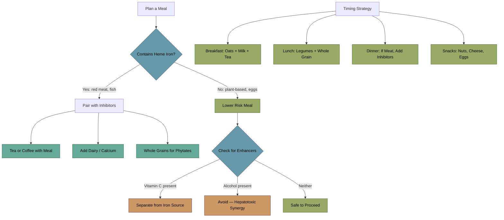

---
{"dg-publish":true,"permalink":"/diet-management/dietary-management-iron-overload/","tags":["diet","iron-absorption","inhibitors","enhancers","haemochromatosis","management","nutrition"],"dg-note-properties":{"date":"2026-03-17","type":"practical","status":"active","tags":["diet","iron-absorption","inhibitors","enhancers","haemochromatosis","management","nutrition"],"summary":"Dietary iron absorption inhibitors, enhancers, and meal strategies for iron overload management","aliases":["Iron Diet","HH Diet"],"permalink":"diet-management/dietary-management-iron-overload"}}
---


# Dietary Management - Iron Overload

## Context
You reduced ferritin from ~700 to 380 ug/L through dietary changes alone. That is a meaningful result — but [[iron-metabolism/Transferrin Saturation - Clinical Significance\|TSAT remains at 60%]] and ferritin has likely plateaued. Diet is adjunctive, not curative.

> **Milman NT.** "A review of nutrients and compounds which promote or inhibit intestinal iron absorption: making a platform for dietary measures that can reduce iron uptake in patients with genetic haemochromatosis." *J Nutr Metab.* 2020;2020:7373498. PMC7509542

> **Milman NT.** "Managing genetic hemochromatosis: an overview of dietary measures which may reduce intestinal iron absorption." *Gastroenterol Res.* 2021;14(2):66-80. PMC8110241

## Meal Planning Flowchart

> [!info]- Colour Key
> 🟢 Inhibitor | 🟠 Enhancer | 🔵 Decision | 🟡 Safe



## Two Types of Dietary Iron

| Type | Source | Absorption Rate | Modifiable? |
|------|--------|----------------|-------------|
| **Heme iron** | Red meat, organ meat, poultry, fish | 15-35% | Minimally — not much affected by meal context |
| **Non-heme iron** | Plants, grains, legumes, fortified foods | 2-20% | Highly — inhibitors/enhancers make a large difference |

**Priority**: reducing heme iron intake has the biggest impact because it is absorbed at high rates regardless of other dietary factors.

## Iron Absorption Inhibitors (Use These)

### Strong Inhibitors
| Substance | Source | Mechanism |
|-----------|--------|-----------|
| **Tannins/polyphenols** | Tea (black > green), coffee, red wine | Bind non-heme iron in gut, forming insoluble complexes |
| **Phytates** | Whole grains, legumes, nuts, seeds | Chelate iron in the intestinal lumen |
| **Calcium** | Dairy, fortified foods | Inhibits both heme AND non-heme iron absorption (unique) |
| **Eggs** | Egg protein (phosvitin) | Binds iron and reduces absorption |

### Moderate Inhibitors
| Substance | Source | Notes |
|-----------|--------|-------|
| Oxalates | Spinach, rhubarb, beet greens | Bind iron but also reduce bioavailability of other minerals |
| Soy protein | Tofu, soy milk, edamame | Contains phytate + specific inhibitory peptides |
| Polyphenols | Cocoa, berries, dark chocolate | Catechins and related compounds bind iron |

### Practical Application
- **Drink tea or coffee WITH meals** — not between meals. This is the opposite of standard advice but correct for iron reduction.
- **Include dairy at meals** — calcium inhibits both types of iron
- **Whole grains over refined** — phytates are your friend here
- **Eggs with meals** — the phosvitin effect

## Iron Absorption Enhancers (Limit These)

### Strong Enhancers — AVOID pairing with iron-rich foods
| Substance | Source | Risk |
|-----------|--------|------|
| **Vitamin C (ascorbic acid)** | Citrus, peppers, supplements | Converts Fe3+ to Fe2+ (more absorbable); **do NOT take vitamin C supplements** |
| **Organic acids** | Citric, malic, lactic acid in fruits | Similar mechanism to vitamin C |
| **MFP factor** | Meat, fish, poultry protein | Enhances non-heme iron absorption from the same meal |
| **Alcohol** | All types, especially with meals | Enhances absorption AND is directly hepatotoxic in iron-loaded liver |

### Critical Warning: Vitamin C
> Vitamin C is **contraindicated as a supplement** in iron overload states. It:
> - Enhances iron absorption
> - Mobilises iron from stores (potentially increasing labile iron)
> - Can worsen cardiac iron toxicity in overloaded patients
>
> You can still eat fruits and vegetables (the vitamin C in whole food context is modest), but **avoid supplements and large doses of citrus juice with meals**.

### Critical Warning: Alcohol
> Alcohol is hepatotoxic and synergistic with iron overload for liver damage. In haemochromatosis:
> - Even moderate alcohol increases liver disease risk significantly
> - The threshold is lower than in the general population
> - Ideally minimise or eliminate alcohol

## Foods to Limit or Avoid

| Food | Reason |
|------|--------|
| Red meat (beef, lamb, pork) | High heme iron; high absorption rate |
| Organ meats (liver, kidney) | Extremely high iron content |
| Shellfish (oysters, mussels, clams) | High iron + raw shellfish carries *Vibrio vulnificus* risk in iron-overloaded patients |
| Iron-fortified cereals/bread | Check labels — many breakfast cereals are fortified to 100% RDI |
| Vitamin C supplements | Enhances iron absorption |
| Alcohol | Liver synergy with iron toxicity |
| Cast iron cookware | Leaches iron into food, especially with acidic foods |

## Foods to Emphasise

| Food | Benefit |
|------|---------|
| Tea and coffee | Strong iron absorption inhibitors |
| Dairy products | Calcium inhibits both heme and non-heme iron |
| Whole grains | Phytates reduce iron absorption |
| Legumes | Phytates + protein without heme iron |
| Eggs | Phosvitin inhibits iron absorption |
| Nuts and seeds | Phytates; good zinc/copper source |
| Dark leafy greens | Non-heme iron (low absorption) + other nutrients |
| Turmeric | Polyphenols; anti-inflammatory properties |

## Sample Meal Timing Strategy

```
Breakfast: Oats (phytate) + milk (calcium) + tea (tannins)
           → triple iron inhibition

Lunch:     Legume-based meal + whole grain + dairy
           → avoid citrus juice or meat at this meal

Dinner:    If eating any meat, pair with:
           - Tea/coffee
           - Dairy (cheese, yoghurt)
           - Avoid vitamin C-rich foods at this meal

Snacks:    Nuts, cheese, dark chocolate, eggs
```

## What You're Doing Right
Reducing ferritin from 700 to 380 through diet shows your changes are working. Likely effective strategies include reduced red meat, increased tea/coffee with meals, and possibly reduced alcohol.

## What Diet Cannot Do
- Diet cannot actively remove stored iron — only phlebotomy does that
- Diet slows iron accumulation but cannot reverse existing tissue deposits
- Your TSAT at 60% suggests ongoing iron absorption exceeds what diet alone can control
- See [[Action Items and Monitoring Plan\|Action Items and Monitoring Plan]] for next steps

## Interaction With [[neurodevelopment/Elvanse and Mineral Metabolism\|Elvanse]]
- Appetite suppression may already reduce overall iron intake
- Ensure you're getting adequate zinc, copper, and magnesium despite reduced appetite
- Consider timing: eat before Elvanse kicks in or during its waning phase

## Interaction With [[minerals/Copper-Zinc-Iron Interactions\|Low Copper and Zinc]]
- Many iron inhibitors (phytates, tannins) also reduce zinc/copper absorption
- This creates tension: strategies to block iron may further suppress already-low copper/zinc
- **Separating zinc/copper-rich meals from iron-rich meals** may help
- Consider taking any copper/zinc supplement (if recommended) at bedtime, away from dietary iron and inhibitors

---

## Key References
1. Milman NT. Iron absorption inhibitors and promoters in haemochromatosis. *J Nutr Metab.* 2020;2020:7373498
2. Milman NT. Dietary measures for genetic hemochromatosis. *Gastroenterol Res.* 2021;14(2):66-80
3. Irish Haemochromatosis Association. Diet and Haemochromatosis guide. 2023
4. Adams PC. How I treat hemochromatosis. *Blood.* 2010;116(3):317-325
5. EASL Clinical Practice Guidelines on haemochromatosis. *J Hepatol.* 2022
6. Hemochromatosis Portal (hemochromatosis.eu). Diet — how to keep iron in check. 2025

---

## Cross-References
- [[lab-results/Blood Results - March 2026\|Blood Results - March 2026]]
- [[iron-metabolism/Transferrin Saturation - Clinical Significance\|Transferrin Saturation - Clinical Significance]]
- [[genetics/HFE Compound Heterozygosity\|HFE Compound Heterozygosity]]
- [[minerals/Copper-Zinc-Iron Interactions\|Copper-Zinc-Iron Interactions]]
- [[neurodevelopment/Elvanse and Mineral Metabolism\|Elvanse and Mineral Metabolism]]
- [[Action Items and Monitoring Plan\|Action Items and Monitoring Plan]]
