---
{"dg-publish":true,"permalink":"/genetics/hfe-compound-het-disease-associations-beyond-iron/","tags":["HFE","C282Y","H63D","compound-heterozygote","disease-associations","cancer","neurodegeneration","arthritis","diabetes","quality-of-life"],"dg-note-properties":{"type":"research","status":"active","date":"2026-03-22","tags":["HFE","C282Y","H63D","compound-heterozygote","disease-associations","cancer","neurodegeneration","arthritis","diabetes","quality-of-life"],"summary":"Comprehensive mapping of disease associations for C282Y/H63D compound heterozygosity beyond iron overload — cancer, neurodegeneration, arthritis, diabetes, mental health, and quality of life","permalink":"obsidian/genetics/hfe-compound-het-disease-associations-beyond-iron"}}
---

# HFE Compound Het — Disease Associations Beyond Iron

## Overview

Anthony's C282Y/H63D compound heterozygosity is typically framed as "low risk" for clinical haemochromatosis. However, this genotype has documented associations with disease endpoints well beyond iron loading. This note maps every verified association using meta-analytic and cohort data.

> [!info]- Colour Key
> 🟤 HFE genotype | 🔵 Grade A evidence | 🟢 Grade B evidence | 🟠 Grade C evidence | ⚪ Disease category

```mermaid
flowchart TD
    HFE["HFE C282Y/H63D"]

    HFE --> LIVER["Liver Disease"]
    HFE --> CANCER["Cancer"]
    HFE --> JOINTS["Joint Disease"]
    HFE --> NEURO["Neurodegeneration"]
    HFE --> ENDO["Endocrine"]
    HFE --> SKIN["Skin"]
    HFE --> QOL["Quality of Life"]

    LIVER --> HCC["HCC: HR 5.25 - Grade A"]
    LIVER --> NAFLD["NAFLD: elevated - Grade B"]

    CANCER --> CRC["Colorectal: OR 3.03 - Grade C"]
    CANCER --> PANC["Pancreatic: elevated - Grade C"]

    JOINTS --> OA["OA polyarticular - Grade B"]
    JOINTS --> MCP["MCP pattern - Grade B"]

    NEURO --> ALS["ALS: 13% increase - Grade B"]
    NEURO --> GLUT["Glutamate toxicity - Grade C"]

    ENDO --> HYPO["Hypogonadism - Grade C"]
    ENDO --> DM["Diabetes risk - Grade C"]

    SKIN --> PCT["PCT: OR 8.1 - Grade A"]

    QOL --> FATIGUE["Fatigue + cognitive - Grade A"]

    classDef centre fill:#8b5e3c,stroke:#6b3e1c,color:#fff
    classDef gradeA fill:#85c1e9,stroke:#2471a3,color:#0a1929
    classDef gradeB fill:#58d68d,stroke:#1e8449,color:#0a1f12
    classDef gradeC fill:#f0b27a,stroke:#ca6f1e,color:#1a1000
    classDef category fill:#d5dbdb,stroke:#7f8c8d,color:#1a1a1a

    class HFE centre
    class HCC,NAFLD,PCT,FATIGUE gradeA
    class OA,MCP,ALS gradeB
    class CRC,PANC,GLUT,HYPO,DM gradeC
    class LIVER,CANCER,JOINTS,NEURO,ENDO,SKIN,QOL category
```

## The Definitive Meta-Analysis: 31 Disease Endpoints

**Ellervik C et al.** "Hemochromatosis genotypes and risk of 31 disease endpoints: meta-analyses including 66,000 cases and 226,000 controls." *Hepatology* 2007;46(4):1071-80. PMID: [17828789](https://pubmed.ncbi.nlm.nih.gov/17828789/)

This landmark study tested all five HFE genotypes against 9 overall endpoints and 22 subgroups. Key findings for **C282Y/H63D compound heterozygotes** specifically:

### Confirmed Associations (C282Y/H63D)

| Disease | Odds Ratio | 95% CI | Significance |
|---------|-----------|--------|-------------|
| **Porphyria cutanea tarda** | **8.1** | 3.9–17 | Strong |
| **Liver disease (overall)** | Elevated (C282Y homozygotes 3.9) | — | Compound hets elevated but less than homozygotes |

### NOT Associated (C282Y/H63D)

| Disease | Finding |
|---------|---------|
| Diabetes mellitus | No significant association in compound hets (only C282Y homozygotes in North Europeans: OR 3.4) |
| Heart disease | No association for any genotype |
| Arthritis (overall meta-analysis) | No association in the meta-analysis (but see arthritis section below for more nuanced evidence) |
| Stroke | No association |
| Cancer (overall) | No association in compound hets specifically |
| Venous disease | No association |

### H63D Homozygote-Specific Finding

| Disease | OR | 95% CI |
|---------|-----|--------|
| **Amyotrophic lateral sclerosis (ALS)** | **3.9** | 1.2–13 |

This ALS association is for H63D/H63D, not C282Y/H63D — but given Anthony carries one H63D allele, this is relevant for family counselling.

## Hepatocellular Carcinoma (HCC) — The Most Serious Risk

**Natarajan Y et al.** "Risk of Hepatocellular Carcinoma in Patients with Various HFE Genotypes." *Dig Dis Sci* 2023;68(1):312-322. PMID: [35790703](https://pubmed.ncbi.nlm.nih.gov/35790703/)

| Genotype | Incidence Rate (/1000 PY) | Adjusted HR vs Controls |
|----------|--------------------------|------------------------|
| C282Y/C282Y | 5.59 | 8.80 (4.17–18.54) |
| **C282Y/H63D** | **4.12** | **5.25 (2.24–12.32)** |
| H63D heterozygote | Higher than controls | 2.82 (1.21–6.58) |
| Controls | 0.92 | 1.0 |

**Risk factors within HFE carriers:**
- Age ≥65: HR 2.2
- **Diabetes: HR 3.74** (1.25–11.20)
- High baseline APRI: HR 3.91
- **Persistent ferritin >250 ng/mL: higher risk** — Anthony's ferritin is 380

**Clinical implication:** Anthony's compound het genotype confers a **5.25× increased HCC risk**. His current ferritin of 380 (>250) is in the elevated risk zone. This strengthens the case for phlebotomy to reduce ferritin below 250, ideally to 50-100.

## NAFLD and Liver Disease

**Ye Q et al.** "Association between the HFE C282Y, H63D Polymorphisms and the Risks of Non-Alcoholic Fatty Liver Disease, Liver Cirrhosis and Hepatocellular Carcinoma." *PLoS One* 2016;11(9):e0163423. PMID: [27657935](https://pubmed.ncbi.nlm.nih.gov/27657935/)

- **C282Y/H63D compound heterozygosity** associated with increased risk of NAFLD and HCC
- **Not** associated with liver cirrhosis specifically
- H63D independently associated with NAFLD in Caucasians under allele, heterozygote, and dominant models

**Clinical note:** Anthony's current LFTs are normal (ALT 27), but NAFLD can be present with normal LFTs. The hepatic iron MRI already recommended in [[Action Items and Monitoring Plan\|Action Items and Monitoring Plan]] would also assess for steatosis.

## Cancer Risk — Detailed Analysis

### Overall Cancer Risk

**Lv YF et al.** "The risk of new-onset cancer associated with HFE C282Y and H63D mutations: evidence from 87,028 participants." *J Cell Mol Med* 2016;20(7):1219-33. PMID: [26893171](https://pubmed.ncbi.nlm.nih.gov/26893171/)

- C282Y significantly associated with elevated cancer risk in recessive model (OR 1.99)
- **H63D did NOT significantly increase overall cancer risk** in any genetic model
- BUT when stratified by ethnicity: H63D increased cancer risk in Asian populations

**Zhang M et al.** "Meta-Analysis of the Association between H63D and C282Y Polymorphisms in HFE and Cancer Risk." *Asian Pac J Cancer Prev* 2015;16(11):4633-9. PMID: [26107216](https://pubmed.ncbi.nlm.nih.gov/26107216/)

- **H63D associated with increased overall cancer risk** under multiple genetic models (allele, homozygote, dominant, recessive)
- When stratified: H63D associated with hepatocellular carcinoma and pancreatic cancer specifically

**Shen LL et al.** "Implicating the H63D polymorphism in the HFE gene in increased incidence of solid cancers." *Genet Mol Res* 2015;14(4):13735-45. PMID: [26535689](https://pubmed.ncbi.nlm.nih.gov/26535689/)

- H63D associated with increased solid cancer risk (CG vs CC: OR 1.14; GG vs CC: OR 1.45)
- Strongest for hepatocellular carcinoma and pancreatic cancer

### Colorectal Cancer — Compound Het Specific

**Robinson JP et al.** "Evidence for an association between compound heterozygosity for germ line mutations in the HFE gene and increased risk of colorectal cancer." *Cancer Epidemiol Biomarkers Prev* 2005;14(6):1460-3. PMID: [15941956](https://pubmed.ncbi.nlm.nih.gov/15941956/)

- Single HFE mutation: NOT associated with colorectal cancer risk
- **C282Y/H63D compound heterozygotes: 3× the odds of colorectal cancer** (OR 3.03; 95% CI 1.06–8.61)
- P=0.038 — borderline after Bonferroni correction
- This is the only cancer type showing a **compound het-specific** risk signal

### Swedish Long-Term Cohort

**Hagström H et al.** "Morbidity, risk of cancer and mortality in 3645 HFE mutations carriers." *Liver Int* 2021;41(3):545-553. PMID: [33450138](https://pubmed.ncbi.nlm.nih.gov/33450138/)

- 3645 patients (62% C282Y homozygotes, 38% C282Y/H63D compound hets), mean follow-up 7.9 years
- **Increased risk found for:** HCC, cirrhosis, type 2 diabetes, **osteoarthritis**, and death (excess mortality only in men)
- **No increased risk for:** colorectal or breast cancer
- Absolute risk for adverse outcomes was low

## Arthritis and Joint Disease

### H63D-Specific Arthropathy

**Carroll GJ.** "HFE gene mutations are associated with osteoarthritis in the index or middle finger metacarpophalangeal joints." *J Rheumatol* 2006;33(4):749-53. PMID: [16583477](https://pubmed.ncbi.nlm.nih.gov/16583477/)

- HFE mutations (including H63D) independently associated with MCP joint osteoarthritis — the characteristic pattern of haemochromatosis arthropathy

**Carroll GJ.** "Primary osteoarthritis in the ankle joint is associated with finger metacarpophalangeal osteoarthritis and the H63D mutation in the HFE gene." *J Clin Rheumatol* 2006;12(3):109-13. PMID: [16755236](https://pubmed.ncbi.nlm.nih.gov/16755236/)

- H63D specifically associated with a polyarticular osteoarthritis phenotype (MCP + ankle)
- Evidence for a **"haemochromatosis-like polyarticular OA phenotype"** in H63D carriers

**Carroll GJ et al.** "Ferritin concentrations in synovial fluid are higher in osteoarthritis patients with HFE gene mutations." *Scand J Rheumatol* 2010;39(5):413-6. PMID: [20560808](https://pubmed.ncbi.nlm.nih.gov/20560808/)

- OA patients with HFE mutations had significantly higher synovial fluid ferritin
- Iron deposition in joints is a mechanism for accelerated cartilage damage

**Simão M et al.** "Intracellular iron uptake is favored in Hfe-KO mouse primary chondrocytes mimicking an osteoarthritis-related phenotype." *Biofactors* 2019;45(4):583-597. PMID: [31132316](https://pubmed.ncbi.nlm.nih.gov/31132316/)

- HFE-knockout chondrocytes show increased iron uptake and OA-like phenotype — mechanistic proof

**Relevance to Anthony:** His lower back pain and the arthropathy already noted in [[symptoms/Arthropathy and Back Pain\|Arthropathy and Back Pain]] fit this pattern. The H63D-specific OA associations add weight to the case for imaging.

## ALS and Neurodegeneration

### H63D and ALS — Umbrella Review

**Khoshdooz S et al.** "Iron-Status Indicators and HFE Gene Polymorphisms in Individuals with Amyotrophic Lateral Sclerosis: An Umbrella Review." *Biol Trace Elem Res* 2025;203(6):2883-2894. PMID: [39317854](https://pubmed.ncbi.nlm.nih.gov/39317854/)

- H63D polymorphism resulted in a **13% significant increase in ALS risk** (OR 1.13; 95% CI 1.05–1.22)
- ALS patients have higher iron and lower transferrin than controls
- "The H63D polymorphism in the HFE gene is associated with a slight increase in the risk of ALS"

### Mechanistic Evidence

**Nandar W et al.** "H63D HFE genotype accelerates disease progression in animal models of amyotrophic lateral sclerosis." *Biochim Biophys Acta* 2014;1842(12 Pt A):2413-26. PMID: [25283820](https://pubmed.ncbi.nlm.nih.gov/25283820/)

- H67D (mouse homologue of H63D) mice crossed with SOD1 ALS model showed **accelerated disease progression**
- Mechanism: altered iron management, increased neuroinflammation, accelerated motor neuron degeneration

**Su XW et al.** "H63D HFE polymorphisms are associated with increased disease duration and decreased muscle superoxide dismutase-1 expression in amyotrophic lateral sclerosis patients." *Muscle Nerve* 2013;48(3):362-8. PMID: [23813494](https://pubmed.ncbi.nlm.nih.gov/23813494/)

- In ALS patients, H63D polymorphism associated with increased disease duration but decreased muscle SOD1 — suggesting modified disease course

**Canosa A et al.** "The HFE p.H63D Polymorphism Is a Modifier of ALS Outcome in Italian and French Patients with SOD1 Mutations." *Biomedicines* 2023;11(3):704. PMID: [36979682](https://pubmed.ncbi.nlm.nih.gov/36979682/)

- H63D modifies ALS outcomes in SOD1 mutation carriers

**Clinical note for Anthony:** This is NOT a reason for concern about developing ALS. The absolute risk increase is small (13%), and Anthony does not have SOD1 mutations. However, it demonstrates that H63D has neurological effects beyond iron loading — consistent with the glutamate findings (Mitchell 2009) already in [[genetics/Genetic Architecture of AuDHD\|Genetic Architecture of AuDHD]].

## Diabetes

### Compound Het and Diabetes — Mixed Evidence

- The Ellervik 2007 meta-analysis found **no significant diabetes association** for C282Y/H63D specifically
- Only C282Y/C282Y homozygotes in North Europeans showed elevated diabetes risk (OR 3.4)
- The Hagström 2021 Swedish cohort found increased type 2 diabetes risk across HFE carriers
- The Natarajan 2023 HCC study found diabetes was a **risk multiplier** (HR 3.74) in HFE carriers

**Moczulski DK et al.** "Role of hemochromatosis C282Y and H63D mutations in HFE gene in development of type 2 diabetes and diabetic nephropathy." *Diabetes Care* 2001;24(7):1187-91. PMID: [11423500](https://pubmed.ncbi.nlm.nih.gov/11423500/)

- No significant association between HFE mutations and type 2 diabetes in this study
- BUT H63D carriers with diabetes had higher rates of diabetic nephropathy

**Clinical note:** Anthony should have fasting glucose / HbA1c monitored as already recommended in [[Action Items and Monitoring Plan\|Action Items and Monitoring Plan]]. His iron overload increases pancreatic iron deposition risk, which can impair beta-cell function even without overt diabetes.

## Cardiovascular Disease

**Hruskovicová H et al.** "Hemochromatosis-causing mutations C282Y and H63D are not risk factors for atherothrombotic cerebral infarction." *Med Sci Monit* 2005;11(7):CR248-52. PMID: [15990686](https://pubmed.ncbi.nlm.nih.gov/15990686/)

- C282Y and H63D are NOT risk factors for stroke

**Zorc M et al.** "Haemochromatosis-causing mutations C282Y and H63D are not risk factors for coronary artery disease in Caucasians with type 2 diabetes." *Folia Biol (Praha)* 2004;50(2):69-71. PMID: [15222129](https://pubmed.ncbi.nlm.nih.gov/15222129/)

- No coronary artery disease risk from HFE mutations even in diabetic patients

**Vaitiekus D et al.** "HFE Gene Variants' Impact on Anthracycline-Based Chemotherapy-Induced Subclinical Cardiotoxicity." *Cardiovasc Toxicol* 2020;20(6):631-643. PMID: [32748118](https://pubmed.ncbi.nlm.nih.gov/32748118/)

- **H63D carriers showed increased cardiotoxicity** from anthracycline chemotherapy
- Relevant if Anthony ever requires chemotherapy — his HFE status should be flagged

## Endocrine — Hypogonadism

Iron overload can deposit in the pituitary gland, causing hypogonadotropic hypogonadism:

**Macchi C et al.** "Iron overload induces hypogonadism in male mice via extrahypothalamic mechanisms." *Mol Cell Endocrinol* 2017;454:135-145. PMID: [28648620](https://pubmed.ncbi.nlm.nih.gov/28648620/)

- Iron overload directly causes hypogonadism in males via pituitary iron deposition
- **Reversible with iron depletion** if detected before permanent damage

**Lufkin EG et al.** "Influence of phlebotomy treatment on abnormal hypothalamic-pituitary function in genetic hemochromatosis." *Mayo Clin Proc* 1987;62(6):473-9. PMID: [3106726](https://pubmed.ncbi.nlm.nih.gov/3106726/)

- Some pituitary hormone abnormalities improve with phlebotomy, others are permanent if long-standing

**Clinical note:** This is typically a late complication of severe iron overload (usually C282Y homozygotes). At Anthony's ferritin of 380 and age 37, this is unlikely to be an issue yet, but testosterone should be checked if symptoms arise (fatigue, low libido, mood changes). Some of his fatigue could theoretically have a subclinical pituitary iron component.

## Porphyria Cutanea Tarda (PCT)

The Ellervik meta-analysis showed C282Y/H63D compound hets have an **8.1× risk** of PCT. PCT causes:
- Skin fragility and blistering on sun-exposed areas
- Hypertrichosis
- Skin darkening

Anthony does not currently report skin symptoms, but this is worth being aware of. PCT is triggered by iron overload + other factors (alcohol, hepatitis C, oestrogens).

## Quality of Life — UK Data

**Craven-Smith L et al.** "Quantitative and qualitative analysis of quality of life in people diagnosed with genetic haemochromatosis in the United Kingdom." *J Patient Rep Outcomes* 2025;9(1):96. PMID: [40728779](https://pubmed.ncbi.nlm.nih.gov/40728779/)

- n=1039 UK haemochromatosis patients vs 535 healthy controls
- **Significantly lower QoL** in physical, psychological, independence, and spiritual domains
- High incidence of physical AND mental symptoms
- **Cognitive difficulties documented** alongside arthritis/joint pain and chronic fatigue
- Patients reported that improved healthcare understanding by professionals would most improve QoL

**This validates Anthony's experience** — fatigue, cognitive difficulties, and joint pain in HFE carriers are real and measurable, not imagined.

## Penetrance of Compound Het Genotype

**Gallego CJ et al.** "Penetrance of Hemochromatosis in HFE Genotypes Resulting in p.Cys282Tyr and p.[Cys282Tyr];[His63Asp] in the eMERGE Network." *Am J Hum Genet* 2015;97(4):512-20. PMID: [26365338](https://pubmed.ncbi.nlm.nih.gov/26365338/)

- **HH diagnostic rate in compound hets: 3.5% (males), 2.3% (females)** — vs 24.4% / 14.0% in C282Y homozygotes
- In males: 37.5% of compound hets had TSAT >50% (Anthony's TSAT is 60% — he's in this minority)
- 33.3% had ferritin >300 ng/ml (Anthony's ferritin is 380 — also in this minority)
- **Only males showed differences** in iron parameters between genotypes
- No differences found in heart disease, arthritis, or liver disease prevalence between genotypes — but rate of liver biopsy was significantly higher in C282Y homozygotes

**Critical insight:** Anthony is in the **minority of compound hets who DO load iron**. His TSAT of 60% and ferritin of 380 place him in the phenotypically affected group, not the silent carrier group. The low overall penetrance statistics should not be used to dismiss his clinical presentation.

## The Beethoven Connection

**Begg TJA et al.** "Genomic analyses of hair from Ludwig van Beethoven." *Current Biology* 2023;33(7):1431-1440. DOI: 10.1016/j.cub.2023.02.041

- Beethoven's DNA showed two copies of a protective HFE variant alongside other risk factors
- He had **hepatitis B** AND documented liver disease — illustrating how HFE genotype interacts with other factors
- While not a compound het himself, this high-profile case illustrates the multi-hit model of HFE-related disease

## Summary Risk Map for Anthony's C282Y/H63D Genotype

| Risk Area | Evidence Level | Risk Magnitude | Current Status | Action |
|-----------|---------------|----------------|----------------|--------|
| **HCC (liver cancer)** | A — cohort study | HR 5.25 | ALT normal, ferritin 380 (>250 threshold) | Hepatic MRI, reduce ferritin via phlebotomy |
| **NAFLD** | B — meta-analysis | Elevated in compound hets | Unknown — not assessed | Hepatic MRI will assess |
| **Colorectal cancer** | C — single study | OR 3.03 (compound het specific) | Unknown | Standard screening at age 45-50; discuss earlier if family history |
| **Osteoarthritis (MCP, polyarticular)** | B — multiple studies | H63D-specific OA pattern | Back pain present | Hand/spine imaging as in action plan |
| **PCT** | A — meta-analysis | OR 8.1 | No skin symptoms | Monitor; avoid alcohol |
| **ALS** | B — umbrella review | 13% increased risk (H63D) | Not relevant currently | Family awareness only |
| **Diabetes** | C — mixed evidence | Elevated in HFE carriers generally | Not tested | HbA1c as in action plan |
| **Hypogonadism** | C — severe iron overload | Reversible if caught early | Not assessed | Testosterone if symptoms arise |
| **Cardiovascular** | A — meta-analysis | No association | — | Standard screening |
| **Quality of life** | A — UK cohort | Significantly impaired | Fatigue, cognitive difficulties present | Phlebotomy, supplement optimisation |
| **Chemotherapy cardiotoxicity** | C — single study | H63D increases anthracycline toxicity | Not applicable | Flag HFE status if ever needed |

## Updated Action Items

Based on these findings, additional items for [[Action Items and Monitoring Plan\|Action Items and Monitoring Plan]]:

1. **HbA1c / fasting glucose** — already recommended, now with stronger rationale (diabetes amplifies HCC risk HR 3.74 in HFE carriers)
2. **Colorectal cancer screening** — consider discussing earlier-than-standard screening given compound het colorectal cancer signal (OR 3.03)
3. **Flag HFE status in medical records** — for future awareness if chemotherapy or other iron-loading treatments are ever needed
4. **Ferritin target <250** is now supported not just for iron normalisation but for **HCC risk reduction** (persistent ferritin >250 is an independent risk factor in compound hets)
5. **Porphyria awareness** — avoid alcohol, inform clinicians of 8.1× PCT risk if skin symptoms emerge

---

## Cross-References
- [[genetics/HFE Compound Heterozygosity\|HFE Compound Heterozygosity]]
- [[Action Items and Monitoring Plan\|Action Items and Monitoring Plan]]
- [[lab-results/Blood Results - March 2026\|Blood Results - March 2026]]
- [[symptoms/Arthropathy and Back Pain\|Arthropathy and Back Pain]]
- [[iron-metabolism/Iron Overload and NTBI\|Iron Overload and NTBI]]
- [[iron-metabolism/Transferrin Saturation - Clinical Significance\|Transferrin Saturation - Clinical Significance]]
- [[genetics/Genetic Architecture of AuDHD\|Genetic Architecture of AuDHD]]
- [[symptoms/Fatigue and Burnout\|Fatigue and Burnout]]
- [[diet-management/Diet and Supplement Strategy\|Diet and Supplement Strategy]]
- [[diet-management/Dietary Management - Iron Overload\|Dietary Management - Iron Overload]]
