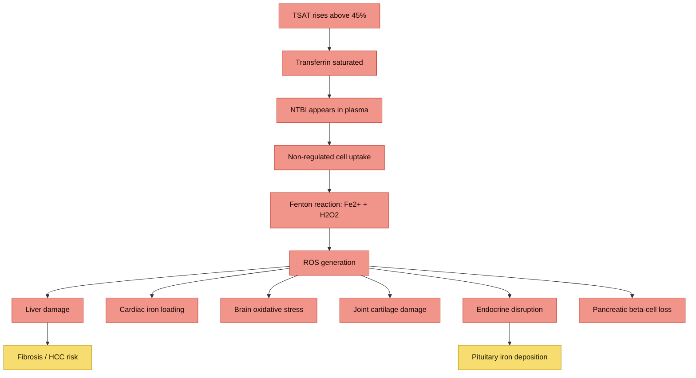

---
{"dg-publish":true,"permalink":"/iron-metabolism/iron-overload-and-ntbi/","tags":["iron-overload","NTBI","LPI","oxidative-stress","haemochromatosis"],"dg-note-properties":{"date":"2026-03-17","type":"research","status":"active","tags":["iron-overload","NTBI","LPI","oxidative-stress","haemochromatosis"],"summary":"Non-transferrin bound iron toxicity mechanisms, NTBI/LPI formation thresholds, and organ damage pathways","aliases":["NTBI","Labile Plasma Iron"],"permalink":"iron-metabolism/iron-overload-and-ntbi"}}
---

# Iron Overload and NTBI

## Core Concept
When iron exceeds transferrin binding capacity, toxic circulating species appear:
- **NTBI** (non-transferrin-bound iron)
- **LPI** (labile plasma iron, redox-active NTBI fraction)

These species drive oxidative damage and organ injury more directly than ferritin alone.

## Why This Matters In Your Labs
- [[iron-metabolism/Transferrin Saturation - Clinical Significance\|TSAT 60%]] is in the range where NTBI is often detectable
- Ferritin is still elevated/high-normal at 380 ug/L
- Prior ferritin ~700 suggests substantial prior iron loading

## Pathophysiology Summary
1. Transferrin saturation rises
2. NTBI appears in plasma
3. NTBI enters cells via non-regulated pathways
4. Iron catalyzes ROS generation (Fenton chemistry)
5. Lipid/protein/DNA damage accumulates

Target organs: liver, pancreas, heart, endocrine tissue, joints, possibly CNS.

> [!info]- Colour Key
> 🔴 Trigger | 🟠 Cascade | 🔵 Organ damage | ⚪ Outcome

## Key Evidence
- Duca L et al. *Int J Mol Sci* 2025;26(13):6433 - comprehensive NTBI/LPI toxicity review (PMC12249652)
- Garbowski MW et al. *Am J Hematol* 2023;98(3):533-540 - clinical relevance of plasma iron species in overload states (DOI: 10.1002/ajh.26819)
- Ryan E et al. *EJHaem* 2022;3(3):644-652 - NTBI can persist in HFE hemochromatosis despite treatment (PMC9422009)
- Silva AMN, Rangel M. *Molecules* 2022;27:1784 - chemistry and biology of NTBI
- Breuer W et al. *Transfus Sci* 2000;23(3):185-192 - foundational NTBI work

## Practical Implication
In iron overload, ferritin is useful, but **TSAT and NTBI-risk physiology** are central for toxicity risk. Your persistent TSAT elevation supports ongoing risk despite dietary improvement.

## Cross-References
- [[iron-metabolism/Transferrin Saturation - Clinical Significance\|Transferrin Saturation - Clinical Significance]]
- [[genetics/HFE Compound Heterozygosity\|HFE Compound Heterozygosity]]
- [[lab-results/Blood Results - March 2026\|Blood Results - March 2026]]
- [[iron-metabolism/Ceruloplasmin and Ferroxidase Activity\|Ceruloplasmin and Ferroxidase Activity]]
- [[Action Items and Monitoring Plan\|Action Items and Monitoring Plan]]
