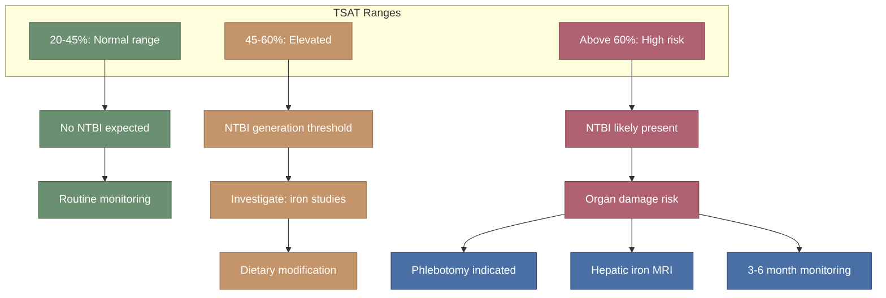

---
{"dg-publish":true,"permalink":"/iron-metabolism/transferrin-saturation-clinical-significance/","tags":["transferrin-saturation","NTBI","iron-overload","TSAT","labile-plasma-iron"],"dg-note-properties":{"date":"2026-03-17","type":"research","status":"active","tags":["transferrin-saturation","NTBI","iron-overload","TSAT","labile-plasma-iron"],"summary":"TSAT 60% clinical significance, NTBI generation thresholds, and guideline-based management targets","aliases":["TSAT","Transferrin Saturation"],"permalink":"iron-metabolism/transferrin-saturation-clinical-significance"}}
---

# Transferrin Saturation - Clinical Significance

## Your Result
**Transferrin saturation: 60%** (reference range: 20-50%)

This is the single most concerning result in your [[lab-results/Blood Results - March 2026\|blood work]].

> [!info]- Colour Key
> 🟢 Normal / safe | 🟠 Caution | 🔴 Risk / danger | 🔵 Action

## What Transferrin Saturation Means

Transferrin is the blood protein that safely transports iron. Under normal conditions, only 20-50% of transferrin's iron-binding sites are occupied. When saturation rises above ~45-50%, the system begins to overflow.

### The NTBI Threshold

**Non-transferrin bound iron (NTBI)** is iron circulating in the blood NOT safely bound to transferrin. It is the primary mediator of iron toxicity.

> "NTBI species appear when transferrin saturation exceeds approximately 45%, and become consistently detectable above 60-70%" — Breuer et al., *Transfus Sci*. 2000;23(3):185-192

> "Many disorders of iron homeostasis are associated with dynamic kinetic profiles of multiple NTBI species, chronic exposure to which can drive organ damage" — Garbowski et al., *Am J Hematol*. 2023;98(3):533-540. DOI: 10.1002/ajh.26819

At your TSAT of 60%, you are at the threshold where **NTBI is likely present in your plasma**.

### Labile Plasma Iron (LPI)

LPI is the redox-active, most toxic fraction of NTBI:
- Generates reactive oxygen species (ROS) via Fenton chemistry
- Directly damages cell membranes, DNA, and proteins
- Targets liver, heart, pancreas, joints, and endocrine organs

> Duca L et al. "The Relationship Between Non-Transferrin-Bound Iron (NTBI), Labile Plasma Iron (LPI), and Iron Toxicity" — *Int J Mol Sci*. 2025;26(13):6433. PMC12249652

### NTBI in HFE Haemochromatosis

> Ryan E et al. "NTBI levels in C282Y homozygotes after therapeutic phlebotomy" — *EJHaem*. 2022;3(3):644-652. PMC9422009
> - NTBI is detectable in HH patients even after phlebotomy when TSAT remains elevated
> - Target TSAT < 50% to minimise NTBI exposure

## Clinical Guidelines for Your Situation

### EASL Guidelines (2022)
For non-C282Y homozygotes (including compound hets) with elevated TSAT and ferritin:
- **TSAT > 45% in females or > 50% in males**: investigate further
- **Ferritin > 200 ug/L (females) or > 300 ug/L (males)**: with elevated TSAT, confirms provisional iron overload
- **If non-C282Y/C282Y**: hepatic iron quantification (MRI T2* or FerriScan) or liver biopsy required for formal diagnosis

### Your Numbers vs Thresholds
| Parameter | Your Value | Male Threshold | Status |
|-----------|-----------|---------------|--------|
| TSAT | 60% | > 50% | Exceeds |
| Ferritin | 380 ug/L | > 300 ug/L | Exceeds |
| Previous ferritin | ~700 ug/L | > 1000 ug/L (organ risk) | Was high, now improved |

### What Should Happen Next

1. **Hepatic iron MRI (T2*/FerriScan)**: Non-invasive quantification of liver iron concentration
   - Indicated because: non-homozygous genotype + elevated iron parameters
   - Would confirm or exclude hepatic iron overload
   - Normal hepatic iron concentration (HIC): < 36 umol/g dry weight

2. **Consider therapeutic phlebotomy**: Even in compound hets, if iron parameters remain elevated
   - Target: ferritin 50-100 ug/L, TSAT < 50%
   - Frequency: typically 1-2 units every 2-4 weeks initially, then maintenance

3. **Monitoring schedule** (if not starting phlebotomy):
   - Serum ferritin and TSAT every 6-12 months minimum
   - LFTs annually
   - Consider FerriScan if ferritin rises above 500 again

## The Phlebotomy Question

> Adams PC. "How I treat hemochromatosis." *Blood*. 2010;116(3):317-325.
> - All patients with ferritin > 300 ug/L (males) and TSAT > 50% should be considered for phlebotomy
> - This applies regardless of genotype if iron overload is confirmed

> HFE hemochromatosis therapeutic recommendations — *Hematol Transfus Cell Ther*. 2022
> - Phlebotomy remains the gold standard for iron removal
> - Diet alone is insufficient for clinical iron overload (you've proven this — dropped from 700 to 380 but plateaued)

## Important Context: Your Diet Has Helped But Plateaued

You reduced ferritin from ~700 to 380 through dietary changes alone. This is significant — but:
- TSAT remains at 60% (still above range)
- Ferritin at 380 is still high-normal
- Diet can reduce iron intake but cannot actively remove stored iron
- Phlebotomy is the only way to actively deplete iron stores

See [[diet-management/Dietary Management - Iron Overload\|Dietary Management - Iron Overload]] for what you're doing right and what else can help.

---

## Key References
1. Breuer W et al. The importance of non-transferrin bound iron in disorders of iron metabolism. *Transfus Sci*. 2000;23(3):185-192
2. Garbowski MW et al. Clinical relevance of detectable plasma iron species in iron overload. *Am J Hematol*. 2023;98(3):533-540
3. Duca L et al. NTBI, LPI, and iron toxicity. *Int J Mol Sci*. 2025;26(13):6433
4. Ryan E et al. NTBI levels in C282Y homozygotes. *EJHaem*. 2022;3(3):644-652
5. EASL Clinical Practice Guidelines on haemochromatosis. *J Hepatol*. 2022
6. Adams PC. How I treat hemochromatosis. *Blood*. 2010;116(3):317-325
7. Patel M, Ramavataram DVS. Non-transferrin bound iron. *Indian J Clin Biochem*. 2012;27(4):322-332. PMC3477448
8. Silva AMN, Rangel M. The (Bio)Chemistry of non-transferrin-bound iron. *Molecules*. 2022;27:1784

---

## Cross-References
- [[lab-results/Blood Results - March 2026\|Blood Results - March 2026]]
- [[genetics/HFE Compound Heterozygosity\|HFE Compound Heterozygosity]]
- [[iron-metabolism/Iron Overload and NTBI\|Iron Overload and NTBI]]
- [[diet-management/Dietary Management - Iron Overload\|Dietary Management - Iron Overload]]
- [[iron-metabolism/Ceruloplasmin and Ferroxidase Activity\|Ceruloplasmin and Ferroxidase Activity]]
- [[Action Items and Monitoring Plan\|Action Items and Monitoring Plan]]
