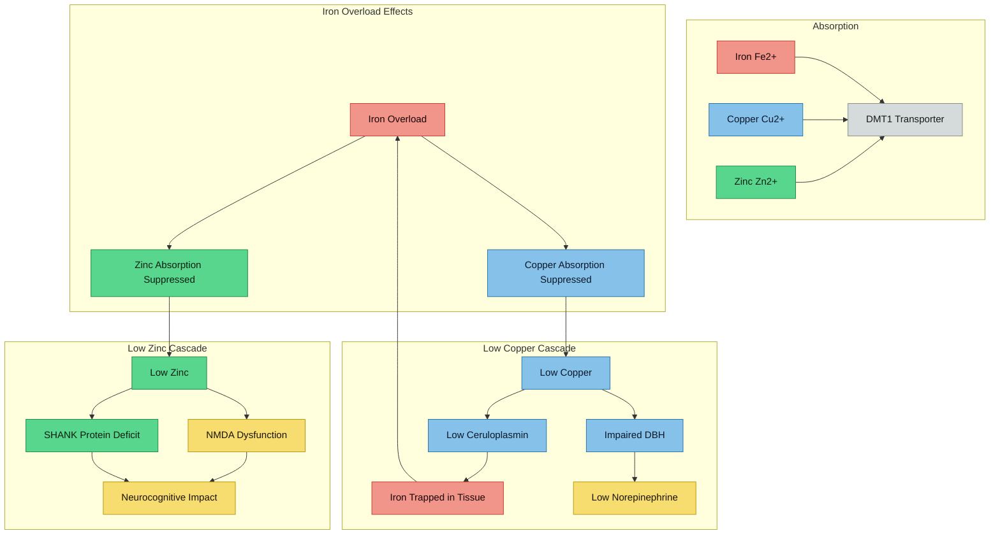

---
{"dg-publish":true,"permalink":"/minerals/copper-zinc-iron-interactions/","tags":["copper","zinc","iron","mineral-interactions","DMT1","absorption","competition"],"dg-note-properties":{"date":"2026-03-17","type":"research","status":"active","tags":["copper","zinc","iron","mineral-interactions","DMT1","absorption","competition"],"summary":"Competitive Cu/Zn/Fe absorption via DMT1, DBH impairment, and the iron-copper vicious cycle","aliases":["Mineral Interactions","Cu-Zn-Fe"],"permalink":"minerals/copper-zinc-iron-interactions"}}
---


# Copper-Zinc-Iron Interactions

## Interaction Map

> [!info]- Colour Key
> 🟠 Iron | 🔵 Copper | 🟢 Zinc | 🔴 Outcome | 🟤 Transporter



## Your Mineral Profile

From [[lab-results/Blood Results - March 2026\|Blood Results - March 2026]]:

| Mineral | Result | Range | % Into Range |
|---------|--------|-------|-------------|
| Copper | 14.3 umol/L | 12.0 - 26.0 | **16%** (low-normal) |
| Zinc | 12.5 umol/L | 11.0 - 24.0 | **12%** (low-normal) |
| Iron | 32 umol/L | 14.0 - 32.0 | **100%** (at ceiling) |

**Pattern: Iron is maxed out while copper and zinc are barely in range.**

This is not coincidental. These three minerals compete for absorption and interact at multiple levels.

## Absorption Competition

### DMT1 (Divalent Metal Transporter 1)
DMT1 is the primary intestinal transporter for iron (Fe2+), but also transports:
- Copper (Cu2+)
- Zinc (Zn2+)
- Manganese, cobalt, cadmium

> **Scheers N.** "Regulatory effects of Cu, Zn, and Ca on Fe absorption: the intricate play between nutrient transporters." *Nutrients*. 2013;5(3):957-970. PMC3705329
> - Iron, copper, and zinc compete for DMT1 transport
> - High iron status can suppress absorption of copper and zinc
> - Conversely, zinc supplementation can reduce iron absorption

> **Nishito Y, Kambe T.** "Absorption mechanisms of iron, copper, and zinc: an overview." *J Nutr Sci Vitaminol*. 2018;64(1):1-7
> - Specific transport proteins for each metal, but significant overlap
> - Competition is dose-dependent and can be clinically significant

> **Kondaiah P et al.** "Iron and zinc homeostasis and interactions." *Nutrients*. 2019;11:1885
> - High iron supplementation blunts zinc absorption
> - Entero-pancreatic zinc excretion may be affected by iron status

### How Iron Overload Suppresses Copper and Zinc

> **Doguer C et al.** "Intersection of iron and copper metabolism in the mammalian intestine and liver." *Compr Physiol*. 2018;8(4):1433-1461. PMC6460475
> - Iron and copper metabolism are deeply intertwined
> - Iron overload downregulates copper transporters
> - Copper is essential for iron export from cells (via ceruloplasmin/hephaestin)

> **Distante S.** "Iron metabolism, calcium, magnesium and trace elements: a review." *Biol Trace Elem Res*. 2025;203:2216-2225
> - Iron homeostasis is connected to calcium, magnesium, and trace elements
> - Excess iron can displace and suppress other essential trace elements

### Iron-Zinc Competition Specifically

> **Solomons NW.** "Competitive interaction of iron and zinc in the diet: consequences for human nutrition." *J Nutr*. 1986;116(6):927-935
> - Classic paper demonstrating iron-zinc competition
> - High iron:zinc ratios in diet suppress zinc absorption
> - Particularly relevant when iron intake is high

## Your Copper:Zinc Ratio

Copper: 14.3 umol/L
Zinc: 12.5 umol/L
**Ratio: ~1.14:1**

Normal copper:zinc ratio is typically 0.7-1.0. Your ratio is slightly elevated (more copper relative to zinc), but both are low.

### Clinical Significance of Low Copper and Zinc

**Low-normal zinc in ADHD is significant:**
> Villagomez A, Ramtekkar U. "Iron, magnesium, vitamin D, and zinc deficiencies in children with ADHD." *Children*. 2014;1(3):261-279. PMC4928738
> - Zinc is a cofactor for >300 enzymes including those in neurotransmitter pathways
> - Zinc deficiency symptoms overlap with ADHD: poor concentration, fatigue, immune dysfunction
> - Zinc supplementation improved ADHD symptoms in some trials

**Low-normal copper in ADHD:**
> Robberecht H et al. "Magnesium, iron, zinc, copper and selenium status in ADHD." *Molecules*. 2020;25(19):4440. PMC7583976
> - ADHD associated with altered trace mineral status
> - Both deficiency and excess of copper are associated with neuropsychiatric symptoms
> - Copper is essential for dopamine beta-hydroxylase (converts dopamine to norepinephrine)

## The Copper-Dopamine Connection

This is critical for your ADHD management:

**Dopamine beta-hydroxylase (DBH)** is a copper-dependent enzyme:
```
Dopamine --[DBH + Cu2+ + ascorbate + O2]--> Norepinephrine
```

> **Lutsenko S et al.** "Copper and the brain noradrenergic system." *J Biol Inorg Chem*. 2019;24(8):1179-1188. PMC6941745
> - Copper is essential for norepinephrine synthesis
> - Low copper = impaired dopamine-to-norepinephrine conversion
> - This affects attention, arousal, and executive function

> **Nelson KT, Prohaska JR.** "Copper deficiency in rodents alters dopamine beta-mono-oxygenase activity." *Br J Nutr*. 2008
> - Copper deficiency directly reduced DBH activity
> - Results in elevated dopamine and reduced norepinephrine

> **Gonzalez-Lopez E, Vrana KE.** "Dopamine beta-hydroxylase and its genetic variants in human health and disease." *J Neurochem*. 2020;152:157-181
> - DBH is the sole enzyme converting dopamine to norepinephrine
> - Copper binding is essential for catalytic activity

### Implications for Your Symptoms
Your low-normal copper (14.3 umol/L) could mean:
- **Suboptimal DBH activity** = impaired norepinephrine production
- **Altered dopamine/norepinephrine balance** = worse ADHD symptoms
- **May affect [[neurodevelopment/Elvanse and Mineral Metabolism\|Elvanse efficacy]]** since stimulants work on both dopamine AND norepinephrine pathways

## The Iron-Copper-Ceruloplasmin Triangle

See [[iron-metabolism/Ceruloplasmin and Ferroxidase Activity\|Ceruloplasmin and Ferroxidase Activity]] for the detailed mechanism, but in summary:
- Copper is needed to make ceruloplasmin
- Ceruloplasmin is needed to export iron from cells
- Low copper = low functional ceruloplasmin = iron gets trapped in tissue
- Your ceruloplasmin is low-normal (0.206 g/L) — consistent with low copper

This creates a **vicious cycle**: iron overload suppresses copper absorption, low copper reduces ceruloplasmin, reduced ceruloplasmin impairs iron export, iron accumulates further.

## What This Means Practically

1. **Your low copper and zinc are likely a consequence of iron overload** — competitive displacement
2. **Low copper may be worsening your ADHD** by impairing DBH and norepinephrine production
3. **Low zinc may be contributing to fatigue, poor concentration, and immune issues**
4. **Supplementing copper/zinc while iron is elevated is complicated** — you'd increase absorption competition further
5. **Reducing iron load (phlebotomy) may naturally improve copper and zinc status**

### Testing to Consider
- **Zinc: erythrocyte zinc** (more reliable than serum)
- **Copper: 24-hour urinary copper** (rules out excess excretion)
- **Ceruloplasmin oxidase activity** (functional test, not just protein level)

---

## Key References
1. Scheers N. Regulatory effects of Cu, Zn, and Ca on Fe absorption. *Nutrients*. 2013;5(3):957-970
2. Doguer C et al. Intersection of iron and copper metabolism. *Compr Physiol*. 2018;8(4):1433-1461
3. Kondaiah P et al. Iron and zinc homeostasis and interactions. *Nutrients*. 2019;11:1885
4. Solomons NW. Competitive interaction of iron and zinc. *J Nutr*. 1986;116(6):927-935
5. Lutsenko S et al. Copper and the brain noradrenergic system. *J Biol Inorg Chem*. 2019;24(8):1179-1188
6. Robberecht H et al. Mineral status in ADHD. *Molecules*. 2020;25(19):4440
7. Villagomez A, Ramtekkar U. Mineral deficiencies in ADHD. *Children*. 2014;1(3):261-279
8. Nelson KT, Prohaska JR. Copper deficiency alters DBH. *Br J Nutr*. 2008
9. Gonzalez-Lopez E, Vrana KE. Dopamine beta-hydroxylase. *J Neurochem*. 2020;152:157-181
10. Distante S. Iron metabolism and trace elements. *Biol Trace Elem Res*. 2025;203:2216-2225
11. Nishito Y, Kambe T. Absorption mechanisms of iron, copper, and zinc. *J Nutr Sci Vitaminol*. 2018;64(1):1-7

---

## Cross-References
- [[lab-results/Blood Results - March 2026\|Blood Results - March 2026]]
- [[iron-metabolism/Ceruloplasmin and Ferroxidase Activity\|Ceruloplasmin and Ferroxidase Activity]]
- [[neurodevelopment/Iron-Dopamine-ADHD Axis\|Iron-Dopamine-ADHD Axis]]
- [[neurodevelopment/Elvanse and Mineral Metabolism\|Elvanse and Mineral Metabolism]]
- [[diet-management/Dietary Management - Iron Overload\|Dietary Management - Iron Overload]]
- [[Action Items and Monitoring Plan\|Action Items and Monitoring Plan]]
