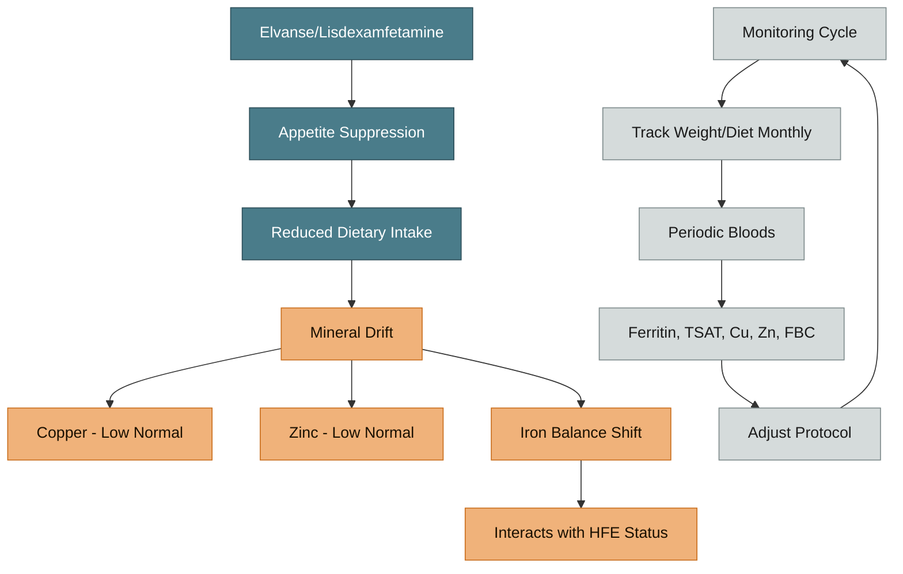

---
{"dg-publish":true,"permalink":"/neurodevelopment/elvanse-and-mineral-metabolism/","tags":["elvanse","lisdexamfetamine","ADHD","appetite","minerals","iron"],"dg-note-properties":{"date":"2026-03-17","type":"research","status":"active","tags":["elvanse","lisdexamfetamine","ADHD","appetite","minerals","iron"],"summary":"Lisdexamfetamine appetite suppression effects on mineral intake and iron/copper/zinc monitoring","aliases":["Vyvanse and Minerals","Lisdexamfetamine"],"permalink":"neurodevelopment/elvanse-and-mineral-metabolism"}}
---

# Elvanse and Mineral Metabolism

## Bottom Line
There is limited high-quality evidence that lisdexamfetamine directly alters iron metabolism. The strongest pathway is **indirect**:
- appetite suppression
- reduced dietary intake variety
- possible long-term micronutrient drift (zinc, magnesium, iron balance)

## Pathway Overview

> [!info]- Colour Key
> 🔵 Medication | 🟤 Mineral | 🟢 Monitoring | 🟣 Link

## What Is Well Supported
- Lisdexamfetamine is effective and generally safe long-term in ADHD populations
- Common adverse effects include reduced appetite/weight change, which can affect nutrient intake

## What Is Not Well Proven
- No robust evidence that lisdexamfetamine directly causes iron overload
- No strong data showing direct copper depletion specifically from lisdexamfetamine
- Pharmacogenomic interaction between HFE genotype and lisdexamfetamine metabolism is not well established

## Relevant ADHD Mineral Literature
- Robberecht H et al. *Molecules* 2020;25(19):4440 - altered magnesium/iron/zinc/copper patterns in ADHD cohorts
- Wang Y et al. *PLoS One* 2017;12(1):e0169145 - ferritin tends to be lower in ADHD populations (meta-analysis)
- DelRosso LM et al. *Children* 2026;13(2):180 - updated cross-disorder iron deficiency review in ADHD/ASD

## Interaction With Your Case
You have:
- high peripheral iron indices
- low-normal zinc/copper
- stimulant-treated ADHD

So clinical focus should be on:
1. Nutritional adequacy under appetite suppression
2. Iron-overload management independent of stimulant use
3. Monitoring whether mineral status changes with dose, meal pattern, or iron treatment

## Practical Monitoring Ideas
- Track body weight and food diversity monthly
- Periodic: ferritin, TSAT, copper, zinc, full blood count
- Keep stimulant timing away from meals only if appetite suppression is severe

## Cross-References
- [[neurodevelopment/Iron-Dopamine-ADHD Axis\|Iron-Dopamine-ADHD Axis]]
- [[minerals/Copper-Zinc-Iron Interactions\|Copper-Zinc-Iron Interactions]]
- [[diet-management/Dietary Management - Iron Overload\|Dietary Management - Iron Overload]]
- [[Action Items and Monitoring Plan\|Action Items and Monitoring Plan]]
