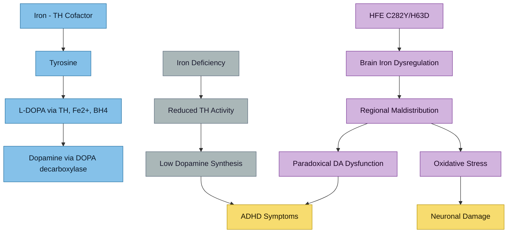

---
{"dg-publish":true,"permalink":"/neurodevelopment/iron-dopamine-adhd-axis/","tags":["ADHD","autism","iron","dopamine","tyrosine-hydroxylase","neurodevelopment","brain-iron"],"dg-note-properties":{"date":"2026-03-17","type":"research","status":"active","tags":["ADHD","autism","iron","dopamine","tyrosine-hydroxylase","neurodevelopment","brain-iron"],"summary":"Iron-dependent tyrosine hydroxylase pathway and its intersection with ADHD and brain iron regulation","aliases":["Iron and ADHD","Dopamine-Iron Connection"],"permalink":"neurodevelopment/iron-dopamine-adhd-axis"}}
---


# The Iron-Dopamine-ADHD Axis

## Pathway Overview

> [!info]- Colour Key
> 🔵 Pathway | 🟤 HFE / iron | 🟣 Deficit | ⚫ Outcome



## The Biochemical Connection

Iron is not just about haemoglobin. It is a critical cofactor for **tyrosine hydroxylase** — the rate-limiting enzyme in dopamine synthesis:

```
Tyrosine --[tyrosine hydroxylase + Fe2+ + BH4]--> L-DOPA --[DOPA decarboxylase]--> Dopamine
```

This means iron status directly affects your brain's ability to produce dopamine — the exact neurotransmitter that is dysregulated in [[ADHD\|ADHD]].

## Iron Deficiency and ADHD — The Well-Studied Direction

Most research focuses on iron *deficiency* in ADHD:

> **Meta-analysis**: "Iron Status in ADHD: A Systematic Review and Meta-Analysis" — Wang Y et al., *PLoS One*. 2017;12(1):e0169145. PMC5207676
> - Children with ADHD had significantly lower serum ferritin than controls
> - Mean difference: -17.88 ng/mL (95% CI: -27.75 to -8.00)

> **2026 Review**: "Iron Deficiency Across Neurodevelopmental Disorders: Comparative Insights from ADHD and ASD" — DelRosso LM et al., *Children*. 2026;13(2):180. PMC12938977
> - Iron deficiency associated with ADHD, ASD, and sleep disorders
> - Iron plays crucial roles in neurotransmitter synthesis, myelination, and neuronal metabolism

> Lin P-Y et al. "Peripheral iron levels in children with ADHD: systematic review and meta-analysis." *Sci Rep*. 2018;8:788

### Brain Iron Specifically

> **Brain iron in childhood ADHD** — Morandini HAE et al., *J Psychiatr Res*. 2024;173:200-209
> - Systematic review of neuroimaging studies
> - Reduced brain iron indices in medication-naive ADHD children
> - Brain iron is independent of peripheral (blood) iron levels

> **Brain tissue iron and dopaminergic modulation** — Cascone AD et al., *Dev Cogn Neurosci*. 2023;63:101274. PMC10372187
> - Brain iron concentration relates to cognitive effects of dopaminergic modulation
> - Iron in basal ganglia influences dopamine signalling

> **Brain iron normalises with stimulant treatment** — Adisetiyo V et al., *Neuroimage Clin*. 2019;24:101993. PMC6726915
> - Brain iron levels in ADHD normalise as a function of psychostimulant treatment duration
> - Suggests stimulants may improve brain iron utilisation

## But What About Iron OVERLOAD and ADHD?

This is the less-studied but critical question for your situation. You don't have iron deficiency — you have iron *excess* in the blood with possible brain iron dysregulation.

### The Paradox: High Peripheral Iron, Potentially Dysregulated Brain Iron

> **HFE gene variants affect iron in the brain** — Connor JR. *Nutr Rev*. 2011. PMID: 21346098
> - H63D HFE variant is associated with iron dyshomeostasis at the cellular level
> - HFE mutations increase oxidative stress and glutamate release
> - **The H63D variant may have more neurological significance than peripheral iron significance**

> **Berberat et al. (2025)**: "Brain iron load and neuroaxonal vulnerability in adult ADHD" — *Psychiatry Clin Neurosci*. 2025;79(5):282-289
> - First study examining brain iron in adult ADHD
> - Found associations between brain iron load patterns and ADHD symptoms

### HFE Variants in Neurological Disease

> **"HFE Mutations in Neurodegenerative Disease as a Model of Hormesis"** — Marshall Moscon SL, Connor JR. *Int J Mol Sci*. 2024;25(6):3334
> - Both C282Y and H63D can affect brain iron
> - H63D may have a "hormetic" effect — mild iron elevation can be neuroprotective at low levels but harmful at high levels
> - Relevant to neurodevelopmental conditions

> **Kalpouzos G et al.** "Contributions of HFE polymorphisms to brain and blood iron load, and their links to cognitive and motor function in healthy adults." *Neuropsychopharmacol Rep*. 2021;41(3):393-404. PMC8411306
> - Carriers of C282Y and/or H63D showed altered brain iron patterns
> - Independent of age, HFE carriers showed differences in iron distribution in brain regions

> **Kim Y, Connor JR.** "The roles of iron and HFE genotype in neurological diseases." *Mol Aspects Med*. 2020;75:100867
> - Comprehensive review: HFE modifies brain iron homeostasis
> - Iron accumulation present in multiple neurological diseases
> - Iron-targeting therapies in development

## The Iron-Overload + ADHD Intersection (Your Situation)

What makes your case clinically interesting:

1. **You have ADHD** (dopamine dysregulation)
2. **You carry HFE variants** (C282Y + H63D) that affect both peripheral AND brain iron handling
3. **Your peripheral iron is high** (TSAT 60%, ferritin 380)
4. **H63D specifically affects brain iron** more than peripheral iron in some studies
5. **You take [[Elvanse\|Elvanse]]** which modulates dopamine — and brain iron affects dopamine signalling

### The Functional Iron Blockade Hypothesis

> **Hauck S (2025)**: "Functional iron blockade in chronic stress and neurodivergence: a perspective on adaptive stress physiology" — *Front Psychiatry*. 2025;16:1701625
> - Proposes that chronic stress in neurodivergent individuals creates a pattern of "functional iron blockade"
> - Persistent hyperferritinaemia without classical haemochromatosis or overt inflammation
> - This metabolic signature is common in burnout and trauma in neurodivergent individuals
> - **Directly relevant to your presentation**: elevated ferritin + neurodivergence + fatigue

## The Oxidative Stress Connection

Iron overload generates reactive oxygen species (ROS). The brain is especially vulnerable:
- High oxygen consumption (20% of body's O2)
- Rich in polyunsaturated fatty acids (oxidation targets)
- Limited antioxidant defences compared to other organs

Both ADHD and ASD show increased oxidative stress markers:
> Thorsen M. "Oxidative stress, metabolic and mitochondrial abnormalities associated with ASD." *Prog Mol Biol Transl Sci*. 2020;173:331-354

Iron overload + neurodevelopmental oxidative stress = compounding damage. See [[symptoms/Fatigue and Burnout\|Fatigue and Burnout]].

---

## Key References
1. Wang Y et al. Iron status in ADHD: systematic review and meta-analysis. *PLoS One*. 2017;12(1):e0169145
2. DelRosso LM et al. Iron deficiency across neurodevelopmental disorders. *Children*. 2026;13(2):180
3. Cascone AD et al. Brain tissue iron and dopaminergic modulation. *Dev Cogn Neurosci*. 2023;63:101274
4. Adisetiyo V et al. Brain iron normalises with stimulant treatment. *Neuroimage Clin*. 2019;24:101993
5. Connor JR. HFE gene variants affect iron in the brain. *Nutr Rev*. 2011. PMID: 21346098
6. Marshall Moscon SL, Connor JR. HFE mutations in neurodegenerative disease. *Int J Mol Sci*. 2024;25(6):3334
7. Kalpouzos G et al. HFE polymorphisms and brain iron. *Neuropsychopharmacol Rep*. 2021;41(3):393-404
8. Kim Y, Connor JR. Iron and HFE genotype in neurological diseases. *Mol Aspects Med*. 2020;75:100867
9. Hauck S. Functional iron blockade in chronic stress and neurodivergence. *Front Psychiatry*. 2025;16:1701625
10. Berberat J et al. Brain iron load in adult ADHD. *Psychiatry Clin Neurosci*. 2025;79(5):282-289
11. Morandini HAE et al. Brain iron in childhood ADHD. *J Psychiatr Res*. 2024;173:200-209
12. Lin P-Y et al. Peripheral iron levels in ADHD. *Sci Rep*. 2018;8:788
13. Araújo T et al. Impact of serum ferritin on ADHD pathophysiology. *Cureus*. 2026;18:e103196

---

## Cross-References
- [[lab-results/Blood Results - March 2026\|Blood Results - March 2026]]
- [[genetics/HFE Compound Heterozygosity\|HFE Compound Heterozygosity]]
- [[neurodevelopment/HFE Variants and Brain Iron\|HFE Variants and Brain Iron]]
- [[neurodevelopment/Elvanse and Mineral Metabolism\|Elvanse and Mineral Metabolism]]
- [[minerals/Copper-Zinc-Iron Interactions\|Copper-Zinc-Iron Interactions]]
- [[symptoms/Fatigue and Burnout\|Fatigue and Burnout]]
