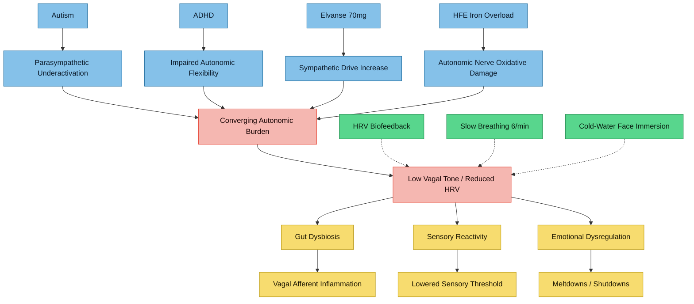

---
{"dg-publish":true,"permalink":"/research/autonomic-nervous-system-and-vagal-tone-in-au-dhd/","tags":["autonomic-nervous-system","vagal-tone","HRV","AuDHD","polyvagal-theory","gut-brain-axis","sensory-processing","iron-overload"],"dg-note-properties":{"type":"research","status":"active","date":"2026-03-27","tags":["autonomic-nervous-system","vagal-tone","HRV","AuDHD","polyvagal-theory","gut-brain-axis","sensory-processing","iron-overload"],"summary":"Evidence synthesis on autonomic nervous system function, vagal tone, and HRV across autism, ADHD, gut-brain signalling, sensory processing, biofeedback, emotional regulation, stimulant effects, and iron overload","permalink":"obsidian/research/autonomic-nervous-system-and-vagal-tone-in-au-dhd"}}
---

# Autonomic Nervous System and Vagal Tone in AuDHD

> Research compiled for a 37-year-old male with co-occurring autism + ADHD, HFE iron overload, trichotillomania, gut issues, fatigue, and Elvanse 70 mg.

Related notes: [[research/Iron and Oxidative Stress in Autism\|Iron and Oxidative Stress in Autism]], [[research/Poor Sleep and AuDHD-HFE Interactions\|Poor Sleep and AuDHD-HFE Interactions]], [[research/Copper-Iron-Dopamine Triangle\|Copper-Iron-Dopamine Triangle]]

---

## Evidence Rating Key

| Grade | Meaning |
|-------|---------|
| **A** | Meta-analysis or systematic review of RCTs |
| **B** | Well-designed controlled study or large cohort |
| **C** | Observational, cross-sectional, pilot, or small-N study |
| **D** | Narrative review, theoretical framework, case report, or animal study |

---

> [!info]- Colour Key
> 🔵 Condition | 🟡 Burden | 🔴 Outcome | 🟢 Protective

## 1. Vagal Tone in Autism -- Polyvagal Theory and HRV Findings

### 1.1 Cheng YC, Huang YC, Huang WL
**Heart rate variability in individuals with autism spectrum disorders: A meta-analysis.**
*Neuroscience & Biobehavioral Reviews*, 2020.
PMID: [32818581](https://pubmed.ncbi.nlm.nih.gov/32818581/)

**Key finding:** Meta-analysis confirming that individuals with ASD show significantly reduced HRV compared to neurotypical controls across both time-domain and frequency-domain measures, indicating chronic parasympathetic underactivation.
**Evidence:** A

---

### 1.2 Thapa R, Alvares GA, Zaidi TA, et al.
**Reduced heart rate variability in adults with autism spectrum disorder.**
*Autism Research*, 2019.
PMID: [30972967](https://pubmed.ncbi.nlm.nih.gov/30972967/)

**Key finding:** Adults with ASD demonstrated significantly reduced resting HRV compared to neurotypical adults, extending prior findings in children and establishing that autonomic dysregulation persists into adulthood in autism.
**Evidence:** B

---

### 1.3 Thapa R, Pokorski I, Ambarchi Z, et al.
**Heart Rate Variability in Children With Autism Spectrum Disorder and Associations With Medication and Symptom Severity.**
*Autism Research*, 2021.
PMID: [33225622](https://pubmed.ncbi.nlm.nih.gov/33225622/)

**Key finding:** Children with ASD showed reduced resting HRV vs neurotypical controls, with greater reductions in those taking psychotropic medication. More severe repetitive behaviours (ADOS-2) were associated with lower HRV, suggesting an autonomic correlate of restricted/repetitive behaviour severity.
**Evidence:** B

---

### 1.4 Porges SW
**Polyvagal Theory: Current Status, Clinical Applications, and Future Directions.**
*Clinical Neuropsychiatry*, 2025.
PMID: [40735382](https://pubmed.ncbi.nlm.nih.gov/40735382/)

**Key finding:** Comprehensive review of Polyvagal Theory emphasising a hierarchical autonomic organisation (ventral vagal for social engagement, sympathetic for mobilisation, dorsal vagal for shutdown). Positions reduced vagal efficiency as a core mechanism in autism, trauma, chronic pain, and mood disorders. Advocates a "science of safety" framework.
**Evidence:** D

---

### 1.5 Porges SW, Macellaio M, Stanfill SD, et al.
**Respiratory sinus arrhythmia and auditory processing in autism: modifiable deficits of an integrated social engagement system?**
*International Journal of Psychophysiology*, 2013.
PMID: [23201146](https://pubmed.ncbi.nlm.nih.gov/23201146/)

**Key finding:** Lower respiratory sinus arrhythmia (RSA, a vagal tone index) was associated with impaired auditory processing in ASD. Both deficits responded to a listening-based intervention, suggesting the social engagement system (vagal brake + middle ear muscles) is modifiable.
**Evidence:** C

---

### 1.6 Bellato A, Arora I, Kochhar P, et al.
**Heart Rate Variability in Children and Adolescents with Autism, ADHD and Co-occurring Autism and ADHD, During Passive and Active Experimental Conditions.**
*Journal of Autism and Developmental Disorders*, 2022.
PMID: [34716841](https://pubmed.ncbi.nlm.nih.gov/34716841/)

**Key finding:** Autism and ADHD may present opposite autonomic profiles: autism associated with parasympathetic underactivation (low HRV) and ADHD with sympathetic dominance. Co-occurring autism+ADHD showed a mixed autonomic pattern, highlighting the importance of assessing both branches in AuDHD.
**Evidence:** B

---

## 2. Autonomic Dysfunction in ADHD

### 2.1 Koenig J, Rash JA, Kemp AH, et al.
**Resting state vagal tone in attention deficit (hyperactivity) disorder: A meta-analysis.**
*World Journal of Biological Psychiatry*, 2017.
PMID: [27073011](https://pubmed.ncbi.nlm.nih.gov/27073011/)

**Key finding:** Meta-analysis found no consistent reduction in resting vagal tone (HF-HRV) in ADHD compared to controls, though substantial heterogeneity was noted. Suggests ADHD autonomic dysfunction may be more evident during task demands than at rest.
**Evidence:** A

---

### 2.2 Robe A, Dobrean A, Cristea IA, et al.
**Attention-deficit/hyperactivity disorder and task-related heart rate variability: A systematic review and meta-analysis.**
*Neuroscience & Biobehavioral Reviews*, 2019.
PMID: [30685483](https://pubmed.ncbi.nlm.nih.gov/30685483/)

**Key finding:** Systematic review and meta-analysis showing that ADHD is associated with reduced task-related HRV reactivity, indicating impaired autonomic flexibility during cognitive challenge rather than baseline dysregulation.
**Evidence:** A

---

### 2.3 Rash JA, Aguirre-Camacho A
**Attention-deficit hyperactivity disorder and cardiac vagal control: a systematic review.**
*ADHD Attention Deficit and Hyperactivity Disorders*, 2012.
PMID: [22773368](https://pubmed.ncbi.nlm.nih.gov/22773368/)

**Key finding:** Systematic review linking ADHD to deficient cardiac vagal control, which parallels the behavioural disinhibition, emotional dysregulation, and attentional deficits characteristic of the disorder. Proposes the vagal brake as a physiological substrate for self-regulation difficulties.
**Evidence:** A

---

### 2.4 Sekaninova N, Mestanik M, Mestanikova A, et al.
**Novel approach to evaluate central autonomic regulation in attention deficit/hyperactivity disorder (ADHD).**
*Physiological Research*, 2019.
PMID: [31177787](https://pubmed.ncbi.nlm.nih.gov/31177787/)

**Key finding:** ADHD is associated with alterations in central autonomic regulation. The study identifies ADHD as involving a shift in sympathovagal balance toward sympathetic dominance, manifesting as hyperarousal and impaired top-down autonomic control.
**Evidence:** B

---

## 3. Vagus Nerve and Gut-Brain Axis

### 3.1 Forsythe P, Bienenstock J, Kunze WA
**Vagal pathways for microbiome-brain-gut axis communication.**
*Advances in Experimental Medicine and Biology*, 2014.
PMID: [24997031](https://pubmed.ncbi.nlm.nih.gov/24997031/)

**Key finding:** Strong animal-model evidence that gut microorganisms activate vagal afferents as a primary route of microbiome-brain communication. Vagotomy abolishes many behavioural and neurochemical effects of probiotic administration, confirming the vagus as the critical conduit.
**Evidence:** D (animal model review)

---

### 3.2 Cao Y, Li R, Bai L
**Vagal sensory pathway for the gut-brain communication.**
*Seminars in Cell & Developmental Biology*, 2024.
PMID: [37558522](https://pubmed.ncbi.nlm.nih.gov/37558522/)

**Key finding:** Comprehensive review of vagal sensory pathways demonstrating that vagal afferents transmit nutrient, immune, and microbial signals from the gut to the brainstem (NTS) and higher brain regions. These pathways regulate energy balance, immune responses, and emotional state.
**Evidence:** D (review)

---

### 3.3 Kim JS, Kirkland RA, Lee SH, et al.
**Gut microbiota composition modulates inflammation and structure of the vagal afferent pathway.**
*Physiology & Behavior*, 2020.
PMID: [32682966](https://pubmed.ncbi.nlm.nih.gov/32682966/)

**Key finding:** Gut microbiota composition directly modulates inflammation in vagal afferent neurons in the nodose ganglion. Dysbiosis-induced microglial activation in the NTS alters vagal afferent structure, providing a mechanistic link between gut inflammation and altered brain-body signalling.
**Evidence:** D (animal model)

---

### 3.4 Tracey KJ
**Physiology and immunology of the cholinergic antiinflammatory pathway.**
*Journal of Clinical Investigation*, 2007.
DOI: [10.1172/JCI30555](https://doi.org/10.1172/jci30555) | OpenAlex: W2002797282

**Key finding:** The vagus nerve mediates a cholinergic anti-inflammatory pathway: efferent vagal signalling releases acetylcholine, which inhibits pro-inflammatory cytokine production (TNF-alpha, IL-1, IL-6). Vagal tone therefore acts as a direct brake on systemic inflammation.
**Evidence:** D (review of experimental evidence)

---

### 3.5 Cryan JF, O'Riordan KJ, Cowan CSM, et al.
**The Microbiota-Gut-Brain Axis.**
*Physiological Reviews*, 2019.
DOI: [10.1152/physrev.00018.2018](https://doi.org/10.1152/physrev.00018.2018) | OpenAlex: W2970686316

**Key finding:** Landmark comprehensive review (4,400+ citations) establishing the microbiota-gut-brain axis as a bidirectional communication system. The vagus nerve is identified as a major signalling route alongside immune, endocrine, and metabolite pathways. Relevant to psychiatric and neurodevelopmental conditions.
**Evidence:** D (comprehensive review)

---

## 4. Autonomic Function and Sensory Processing

### 4.1 Kerley L, Meredith P, Harnett P
**Investigating autonomic biomarkers of sensory processing patterns in young adults.**
*British Journal of Occupational Therapy*, 2022.
PMID: [40337153](https://pubmed.ncbi.nlm.nih.gov/40337153/)

**Key finding:** First study in young adults to link sensory processing patterns with autonomic balance (HRV + pre-ejection period). Males with low sensory thresholds showed reciprocal sympathetic activation at rest -- a state of sympathetic hyperarousal. Directly relevant to sensory over-responsivity in autism.
**Evidence:** C

---

### 4.2 Kolacz J, Raspa M, Heilman KJ, Porges SW
**Evaluating Sensory Processing in Fragile X Syndrome: Psychometric Analysis of the Brain Body Center Sensory Scales (BBCSS).**
*Journal of Autism and Developmental Disorders*, 2018.
PMID: [29417435](https://pubmed.ncbi.nlm.nih.gov/29417435/)

**Key finding:** Development of a sensory processing measure grounded in Polyvagal Theory (BBCSS). Individuals with Fragile X + ASD features had significantly worse sensory processing scores, supporting the framework that autonomic state (vagal regulation) underpins sensory reactivity patterns.
**Evidence:** B

---

### 4.3 Porges SW, Bazhenova OV, Bal E, et al.
**Reducing auditory hypersensitivities in autistic spectrum disorder: preliminary findings evaluating the listening project protocol.**
*Frontiers in Pediatrics*, 2014.
PMID: [25136545](https://pubmed.ncbi.nlm.nih.gov/25136545/)

**Key finding:** The Listening Project Protocol (filtered acoustic stimulation targeting middle-ear muscles innervated by the vagus) reduced auditory hypersensitivities in children with ASD. Provides direct evidence that vagal tone modulation can alter sensory processing thresholds.
**Evidence:** C (pilot study)

---

## 5. HRV Biofeedback for ADHD

### 5.1 Groeneveld KM, Mennenga AM, Heidelberg RC, et al.
**Z-Score Neurofeedback and Heart Rate Variability Training for Adults and Children with Symptoms of Attention-Deficit/Hyperactivity Disorder: A Retrospective Study.**
*Applied Psychophysiology and Biofeedback*, 2019.
PMID: [31119405](https://pubmed.ncbi.nlm.nih.gov/31119405/)

**Key finding:** Combined Z-score neurofeedback and HRV biofeedback training improved ADHD symptoms in both adults and children. Improvements included reduced inattention, hyperactivity, and emotional lability, sustained at follow-up. Suggests HRV training may augment standard ADHD treatment.
**Evidence:** C (retrospective, no control group)

---

### 5.2 Nada PJ
**Heart rate variability in the assessment and biofeedback training of common mental health problems in children.**
*Medical Archives*, 2009.
PMID: [20380120](https://pubmed.ncbi.nlm.nih.gov/20380120/)

**Key finding:** HRV biofeedback in children with ADHD and anxiety improved both autonomic regulation and behavioural symptoms. HRV was positioned as both a diagnostic biomarker and a training target for paediatric mental health conditions.
**Evidence:** C (clinical case series)

---

### 5.3 Sonne T, Jensen MM
**ChillFish: A breath-controlled biofeedback game for ADHD.**
*TEI '16: Proceedings of the 10th International Conference on Tangible, Embedded, and Embodied Interaction*, 2016.
DOI: [10.1145/2839462.2839480](https://doi.org/10.1145/2839462.2839480) | OpenAlex: W2274408628

**Key finding:** A breath-controlled biofeedback game (ChillFish) designed for children with ADHD produced relaxation effects comparable to traditional breathing exercises. Demonstrates gamified HRV/respiratory biofeedback as a feasible and engaging intervention for ADHD.
**Evidence:** C (pilot, N=16)

---

## 6. Vagal Tone and Emotional Regulation

### 6.1 Porges SW, Doussard-Roosevelt JA, Maiti AK
**Vagal tone and the physiological regulation of emotion.**
*Monographs of the Society for Research in Child Development*, 1994.
PMID: [7984159](https://pubmed.ncbi.nlm.nih.gov/7984159/)

**Key finding:** Foundational paper proposing the "vagal circuit of emotion regulation" -- cardiac vagal tone indexes the capacity of the nervous system to support organised emotional responding. Low vagal tone predicts poor emotion regulation, linking directly to the meltdown/shutdown concept.
**Evidence:** D (theoretical + empirical review)

---

### 6.2 Balzarotti S, Biassoni F, Colombo B, et al.
**Cardiac vagal control as a marker of emotion regulation in healthy adults: A review.**
*Biological Psychology*, 2017.
PMID: [29079304](https://pubmed.ncbi.nlm.nih.gov/29079304/)

**Key finding:** Review of 31 studies confirming that higher resting cardiac vagal control (CVC) is consistently associated with better emotion regulation capacity. Individuals with higher CVC showed greater flexibility in deploying adaptive regulation strategies (reappraisal, acceptance) and less reliance on maladaptive ones (suppression, avoidance).
**Evidence:** A (systematic review)

---

### 6.3 Chiu HT, Ip IN, Ching FNY, et al.
**Resting Heart Rate Variability and Emotion Dysregulation in Adolescents with Autism Spectrum Disorder.**
*Journal of Autism and Developmental Disorders*, 2024.
PMID: [36710299](https://pubmed.ncbi.nlm.nih.gov/36710299/)

**Key finding:** Lower resting HRV was more strongly associated with greater emotion dysregulation in ASD adolescents than in TD controls. Supports the model that autonomic dysfunction underpins the emotion regulation difficulties characteristic of autistic meltdowns and shutdowns.
**Evidence:** B

---

### 6.4 Pinna T, Edwards DJ
**A Systematic Review of Associations Between Interoception, Vagal Tone, and Emotional Regulation: Potential Applications for Mental Health, Wellbeing, Psychological Flexibility, and Chronic Conditions.**
*Frontiers in Psychology*, 2020.
PMID: [32849058](https://pubmed.ncbi.nlm.nih.gov/32849058/)

**Key finding:** Systematic review linking the triad of interoception, vagal tone, and emotion regulation. Poor interoceptive accuracy (common in autism) combined with low vagal tone creates a vulnerability to emotion dysregulation. Relevant to the "window of tolerance" concept.
**Evidence:** A

---

## 7. Stimulant Medication Effects on Autonomic Function

### 7.1 Buchhorn R, Conzelmann A, Willaschek C, et al.
**Heart rate variability and methylphenidate in children with ADHD.**
*ADHD Attention Deficit and Hyperactivity Disorders*, 2012.
PMID: [22328340](https://pubmed.ncbi.nlm.nih.gov/22328340/)

**Key finding:** Methylphenidate treatment in ADHD children significantly reduced HRV, particularly vagal-mediated components (RMSSD, HF power). This indicates that stimulant medication further suppresses parasympathetic activity in a population that may already have autonomic dysregulation.
**Evidence:** B

---

### 7.2 Negrao BL, Crafford D, Viljoen M
**The effect of sympathomimetic medication on cardiovascular functioning of children with attention-deficit/hyperactivity disorder.**
*Cardiovascular Journal of Africa*, 2009.
PMID: [19907802](https://pubmed.ncbi.nlm.nih.gov/19907802/)

**Key finding:** Sympathomimetic medication (methylphenidate) in ADHD children shifted autonomic balance toward sympathetic dominance, raising heart rate and reducing parasympathetic markers. The cardiovascular effects were dose-dependent.
**Evidence:** B

---

### 7.3 Schubiner H, Hassunizadeh B, Kaczynski R
**A controlled study of autonomic nervous system function in adults with attention-deficit/hyperactivity disorder treated with stimulant medications: results of a pilot study.**
*Journal of Attention Disorders*, 2006.
PMID: [17085631](https://pubmed.ncbi.nlm.nih.gov/17085631/)

**Key finding:** Adults with ADHD on stimulant medications showed autonomic differences compared to controls, including elevated resting heart rate and altered sympathovagal balance. Notably, ADHD adults also showed baseline ANS abnormalities independent of medication, suggesting both trait and drug effects.
**Evidence:** C (pilot, controlled)

---

### 7.4 Haigh SM, Walford TP, Brosseau P
**Heart Rate Variability in Schizophrenia and Autism.**
*Frontiers in Psychiatry*, 2021.
PMID: [34899423](https://pubmed.ncbi.nlm.nih.gov/34899423/)

**Key finding:** Review confirming suppressed HRV across both schizophrenia and autism, identifying medication use (antipsychotics and stimulants) as a confounding factor that further reduces HRV. Highlights the need to account for pharmacological effects when assessing autonomic function in neurodevelopmental conditions.
**Evidence:** D (narrative review)

---

## 8. Iron Overload and Autonomic Function

### 8.1 Mlodziński K, Swiatczak M, Kaufmann D, et al.
**From Iron Deficiency to Overload: A Missing Link in the Mechanisms of Cardiac Autonomic Nervous System Dysfunction.**
*Journal of Clinical Medicine*, 2026.
PMID: [41827288](https://pubmed.ncbi.nlm.nih.gov/41827288/)

**Key finding:** Review proposing iron status (both deficiency and overload) as a previously underrecognised factor in cardiac autonomic dysfunction. Iron overload promotes oxidative stress and inflammation that damage autonomic nerve fibres and alter sympathovagal balance. Directly relevant to HFE hemochromatosis.
**Evidence:** D (narrative review)

---

### 8.2 Koonrungsesomboon N, Tantiworawit A, Phrommintikul A, et al.
**Heart Rate Variability for Early Detection of Iron Overload Cardiomyopathy in beta-Thalassemia Patients.**
*Hemoglobin*, 2015.
PMID: [26029793](https://pubmed.ncbi.nlm.nih.gov/26029793/)

**Key finding:** In beta-thalassemia patients with iron overload, HRV (both time- and frequency-domain) was depressed and weakly but significantly correlated with non-transferrin-bound iron (NTBI) levels. HRV may serve as a non-invasive marker of iron-mediated cardiac autonomic damage.
**Evidence:** C

---

### 8.3 Silvilairat S, Charoenkwan P, Saekho S, et al.
**Heart Rate Variability for Early Detection of Cardiac Iron Deposition in Patients with Transfusion-Dependent Thalassemia.**
*PLoS ONE*, 2016.
PMID: [27737009](https://pubmed.ncbi.nlm.nih.gov/27737009/)

**Key finding:** In 101 transfusion-dependent thalassemia patients, cardiac T2* MRI (a direct measure of cardiac iron deposition) independently predicted HRV reduction even after adjusting for anaemia. Demonstrates that iron deposition in the heart itself causes autonomic imbalance.
**Evidence:** B

---

### 8.4 Wijarnpreecha K, Siri-Angkul N, Shinlapawittayatorn K, et al.
**Heart Rate Variability as an Alternative Indicator for Identifying Cardiac Iron Status in Non-Transfusion Dependent Thalassemia Patients.**
*PLoS ONE*, 2015.
PMID: [26083259](https://pubmed.ncbi.nlm.nih.gov/26083259/)

**Key finding:** In 99 non-transfusion-dependent thalassemia patients, HRV correlated with cardiac MRI T2* and NTBI. The LF/HF ratio (sympathovagal balance marker) correlated with cardiac iron load, supporting HRV as a screening tool for cardiac iron status.
**Evidence:** C

---

## Synthesis: Relevance to AuDHD + HFE Profile

### Converging autonomic burden

This profile faces a convergence of at least four factors that each independently reduce vagal tone and shift autonomic balance toward sympathetic dominance:

1. **Autism** -- chronic parasympathetic underactivation (reduced RSA/HRV) affecting social engagement, sensory gating, and emotion regulation
2. **ADHD** -- impaired autonomic flexibility during cognitive demands, with sympathovagal imbalance contributing to emotional lability
3. **Elvanse (lisdexamfetamine) 70 mg** -- amphetamine-class stimulants further suppress vagal tone and elevate sympathetic drive dose-dependently
4. **HFE iron overload** -- excess iron promotes oxidative damage to autonomic nerve fibres and cardiac tissue, depressing HRV independently

### Clinical implications

| Domain | Mechanism | Potential Intervention |
|--------|-----------|----------------------|
| Sensory overload | Low vagal tone reduces sensory gating threshold | HRV biofeedback, Listening Project Protocol |
| [[Gut-brain axis\|Gut-brain axis]] dysfunction | Vagal afferent inflammation from dysbiosis | Vagal tone training, targeted probiotics |
| Emotional meltdowns/shutdowns | Reduced vagal brake capacity narrows window of tolerance | Slow breathing (6 breaths/min), cold-water face immersion |
| [[Trichotillomania\|Trichotillomania]] | Autonomic dysregulation may drive repetitive behaviours | HRV monitoring as biofeedback target |
| Cardiovascular risk | Stimulant + iron overload double burden on cardiac ANS | Regular HRV monitoring, venesection adherence |
| Fatigue | Chronic sympathetic dominance = allostatic load | Restorative vagal practices (slow breathing, gentle yoga) |

### Recommended monitoring

- **Resting HRV** (RMSSD, HF power) measured via wearable or 5-min ECG at baseline and quarterly
- **Cardiac T2* MRI** if iron markers remain elevated, given the demonstrated link between cardiac iron and HRV depression
- **Ferritin + NTBI tracking** alongside HRV trends to correlate iron management with autonomic recovery

---

## References by Section

See PMIDs linked inline above. All searches conducted via PubMed and OpenAlex on 2026-03-27.