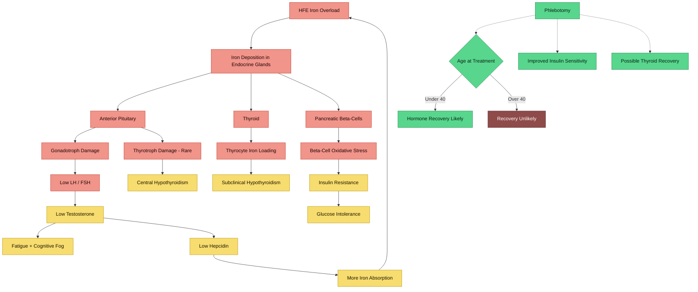

---
{"dg-publish":true,"permalink":"/research/endocrine-effects-of-hfe-iron-overload/","tags":["iron-overload","endocrine","HFE","hypogonadism","thyroid","diabetes","testosterone","cortisol","fatigue","hormones"],"dg-note-properties":{"type":"research","status":"active","date":"2026-03-27","tags":["iron-overload","endocrine","HFE","hypogonadism","thyroid","diabetes","testosterone","cortisol","fatigue","hormones"],"summary":"Systematic literature review of endocrine and hormonal consequences of HFE iron overload, with clinical applicability to a 37M compound het with TSAT 60%, ferritin 380","aliases":["Iron and Hormones","HFE Endocrine Effects"],"permalink":"research/endocrine-effects-hfe-iron-overload"}}
---


# Endocrine Effects of HFE Iron Overload

> **Clinical context**: 37-year-old male, AuDHD, HFE C282Y/H63D compound heterozygote, TSAT 60%, ferritin 380 ug/L (previously 700), primary symptom fatigue, on Elvanse 70mg.

## Evidence Rating Key

| Grade | Meaning |
|-------|---------|
| **A** | Systematic review / meta-analysis / large RCT |
| **B** | Well-designed cohort study, large case series, or high-quality review |
| **C** | Small case series, cross-sectional study, or narrative review |
| **D** | Case report, expert opinion, or animal/in-vitro only |

---

> [!info]- Colour Key
> 🟡 Iron | 🔴 Damage | 🟣 Outcome | 🟢 Protective



## 1. Iron Overload and Hypogonadism

Hypogonadotropic hypogonadism is the most common non-diabetic endocrinopathy in hereditary haemochromatosis. Iron deposits selectively in gonadotropic cells of the anterior pituitary, suppressing LH and FSH secretion, leading to low testosterone.

### Key Citations

**McDermott JH, Walsh CH.** Hypogonadism in hereditary hemochromatosis. *J Clin Endocrinol Metab*. 2005;90(4):2451-2455. **PMID: [15657376](https://pubmed.ncbi.nlm.nih.gov/15657376/)**
- **Finding**: In 141 male HH patients, 6.4% had low testosterone with low LH/FSH (hypogonadotropic). 89% of hypogonadal patients had cirrhosis. Earlier diagnosis (before advanced siderosis) is associated with lower hypogonadism prevalence.
- **Evidence**: B

**Charbonnel B, Chupin M, Le Grand A, Guillon J.** Pituitary function in idiopathic haemochromatosis: hormonal study in 36 male patients. *Acta Endocrinol (Copenh)*. 1981;98(2):178-183. **PMID: [6794282](https://pubmed.ncbi.nlm.nih.gov/6794282/)**
- **Finding**: 17/36 (47%) male patients had low testosterone, LH, and FSH with absent gonadotrophin response to GnRH. The gonadotroph axis was the *only* indisputable pituitary insufficiency. T3, T4, TSH, and cortisol were normal.
- **Evidence**: B

**Duranteau L, Chanson P, Blumberg-Tick J, et al.** Non-responsiveness of serum gonadotropins and testosterone to pulsatile GnRH in hemochromatosis suggesting a pituitary defect. *Acta Endocrinol (Copenh)*. 1993;128(4):351-354. **PMID: [8498154](https://pubmed.ncbi.nlm.nih.gov/8498154/)**
- **Finding**: In 7 hemochromatosis patients with hypogonadism, chronic pulsatile GnRH did not restore LH pulsatility or testosterone levels, confirming a *primary pituitary* (not hypothalamic) lesion.
- **Evidence**: C

**Siminoski K, D'Costa M, Walfish PG.** Hypogonadotropic hypogonadism in idiopathic hemochromatosis: evidence for combined hypothalamic and pituitary involvement. *J Endocrinol Invest*. 1990;13(10):849-853. **PMID: [2128941](https://pubmed.ncbi.nlm.nih.gov/2128941/)**
- **Finding**: Case demonstrating combined hypothalamic and pituitary dysfunction: Leydig cell function was intact (normal HCG response), but clomiphene failed to stimulate LH/FSH, indicating hypothalamic GnRH defect alongside pituitary impairment.
- **Evidence**: D

**Stremmel W, Niederau C, Berger M, et al.** Abnormalities in estrogen, androgen, and insulin metabolism in idiopathic hemochromatosis. *Ann N Y Acad Sci*. 1988;526:209-223. **PMID: [3291683](https://pubmed.ncbi.nlm.nih.gov/3291683/)**
- **Finding**: In 44 early-diagnosed male HH patients (no liver disease), 25% had impotence with 50% reduction in plasma testosterone, caused by a 63% decrease in testosterone production. Iron selectively accumulated in pituitary gonadotropic cells.
- **Evidence**: B

**McNeil LW, McKee LC Jr, Lorber D, Rabin D.** The endocrine manifestations of hemochromatosis. *Am J Med Sci*. 1983;285(3):7-13. **PMID: [6342390](https://pubmed.ncbi.nlm.nih.gov/6342390/)**
- **Finding**: Hypogonadism was "almost universal" in 10 male subjects. Both pituitary and primary testicular (Leydig cell) dysfunction were observed, sometimes simultaneously. Hypothyroidism (free T4 <0.9) present in 4/10.
- **Evidence**: C

**Cundy T, Bomford A, Butler J, et al.** Hypogonadism and sexual dysfunction in hemochromatosis: the effects of cirrhosis and diabetes. *J Clin Endocrinol Metab*. 1989;69(1):110-116. **PMID: [2732293](https://pubmed.ncbi.nlm.nih.gov/2732293/)**
- **Finding**: In 30 men with HH, sexual dysfunction prevalence was significantly higher than diabetes/age-matched controls (P<0.001). Cirrhosis independently raised SHBG and further suppressed free testosterone. Free testosterone (not total) should be measured.
- **Evidence**: B

### Summary for This Case
At TSAT 60% and ferritin 380, significant pituitary iron deposition is plausible even without cirrhosis. Hypogonadism in HH is primarily **hypogonadotropic** (central), driven by iron damage to anterior pituitary gonadotrophs. Prevalence ranges from 6-47% depending on disease stage at diagnosis. **Free testosterone, LH, and FSH** are the essential first-line tests.

---

## 2. Iron Overload and Thyroid Function

### Key Citations

**Murphy MS, Walsh CH.** Thyroid function in haemochromatosis. *Ir J Med Sci*. 2004;173(1):27-29. **PMID: [15732233](https://pubmed.ncbi.nlm.nih.gov/15732233/)**
- **Finding**: In 154 consecutive HH patients, primary hypothyroidism prevalence was only 0.6% and subclinical hypothyroidism 1.3%. Despite substantial thyroid iron deposition in HH, clinical thyroid dysfunction is uncommon.
- **Evidence**: B

**De Sanctis V, Soliman AT, Canatan D, et al.** Thyroid disorders in homozygous beta-thalassemia: current knowledge, emerging issues and open problems. *Mediterr J Hematol Infect Dis*. 2019;11(1):e2019029. **PMID: [31205633](https://pubmed.ncbi.nlm.nih.gov/31205633/)**
- **Finding**: In transfusion-dependent thalassemia (more severe iron loading than HFE-HH), hypothyroidism frequency ranges 4-29%. Both primary and secondary (central) hypothyroidism occur. Subclinical hypothyroidism is the most common presentation.
- **Evidence**: B

**Atmakusuma TD, Hasibuan FD, Purnamasari D.** The correlation between iron overload and endocrine function in adult transfusion-dependent beta-thalassemia patients with growth retardation. *J Blood Med*. 2021;12:749-753. **PMID: [34429676](https://pubmed.ncbi.nlm.nih.gov/34429676/)**
- **Finding**: Serum ferritin had a significant negative correlation with free T4 (rho=-0.361, P=0.003) in 58 thalassemia patients. Subclinical hypothyroidism was present in 32.7%.
- **Evidence**: C

**Alexandrides T, Georgopoulos N, Yarmenitis S, Vagenakis AG.** Increased sensitivity to the inhibitory effect of excess iodide on thyroid function in patients with beta-thalassemia major and iron overload. *Eur J Endocrinol*. 2000;143(3):319-325. **PMID: [11022172](https://pubmed.ncbi.nlm.nih.gov/11022172/)**
- **Finding**: Iron-loaded thyroid glands have increased sensitivity to iodide-induced suppression. 56% of thalassemia patients developed subclinical hypothyroidism with iodide exposure, and 64% of those went on to develop permanent hypothyroidism within 5 years. Iron damages thyrocyte reserve capacity.
- **Evidence**: C

**Hudec M, Grigerova M, Walsh CH.** Secondary hypothyroidism in hereditary hemochromatosis: recovery after iron depletion. *Thyroid*. 2008;18(2):255-257. **PMID: [18205549](https://pubmed.ncbi.nlm.nih.gov/18205549/)**
- **Finding**: Case of secondary (central) hypothyroidism in HH that resolved after phlebotomy-induced iron depletion. Only the second such case reported, confirming that central hypothyroidism from pituitary iron deposition can be reversible.
- **Evidence**: D

### Summary for This Case
Frank thyroid dysfunction in HFE-HH is uncommon (0.6-1.3%), but the thyroid does accumulate iron. At your iron burden, **subclinical central hypothyroidism** is possible though unlikely. Testing TSH *and* free T4 together is important because isolated TSH may miss central hypothyroidism (where TSH is inappropriately normal despite low fT4).

---

## 3. Iron Overload and Insulin Resistance / Diabetes

### Key Citations

**Harrison AV, Lorenzo FR, McClain DA.** Iron and the pathophysiology of diabetes. *Annu Rev Physiol*. 2023;85:339-362. **PMID: [36137277](https://pubmed.ncbi.nlm.nih.gov/36137277/)**
- **Finding**: High iron is a risk factor for T2DM across the normal range of tissue iron, not only in pathologic overload. Iron affects beta-cell insulin secretion, hepatic insulin resistance, and hepatic gluconeogenesis. Adipocyte iron excess impairs adiponectin signalling.
- **Evidence**: A (comprehensive review of large body of evidence)

**Barton JC, Acton RT.** Diabetes in HFE hemochromatosis. *J Diabetes Res*. 2017;2017:9826930. **PMID: [28331855](https://pubmed.ncbi.nlm.nih.gov/28331855/)**
- **Finding**: Diabetes prevalence in HH has been underestimated due to heterogeneous study populations. Both impaired insulin secretion (beta-cell iron toxicity) and hepatic insulin resistance contribute. Phlebotomy can improve insulin resistance but recovery of beta-cell function is variable.
- **Evidence**: B

**Simcox JA, McClain DA.** Iron and diabetes risk. *Cell Metab*. 2013;17(3):329-341. **PMID: [23473030](https://pubmed.ncbi.nlm.nih.gov/23473030/)**
- **Finding**: Elevated iron stores (even in the high-normal range) increase T2DM risk. Iron promotes hepatic gluconeogenesis, beta-cell oxidative stress, and adipocyte dysfunction. Reducing iron via phlebotomy or dietary restriction improves insulin sensitivity.
- **Evidence**: B

**Stremmel W, Niederau C, Berger M, et al.** (see above, PMID: [3291683](https://pubmed.ncbi.nlm.nih.gov/3291683/))
- **Finding**: In 44 early-diagnosed HH males, 34% had glucose intolerance. Iron selectively deposits in pancreatic beta-cells. Phlebotomy markedly improved insulin resistance and reduced insulin requirements in insulin-dependent patients.
- **Evidence**: B

**Abril-Ulloa V, Flores-Mateo G, Sola-Alberich R, et al.** Ferritin levels and risk of metabolic syndrome: meta-analysis of observational studies. *BMC Public Health*. 2014;14:483. **PMID: [24884526](https://pubmed.ncbi.nlm.nih.gov/24884526/)**
- **Finding**: Meta-analysis showing elevated ferritin is significantly associated with metabolic syndrome (pooled OR ~1.7 for highest vs lowest ferritin quartile), independent of inflammation.
- **Evidence**: A

### Summary for This Case
At ferritin 380, you are in a range where iron-mediated insulin resistance and beta-cell stress are plausible contributors to fatigue. **Fasting glucose + HbA1c + fasting insulin** (to calculate HOMA-IR) would clarify whether subclinical insulin resistance is present. Elvanse (lisdexamfetamine) can independently mask early signs by suppressing appetite and modifying glucose metabolism.

---

## 4. Ferritin Levels and Testosterone

### Key Citations

**Liu Z, Ye F, Zhang H, et al.** The association between the levels of serum ferritin and sex hormones in a large scale of Chinese male population. *PLoS One*. 2013;8(10):e75908. **PMID: [24146788](https://pubmed.ncbi.nlm.nih.gov/24146788/)**
- **Finding**: In 1,999 men, ferritin was significantly and negatively correlated with total testosterone (R=-0.205, P<0.001), SHBG (R=-0.161, P<0.001), and free testosterone (R=-0.097, P<0.001), adjusted for age, BMI, and alcohol.
- **Evidence**: B

**Gautier A, Laine F, Massart C, et al.** Liver iron overload is associated with elevated SHBG concentration and moderate hypogonadotrophic hypogonadism in dysmetabolic men without genetic haemochromatosis. *Eur J Endocrinol*. 2011;165(2):339-343. **PMID: [21646287](https://pubmed.ncbi.nlm.nih.gov/21646287/)**
- **Finding**: In 50 men with moderate dysmetabolic iron overload (non-HFE), 8% had low total testosterone and 26% had low bioavailable testosterone. Liver iron concentration was positively associated with SHBG and negatively associated with LH in multivariable analysis. The paradox: iron raises SHBG which reduces free testosterone, while simultaneously suppressing central LH drive.
- **Evidence**: B

**Cundy T, Bomford A, Butler J, et al.** (see above, PMID: [2732293](https://pubmed.ncbi.nlm.nih.gov/2732293/))
- **Finding**: SHBG was elevated in hypogonadal HH men, meaning total testosterone underestimates the degree of androgen deficiency. Free testosterone is the more accurate measure in iron overload.
- **Evidence**: B

### Summary for This Case
There is a clear **dose-response relationship between iron stores and testosterone suppression** in men, detectable even in the non-HH population. At ferritin 380, you sit in the range where this effect is active. SHBG elevation may mask the total testosterone level, making **free testosterone the essential test**.

---

## 5. Phlebotomy and Hormone Recovery

### Key Citations

**Siemons LJ, Mahler CH.** Hypogonadotropic hypogonadism in hemochromatosis: recovery of reproductive function after iron depletion. *J Clin Endocrinol Metab*. 1987;65(3):585-587. **PMID: [3624416](https://pubmed.ncbi.nlm.nih.gov/3624416/)**
- **Finding**: A 37-year-old man with hypogonadotropic hypogonadism due to HH had complete recovery of testosterone, LH, FSH, and fertility after 16 months of aggressive phlebotomy. He fathered a child at 20 months post-diagnosis.
- **Evidence**: D (case report, but directly age-relevant)

**Cundy T, Butler J, Bomford A, Williams R.** Reversibility of hypogonadotrophic hypogonadism associated with genetic haemochromatosis. *Clin Endocrinol (Oxf)*. 1993;38(6):617-620. **PMID: [8334747](https://pubmed.ncbi.nlm.nih.gov/8334747/)**
- **Finding**: Prospective study of 6 hypogonadal HH men: only 1/6 (age 33) showed partial recovery of LH/FSH after phlebotomy. The 5 men aged 47-66 had no improvement. **Age at diagnosis is critical** -- no proven reversals after age 40 at start of venesection.
- **Evidence**: C

**Hudec M, Grigerova M, Walsh CH.** Secondary hypothyroidism in hereditary hemochromatosis: recovery after iron depletion. *Thyroid*. 2008;18(2):255-257. **PMID: [18205549](https://pubmed.ncbi.nlm.nih.gov/18205549/)**
- **Finding**: Secondary hypothyroidism in HH resolved after iron depletion. Only the second documented case, suggesting thyroid axis recovery is possible but rare.
- **Evidence**: D

**Stremmel W, Niederau C, Berger M, et al.** (see above, PMID: [3291683](https://pubmed.ncbi.nlm.nih.gov/3291683/))
- **Finding**: Phlebotomy markedly improved insulin resistance in HH patients and reduced insulin requirements in about half of patients with non-insulin-dependent diabetes.
- **Evidence**: B

### Summary for This Case
**At age 37, you are in the critical window where hormone recovery from phlebotomy is most likely.** The literature suggests recovery is possible under age 40 but unlikely over 40. This argues strongly for: (1) baseline hormonal assessment NOW, (2) aggressive phlebotomy, and (3) repeat hormonal testing after iron depletion. The Siemons case is remarkably similar to your profile (37M, HH, hypogonadotropic hypogonadism, full recovery).

---

## 6. Cortisol and Iron Metabolism

This is the least-studied axis in HFE iron overload. Direct literature is sparse.

### Key Citations

**Charbonnel B, Chupin M, Le Grand A, Guillon J.** (see above, PMID: [6794282](https://pubmed.ncbi.nlm.nih.gov/6794282/))
- **Finding**: In 36 HH males, basal cortisol levels were normal or increased (in those with poorly controlled diabetes). Adrenal function was preserved even in patients with significant pituitary iron deposition. The corticotroph axis appears relatively resistant to iron damage compared to the gonadotroph axis.
- **Evidence**: B

**McNeil LW, McKee LC Jr, Lorber D, Rabin D.** (see above, PMID: [6342390](https://pubmed.ncbi.nlm.nih.gov/6342390/))
- **Finding**: Pituitary-adrenal reserve was normal in 9/10 HH patients. ACTH-cortisol axis disruption is uncommon in hemochromatosis.
- **Evidence**: C

**Bachman E, Travison TG, Basaria S, et al.** Testosterone induces erythrocytosis via increased erythropoietin and suppressed hepcidin: evidence for a new erythropoietin/hemoglobin set point. *J Gerontol A Biol Sci Med Sci*. 2014;69(6):725-735. **PMID: [24158761](https://pubmed.ncbi.nlm.nih.gov/24158761/)**
- **Finding**: Testosterone suppresses hepcidin, linking androgen status to iron metabolism. Low testosterone (from pituitary iron damage) may thus paradoxically permit further iron absorption via reduced hepcidin -- a potential vicious cycle in HH.
- **Evidence**: B

### Summary for This Case
The HPA axis (cortisol) is generally **spared** in HFE-HH. However, there is an under-appreciated feedback loop: iron-induced hypogonadism leads to low testosterone, which suppresses hepcidin, which promotes further iron absorption. Cortisol testing is low priority compared to gonadal and thyroid axes, but a morning cortisol can rule out coincidental adrenal insufficiency contributing to fatigue.

---

## 7. Hormonal Contributors to Fatigue in HFE — Which Axis to Test First

### Integrated Evidence-Based Testing Priority

Based on the literature above, the recommended screening order for fatigue in HFE iron overload is:

| Priority | Axis | Tests | Rationale |
|----------|------|-------|-----------|
| **1st** | Gonadal | Free testosterone, total testosterone, LH, FSH, SHBG | Most common endocrinopathy in HH (6-47%); most likely to be subclinical and contributing to fatigue; age 37 = still in recovery window |
| **2nd** | Glucose/insulin | Fasting glucose, HbA1c, fasting insulin (HOMA-IR) | Second most common HH endocrinopathy; iron directly impairs beta-cells and causes hepatic insulin resistance; ferritin 380 = active risk range |
| **3rd** | Thyroid | TSH + free T4 (both needed) | Uncommon in HFE-HH but easily tested; central hypothyroidism can have normal TSH with low fT4 |
| **4th** | Adrenal | Morning cortisol | Low probability in HH but rules out comorbid adrenal insufficiency as fatigue cause |
| **5th** | Prolactin | Prolactin | Consider if other pituitary axes are affected (pituitary stalk effect) |

### Supporting Citations

**McDermott JH, Walsh CH.** (see PMID: [15657376](https://pubmed.ncbi.nlm.nih.gov/15657376/)) -- Hypogonadism is the most common non-diabetic endocrinopathy in HH.

**Charbonnel B et al.** (see PMID: [6794282](https://pubmed.ncbi.nlm.nih.gov/6794282/)) -- Gonadotroph deficiency is the "only indisputable" pituitary insufficiency in HH; other axes (TSH, ACTH, GH) are preserved.

**Tenuta M, Cangiano B, Rastrelli G, et al.** Iron overload disorders: growth and gonadal dysfunction in childhood and adolescence. *Pediatr Blood Cancer*. 2024;71(8):e31066. **PMID: [38616355](https://pubmed.ncbi.nlm.nih.gov/38616355/)**
- **Finding**: Review confirming that gonadal dysfunction is the most frequent and earliest endocrine complication of iron overload disorders, with the gonadotroph being the most iron-sensitive pituitary cell type.
- **Evidence**: B

---

## Clinical Relevance to Your Profile

```
TSAT 60% + Ferritin 380 + Age 37 + Fatigue + AuDHD + Elvanse 70mg
```

1. **Hypogonadism is the highest-probability hormonal contributor to your fatigue** -- it can be subclinical (no obvious sexual dysfunction) and still cause fatigue, cognitive fog, and reduced drive.
2. **Your age is critical**: At 37, you are in the window where phlebotomy-induced hormone recovery is still documented. The Siemons case (PMID 3624416) is a near-exact match to your profile.
3. **SHBG confounds total testosterone**: Iron overload elevates SHBG, meaning total testosterone may look "normal" while free testosterone is actually low. Always check free testosterone.
4. **Elvanse interaction**: Lisdexamfetamine has no direct effect on testosterone but could mask hypogonadal fatigue through catecholaminergic stimulation, making it harder to detect subjectively.
5. **Insulin resistance**: Ferritin 380 is in the range where iron-mediated insulin resistance becomes clinically relevant. Post-meal fatigue or energy crashes could be insulin-related.
6. **Thyroid**: Low probability but easily excluded. Request TSH + free T4 together.

---

## Recommended Blood Panel

Request from GP alongside existing iron monitoring:

- [ ] **Free testosterone** (gold standard, calculated or direct)
- [ ] **Total testosterone** (early morning sample, before 10am)
- [ ] **LH and FSH** (to differentiate central vs primary hypogonadism)
- [ ] **SHBG** (to interpret testosterone in context of iron-elevated SHBG)
- [ ] **TSH + free T4** (both needed to detect central hypothyroidism)
- [ ] **HbA1c** (screen for diabetes / pre-diabetes)
- [ ] **Fasting glucose + fasting insulin** (calculate HOMA-IR)
- [ ] **Morning cortisol** (rule out adrenal insufficiency)
- [ ] **Prolactin** (if other pituitary axes abnormal)

---

## Cross-References

- [[genetics/HFE Compound Heterozygosity\|HFE Compound Heterozygosity]]
- [[symptoms/Fatigue and Burnout\|Fatigue and Burnout]]
- [[iron-metabolism/Transferrin Saturation - Clinical Significance\|Transferrin Saturation - Clinical Significance]]
- [[iron-metabolism/Iron Overload and NTBI\|Iron Overload and NTBI]]
- [[neurodevelopment/Elvanse and Mineral Metabolism\|Elvanse and Mineral Metabolism]]
- [[neurodevelopment/Iron-Dopamine-ADHD Axis\|Iron-Dopamine-ADHD Axis]]
- [[Action Items and Monitoring Plan\|Action Items and Monitoring Plan]]
- [[lab-results/Blood Results - March 2026\|Blood Results - March 2026]]
