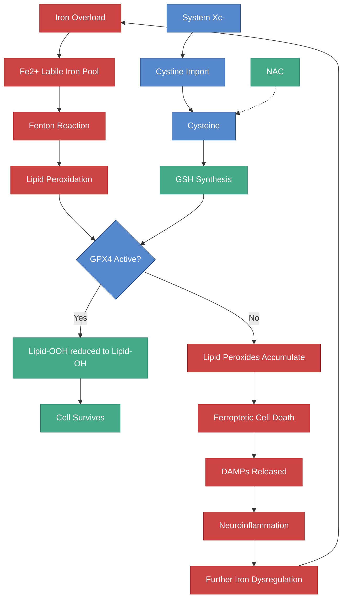

---
{"dg-publish":true,"permalink":"/research/ferroptosis-and-neuronal-iron/","tags":["ferroptosis","iron","neurodegeneration","neuroinflammation","lipid-peroxidation","GPX4","system-Xc"],"dg-note-properties":{"type":"research","status":"active","date":"2026-03-21","tags":["ferroptosis","iron","neurodegeneration","neuroinflammation","lipid-peroxidation","GPX4","system-Xc"],"summary":"Ferroptosis — iron-dependent regulated cell death in neurons via lipid peroxidation, relevance to neuroinflammation and neurodevelopment","permalink":"research/ferroptosis-and-neuronal-iron"}}
---


# Ferroptosis and Neuronal Iron

## What Is Ferroptosis?

Ferroptosis is a form of **regulated cell death** defined by iron-dependent peroxidation of phospholipids leading to destruction of cellular membranes. It is distinct from apoptosis, necrosis, and autophagy.

The term was coined in 2012 by Dixon et al., and its relevance to brain disease has expanded rapidly since.

> [!info]- Colour Key
> 🔴 Pathological | 🟢 Protective | 🔵 Neutral | ⚪ Outcome



## Why the Brain Is Uniquely Vulnerable

> **Bhatt S et al.** "Neuroferroptosis in health and diseases." *Nat Rev Neurosci*. 2025. DOI: 10.1038/s41583-025-00930-5
> - The CNS is especially vulnerable to ferroptotic damage because of:
>   - **High oxygen consumption** (20% of body's O2)
>   - **Abundant polyunsaturated fatty acids (PUFAs)** in membranes (oxidation targets)
>   - **Robust iron utilisation** for neurotransmitter synthesis and myelin formation
>   - **Limited regenerative capacity** of neurons

## The Core Mechanism

### The System Xc-/GSH/GPX4 Axis

This is the primary defence against ferroptosis:

```
System Xc- imports cystine (exports glutamate, 1:1 ratio)
          |
          v
Cystine -> Cysteine -> Glutathione (GSH)
                              |
                              v
                     GPX4 uses GSH to reduce lipid peroxides
                              |
                              v
                     Lipid-OOH -> Lipid-OH (harmless)
```

When any step fails:
1. **System Xc- inhibition** -> cysteine depletion -> GSH depletion -> GPX4 inactive -> lipid peroxides accumulate
2. **Iron overload** -> Fe2+ catalyses Fenton reaction -> generates lipid peroxides faster than GPX4 can clear them
3. **GPX4 inactivation** -> direct loss of lipid peroxide detoxification

> **Li J et al.** "System Xc-/GSH/GPX4 axis: an important antioxidant system for ferroptosis in drug-resistant solid tumour therapy." *Front Pharmacol*. 2022;13:910292. PMC9465090
> - System Xc- transports cystine into the cell and glutamate out in 1:1 ratio
> - GSH is formed by condensation of glutamate, cysteine, and glycine
> - GPX4 is the sole enzyme that reduces lipid hydroperoxides within membranes

### Iron's Central Role

Iron catalyses the Fenton reaction:
```
Fe2+ + H2O2 -> Fe3+ + OH- + OH*  (hydroxyl radical)
Fe2+ + LOOH -> Fe3+ + LO* + OH-  (lipid alkoxyl radical)
```

These radicals propagate lipid peroxidation chain reactions in neuronal membranes.

## Ferroptosis in Neurodegeneration

> **Gao G et al.** "Ferroptosis and iron homeostasis: molecular mechanisms and neurodegenerative disease implications." *Antioxidants*. 2025. PMC12108473
> - Iron dysregulation is a pivotal factor in neurodegenerative pathologies through ferroptosis
> - Most extensively studied in Alzheimer's disease and Parkinson's disease
> - Both shared and unique ferroptotic characteristics across diseases

> **Ryan SK et al.** "Microglia ferroptosis is regulated by SEC24B and contributes to neurodegeneration." *Nat Neurosci*. 2023;26(1):12-26. DOI: 10.1038/s41593-022-01221-3
> - **Microglia** (brain immune cells) themselves undergo ferroptosis
> - Ferroptotic microglia release damage-associated molecular patterns (DAMPs)
> - DAMPs activate surrounding astrocytes and microglia
> - Creates a **feedforward cycle of neuroinflammation and cell death**

## Ferroptosis and Neuroinflammation

> **Tang D et al.** "Ferroptosis: past, present and future." *Cell Death Dis*. 2020;11:88. DOI: 10.1038/s41419-020-2298-2
> - Ferroptotic cells release pro-inflammatory signals
> - This amplifies neuroinflammation, a hallmark of neurodegenerative diseases
> - Age-related changes in iron metabolism exacerbate iron overload and trigger ferroptosis

## Relevance to Neurodevelopmental Conditions

### Direct Links

1. **Iron overload in HFE carriers** increases the labile iron pool available for Fenton chemistry
2. **Glutathione depletion in autism** (see [[research/Iron and Oxidative Stress in Autism\|Iron and Oxidative Stress in Autism]]) removes the primary ferroptosis defence
3. **Nrf2 dysfunction in ASD** impairs ferritin and ferroportin upregulation that would normally buffer excess iron
4. **Oligodendrocyte ferroptosis** could contribute to the myelination deficits seen in ADHD/autism (see [[research/Iron and Myelination\|Iron and Myelination]])

### The HFE-Ferroptosis Vulnerability

> **Connor JR et al.** "A mutation in the HFE gene is associated with altered brain iron profiles and increased oxidative stress in mice." *Neurobiol Aging*. 2013. PMID: 23429074
> - H67D mice (equivalent to human H63D) had increased brain iron and oxidative stress markers
> - Increased HO-1 and xCT (System Xc-) expression — markers of ferroptotic stress

This means **H63D carriers may have constitutively elevated ferroptotic pressure** in the brain — the cells are constantly fighting against iron-dependent lipid peroxidation.

### System Xc- and Glutamate Release

A critical secondary effect of ferroptotic defence: System Xc- **exports glutamate** for every cystine it imports. Under iron-mediated oxidative stress, System Xc- is upregulated, releasing more extracellular glutamate. This can cause **excitotoxicity** (see [[research/Iron Glutamate and Excitotoxicity\|Iron Glutamate and Excitotoxicity]]).

## Clinical Implications

1. **Ferroptosis inhibitors** (e.g., ferrostatin-1, liproxstatin-1) are in preclinical development for neurodegeneration
2. **Vitamin E** and **CoQ10** are lipid-soluble antioxidants that can interrupt lipid peroxidation chains
3. **Iron chelation** with deferiprone (see [[research/Iron Chelation Therapy - Deferiprone\|Iron Chelation Therapy - Deferiprone]]) removes the iron catalyst
4. **NAC** replenishes cysteine for GSH synthesis, supporting GPX4 function
5. **Selenium** is the cofactor for GPX4 — selenium status matters for ferroptosis defence

## Verified Academic Citations

> **Jiang P, Zhou L, Zhao L et al.** "Puerarin attenuates valproate-induced features of ASD in male mice via regulating Slc7a11-dependent ferroptosis." *Neuropsychopharmacology*. 2024;49(3):561-573. PMID: 37491673
> - Direct evidence that **SLC7A11 (System Xc-)-dependent ferroptosis** is involved in ASD pathogenesis in a VPA mouse model
> - Puerarin rescued ASD-like behaviours by inhibiting ferroptosis through the SLC7A11 pathway
> - Establishes ferroptosis as a druggable mechanism in autism-related neurodevelopmental injury

> **Luo T, Chen SS, Ruan Y et al.** "Downregulation of DDIT4 ameliorates abnormal behaviors in autism by inhibiting ferroptosis via the PI3K/Akt pathway." *Biochem Biophys Res Commun*. 2023;641:98-106. PMID: 36528956
> - VPA-induced neuronal ferroptosis mediated by DDIT4 upregulation and PI3K/Akt pathway inhibition
> - DDIT4 knockdown reduced ferroptosis markers and improved ASD-like behaviours
> - Confirms ferroptosis as a convergent cell death mechanism in autism models

> **Liu L, Lai Y, Zhan Z et al.** "Identification of Ferroptosis-Related Molecular Clusters and Immune Characterization in Autism Spectrum Disorder." *Front Genet*. 2022;13:911119. PMID: 36035135
> - Bioinformatics analysis of ASD transcriptomes identified distinct ferroptosis-related molecular subtypes
> - Ferroptosis gene expression clusters correlated with immune cell infiltration patterns in ASD
> - Supports the intersection of ferroptosis, neuroinflammation, and ASD pathology

> **Kim SW, Kim Y, Kim SE et al.** "Ferroptosis-Related Genes in Neurodevelopment and Central Nervous System." *Biology (Basel)*. 2021;10(1):35. PMID: 33419148
> - Systematic review of ferroptosis-related genes expressed during neurodevelopment
> - GPX4, SLC7A11, ACSL4, and LPCAT3 are highly expressed during critical neurodevelopmental windows
> - Establishes that the ferroptosis defence machinery is essential during brain development, making neurodevelopmental conditions vulnerable to ferroptotic insult

> **Dixon SJ, Olzmann JA.** "The cell biology of ferroptosis." *Nat Rev Mol Cell Biol*. 2024;25:424-442. DOI: 10.1038/s41580-024-00703-5
> - Authoritative review from the discoverer of ferroptosis covering updated mechanistic understanding
> - GPX4 remains the master regulator; additional parallel defence pathways (FSP1/CoQ10, DHODH, GCH1/BH4) now recognised
> - 979 citations — establishes current consensus on ferroptosis cell biology

> **Xue Q, Ding Y, Chen X et al.** "Copper-dependent autophagic degradation of GPX4 drives ferroptosis." *Autophagy*. 2023;19(7):1982-1996. DOI: 10.1080/15548627.2023.2165323
> - Copper promotes ferroptosis by inducing autophagic degradation of GPX4
> - Relevant to the [[research/Copper-Iron-Dopamine Triangle\|Copper-Iron-Dopamine Triangle]]: copper-iron crosstalk extends to ferroptosis regulation
> - Copper chelators reduced ferroptosis sensitivity — implicating copper status in ferroptotic vulnerability

---

## Cross-References
- [[research/Iron and Oxidative Stress in Autism\|Iron and Oxidative Stress in Autism]]
- [[research/Iron Glutamate and Excitotoxicity\|Iron Glutamate and Excitotoxicity]]
- [[research/Iron and Myelination\|Iron and Myelination]]
- [[iron-metabolism/Iron Overload and NTBI\|Iron Overload and NTBI]]
- [[research/NTBI in the Brain\|NTBI in the Brain]]
- [[research/Iron Chelation Therapy - Deferiprone\|Iron Chelation Therapy - Deferiprone]]
- [[Health Research MOC\|Health Research MOC]]
