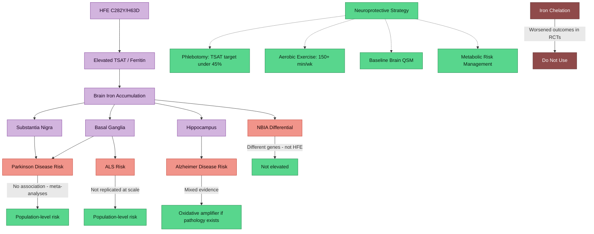

---
{"dg-publish":true,"permalink":"/research/hfe-and-long-term-neurodegeneration-risk/","tags":["HFE","neurodegeneration","brain-iron","Parkinson","Alzheimer","ALS","NBIA","QSM","neuroprotection","compound-heterozygote","evidence-review"],"dg-note-properties":{"type":"research","status":"active","date":"2026-03-27","tags":["HFE","neurodegeneration","brain-iron","Parkinson","Alzheimer","ALS","NBIA","QSM","neuroprotection","compound-heterozygote","evidence-review"],"summary":"Systematic evidence review of HFE compound heterozygosity (C282Y/H63D) and long-term neurodegeneration risk across PD, AD, ALS, and NBIA","permalink":"obsidian/research/hfe-and-long-term-neurodegeneration-risk"}}
---

# HFE Compound Heterozygosity and Long-Term Neurodegeneration Risk

> **Patient context**: 37-year-old male, AuDHD, [[genetics/HFE Compound Heterozygosity\|C282Y/H63D compound heterozygote]], TSAT 60%, ferritin 380 ng/mL, existing basal ganglia iron concerns.

This note consolidates evidence from PubMed and OpenAlex on whether HFE variants — specifically the C282Y/H63D compound heterozygous genotype — confer meaningful risk for neurodegenerative disease via brain iron accumulation, and what monitoring and prevention strategies exist.

## Evidence Rating Scale

| Grade | Meaning |
|-------|---------|
| **A** | Meta-analysis or large RCT with consistent results |
| **B** | Well-designed cohort/case-control study or small RCT |
| **C** | Case series, pilot study, narrative review, or conflicting evidence |
| **D** | Case report, expert opinion, or preclinical data only |

---

> [!info]- Colour Key
> 🟡 HFE | 🔴 Risk | 🔵 Evidence | 🟢 Protective

## 1. HFE Variants and Parkinson's Disease Risk

### Key Finding Summary

Two meta-analyses find **no significant association** between HFE C282Y or H63D carrier status and overall PD risk. One meta-analysis (Xia 2015) identified a possible **protective effect** of C282Y homozygosity (OR 0.22), though this subgroup is very small and not directly relevant to compound heterozygotes.

### Citations

**Duan C, Wang M, Zhang Y, et al.** C282Y and H63D Polymorphisms in Hemochromatosis Gene and Risk of Parkinson's Disease: A Meta-Analysis. *Am J Alzheimers Dis Other Demen*. 2016;31(3):201-207. **PMID: [26340960](https://pubmed.ncbi.nlm.nih.gov/26340960/)**
- 8 articles, 9 independent studies pooled. No significant association for either C282Y (dominant OR 0.87, 95% CI 0.70-1.09) or H63D (dominant OR 1.04, 95% CI 0.87-1.24) with PD risk in any genetic model.
- **Evidence: A**

**Xia J, Xu H, Jiang H, Xie J.** The association between the C282Y and H63D polymorphisms of HFE gene and the risk of Parkinson's disease: A meta-analysis. *Neurosci Lett*. 2015;595:99-103. **PMID: [25863172](https://pubmed.ncbi.nlm.nih.gov/25863172/)**
- 15 studies (1631 cases, 4548 controls for C282Y; 1192 cases, 4065 controls for H63D). C282Y homozygosity showed protective association (OR 0.22, p=0.002), but no association for H63D in any model.
- **Evidence: A**

**Biasiotto G, Goldwurm S, Finazzi D, et al.** HFE gene mutations in a population of Italian Parkinson's disease patients. *Parkinsonism Relat Disord*. 2008. **PMID: [18325820](https://pubmed.ncbi.nlm.nih.gov/18325820/)**
- Italian cohort study finding no increased frequency of HFE mutations in PD patients versus controls.
- **Evidence: B**

### Interpretation for Your Genotype

Current meta-analytic evidence does **not** support a direct genetic risk link between C282Y/H63D compound heterozygosity and Parkinson's disease. However, this does not address whether chronically elevated systemic iron (TSAT 60%, ferritin 380) independently accelerates nigral iron deposition in someone who already has a genetic predisposition to iron dysregulation. That remains an open question — see Section 4 on QSM monitoring.

---

## 2. HFE Variants and ALS/Motor Neuron Disease

### Key Finding Summary

The evidence is **conflicting**. The largest study to date (van Rheenen 2013, n=3962 ALS / 5072 controls from 7 European countries) found **no association** between H63D and ALS susceptibility. Earlier smaller studies suggested H63D homozygosity might increase ALS risk (OR ~2.2-2.7), but this was not replicated at scale. H63D may modify disease course rather than cause disease.

### Citations

**van Rheenen W, Diekstra FP, van Doormaal PT, et al.** H63D polymorphism in HFE is not associated with amyotrophic lateral sclerosis. *Neurobiol Aging*. 2013;34(5):1517.e5-7. **PMID: [23063643](https://pubmed.ncbi.nlm.nih.gov/23063643/)**
- Largest study: 3962 ALS patients, 5072 controls, 7 European countries. After meta-analysis of prior and current data, concluded H63D is NOT associated with ALS susceptibility, age at onset, or survival.
- **Evidence: A**

**Sutedja NA, Sinke RJ, Van Vught PW, et al.** The association between H63D mutations in HFE and amyotrophic lateral sclerosis in a Dutch population. *Arch Neurol*. 2007;64(1):63-67. **PMID: [17210810](https://pubmed.ncbi.nlm.nih.gov/17210810/)**
- Dutch study: 289 ALS patients, 5886 controls. H63D homozygosity associated with increased ALS risk (OR 2.2, 95% CI 1.1-4.1). Pooled analysis of prior studies found OR 2.7 for homozygotes, 1.5 for heterozygotes. H63D heterozygosity associated with higher age at onset.
- **Evidence: B** (superseded by larger negative study)

**Su XW, Lee SY, Mitchell RM, et al.** H63D HFE polymorphisms are associated with increased disease duration and decreased muscle superoxide dismutase-1 expression in amyotrophic lateral sclerosis patients. *Muscle Nerve*. 2013;48(2):242-246. **PMID: [23813494](https://pubmed.ncbi.nlm.nih.gov/23813494/)**
- H63D carriers with ALS showed 28 months longer disease duration and 39% lower muscle SOD1 expression. Suggests H63D may modify ALS phenotype rather than cause it.
- **Evidence: C**

**Yen AA, Simpson EP, Henkel JS, et al.** HFE mutations are not strongly associated with sporadic ALS. *Neurology*. 2004;62(9):1611-1612. **PMID: [15136693](https://pubmed.ncbi.nlm.nih.gov/15136693/)**
- Small study (51 ALS, 47 controls): Nearly identical prevalence of C282Y and H63D between groups.
- **Evidence: C**

**Eum KD, Seals RM, Taylor KM, et al.** Modification of the association between lead exposure and amyotrophic lateral sclerosis by iron and oxidative stress related gene polymorphisms. *Amyotroph Lateral Scler Frontotemporal Degener*. 2015;16(1-2):72-79. **PMID: [25293352](https://pubmed.ncbi.nlm.nih.gov/25293352/)**
- Found that HFE genotypes modify the lead-ALS association differently: C282Y variant carriers showed higher risk with lead exposure, while H63D carriers showed lower risk. Suggests complex gene-environment interactions.
- **Evidence: B**

### Interpretation for Your Genotype

As a C282Y/H63D compound heterozygote, the aggregate evidence does **not** support a clinically meaningful increase in ALS risk from HFE variants alone. The compound het genotype has not been specifically studied in ALS cohorts. The H63D effect seen in early studies was driven by homozygosity and was not replicated in the definitive large study.

---

## 3. HFE Variants and Alzheimer's Disease

### Key Finding Summary

A large meta-analysis (Lin 2012, 22 studies) found **no association** for C282Y with AD, and a **marginal protective effect** for the H63D variant (OR 0.90, p=0.037). A separate study found HFE C282Y may reduce the APOE4-associated AD risk. The relationship is complex — homozygous/compound heterozygous HFE mutations were associated with higher oxidative stress markers (F2-isoprostanes) and higher Braak staging in one autopsy study.

### Citations

**Lin M, Zhao L, Fan J, et al.** Association between HFE polymorphisms and susceptibility to Alzheimer's disease: a meta-analysis of 22 studies including 4,365 cases and 8,652 controls. *Mol Biol Rep*. 2012;39(3):3089-3095. **PMID: [21701828](https://pubmed.ncbi.nlm.nih.gov/21701828/)**
- Largest meta-analysis: 22 studies, 4365 AD cases, 8652 controls. C282Y showed no association. H63D showed a marginally significant protective association (allele contrast OR 0.90, 95% CI 0.82-0.99, p=0.037).
- **Evidence: A**

**Tisato V, Zuliani G, Vigliano M, et al.** Gene-gene interactions among coding genes of iron-homeostasis proteins and APOE-alleles in cognitive impairment diseases. *PLoS One*. 2018;13(3):e0193867. **PMID: [29518107](https://pubmed.ncbi.nlm.nih.gov/29518107/)**
- 765 patients (AD, VaD, MCI) vs 1086 controls. HFE C282Y yielded a 3-fold risk REDUCTION in all patients, reaching 5-fold in MCI. Critically, C282Y allele completely extinguished APOE4-associated risk. However, iron SNP burden accrued the APOE4 detrimental effect on MMSE scores.
- **Evidence: B**

**Pulliam JF, Jennings CD, Kryscio RJ, et al.** Association of HFE mutations with neurodegeneration and oxidative stress in Alzheimer's disease and correlation with APOE. *Am J Med Genet B Neuropsychiatr Genet*. 2003;119B(1):48-53. **PMID: [12707938](https://pubmed.ncbi.nlm.nih.gov/12707938/)**
- Autopsy-confirmed cohort: 9.4% of AD/MCI subjects had homozygous or compound heterozygous HFE mutations versus 0% in low-pathology controls (p=0.019). F2-isoprostane levels (lipid peroxidation marker) were increased in AD subjects with any HFE mutation versus wild-type (p=0.027).
- **Evidence: B**

**Berlin D, Chong G, Chertkow H, et al.** Evaluation of HFE (hemochromatosis) mutations as genetic modifiers in sporadic AD and MCI. *Neurobiol Aging*. 2004;25(4):465-474. **PMID: [15013567](https://pubmed.ncbi.nlm.nih.gov/15013567/)**
- 213 AD, 106 MCI, 63 controls. No significant impact of H63D or C282Y heterozygosity on AD age of onset or neuropsychological deficits. However, H63D homozygotes showed trends toward accelerated MCI-to-AD conversion and earlier onset in the 55-75 age subgroup.
- **Evidence: B**

### Interpretation for Your Genotype

The population-level data does not clearly implicate your compound het genotype as an AD risk factor — indeed, C282Y carrier status may be mildly protective. However, the Pulliam autopsy study is concerning: compound heterozygotes with AD had elevated oxidative stress markers. This suggests that while HFE variants may not initiate AD, they may **worsen oxidative damage in the context of existing pathology**. This is relevant given your elevated TSAT/ferritin, which could amplify oxidative injury.

---

## 4. Brain Iron MRI: QSM and SWI

### Key Finding Summary

Quantitative susceptibility mapping (QSM) is now the gold-standard MRI technique for non-invasive brain iron quantification. It measures local tissue magnetic susceptibility, which correlates strongly with non-heme iron in deep grey matter nuclei (basal ganglia, substantia nigra). QSM can detect iron changes associated with neurodegeneration and is available at academic medical centres with 3T MRI. SWI (susceptibility-weighted imaging) is more widely available but less quantitative.

### Citations

**Eskreis-Winkler S, Zhang Y, Zhang J, et al.** The clinical utility of QSM: disease diagnosis, medical management, and surgical planning. *NMR Biomed*. 2017;30(4). **PMID: [27906525](https://pubmed.ncbi.nlm.nih.gov/27906525/)**
- Comprehensive review of QSM clinical applications. QSM can identify elevated iron in motor cortex (ALS), substantia nigra (PD), striatum (HD), basal ganglia (Wilson's). Also useful for monitoring iron chelation therapy and distinguishing haemorrhage from calcification.
- **Evidence: C** (narrative review)

**Cogswell PM, Wiste HJ, Senjem ML, et al.** Associations of quantitative susceptibility mapping with Alzheimer's disease clinical and imaging markers. *Neuroimage*. 2021;224:117433. **PMID: [33035667](https://pubmed.ncbi.nlm.nih.gov/33035667/)**
- 421 participants (Mayo Clinic). QSM susceptibility increased with age and cognitive impairment in pallidum, putamen, substantia nigra, and subthalamic nucleus. Higher susceptibility correlated with amyloid PET SUVR and tau PET in basal ganglia.
- **Evidence: B**

**Suresh Paul J, T AR, Raghavan S, et al.** Comparative analysis of quantitative susceptibility mapping in preclinical dementia detection. *Eur J Radiol*. 2024;178:111598. **PMID: [38996737](https://pubmed.ncbi.nlm.nih.gov/38996737/)**
- Review confirming QSM effectiveness in detecting early pathological iron changes in hippocampus, basal ganglia, and substantia nigra. Identifies standardisation of processing algorithms as a remaining challenge.
- **Evidence: C** (review)

**Luyken AK, Lappe C, Viard R, et al.** High correlation of quantitative susceptibility mapping and echo intensity measurements of nigral iron overload in Parkinson's disease. *J Neural Transm (Vienna)*. 2025;132(3):407-417. **PMID: [39485510](https://pubmed.ncbi.nlm.nih.gov/39485510/)**
- Substantia nigra susceptibility on QSM correlated strongly with serum transferrin saturation (r=0.78, p<0.001). This is directly relevant — your TSAT of 60% may predict elevated nigral iron.
- **Evidence: B**

### Clinical Relevance for You

Given your elevated TSAT (60%) and the correlation between serum TSAT and nigral iron on QSM, obtaining a **baseline brain iron QSM** is a reasonable clinical step. This would:
1. Quantify iron in basal ganglia, substantia nigra, and hippocampus
2. Establish a baseline for longitudinal monitoring
3. Identify whether your systemic iron status has translated into brain iron accumulation

QSM requires a **3T MRI scanner** with gradient-echo sequences and post-processing capability. In the UK, this is available at academic centres and some NHS radiology departments. Ask for "quantitative susceptibility mapping protocol" or "multi-echo GRE for iron quantification."

---

## 5. Neuroprotective Strategies Against Iron-Driven Neurodegeneration

### Key Finding Summary

**Iron chelation with deferiprone has failed in both PD and AD** — removing brain iron paradoxically worsened outcomes. This critical finding reframes the iron-neurodegeneration relationship: iron accumulation in disease may be partly compensatory or essential for surviving neurons. **Phlebotomy** reduces systemic iron but its brain neuroprotective effect is unstudied. **Exercise** shows the most consistent evidence for modifying ferroptosis and iron-related neurodegeneration.

### Citations — Iron Chelation

**Devos D, Labreuche J, Rascol O, et al.** Trial of Deferiprone in Parkinson's Disease. *N Engl J Med*. 2022;387(22):2045-2055. **PMID: [36449420](https://pubmed.ncbi.nlm.nih.gov/36449420/)**
- FAIRPARK-II: Phase 2 RCT, 372 participants with early PD (never on levodopa). Deferiprone reduced nigral iron BUT **worsened** MDS-UPDRS total score by 9.3 points versus placebo (p<0.001). 22% of deferiprone group needed rescue dopaminergic therapy vs 2.7% placebo. **Major negative result.**
- **Evidence: A**

**Ayton S, Barton D, Brew B, et al.** Deferiprone in Alzheimer Disease: A Randomized Clinical Trial. *JAMA Neurol*. 2025;82(1):11-18. **PMID: [39495531](https://pubmed.ncbi.nlm.nih.gov/39495531/)**
- Phase 2 RCT, 81 participants with early AD. Deferiprone decreased hippocampal iron on QSM but **accelerated cognitive decline** (NTB composite z-score change: -0.80 vs -0.30 placebo). Increased frontal volume loss. Higher neutropenia rate (7.5%).
- **Evidence: A**

**Martin-Bastida A, Ward RJ, Newbould R, et al.** Brain iron chelation by deferiprone in a phase 2 randomised double-blinded placebo controlled clinical trial in Parkinson's disease. *Sci Rep*. 2017;7(1):1398. **PMID: [28469157](https://pubmed.ncbi.nlm.nih.gov/28469157/)**
- Small early trial (22 PD patients). Deferiprone reduced iron in dentate and caudate nucleus. Trend toward improvement in motor scores at 30 mg/kg dose but not significant. Laid groundwork for FAIRPARK-II which ultimately showed harm.
- **Evidence: B**

See also: [[research/Iron Chelation Therapy - Deferiprone\|Iron Chelation Therapy - Deferiprone]]

### Citations — Conservative Chelation in ALS

**Moreau C, Danel V, Devedjian JC, et al.** Could Conservative Iron Chelation Lead to Neuroprotection in Amyotrophic Lateral Sclerosis? *Antioxid Redox Signal*. 2018;29(8):742-748. **PMID: [29287521](https://pubmed.ncbi.nlm.nih.gov/29287521/)**
- Pilot study: 23 ALS patients, 12 months of low-dose deferiprone (30 mg/kg/day). Reduced spinal cord/medulla/motor cortex iron on MRI. Lower CSF oxidative stress markers and neurofilament light chains. Functional decline was slower during treatment versus treatment-free periods. Safety profile acceptable (no anaemia).
- **Evidence: C** (pilot, unblinded comparison periods)

### Citations — Exercise

**Tang S, Zhang J, Chen J, et al.** Ferroptosis in neurodegenerative diseases: potential mechanisms of exercise intervention. *Front Cell Dev Biol*. 2025;13:1622544. **PMID: [40661149](https://pubmed.ncbi.nlm.nih.gov/40661149/)**
- Review of exercise effects on ferroptosis. Exercise suppresses ferroptosis by regulating iron metabolism, reducing oxidative stress, and increasing protective exerkines (BDNF, irisin). Provides scientific rationale for exercise-based neuroprotection.
- **Evidence: C** (narrative review, but mechanistically compelling)

**Ong WY, Leow DM, Herr DR, Yeo CJ.** What Do Randomized Controlled Trials Inform Us About Potential Disease-Modifying Strategies for Parkinson's Disease? *Neuromolecular Med*. 2023;25(1):1-13. **PMID: [35776238](https://pubmed.ncbi.nlm.nih.gov/35776238/)**
- Review of RCTs for PD disease modification. Iron chelation, exercise, and therapies reducing excitotoxicity/oxidative stress show the most promise. Physical exercise activates brain reward pathways and may slow progression through multiple mechanisms.
- **Evidence: C** (review of RCTs)

### Practical Implications

| Strategy | Evidence for Brain Iron | Practical Recommendation |
|----------|----------------------|--------------------------|
| **Deferiprone** | Reduces brain iron but worsens outcomes in PD and AD | **Do not use** for neuroprotection outside trials |
| **Phlebotomy** | Reduces systemic iron/TSAT/ferritin; no direct brain iron data | **Maintain** to normalise TSAT <45% and ferritin <100 |
| **Exercise** | Mechanistically suppresses ferroptosis; RCT evidence for PD benefit | **Regular aerobic exercise** (150+ min/week) |
| **Antioxidants** | Indirect support; no specific RCTs for HFE-related neuroprotection | Consider as adjunct (see [[research/Ferroptosis and Neuronal Iron\|Ferroptosis and Neuronal Iron]]) |

---

## 6. Age of Onset Considerations

### Key Finding Summary

Brain iron accumulation is a **normal feature of aging** that accelerates after midlife (age 40-50+), with the basal ganglia and substantia nigra showing the strongest age-related increases. Elevated baseline iron predicts subsequent striatal shrinkage and working memory decline even in healthy adults. For someone at age 37 with an HFE compound het genotype and elevated TSAT, the window for intervention is **now to the next decade**, before age-related iron accumulation compounds the existing iron dysregulation.

### Citations

**Daugherty A, Raz N.** Age-related differences in iron content of subcortical nuclei observed in vivo: a meta-analysis. *Neuroimage*. 2013;70:113-121. **PMID: [23277110](https://pubmed.ncbi.nlm.nih.gov/23277110/)**
- Meta-analysis of 20 MRI studies. Robust association between advanced age and high iron in substantia nigra and striatum. Effect smaller in globus pallidus. Iron accumulation in these regions is a consistent feature of normal aging that begins in midlife.
- **Evidence: A**

**Daugherty AM, Haacke EM, Raz N.** Striatal iron content predicts its shrinkage and changes in verbal working memory after two years in healthy adults. *J Neurosci*. 2015;35(17):6731-6743. **PMID: [25926451](https://pubmed.ncbi.nlm.nih.gov/25926451/)**
- Longitudinal study (age 19-77, 2-year follow-up). Iron content increased in the striatum over time and predicted subsequent volume shrinkage. Higher caudate iron at baseline predicted lesser improvement in working memory. Age and metabolic syndrome risk were associated with higher baseline putamen iron.
- **Evidence: B**

**Casanova F, Tian Q, Williamson DS, et al.** Predictors of MRI-estimated brain iron deposition in dementia and Parkinson's disease-associated subcortical regions: Genetic and observational analysis in UK Biobank. *J Alzheimers Dis*. 2025;108(1):107-118. **PMID: [40953027](https://pubmed.ncbi.nlm.nih.gov/40953027/)**
- UK Biobank study (n=41,581). Higher BMI, blood pressure, smoking, and meat consumption increased subcortical brain iron. Mendelian randomisation supports causal effects of type-2 diabetes and depression on brain iron but NOT Alzheimer's disease on brain iron (supporting iron as cause, not consequence). Adiposity interventions may reduce brain iron.
- **Evidence: B**

### Your Window

At 37, you are entering the age range where normal iron accumulation accelerates. Your compound het genotype and elevated TSAT (60%) mean you likely have a **higher baseline** of brain iron than age-matched peers. The next 10-15 years represent a critical window where:
1. Baseline brain iron MRI (QSM) establishes your current state
2. Aggressive TSAT/ferritin management via phlebotomy reduces ongoing iron delivery
3. Metabolic risk factor management (BMI, BP, insulin sensitivity) reduces iron accumulation
4. Regular aerobic exercise provides ferroptosis suppression

---

## 7. NBIA — Relevance to HFE

### Key Finding Summary

NBIA (neurodegeneration with brain iron accumulation) is a group of **rare genetic disorders** caused by mutations in PANK2, PLA2G6, C19orf12, and other genes — **NOT in HFE**. NBIA is genetically and mechanistically distinct from HFE-related hemochromatosis. Only two NBIA subtypes involve genes directly in iron metabolism (aceruloplasminemia, neuroferritinopathy). HFE hemochromatosis does not typically cause the NBIA phenotype, though brain MRI hypointensities on T2*/GRE sequences can overlap and require differential diagnosis.

### Citations

**Schneider SA, Hardy J, Bhatia KP.** Syndromes of neurodegeneration with brain iron accumulation (NBIA): an update on clinical presentations, histological and genetic underpinnings, and treatment considerations. *Mov Disord*. 2012;27(1):42-53. **PMID: [22031173](https://pubmed.ncbi.nlm.nih.gov/22031173/)**
- Comprehensive NBIA review. PKAN (NBIA1) and PLAN (NBIA2) are the core syndromes. Autopsy studies show Lewy bodies and tangles in some NBIA forms, bridging to common neurodegenerative diseases. HFE not implicated in NBIA pathogenesis.
- **Evidence: C** (review)

**Di Meo I, Tiranti V.** Classification and molecular pathogenesis of NBIA syndromes. *Eur J Paediatr Neurol*. 2018;22(2):272-284. **PMID: [29409688](https://pubmed.ncbi.nlm.nih.gov/29409688/)**
- Only 2 of the known NBIA genes encode proteins playing a direct role in iron metabolism (ceruloplasmin, ferritin light chain). Other NBIA genes involve lipid metabolism, lysosomal activity, or mitochondrial function. Iron accumulation in most NBIA forms is a downstream consequence, not a primary mechanism.
- **Evidence: C** (review)

**Dusek P, Schneider SA.** Neurodegeneration with brain iron accumulation. *Curr Opin Neurol*. 2012;25(4):499-506. **PMID: [22691760](https://pubmed.ncbi.nlm.nih.gov/22691760/)**
- NBIA classification update. Chelation therapy (deferiprone) showed no clinical improvement in a PKAN pilot study but had benefit in individual patients with idiopathic NBIA. Deep brain stimulation is useful for NBIA-associated dystonia.
- **Evidence: C** (review)

**Dusek P, Jankovic J, Le W.** Iron dysregulation in movement disorders. *Neurobiol Dis*. 2012;46(1):1-18. **PMID: [22266337](https://pubmed.ncbi.nlm.nih.gov/22266337/)**
- Comprehensive review: PD, HD, MSA, PSP, and NBIA all exhibit increased brain iron. Iron accumulation linked to myelin derangements and impaired lysosomal recycling. Proposed new NBIA classification. HFE not a primary cause of movement-disorder-associated brain iron.
- **Evidence: C** (review)

**Scarlini S, Cavallieri F, Fiorini M, et al.** Idiopathic brain calcification in a patient with hereditary hemochromatosis. *BMC Neurol*. 2020;20(1):113. **PMID: [32228506](https://pubmed.ncbi.nlm.nih.gov/32228506/)**
- Case report: C282Y homozygous HH patient with bilateral T2* hypointensities in globus pallidus, substantia nigra, and dentate nucleus — which turned out to be **calcification**, not iron, on CT. Highlights that brain MRI hypointensities in HH may not represent iron deposition and require CT for differentiation.
- **Evidence: D** (case report, but clinically important caveat)

### Relevance to Your Genotype

Your compound het genotype does **not** place you in the NBIA spectrum. NBIA is genetically distinct (autosomal recessive mutations in PANK2, PLA2G6, etc.). However, the imaging overlap is important: if brain MRI shows basal ganglia signal abnormalities, both iron deposition and calcification must be considered. The [[genetics/HFE Compound Heterozygosity\|HFE Compound Heterozygosity]] genotype could theoretically contribute to accelerated subcortical iron accumulation via the mechanism described by [[genetics/HFE Compound Het - Disease Associations Beyond Iron\|Nandar and Connor (2011)]]:

**Nandar W, Connor JR.** HFE gene variants affect iron in the brain. *J Nutr*. 2011;141(4):729S-739S. **PMID: [21346098](https://pubmed.ncbi.nlm.nih.gov/21346098/)**
- Key review: HFE variants — especially H63D — are associated with iron dyshomeostasis, increased oxidative stress, glutamate release, tau phosphorylation, and altered inflammatory response at the cellular level. Data "begin to dispel the long-held view that the brain is protected from iron accumulation associated with HFE mutations."
- **Evidence: C** (review with in vitro data)

---

## Synthesis and Action Items

### Risk Summary

| Disease | HFE Variant Association | Your Risk Level | Confidence |
|---------|------------------------|-----------------|------------|
| **Parkinson's** | No association (meta-analyses) | Population-level | High |
| **ALS** | No association (largest study); conflicting small studies | Population-level | Moderate-high |
| **Alzheimer's** | Marginal protective effect for H63D; compound hets had higher oxidative stress in autopsy study | Slightly above population-level for oxidative damage | Moderate |
| **NBIA** | Not relevant — different genetic pathway | Not elevated | High |

### What Your Labs Mean for Brain Iron

- **TSAT 60%**: Strongly correlated with nigral iron on QSM (r=0.78; Luyken 2025). This is your most actionable biomarker.
- **Ferritin 380**: Above optimal but does not directly predict brain iron. Aim for <100 via phlebotomy.
- **Compound het genotype**: Creates an "enabling milieu" (Nandar 2011) for iron-driven oxidative stress but does not determine disease.

### Recommended Actions

1. **Baseline brain iron QSM** — Establish current basal ganglia and nigral iron levels while asymptomatic. Repeat every 3-5 years.
2. **Phlebotomy optimisation** — Target TSAT <45%, ferritin <100. The TSAT-to-nigral-iron correlation makes TSAT reduction the single most modifiable risk factor.
3. **Regular aerobic exercise** — 150+ min/week. Mechanistically suppresses ferroptosis, enhances BDNF, and may directly reduce brain iron vulnerability.
4. **Metabolic risk management** — BMI, blood pressure, insulin sensitivity all causally linked to brain iron (Casanova 2025 UK Biobank MR study).
5. **Do NOT pursue iron chelation therapy** — Deferiprone worsened outcomes in both PD and AD RCTs despite reducing brain iron.
6. **Monitor neurological baselines** — Establish cognitive and motor baselines now (neuropsych testing, motor exam) for future comparison.

---

## Related Notes

- [[genetics/HFE Compound Heterozygosity\|HFE Compound Heterozygosity]]
- [[genetics/HFE Compound Het - Disease Associations Beyond Iron\|HFE Compound Het - Disease Associations Beyond Iron]]
- [[research/Iron Chelation Therapy - Deferiprone\|Iron Chelation Therapy - Deferiprone]]
- [[research/Ferroptosis and Neuronal Iron\|Ferroptosis and Neuronal Iron]]
- [[iron-metabolism/Iron Overload and NTBI\|Iron Overload and NTBI]]
- [[iron-metabolism/Transferrin Saturation - Clinical Significance\|Transferrin Saturation - Clinical Significance]]
- [[research/Copper-Iron-Dopamine Triangle\|Copper-Iron-Dopamine Triangle]]