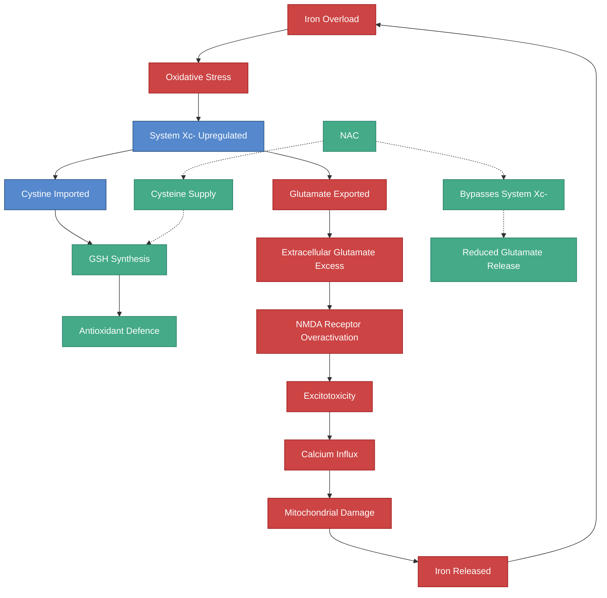

---
{"dg-publish":true,"permalink":"/research/iron-glutamate-and-excitotoxicity/","tags":["iron","glutamate","excitotoxicity","system-Xc","NAC","trichotillomania","ferroptosis","HFE"],"dg-note-properties":{"type":"research","status":"active","date":"2026-03-21","tags":["iron","glutamate","excitotoxicity","system-Xc","NAC","trichotillomania","ferroptosis","HFE"],"summary":"Iron drives glutamate release via System Xc- upregulation, contributing to excitotoxicity — with direct relevance to trichotillomania and OCD-spectrum conditions","permalink":"research/iron-glutamate-and-excitotoxicity"}}
---


# Iron, Glutamate, and Excitotoxicity

## The Iron-Glutamate Connection

Iron does not merely coexist with glutamate signalling — it directly drives **extracellular glutamate accumulation** through the System Xc- cystine/glutamate antiporter. This is one of the most mechanistically important and underappreciated connections in iron neurotoxicity.

> [!info]- Colour Key
> 🔴 Pathological | 🟢 Protective | 🔵 Neutral



## The System Xc- Mechanism

The **cystine/glutamate antiporter (System Xc-)** imports one molecule of cystine while exporting one molecule of glutamate. It is encoded by the gene **SLC7A11 (xCT)**.

```
Extracellular cystine ---[System Xc-]--> Intracellular cystine -> Cysteine -> GSH
Intracellular glutamate ---[System Xc-]--> Extracellular glutamate
```

### Iron Overload Upregulates System Xc-

> **Connor JR et al.** "A mutation in the HFE gene is associated with altered brain iron profiles and increased oxidative stress in mice." *Neurobiol Aging*. 2013. PMID: 23429074
> - H67D mice (human H63D equivalent) showed increased expression of **xCT (System Xc-)**
> - This is a direct consequence of iron-mediated oxidative stress — cells upregulate System Xc- to import more cystine for glutathione synthesis
> - **Unintended consequence**: more glutamate is exported extracellularly

> **Mitchell JJ et al.** "HFE polymorphisms affect cellular glutamate regulation." *Neurobiol Dis*. 2009;36(3):484-489. PMID: 19560233
> - H63D HFE expression is associated with **increased calcium-induced glutamate secretion** and **decreased cellular glutamate uptake**
> - The polymorphism-associated changes in glutamate secretion were **mimicked by altering cellular iron** — confirming iron as the mediator
> - Direct evidence that HFE variants alter brain glutamate homeostasis via iron

### The Vicious Cycle

1. Iron overload causes oxidative stress
2. Cells upregulate System Xc- to import cystine for antioxidant defence
3. System Xc- exports glutamate as a mandatory exchange
4. Extracellular glutamate rises
5. Excess glutamate causes excitotoxicity via NMDA receptor overactivation
6. Excitotoxicity increases calcium influx
7. Calcium overload damages mitochondria, releasing more iron
8. More iron drives more oxidative stress -> cycle continues

## HFE H63D and Glutamate — The Critical Link

> **Lee SY, Connor JR.** "Mutant HFE H63D protein is associated with prolonged endoplasmic reticulum stress and increased neuronal vulnerability." *J Biol Chem*. 2011;286(25):21915-21926. PMC3093866
> - H63D HFE protein triggers sustained ER stress in neurons
> - Activates the unfolded protein response (UPR) followed by caspase-3 activation
> - Neurons expressing H63D HFE are **chronically more vulnerable** to excitotoxic stress

> **Liu Y et al.** "H63D HFE genotype accelerates disease progression in animal models of amyotrophic lateral sclerosis." *Ann Neurol*. 2014. PMID: 25283820
> - H63D variant accelerates ALS progression in mice
> - Mechanism involves iron-mediated excitotoxicity
> - Though ALS is not a neurodevelopmental condition, the glutamate toxicity mechanism is shared

## Glutamate Hypothesis of Trichotillomania

> **Grant JE, Odlaug BL, Kim SW.** "N-acetylcysteine, a glutamate modulator, in the treatment of trichotillomania: a double-blind, placebo-controlled study." *Arch Gen Psychiatry*. 2009;66(7):756-763. PMID: 19581567
> - NAC restored extracellular glutamate concentration in the nucleus accumbens
> - Reduced compulsive hair-pulling behaviour
> - NAC works by two complementary mechanisms:
>   1. As a cysteine donor, it supports glutathione synthesis without needing System Xc-
>   2. As a glutamate modulator, it normalises extrasynaptic glutamate signalling

> **Rodrigues-Amorim D et al.** "The potential of N-acetylcysteine for treatment of trichotillomania, excoriation disorder, onychophagia, and onychotillomania: an updated literature review." *Clin Psychopharmacol Neurosci*. 2022;20(2):197-208. PMC9180086
> - Updated review confirming NAC's efficacy across OCD-spectrum conditions
> - Glutamate modulation is the proposed primary mechanism

### The Iron-Trichotillomania Link

Connecting the evidence:
1. **HFE variants increase brain iron** -> upregulated System Xc- -> elevated extracellular glutamate
2. **Elevated glutamate in the nucleus accumbens and basal ganglia** -> disrupted habit/reward circuits
3. **Glutathione depletion** (from oxidative stress consuming GSH) -> further System Xc- upregulation -> more glutamate release
4. **NAC breaks this cycle** by providing cysteine independently of System Xc-, reducing the drive to export glutamate

For a patient with HFE variants + trichotillomania, this mechanism suggests that iron overload could be directly driving the compulsive behaviour through glutamate dysregulation.

## Glutamate-Cysteine Ligase and Iron

**Glutamate-cysteine ligase (GCL)** is the rate-limiting enzyme in glutathione synthesis. While GCL itself is not iron-dependent, its activity is critically affected by iron status:
- Iron overload depletes GSH, which removes feedback inhibition on GCL
- Iron overload increases demand on GCL to produce more GSH
- If GCL cannot keep up with demand, the cell relies increasingly on System Xc- for cystine import -> more glutamate export

## Excitotoxicity in Neurodevelopmental Conditions

> **Essa MM et al.** "Glutamate-mediated excitotoxicity in the pathogenesis and treatment of neurodevelopmental and adult mental disorders." *Curr Med Chem*. 2024. PMC11203689
> - Excitotoxicity mechanisms are implicated in ADHD, ASD, OCD, and anxiety disorders
> - Disruption of glutamate homeostasis leads to excessive calcium influx, mitochondrial dysfunction, oxidative stress, and cell death

## Clinical Implications

1. **NAC supplementation** has strong mechanistic rationale for anyone with HFE variants + OCD-spectrum behaviours
2. **Iron reduction** (phlebotomy) should reduce the iron-driven System Xc- upregulation, potentially lowering extracellular glutamate
3. **MR spectroscopy** can measure brain glutamate levels — could be used to monitor the effect of iron reduction
4. **Memantine** (NMDA receptor antagonist) might protect against iron-driven excitotoxicity — though this is speculative
5. **The combination of iron management + NAC** could have synergistic benefit by addressing both the cause (excess iron) and the consequence (glutamate/GSH dysregulation)

---

## Cross-References
- [[research/Iron and OCD-Spectrum Repetitive Behaviours\|Iron and OCD-Spectrum Repetitive Behaviours]]
- [[research/Ferroptosis and Neuronal Iron\|Ferroptosis and Neuronal Iron]]
- [[research/Iron and Oxidative Stress in Autism\|Iron and Oxidative Stress in Autism]]
- [[research/Iron and GABAergic Function\|Iron and GABAergic Function]]
- [[neurodevelopment/HFE Variants and Brain Iron\|HFE Variants and Brain Iron]]
- [[minerals/Copper-Zinc-Iron Interactions\|Copper-Zinc-Iron Interactions]]
- [[Health Research MOC\|Health Research MOC]]
