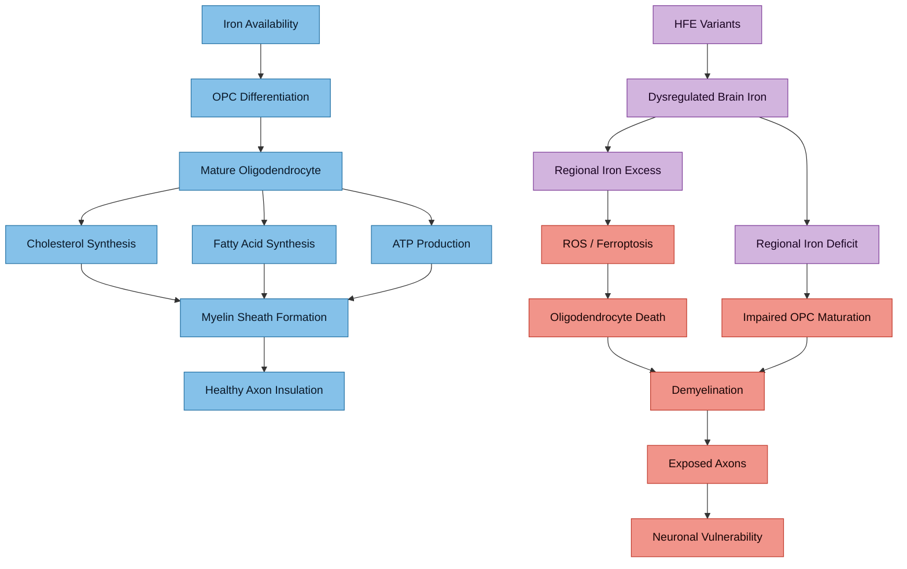

---
{"dg-publish":true,"permalink":"/research/iron-and-myelination/","tags":["iron","myelination","oligodendrocytes","white-matter","ADHD","autism","neurodevelopment"],"dg-note-properties":{"type":"research","status":"active","date":"2026-03-21","tags":["iron","myelination","oligodendrocytes","white-matter","ADHD","autism","neurodevelopment"],"summary":"Iron is essential for oligodendrocyte differentiation and myelination — white matter deficits in ADHD/autism may be iron-mediated","permalink":"research/iron-and-myelination"}}
---

# Iron and Myelination

## Why This Matters

Oligodendrocytes — the cells that produce myelin sheaths around axons — are the **most iron-rich cells in the brain**. Iron is not merely stored in them; it is a direct enzymatic requirement for myelin production. This creates a critical vulnerability: dysregulated iron (either deficiency or overload) can impair myelination during neurodevelopment.

> [!info]- Colour Key
> 🔵 Normal | 🔴 Damage | 🟡 HFE | 🟣 Outcome

## The Biochemical Dependency

Iron is required by oligodendrocytes for:

1. **Cholesterol synthesis** — myelin is 70-80% lipid, and cholesterol is its single largest component. The cholesterol biosynthesis pathway requires iron-dependent enzymes (cytochrome P450 enzymes, stearoyl-CoA desaturase)
2. **Fatty acid synthesis** — fatty acid desaturases are iron-dependent
3. **ATP production** — mitochondrial electron transport chain (complexes I, II, III) requires iron-sulphur clusters
4. **Oligodendrocyte precursor cell (OPC) differentiation** — the maturation programme from OPC to myelinating oligodendrocyte requires adequate iron

### Key Evidence

> **Cheli VT, Correale J, Paez PM, Pasquini JM.** "Iron metabolism in oligodendrocytes and astrocytes, implications for myelination and remyelination." *ASN Neuro*. 2020;12:1759091420962681. PMC7545512
> - Comprehensive review establishing that iron homeostasis negatively impacts OLG differentiation and impairs myelination when disrupted
> - Iron deficiency affected OLG development at early stages, reducing maturation capacity and increasing proliferation
> - DMT1 is crucial for proper oligodendrocyte maturation and required for efficient remyelination

> **Connor JR, Menzies SL.** "Oligodendrocytes and myelination: the role of iron." *Glia*. 2008. PMID: 18837051
> - Foundational paper establishing oligodendrocytes as the most iron-rich cells in the CNS
> - Described the developmental time window during which oligodendrocytes uptake iron via the transferrin cycle

> **Cheli VT et al.** "What does iron mean to an oligodendrocyte?" *Glia*. 2025;73(7). DOI: 10.1002/glia.70043
> - Most recent review of iron-oligodendrocyte biology
> - Iron is a cofactor for enzymes involved in proliferation, differentiation, and production of cholesterol and phospholipids essential for myelin

## White Matter Deficits in ADHD

White matter abnormalities are a consistent finding in ADHD neuroimaging, and there is a hypothesis that ADHD involves a primary myelination disorder.

> **Aoki Y et al.** "White matter alterations in ADHD: a systematic review of 129 diffusion imaging studies with meta-analysis." *Mol Psychiatry*. 2023. DOI: 10.1038/s41380-023-02173-1
> - 129 diffusion tensor imaging studies reviewed
> - Consistent white matter microstructural alterations across ADHD cohorts
> - Findings aligned with the hypothesis that dysregulated myelination contributes to brain developmental delay in ADHD

> **Lesch KP et al.** "Editorial: Can dysregulated myelination be linked to ADHD pathogenesis and persistence?" *J Child Psychol Psychiatry*. 2019;60(3):229-231. DOI: 10.1111/jcpp.13031
> - Proposed that ADHD involves a myelination disorder characterised by insufficient myelin production by oligodendrocytes
> - Several ADHD-associated genetic loci are enriched in genes implicated in myelination and oligodendrocyte function

## White Matter and Myelin Abnormalities in Autism

> **Graciarena M et al.** "Role of oligodendrocytes and myelin in the pathophysiology of autism spectrum disorder." *Brain Sci*. 2020;10(12):951. PMC7764453
> - Disruption in neuronal connectivity associated with altered white matter production and myelination in diverse brain regions
> - Abnormalities in oligodendrocyte generation and axonal myelination involved in ASD pathophysiology
> - Oligodendrocytes provide both electrical insulation and trophic factors for proper neurotransmission

## The Iron Overload Angle — Relevance to HFE Variants

While most research focuses on iron *deficiency* impairing myelination, iron *overload* is also harmful:

- **Excess iron generates reactive oxygen species** that damage oligodendrocyte precursors and mature oligodendrocytes
- **Iron-induced ferroptosis** (see [[research/Ferroptosis and Neuronal Iron\|Ferroptosis and Neuronal Iron]]) can kill oligodendrocytes
- **HFE variants alter brain iron distribution** — this could create regional iron dysregulation where some areas have too much iron while others have too little for proper myelination
- The [[neurodevelopment/HFE Variants and Brain Iron\|H63D variant]] specifically alters brain iron handling independently of peripheral iron

### The Paradox for HFE Carriers

In compound heterozygotes like C282Y/H63D carriers, the paradox is: **systemic iron overload with potentially dysregulated brain iron distribution**. This could mean:
- Some brain regions accumulate excess iron (oxidative damage, ferroptosis risk)
- Other regions may have functional iron insufficiency (impaired myelination)
- The net effect could be patchy or regional white matter deficits

## Clinical Relevance

1. White matter integrity is measurable via **diffusion tensor imaging (DTI)** — this could be a biomarker
2. The developmental timing matters: iron status during the **peak myelination window** (first 2 years of life, continuing through adolescence) is critical
3. Both iron deficiency AND iron overload can impair myelination — optimal iron status, not maximum iron, is the goal
4. [[neurodevelopment/Elvanse and Mineral Metabolism\|Stimulant treatment]] may indirectly affect myelination through brain iron utilisation changes

## Verified Academic Citations

> **Zhou X, Deng YY, Qian L et al.** "Alterations in brain iron and myelination in children with ASD: A susceptibility source separation imaging study." *NeuroImage*. 2025;304. PMID: 40057287
> - Used APART-QSM to separate iron and myelin contributions to magnetic susceptibility in children with ASD
> - Demonstrated both brain iron and myelin alterations co-occur in ASD, linked to clinical symptom severity
> - First study to apply susceptibility source separation to neurodevelopmental imaging

> **Hod EA, Habeck C, Zhuang H et al.** "Effects of iron repletion on brain iron content, myelination, neural network activation, and cognition." *JCI Insight*. 2025;10(23). PMID: 41118254
> - Randomised trial in 67 iron-deficient blood donors demonstrating that iron repletion increased both brain iron content and positive susceptibility (myelination proxy)
> - Directly establishes causal relationship: restoring iron status improves brain myelination markers in humans

> **Zhang N, Zhang S, Liu X et al.** "Oligodendrocyte-specific knockout of FPN1 affects CNS myelination defects and depression-like behavior in mice." *Free Radic Biol Med*. 2025;227. PMID: 40609802
> - Conditional knockout of ferroportin (FPN1) in oligodendrocytes caused iron trapping, myelination deficits, and depression-like behaviour
> - Demonstrates that oligodendrocyte iron *export* is critical — iron overload within oligodendrocytes is damaging, not just deficiency

> **Morandini HAE, Watson PA, Barbaro P et al.** "Brain iron concentration in childhood ADHD: A systematic review of neuroimaging studies." *J Psychiatr Res*. 2024;173:200-209. PMID: 38547742
> - Systematic review of neuroimaging studies measuring brain iron in children with ADHD
> - Found evidence of reduced brain iron in ADHD, particularly in basal ganglia regions involved in dopamine synthesis
> - Iron's role in both dopamine synthesis and myelination positions it as a convergent mechanism in ADHD

> **Chen Y, Su S, Dai Y et al.** "Quantitative susceptibility mapping reveals brain iron deficiency in children with ADHD: a whole-brain analysis." *Eur Radiol*. 2022;32(5):3726-3735. PMID: 35064804
> - Whole-brain QSM analysis showing significantly lower magnetic susceptibility (lower iron) in ADHD children vs controls
> - Affected regions included bilateral globus pallidus, putamen, and caudate — all iron-rich structures involved in motor and executive circuits

> **Shvarzman R, Crocetti D, Rosch KS et al.** "Reduced basal ganglia tissue-iron concentration in school-age children with ADHD is localized to limbic circuitry." *Exp Brain Res*. 2022;240(12):3153-3168. PMID: 36301336
> - Iron reduction in ADHD localised specifically to limbic subdivisions of the basal ganglia
> - Suggests iron deficits in ADHD preferentially affect emotional regulation circuits, not just motor circuits

---

## Cross-References
- [[neurodevelopment/Iron-Dopamine-ADHD Axis\|Iron-Dopamine-ADHD Axis]]
- [[neurodevelopment/HFE Variants and Brain Iron\|HFE Variants and Brain Iron]]
- [[research/Ferroptosis and Neuronal Iron\|Ferroptosis and Neuronal Iron]]
- [[research/Iron and Oxidative Stress in Autism\|Iron and Oxidative Stress in Autism]]
- [[Health Research MOC\|Health Research MOC]]
