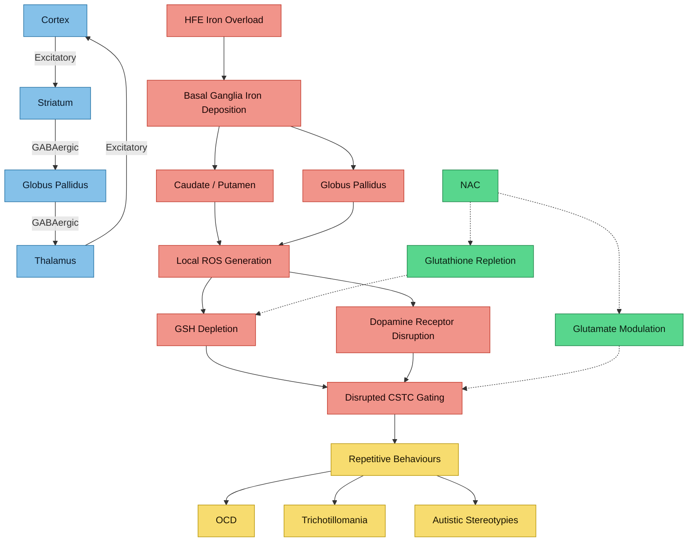

---
{"dg-publish":true,"permalink":"/research/iron-and-ocd-spectrum-repetitive-behaviours/","tags":["iron","OCD","trichotillomania","basal-ganglia","caudate","putamen","repetitive-behaviours","oxidative-stress","glutathione"],"dg-note-properties":{"type":"research","status":"active","date":"2026-03-21","tags":["iron","OCD","trichotillomania","basal-ganglia","caudate","putamen","repetitive-behaviours","oxidative-stress","glutathione"],"summary":"Basal ganglia iron deposition in OCD-spectrum conditions, oxidative stress in trichotillomania, and glutamate-iron connections","permalink":"research/iron-and-ocd-spectrum-repetitive-behaviours"}}
---


# Iron and OCD-Spectrum / Repetitive Behaviours

## The Basal Ganglia Iron Connection

The basal ganglia — particularly the globus pallidus, caudate nucleus, and putamen — have the **highest iron concentrations of any brain structures**. These same structures are consistently implicated in OCD, trichotillomania, and other repetitive behaviour disorders.

> [!info]- Colour Key
> 🔵 Circuit | 🔴 Damage | 🟣 Outcome | 🟢 Protective



## Iron in OCD

### MRI Evidence

> **Rosenberg DR, MacMaster FP, Keshavan MS et al.** "Basal ganglia MR relaxometry in obsessive-compulsive disorder: T2 depends upon age of symptom onset." *Brain Imaging Behav*. 2010;4(2):134-145. PMC3018344
> - 32 adults with OCD vs 33 matched controls
> - OCD group had **lower T2 values in the right globus pallidus** (lower T2 = higher iron content)
> - Effect was driven by patients with onset from adolescence to early adulthood
> - First direct evidence linking iron deposition patterns to OCD

**Interpretation**: The globus pallidus has the highest baseline iron content of any brain structure. Additional iron accumulation here could disrupt the cortico-striato-thalamo-cortical (CSTC) circuits that underlie OCD.

### The CSTC Circuit and Iron

The circuit involved in OCD:
```
Cortex -> Caudate/Putamen -> Globus Pallidus -> Thalamus -> Cortex
```

Iron accumulation in any node of this circuit could:
- Generate local oxidative stress
- Alter dopaminergic signalling (iron modulates dopamine receptors)
- Disrupt GABAergic output from the globus pallidus (see [[research/Iron and GABAergic Function\|Iron and GABAergic Function]])
- Modify glutamatergic transmission (see [[research/Iron Glutamate and Excitotoxicity\|Iron Glutamate and Excitotoxicity]])

## Trichotillomania (Hair-Pulling Disorder)

### Basal Ganglia Structural Changes

> **O'Sullivan RL et al.** "Reduced basal ganglia volumes in trichotillomania measured via morphometric MRI." *Biol Psychiatry*. 1997;42(1):39-45. PMID: 9193740
> - Left putamen volume significantly smaller in trichotillomania vs controls
> - First structural neuroimaging evidence of basal ganglia involvement

> **Chamberlain SR et al.** "Striatal abnormalities in trichotillomania: a multi-site MRI analysis." *Biol Psychiatry*. 2018;83(10):e69-e71. PMC5836997
> - Multi-site study confirmed structural abnormalities
> - Localised shape deformities in bilateral nucleus accumbens, bilateral amygdala, right caudate and right putamen
> - Structures involved in affect regulation, inhibitory control, and habit generation

### Oxidative Stress and Glutathione in Trichotillomania

> **Grant JE, Chamberlain SR, Redden SA et al.** "A pilot examination of oxidative stress in trichotillomania." *Psychiatry Investig*. 2019;16(1):52-56. PMC6318485
> - 14 adults with trichotillomania: **35.7% had low total glutathione levels**
> - Lower glutathione correlated significantly with **higher motor impulsiveness** (Barratt Impulsiveness Scale)
> - Also measured ferritin, iron, hepcidin — iron markers were analysed as oxidative stress proxies
> - Suggests oxidative stress pathways are active in trichotillomania

> **Flessner CA et al.** "Can oxidative stress biomarkers differentiate trichotillomania from OCD and healthy controls?" *J Mol Neurosci*. 2025. DOI: 10.1007/s12031-025-02428-2
> - TTM patients had significantly lower native and total thiol levels
> - Reduced native/total thiol ratio and elevated disulfide levels vs OCD and controls
> - Suggests distinct oxidative stress profiles between TTM and OCD

### The NAC Connection — Glutamate and Glutathione

> **Grant JE, Odlaug BL, Kim SW.** "N-acetylcysteine, a glutamate modulator, in the treatment of trichotillomania: a double-blind, placebo-controlled study." *Arch Gen Psychiatry*. 2009;66(7):756-763. PMID: 19581567
> - NAC (1200-2400 mg/day) significantly reduced trichotillomania symptoms
> - NAC works via **dual mechanism**: restores extracellular glutamate in nucleus accumbens AND is a cysteine precursor for glutathione synthesis
> - This is the landmark study linking glutamate modulation to hair-pulling behaviour

**The iron connection here**: NAC's benefit in trichotillomania may partly work by replenishing glutathione, which is depleted by iron-mediated oxidative stress. If a patient has both iron overload and trichotillomania, the glutathione depletion could be synergistically worse.

### Mouse Model Evidence

> **Bhatt S et al.** "Preventing, treating, and predicting barbering: a fundamental role for biomarkers of oxidative stress in a mouse model of trichotillomania." *PLoS One*. 2017;12(4):e0175222. PMC5398524
> - Oxidative stress biomarkers predicted barbering behaviour (mouse equivalent of trichotillomania)
> - NAC both prevented and treated the behaviour
> - Confirms oxidative stress as mechanistically involved, not just correlational

## Iron Overload and Repetitive Behaviours — The Hypothesis

For someone with:
- **HFE variants** causing iron loading
- **Autism** (which involves repetitive behaviours)
- **Elevated basal ganglia iron** (likely given HFE + age-related iron accumulation)

The proposed mechanism:
1. HFE variants increase iron delivery to basal ganglia
2. Basal ganglia iron accumulates beyond normal age-related increases
3. Excess iron generates ROS, depleting local glutathione
4. Oxidative stress disrupts CSTC circuit function
5. Glutamate signalling is altered (via System Xc- upregulation)
6. Inhibitory control weakens, repetitive behaviours intensify

## Clinical Implications

1. **Brain MRI with iron-sensitive sequences** (T2*, QSM) could quantify basal ganglia iron
2. **NAC supplementation** has dual rationale: glutathione repletion + glutamate modulation
3. **Sulforaphane** (Nrf2 activator) could help restore antioxidant defences
4. **Phlebotomy** to reduce systemic iron load may indirectly reduce brain iron delivery
5. Monitoring **glutathione levels** could be informative for treatment response

## Verified Academic Citations

> **Poetini MR, Musachio EAS, Araujo SM et al.** "Iron overload during the embryonic period develops hyperactive like behavior and dysregulation of biogenic amines in Drosophila melanogaster." *Dev Biol*. 2021;475:80-90. PMID: 33741348
> - Embryonic iron overload in Drosophila produced **hyperactive-like behaviour** and dysregulation of dopamine, serotonin, and octopamine
> - Directly demonstrates that developmental iron excess — not just deficiency — causes behavioural abnormalities
> - Biogenic amine dysregulation from iron overload mirrors the catecholamine disruption hypothesised in HFE carriers

> **Chang J, Kueon C, Kim J.** "Influence of lead on repetitive behavior and dopamine metabolism in a mouse model of iron overload." *Toxicol Res*. 2014;30(4):267-276. PMID: 25584146
> - HFE-related iron overload mice showed altered **dopamine metabolism** in the brain
> - Lead exposure in iron overload context exacerbated repetitive behaviours
> - Iron overload upregulated iron transporters (DMT1), increasing vulnerability to co-exposure with toxic metals
> - Demonstrates that HFE-driven iron overload creates a permissive environment for repetitive behaviour via dopaminergic disruption

> **Morandini HAE, Vos SB, Bhoyroo R et al.** "Clinical and cognitive profile of nigral iron content in children with ADHD." *J Affect Disord*. 2026;371:64-72. PMID: 41653994
> - Investigated substantia nigra iron content in ADHD children using QSM
> - Nigral iron is relevant to repetitive behaviour circuits because the nigrostriatal pathway feeds into the basal ganglia CSTC loop implicated in OCD-spectrum conditions
> - Establishes that iron dysregulation in dopaminergic nuclei is measurable and clinically relevant in neurodevelopmental populations

> **Schulze M, Coghill D, Lux S et al.** "Assessing Brain Iron and Its Relationship to Cognition and Comorbidity in Children With ADHD With Quantitative Susceptibility Mapping." *Biol Psychiatry Cogn Neurosci Neuroimaging*. 2025;10(1):57-66. PMID: 39218036
> - QSM-based brain iron assessment in ADHD children, examining relationship to **comorbid conditions** including anxiety and oppositional behaviour
> - Brain iron levels related to both cognitive performance and psychiatric comorbidity
> - Supports the hypothesis that iron dysregulation in basal ganglia affects multiple behavioural domains beyond attention

---

## Cross-References
- [[research/Iron and GABAergic Function\|Iron and GABAergic Function]]
- [[research/Iron Glutamate and Excitotoxicity\|Iron Glutamate and Excitotoxicity]]
- [[research/Iron and Oxidative Stress in Autism\|Iron and Oxidative Stress in Autism]]
- [[research/Ferroptosis and Neuronal Iron\|Ferroptosis and Neuronal Iron]]
- [[neurodevelopment/HFE Variants and Brain Iron\|HFE Variants and Brain Iron]]
- [[Health Research MOC\|Health Research MOC]]
