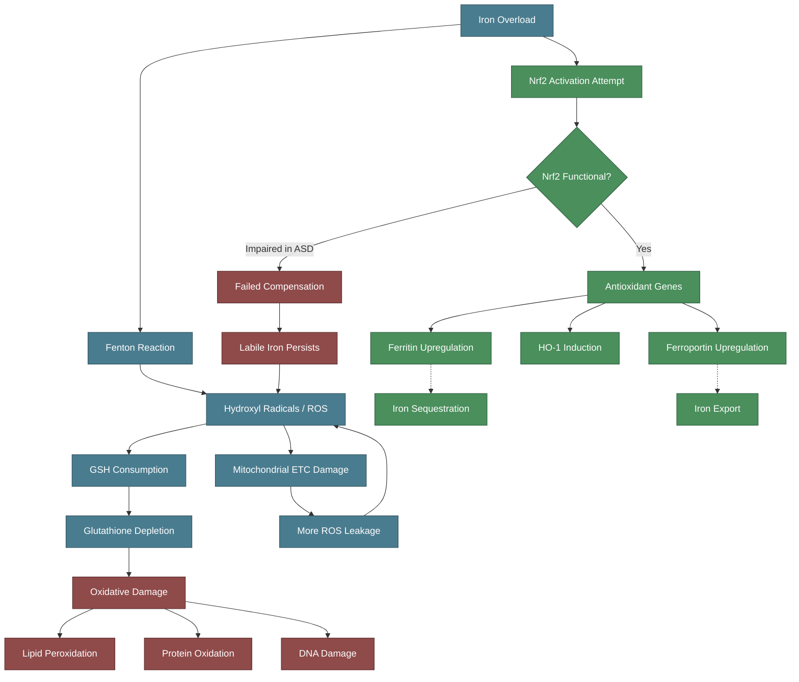

---
{"dg-publish":true,"permalink":"/research/iron-and-oxidative-stress-in-autism/","tags":["iron","oxidative-stress","autism","glutathione","Nrf2","mitochondria","ferroptosis"],"dg-note-properties":{"type":"research","status":"active","date":"2026-03-21","tags":["iron","oxidative-stress","autism","glutathione","Nrf2","mitochondria","ferroptosis"],"summary":"Iron-mediated oxidative stress in autism via glutathione depletion, Nrf2 dysfunction, and mitochondrial impairment","permalink":"research/iron-and-oxidative-stress-in-autism"}}
---

# Iron and Oxidative Stress in Autism

## The Convergence

Three pathological processes converge in autism spectrum disorder:
1. **Oxidative stress** — well-documented in ASD
2. **Iron dysregulation** — altered transferrin and ceruloplasmin levels in ASD
3. **Mitochondrial dysfunction** — estimated in 5-80% of ASD depending on criteria

Iron sits at the intersection of all three — it generates ROS via Fenton chemistry, depletes antioxidant defences, and damages mitochondria.

> [!info]- Colour Key
> 🔵 Normal | 🔴 Damage | 🟢 Protective | 🟡 Warning

## Glutathione Depletion

Glutathione (GSH) is the brain's primary antioxidant. Its synthesis depends on the enzyme **glutamate-cysteine ligase (GCL)**, and iron status affects this pathway at multiple points.

### Evidence in ASD

> **Bjorklund G et al.** "Oxidative stress in autism spectrum disorder." *Mol Neurobiol*. 2020. PMID: 16766163 (foundational review)
> - Oxidative stress characterised by imbalance between ROS and antioxidant defences is implicated in ASD
> - Contributes to neuroinflammation and mitochondrial dysfunction

> **Manivasagam T et al.** "Role of oxidative stress and antioxidants in autism." *Adv Neurobiol*. 2020. (Multiple reviews confirm GSH depletion in ASD)
> - Children with ASD show significantly lower GSH levels
> - Reduced GSH/GSSG ratio indicating oxidative stress

### How Iron Worsens Glutathione Depletion

1. **Fenton reaction**: Fe2+ + H2O2 -> Fe3+ + OH- + OH* — generates hydroxyl radicals
2. Hydroxyl radicals consume GSH as the cell tries to neutralise them
3. Iron overload depletes the GSH pool faster than it can be regenerated
4. The **System Xc- antiporter** (cystine/glutamate exchange) is critical for cysteine import for GSH synthesis — and this system is upregulated by iron-induced oxidative stress, releasing glutamate extracellularly (see [[research/Iron Glutamate and Excitotoxicity\|Iron Glutamate and Excitotoxicity]])

## The Nrf2 Pathway — Master Regulator

Nrf2 (Nuclear factor erythroid 2-related factor 2) is the master transcription factor for antioxidant defence. It directly regulates iron metabolism genes.

### Nrf2 Target Genes Relevant to Iron

> **Kerins MJ, Ooi A.** "The roles of NRF2 in modulating cellular iron homeostasis." *Antioxid Redox Signal*. 2018;29(17):1756-1773. PMC6208163
> - Nrf2 induces transcription of:
>   - **Ferritin heavy chain (FTH1)** and **light chain (FTL)** — iron storage
>   - **Ferroportin 1 (FPN1)** — iron export from cells
>   - **Heme oxygenase-1 (HO-1)** — heme degradation (releases iron and biliverdin)
> - Nrf2 is therefore a critical regulator of intracellular labile iron pool

### Nrf2 Dysfunction in ASD

> **Menegon F et al.** "Oxidative stress response and NRF2 signaling pathway in autism spectrum disorder." *Redox Biol*. 2025;82:103597. PMC12099462
> - Decreased NRF2 expression in frontal cortex of individuals with ASD
> - Accompanied by disturbances in thiol and cobalamin (vitamin B12) metabolism
> - Significant alterations in NRF2 signaling suggesting dysfunction contributes to ASD pathophysiology

> **Alotaibi MR et al.** "Oxidative stress indicated by nuclear transcription factor Nrf2 and glutathione status in the blood of young children with ASD: pilot study." *Antioxidants*. 2025;14(3):320
> - Measured Nrf2 and glutathione directly in ASD children
> - Confirmed oxidative stress via these specific pathways

> **Mammadova N et al.** "Association of NEF2L2 Rs35652124 polymorphism with Nrf2 induction and genotoxic stress biomarkers in autism." *Genes*. 2023;14(3):718
> - Genetic variants in the Nrf2 gene (NFE2L2) associated with ASD susceptibility
> - Links genetic predisposition to oxidative stress vulnerability

### Nrf2 Activators as Therapeutic Targets

> **Calabrese V et al.** "Nrf2 activators as dietary phytochemicals against oxidative stress, inflammation, and mitochondrial dysfunction in ASD: a systematic review." *Front Psychiatry*. 2020;11:561998. PMC7714765
> - Sulforaphane (from broccoli sprouts) is a potent Nrf2 activator
> - Oral sulforaphane decreased pro-inflammatory markers and increased cytoprotective enzymes (NQO1, HO-1, AKR1C1) in ASD patients
> - Evidence for improving autism-like behaviours through Nrf2 activation

## Mitochondrial Dysfunction

> **Thorsen M.** "Oxidative stress, metabolic and mitochondrial abnormalities associated with ASD." *Prog Mol Biol Transl Sci*. 2020;173:331-354
> - Mitochondria are the main sites for ROS generation
> - Electron transport chain complexes I, II, III contain iron-sulphur clusters
> - Iron overload damages these complexes, creating a vicious cycle of more ROS production

### Iron-Mitochondria Feedback Loop

1. Excess iron enters mitochondria
2. Iron damages ETC complexes (which themselves contain iron-sulphur clusters)
3. Damaged ETC leaks more electrons, generating more ROS
4. ROS damage more mitochondria
5. Damaged mitochondria release iron from their iron-sulphur clusters
6. Released iron generates more ROS
7. This cycle can trigger **ferroptosis** (see [[research/Ferroptosis and Neuronal Iron\|Ferroptosis and Neuronal Iron]])

## The HFE-Nrf2-Autism Triangle

For [[genetics/HFE Compound Heterozygosity\|HFE compound heterozygotes]] with autism:
- HFE variants increase cellular labile iron pool
- Increased labile iron generates more ROS
- If Nrf2 response is adequate, ferritin and ferroportin upregulation can compensate
- If Nrf2 response is impaired (as seen in ASD), iron toxicity is amplified
- The combination of HFE variants + autism-related Nrf2 dysfunction could create synergistic oxidative damage

## Clinical Implications

1. **Sulforaphane supplementation** has evidence in ASD and would also help manage iron-mediated oxidative stress via Nrf2 activation
2. **NAC (N-acetylcysteine)** replenishes glutathione — addresses both the oxidative stress and glutamate dysregulation
3. **Monitoring oxidative stress markers** (GSH/GSSG ratio, 8-OHdG, F2-isoprostanes) could be informative
4. **Iron reduction** (phlebotomy) would reduce the Fenton chemistry substrate

---

## Cross-References
- [[neurodevelopment/Iron-Dopamine-ADHD Axis\|Iron-Dopamine-ADHD Axis]]
- [[research/Ferroptosis and Neuronal Iron\|Ferroptosis and Neuronal Iron]]
- [[research/Iron Glutamate and Excitotoxicity\|Iron Glutamate and Excitotoxicity]]
- [[iron-metabolism/Iron Overload and NTBI\|Iron Overload and NTBI]]
- [[iron-metabolism/Ceruloplasmin and Ferroxidase Activity\|Ceruloplasmin and Ferroxidase Activity]]
- [[Health Research MOC\|Health Research MOC]]
