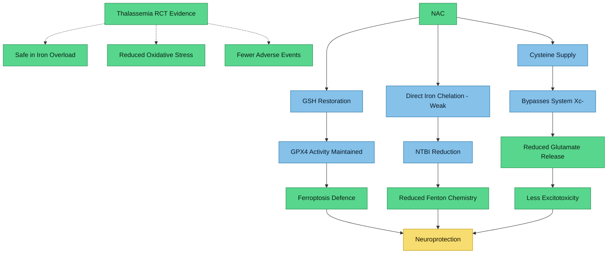

---
{"dg-publish":true,"permalink":"/research/nac-and-iron-metabolism/","tags":["NAC","iron-metabolism","ferroptosis","glutathione","thalassemia","hemochromatosis","oxidative-stress","trichotillomania"],"dg-note-properties":{"type":"research","status":"active","date":"2026-03-27","tags":["NAC","iron-metabolism","ferroptosis","glutathione","thalassemia","hemochromatosis","oxidative-stress","trichotillomania"],"summary":"Systematic evidence review on NAC interactions with iron metabolism, specifically for HFE compound heterozygosity with elevated TSAT/ferritin","permalink":"obsidian/research/nac-and-iron-metabolism"}}
---


# NAC and Iron Metabolism

## Clinical Context

This review addresses the safety and mechanistic interactions of **N-acetylcysteine (NAC) at 1200-2400 mg/day** in the context of:
- [[genetics/HFE Compound Heterozygosity\|HFE Compound Heterozygosity]] (C282Y/H63D)
- TSAT 60%, ferritin 380 ng/mL
- Intended use for [[neurodevelopment/Trichotillomania and Neurodevelopmental Links\|trichotillomania]] and oxidative stress reduction
- Concurrent concerns about [[iron-metabolism/Iron Overload and NTBI\|NTBI]] and [[research/Ferroptosis and Neuronal Iron\|ferroptosis]]

> [!info]- Colour Key
> 🟢 Protective | 🔵 Mechanism | 🟢 Evidence | 🟢 Outcome



---

## 1. NAC as Iron Chelator

### Key Finding
NAC possesses a thiol (-SH) group capable of coordinating metal ions, but it is a **weak chelator** compared to therapeutic iron chelators (deferiprone, deferoxamine, deferasirox). At oral therapeutic doses (600-1800 mg/day), NAC does **not** significantly alter plasma iron, zinc, copper, calcium, or magnesium levels or their urinary excretion.

### Evidence

#### Hjortso E, Fomsgaard JS, Fogh-Andersen N. "Does N-acetylcysteine increase the excretion of trace metals (calcium, magnesium, iron, zinc and copper) when given orally?" *Eur J Clin Pharmacol*. 1990;39(1):29-31. PMID: [2276385](https://pubmed.ncbi.nlm.nih.gov/2276385/)
- **Design:** Prospective study, 10 healthy volunteers, NAC 200 mg TID for 2 weeks
- **Finding:** No significant change in plasma concentrations or urinary excretion of Fe, Zn, Cu, Ca, or Mg during NAC treatment. Oral therapeutic NAC does not function as a clinically meaningful metal chelator.
- **Evidence rating:** B (small human study, healthy volunteers, directly answers the question)

#### Kalyanaraman B. "NAC, NAC, Knockin' on Heaven's door: Interpreting the mechanism of action of N-acetylcysteine in tumor and immune cells." *Redox Biol*. 2022;57:102497. PMID: [36242913](https://pubmed.ncbi.nlm.nih.gov/36242913/)
- **Design:** Comprehensive mechanistic review
- **Finding:** NAC affects iron signaling and transferrin iron pathways, but its primary mechanism of action is through GSH replenishment and cysteine supply, not direct iron chelation. NAC can interact with labile iron pools intracellularly but is not comparable to dedicated chelators.
- **Evidence rating:** B (authoritative review, mechanistic detail)

#### Wongjaikam S et al. "Combined Iron Chelator and Antioxidant Exerted Greater Efficacy on Cardioprotection Than Monotherapy in Iron-Overloaded Rats." *PLoS One*. 2016;11(7):e0159414. PMID: [27428732](https://pubmed.ncbi.nlm.nih.gov/27428732/)
- **Design:** Animal study, iron-overloaded Wistar rats, NAC 100 mg/kg/day vs DFO/DFP/DFX vs combined DFP+NAC
- **Finding:** NAC alone decreased plasma NTBI and cardiac iron concentration, but combined DFP+NAC was superior. NAC acts primarily as antioxidant rather than chelator; its iron-lowering effect is modest and secondary to its redox actions.
- **Evidence rating:** C (animal model, high dose relative to body weight)

### Summary
NAC is **not a clinically significant iron chelator** at oral therapeutic doses. Its thiol group can weakly coordinate iron in vitro, but this does not translate to meaningful iron removal in vivo. This is reassuring for someone with iron overload -- NAC will not paradoxically mobilise iron stores.

---

## 2. NAC and Glutathione Restoration in Iron Overload

### Key Finding
Iron overload depletes intracellular glutathione (GSH), the body's primary antioxidant defence. NAC, as the rate-limiting precursor of GSH synthesis (providing cysteine), **restores GSH levels** and provides protection against iron-mediated oxidative damage.

### Evidence

#### Musacco Sebio R et al. "Redox dyshomeostasis in the experimental chronic hepatic overloads with iron or copper." *J Inorg Biochem*. 2019;191:119-125. PMID: [30500573](https://pubmed.ncbi.nlm.nih.gov/30500573/)
- **Design:** Animal model, chronic hepatic iron overload in rats
- **Finding:** Chronic iron overload caused marked decreases in liver reduced glutathione (GSH) content and the GSH/GSSG ratio. GSH depletion was identified as an early indicator of iron-induced oxidative metabolic disturbance. This establishes the rationale for GSH replenishment via NAC in iron-loaded states.
- **Evidence rating:** B (well-designed animal model directly modelling hemochromatosis)

#### Evens AM, Mehta J, Gordon LI. "Rust and corrosion in hematopoietic stem cell transplantation: the problem of iron and oxidative stress." *Bone Marrow Transplant*. 2004;34(7):561-71. PMID: [15286699](https://pubmed.ncbi.nlm.nih.gov/15286699/)
- **Design:** Review of iron overload in HSCT patients
- **Finding:** In iron excess, free iron catalyses conversion of ROS intermediates to toxic hydroxyl radicals via Fenton chemistry. NAC replenishes glutathione redox potential and scavenges free radicals, providing a complementary approach to phlebotomy and chelation.
- **Evidence rating:** B (clinical review with mechanistic framework)

#### Cui Y et al. "Non-heme iron overload impairs monocyte to macrophage differentiation via mitochondrial oxidative stress." *Front Immunol*. 2022;13:998059. PMID: [36341326](https://pubmed.ncbi.nlm.nih.gov/36341326/)
- **Design:** In vitro study using ferric ammonium citrate to model iron overload
- **Finding:** Iron overload increased cellular and mitochondrial ROS, impaired mitochondrial function and ATP generation. Treatment with NAC (as ROS scavenger) **partially reversed** iron-induced effects, confirming its protective role via antioxidant mechanism rather than chelation.
- **Evidence rating:** C (in vitro, but mechanistically informative)

### Summary
GSH depletion is a central feature of iron overload pathophysiology. NAC directly addresses this by providing cysteine for GSH synthesis. This is arguably the **most important rationale** for NAC use in HFE iron overload -- it counteracts the downstream oxidative damage without requiring iron removal.

---

## 3. NAC and NTBI (Non-Transferrin Bound Iron)

### Key Finding
NAC can reduce plasma NTBI levels in iron-overloaded animal models, likely through both weak chelation and by reducing the oxidative environment that promotes iron release from ferritin.

### Evidence

#### Sumneang N et al. "Combined iron chelator with N-acetylcysteine exerts the greatest effect on improving cardiac calcium homeostasis in iron-overloaded thalassemic mice." *Toxicology*. 2019;427:152289. PMID: [31542421](https://pubmed.ncbi.nlm.nih.gov/31542421/)
- **Design:** Iron-overloaded wild-type and thalassemic (HT) mice, NAC 100 mg/kg/day, DFP 75 mg/kg/day, or combination
- **Finding:** In both WT and HT iron-overloaded mice, **NAC and DFP had similar efficacy in decreasing plasma NTBI** and cardiac iron concentration. Combined DFP+NAC was superior for cardiac calcium homeostasis restoration.
- **Evidence rating:** B (animal model with direct NTBI measurement, thalassemic phenotype)

#### Wongjaikam S et al. (2016) -- as cited above, PMID: [27428732](https://pubmed.ncbi.nlm.nih.gov/27428732/)
- **Finding:** HFe-diet rats had increased plasma NTBI. NAC monotherapy decreased plasma NTBI alongside MDA and cardiac iron. The NTBI reduction by NAC is likely mediated by antioxidant protection of ferritin (preventing oxidative iron release) rather than direct chelation.
- **Evidence rating:** C (animal model)

#### Gong K et al. "Oxidative Ferritin Destruction: A Key Mechanism of Iron Overload in Acetaminophen-Induced Hepatocyte Ferroptosis." *Int J Mol Sci*. 2025;26(15):7585. PMID: [40806713](https://pubmed.ncbi.nlm.nih.gov/40806713/)
- **Design:** In vitro primary mouse hepatocytes
- **Finding:** Oxidative stress directly damages ferritin structure, releasing free iron and creating a self-amplifying cycle of oxidative stress and iron-mediated damage. NAC alleviates this by protecting ferritin from oxidative destruction, thereby reducing labile iron release.
- **Evidence rating:** C (in vitro, mechanistically important for understanding NAC's indirect effect on NTBI/labile iron)

### Summary
NAC appears to reduce NTBI in animal models, though the mechanism is primarily **indirect** -- by reducing oxidative stress that causes ferritin degradation and iron release, rather than by chelating NTBI directly. This is particularly relevant for [[iron-metabolism/Iron Overload and NTBI\|NTBI management]] at TSAT 60%, where NTBI is likely present.

---

## 4. NAC in Thalassemia and Hemochromatosis (Clinical Studies)

### Key Finding
Multiple clinical studies in transfusion-dependent thalassemia demonstrate NAC's safety and benefit in iron-loaded patients. **No clinical studies exist specifically for hereditary hemochromatosis.** The thalassemia data provides the closest available clinical analogue.

### Evidence

#### Pattanakuhar S et al. "N-acetylcysteine Restored Heart Rate Variability and Prevented Serious Adverse Events in Transfusion-dependent Thalassemia Patients: a Double-blind Single Center Randomized Controlled Trial." *Int J Med Sci*. 2020;17(9):1147-1155. PMID: [32547310](https://pubmed.ncbi.nlm.nih.gov/32547310/)
- **Design:** Double-blind RCT, 59 TDT patients, NAC 600 mg/day for 6 months
- **Finding:** NAC significantly reduced serious adverse events (infections, worsening thalassemia) vs placebo (3.3% vs 24.1%, p=0.019; NNT=4.8). NAC restored heart rate variability. No safety signals in iron-loaded patients.
- **Evidence rating:** A (double-blind RCT in iron-loaded patients, directly relevant safety data)

#### Ozdemir ZC et al. "N-Acetylcysteine supplementation reduces oxidative stress and DNA damage in children with beta-thalassemia." *Hemoglobin*. 2014;38(5):359-64. PMID: [25222041](https://pubmed.ncbi.nlm.nih.gov/25222041/)
- **Design:** RCT, 75 children with transfusion-dependent thalassemia, NAC 10 mg/kg/day for 3 months
- **Finding:** NAC significantly decreased total oxidant status, oxidative stress index, and DNA damage. Increased total antioxidant capacity and pre-transfusion haemoglobin levels. DNA damage score specifically decreased in the NAC group.
- **Evidence rating:** A (RCT, clinically meaningful endpoints)

#### Bahoush G, Rahab M, Ahmadvand P. "Can N-acetylcysteine reduce red blood cell transfusion burden in patients with transfusion-dependent beta-thalassemia?" *Pediatr Hematol Oncol*. 2024;41(4):251-259. PMID: [38088332](https://pubmed.ncbi.nlm.nih.gov/38088332/)
- **Design:** Quasi-experimental, 35 TDT patients, NAC 10 mg/kg/day for 3 months
- **Finding:** NAC significantly reduced RBC transfusion burden (p=0.029) without decreasing serum haemoglobin. Serum ferritin and liver enzymes did not significantly change. No significant toxicity observed.
- **Evidence rating:** B (quasi-experimental, no control group, but clinically relevant)

#### Yanpanitch OU et al. "Treatment of beta-Thalassemia/Hemoglobin E with Antioxidant Cocktails Results in Decreased Oxidative Stress, Increased Hemoglobin Concentration, and Improvement of the Hypercoagulable State." *Oxid Med Cell Longev*. 2015;2015:537954. PMID: [26078808](https://pubmed.ncbi.nlm.nih.gov/26078808/)
- **Design:** Clinical trial, 60 patients, NAC + deferiprone + curcuminoids or vitamin E
- **Finding:** Responders showed significantly decreased iron load, oxidative stress, and coagulation potential with increased antioxidant capacity and haemoglobin. NAC as part of combination therapy was safe and effective in iron-loaded patients.
- **Evidence rating:** B (clinical trial, combination therapy, hard to isolate NAC effect)

#### Kumfu S et al. "A combination of an iron chelator with an antioxidant exerts greater efficacy on cardioprotection than monotherapy in iron-overload thalassemic mice." *Free Radic Res*. 2018;52(1):70-79. PMID: [29207893](https://pubmed.ncbi.nlm.nih.gov/29207893/)
- **Design:** Thalassemic mice with iron overload, DFP and/or NAC for 1 month
- **Finding:** Combined DFP+NAC was superior to either monotherapy in reducing cardiac iron deposition, oxidative stress, and apoptosis. Supports the rationale of combining antioxidant therapy with iron management.
- **Evidence rating:** C (animal model, thalassemic phenotype)

#### Rachmilewitz EA et al. "Role of iron in inducing oxidative stress in thalassemia: Can it be prevented by inhibition of absorption and by antioxidants?" *Ann N Y Acad Sci*. 2005;1054:118-23. PMID: [16339657](https://pubmed.ncbi.nlm.nih.gov/16339657/)
- **Design:** Review with experimental data on labile plasma iron
- **Finding:** Treatment with combination of NAC (for protein protection) and vitamin E (for lipid protection) in addition to iron chelators can neutralise the deleterious effects of ROS in thalassemia. NAC specifically protects protein targets from iron-catalysed oxidation.
- **Evidence rating:** B (review with experimental data)

### Summary
Clinical evidence from thalassemia RCTs demonstrates that NAC is **safe in iron-loaded patients** and provides measurable benefits (reduced oxidative stress, DNA damage, adverse events). No hemochromatosis-specific clinical trials exist, but the iron overload mechanism is analogous.

---

## 5. NAC and Iron Absorption

### Key Finding
There is **no direct clinical evidence** that oral NAC significantly affects dietary iron absorption. The available data suggests NAC does not alter iron absorption at therapeutic doses.

### Evidence

#### Hjortso E et al. (1990) -- PMID: [2276385](https://pubmed.ncbi.nlm.nih.gov/2276385/) (as cited above)
- **Finding:** No change in plasma iron levels or urinary iron excretion during 2 weeks of oral NAC at 600 mg/day. If NAC meaningfully increased or decreased iron absorption, plasma iron levels would be expected to shift.
- **Evidence rating:** B (indirect evidence; plasma iron stability suggests no major absorption effect)

#### Lane DJR et al. "Transferrin iron uptake is stimulated by ascorbate via an intracellular reductive mechanism." *Biochim Biophys Acta*. 2013;1833(6):1527-41. PMID: [23481043](https://pubmed.ncbi.nlm.nih.gov/23481043/)
- **Finding:** Neither NAC nor buthionine sulfoximine (which decrease/increase intracellular glutathione respectively) affected transferrin-dependent iron uptake. Ascorbate stimulates iron uptake via an intracellular reductive mechanism independent of GSH status. This suggests NAC does not alter cellular iron uptake via the transferrin pathway.
- **Evidence rating:** C (in vitro, but informative mechanistic dissociation)

### Summary
No evidence that NAC at therapeutic oral doses increases iron absorption. This is important reassurance for someone with [[genetics/HFE Compound Heterozygosity\|HFE Compound Heterozygosity]], where increased absorption is the primary pathological mechanism. NAC's mechanism (thiol chemistry) is distinct from the ascorbate-mediated reduction that enhances iron absorption.

---

## 6. Safety of NAC with Elevated Iron

### Key Finding
No specific contraindications for NAC in the setting of elevated iron/ferritin have been identified. Clinical trials in iron-loaded thalassemia patients demonstrate a favourable safety profile.

### Evidence

#### Pattanakuhar S et al. (2020) -- PMID: [32547310](https://pubmed.ncbi.nlm.nih.gov/32547310/)
- **Finding:** In a 6-month RCT of 59 iron-loaded TDT patients, NAC 600 mg/day showed no safety signals. The intervention group had significantly fewer serious adverse events than controls.
- **Evidence rating:** A (RCT safety data in iron-loaded population)

#### Bahoush G et al. (2024) -- PMID: [38088332](https://pubmed.ncbi.nlm.nih.gov/38088332/)
- **Finding:** No significant toxicity observed. Ferritin and liver enzymes (SGOT, SGPT) did not change significantly during NAC treatment, indicating no worsening of iron-related hepatic parameters.
- **Evidence rating:** B (safety monitoring in iron-loaded patients)

#### Cherneva DI et al. "The Central Nervous System Modulatory Activities of N-Acetylcysteine: A Synthesis of Two Decades of Evidence." *Curr Issues Mol Biol*. 2025;47(9):710. PMID: [41020832](https://pubmed.ncbi.nlm.nih.gov/41020832/)
- **Finding:** Comprehensive review of NAC's CNS effects over two decades. NAC functions as antioxidant via GSH replenishment and has glutathione-independent effects through modulation of mitochondrial redox systems and ferroptosis inhibition. No contraindication for iron-loaded states identified. Variability in clinical outcomes noted.
- **Evidence rating:** B (broad review, no iron-specific safety concerns raised)

#### Nahon P et al. "Do genetic variations in antioxidant enzymes influence the course of hereditary hemochromatosis?" *Antioxid Redox Signal*. 2011;15(1):31-8. PMID: [20673159](https://pubmed.ncbi.nlm.nih.gov/20673159/)
- **Finding:** In C282Y homozygous hemochromatosis patients, genetic variants affecting antioxidant enzyme activity (SOD2, GPX1, MPO) influence risk of cirrhosis and HCC. Patients with higher-activity pro-oxidant enzymes had worse outcomes. This underscores the importance of antioxidant defence in hemochromatosis and supports the theoretical rationale for GSH augmentation with NAC.
- **Evidence rating:** B (observational genetics study in HFE hemochromatosis, indirect support)

### Theoretical Concern: Pro-oxidant Thiol-Iron Interactions
One theoretical concern is that thiol compounds could reduce Fe(III) to Fe(II), potentially increasing Fenton-reactive iron. However:
- This is primarily an in vitro phenomenon at supraphysiological concentrations
- In vivo, NAC's primary action is GSH replenishment, which strengthens GPX4-mediated lipid peroxide detoxification
- The clinical thalassemia data shows net benefit, not harm

### Summary
**No contraindications or safety warnings exist for NAC use with elevated iron.** The clinical evidence from iron-loaded thalassemia patients demonstrates safety and benefit. The theoretical pro-oxidant concern does not appear to manifest clinically.

---

## 7. NAC and Ferroptosis Protection

### Key Finding
NAC inhibits ferroptosis through multiple mechanisms: (1) providing cysteine for GSH synthesis independent of System Xc-, (2) maintaining GPX4 activity, and (3) direct free radical scavenging. This is highly relevant for iron-loaded states where ferroptosis risk is elevated.

### Evidence

#### Costa I et al. "Molecular mechanisms of ferroptosis and their involvement in brain diseases." *Pharmacol Ther*. 2023;244:108373. PMID: [36894028](https://pubmed.ncbi.nlm.nih.gov/36894028/)
- **Design:** Comprehensive review of ferroptosis mechanisms
- **Finding:** NAC is classified as a ferroptosis inhibitor alongside ferrostatin-1, liproxstatin-1, and deferoxamine. NAC inhibits ferroptosis by **bypassing System Xc- inhibition** -- it provides cysteine directly after deacetylation, maintaining GSH synthesis even when System Xc- is blocked. This maintains GPX4 activity, the central enzyme preventing lethal lipid peroxidation.
- **Evidence rating:** A (high-quality review in major pharmacology journal, comprehensive mechanistic framework)

#### Morris G et al. "Why should neuroscientists worry about iron? The emerging role of ferroptosis in the pathophysiology of neuroprogressive diseases." *Behav Brain Res*. 2018;341:154-175. PMID: [29289598](https://pubmed.ncbi.nlm.nih.gov/29289598/)
- **Design:** Review of ferroptosis in neurological disease
- **Finding:** In iron-overloaded states, NTBI uptake via DMT1 on neurones and glia makes cells highly vulnerable to ferroptosis. NAC is discussed as a rational therapeutic alongside iron chelation (deferiprone) for neuroprotection. GSH and GPX4 are the primary negative regulators of ferroptosis; NAC supports both.
- **Evidence rating:** B (comprehensive review, relevant to [[research/NTBI in the Brain\|brain NTBI]] and neurological context)

#### Kalyanaraman B. (2022) -- PMID: [36242913](https://pubmed.ncbi.nlm.nih.gov/36242913/)
- **Finding:** NAC affects multiple pathways relevant to ferroptosis: iron signaling, GSH-dependent antioxidant mechanisms, and the ferroptosis pathway. Critically, NAC's anti-ferroptotic effect operates through GSH replenishment rather than direct iron chelation, making it complementary to (not redundant with) iron management strategies.
- **Evidence rating:** B (mechanistic review, clarifies NAC's mode of action in ferroptosis context)

#### Saporito-Magrina C et al. "Copper(II) and iron(III) ions inhibit respiration and increase free radical-mediated phospholipid peroxidation in rat liver mitochondria: Effect of antioxidants." *J Inorg Biochem*. 2017;172:94-99. PMID: [28445841](https://pubmed.ncbi.nlm.nih.gov/28445841/)
- **Design:** In vitro mitochondrial study
- **Finding:** Iron(III) at 100-500 uM inhibited mitochondrial respiration and increased phospholipid peroxidation via Fenton/Haber-Weiss mechanism. GSH and NAC supplementation attenuated iron-induced mitochondrial phospholipid peroxidation and respiratory inhibition, confirming their protective role against iron-mediated mitochondrial ferroptotic damage.
- **Evidence rating:** C (in vitro, mitochondrial level, mechanistically valuable)

### The Ferroptosis Defence Pathway (System Xc- / GSH / GPX4)
```
Cystine ──[System Xc-]──> Cysteine ──> γ-GluCys ──> GSH ──> GPX4 activity
                                                              │
NAC ──[deacetylation]──> Cysteine ─────────────────────────────┘
                         (bypasses System Xc-)
                                                              │
                                                    Reduces lipid-OOH to lipid-OH
                                                    (prevents ferroptotic death)
```

### Summary
NAC provides **direct anti-ferroptotic protection** by maintaining the GSH/GPX4 axis. In an iron-loaded state where ferroptosis risk is elevated, this represents a mechanistically sound protective strategy. The fact that NAC bypasses System Xc- means it provides cysteine even when glutamate-mediated excitotoxicity (relevant to [[research/Iron Glutamate and Excitotoxicity\|excitotoxicity pathways]]) inhibits the antiporter.

---

## Clinical Synthesis for HFE C282Y/H63D, TSAT 60%, Ferritin 380

### Risk-Benefit Assessment

| Factor | Assessment |
|--------|-----------|
| Iron chelation concern | **Low risk** -- NAC is not a meaningful iron chelator at oral doses |
| Iron absorption increase | **No evidence** of increased absorption; mechanism differs from ascorbate |
| NTBI reduction | **Probable benefit** -- indirect via ferritin protection |
| GSH restoration | **Clear benefit** -- directly addresses iron-induced GSH depletion |
| Ferroptosis protection | **Clear benefit** -- maintains GPX4 axis |
| Safety in iron overload | **Supported** by thalassemia RCT data |
| Ferritin/iron mobilisation | **No concern** -- NAC does not increase ferritin or worsen iron parameters |

### Recommended Approach
1. **NAC 1200-2400 mg/day is likely safe** in this iron-loading context
2. NAC provides **complementary protection** to phlebotomy/iron management via antioxidant pathway
3. Consider **monitoring** ferritin and TSAT at routine intervals (as already indicated for HFE management) -- not because of NAC-specific concerns but as standard practice
4. NAC **does not replace** phlebotomy or active iron reduction but addresses the oxidative stress consequence of iron loading
5. For trichotillomania, NAC's **glutamatergic effects** (via System Xc-) are the primary therapeutic mechanism; the iron-protective effects are a secondary benefit

### Key Knowledge Gaps
- No clinical trials of NAC specifically in HFE hereditary hemochromatosis
- No human data on NAC's effect on NTBI levels (only animal data)
- No long-term (>6 month) safety data in iron-loaded patients on NAC >600 mg/day
- No studies examining NAC interaction with phlebotomy schedule

---

## Related Notes

- [[genetics/HFE Compound Heterozygosity\|HFE Compound Heterozygosity]]
- [[iron-metabolism/Iron Overload and NTBI\|Iron Overload and NTBI]]
- [[research/Ferroptosis and Neuronal Iron\|Ferroptosis and Neuronal Iron]]
- [[research/NTBI in the Brain\|NTBI in the Brain]]
- [[research/Iron Glutamate and Excitotoxicity\|Iron Glutamate and Excitotoxicity]]
- [[neurodevelopment/Trichotillomania and Neurodevelopmental Links\|Trichotillomania and Neurodevelopmental Links]]
- [[research/Iron Chelation Therapy - Deferiprone\|Iron Chelation Therapy - Deferiprone]]
- [[research/Iron and Oxidative Stress in Autism\|Iron and Oxidative Stress in Autism]]
- [[diet-management/Diet and Supplement Strategy\|Diet and Supplement Strategy]]
- [[iron-metabolism/Transferrin Saturation - Clinical Significance\|Transferrin Saturation - Clinical Significance]]
- [[diet-management/Dietary Management - Iron Overload\|Dietary Management - Iron Overload]]
- [[research/Iron and OCD-Spectrum Repetitive Behaviours\|Iron and OCD-Spectrum Repetitive Behaviours]]