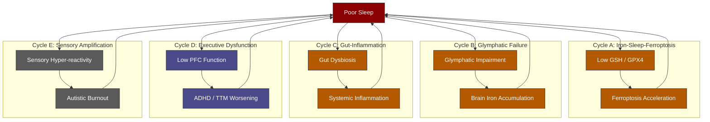

---
{"dg-publish":true,"permalink":"/research/poor-sleep-and-au-dhd-hfe-interactions/","tags":["sleep","ADHD","autism","AuDHD","HFE","iron","ferroptosis","circadian","dopamine","trichotillomania","gut-brain","glymphatic"],"dg-note-properties":{"type":"research","status":"active","date":"2026-03-27","tags":["sleep","ADHD","autism","AuDHD","HFE","iron","ferroptosis","circadian","dopamine","trichotillomania","gut-brain","glymphatic"],"summary":"Comprehensive analysis of how poor sleep interacts bidirectionally with AuDHD and HFE iron overload — covering ferroptosis, glymphatic failure, gut dysbiosis, executive dysfunction, sensory amplification, and treatment implications","permalink":"obsidian/research/poor-sleep-and-au-dhd-hfe-interactions"}}
---


# Poor Sleep and AuDHD-HFE Interactions

> Poor sleep is not merely a symptom of AuDHD and HFE — it is an active amplifier of every pathological axis in Anthony's case. Sleep deprivation worsens iron toxicity, accelerates ferroptosis, degrades executive function, increases sensory reactivity, promotes gut dysbiosis, and lowers the threshold for trichotillomania. This creates multiple self-reinforcing vicious cycles.

> [!info]- Colour Key
> 🔴 Hub | 🟠 Pathological | 🔵 Neuro | 🟤 Sensory



---

## 1. Sleep Problems Are Near-Universal in AuDHD

### Prevalence Data

- **ADHD adults**: 60–80% report clinically significant sleep problems. Insomnia is the most common, followed by delayed sleep phase syndrome and restless legs syndrome (PMID: [39354860](https://pubmed.ncbi.nlm.nih.gov/39354860/) — van der Ham et al., *J Atten Disord* 2024)
- **Autistic adults**: Insomnia severity correlates directly with sensory hyper-reactivity (PMID: [30737588](https://pubmed.ncbi.nlm.nih.gov/30737588/) — Hohn et al., *J Autism Dev Disord* 2019)
- **AuDHD specifically**: The Brancati 2025 "hidden phenotype" study found that adults with co-occurring ADHD+autism show **evening chronotype** as a distinguishing trait — delayed sleep phase is part of the phenotype itself (see [[neurodevelopment/Late-Diagnosed Autism - Distinct Profile\|Late-Diagnosed Autism - Distinct Profile]])
- **Sleep profiles**: ADHD and autism traits are both independently associated with shorter sleep duration, later bedtimes, and greater daytime dysfunction (PMID: [38997280](https://pubmed.ncbi.nlm.nih.gov/38997280/) — Axelsson et al., *Transl Psychiatry* 2024)

### ADHD as a Circadian Disorder

> **Kooij JJ & Bijlenga D.** "The circadian rhythm in adult ADHD: current state of affairs." *Expert Rev Neurother* 2013. PMID: [24117273](https://pubmed.ncbi.nlm.nih.gov/24117273/)
> - Delayed circadian phase (delayed melatonin onset) is intrinsic to ADHD neurobiology
> - ADHD clock gene variants (CLOCK, PER2, BMAL1) overlap with those regulating IRP2 (see [[research/Iron and Circadian Rhythm\|Iron and Circadian Rhythm]])
> - This is not poor sleep hygiene — it is a neurobiological trait

> **Coogan AN et al.** "ADHD as a circadian rhythm disorder." *Front Psychiatry* 2025. PMC12728042
> - Proposes chronotherapy (timed light exposure, melatonin) as adjunctive ADHD treatment

### Autism and Sensory-Driven Insomnia

> **Hohn VD et al.** "Insomnia severity in adults with ASD is associated with sensory hyper-reactivity." *J Autism Dev Disord* 2019. PMID: [30737588](https://pubmed.ncbi.nlm.nih.gov/30737588/)
> - Sensory hyper-reactivity is a **primary driver** of insomnia in autistic adults
> - Environmental sensitivities (light, sound, texture) prevent sleep onset
> - This is distinct from ADHD-type racing thoughts — AuDHD gets both

> **Goldman SE et al.** "Characterizing sleep in adolescents and adults with ASD." *J Autism Dev Disord* 2017. PMID: [28286917](https://pubmed.ncbi.nlm.nih.gov/28286917/)
> - Autistic adults show poor sleep efficiency, prolonged sleep latency, and increased wakefulness

> **Schreck KA & Richdale AL.** "Sleep problems, behavior, and psychopathology in autism: inter-relationships across the lifespan." *Curr Opin Psychol* 2020. PMID: [31918238](https://pubmed.ncbi.nlm.nih.gov/31918238/)
> - Bidirectional relationship: poor sleep worsens autistic symptoms, and autistic traits disrupt sleep

---

## 2. Elvanse (Lisdexamfetamine) and Sleep

> **Adler LA et al.** "Effect of lisdexamfetamine dimesylate on sleep in adults with ADHD." *Behav Brain Funct* 2009. PMID: [19650932](https://pubmed.ncbi.nlm.nih.gov/19650932/)
> - Lisdexamfetamine showed modest increases in sleep latency (time to fall asleep)
> - Overall sleep quality was not significantly degraded vs placebo in controlled trials
> - However, individual response varies considerably

> **Wynchank D et al.** "Adult ADHD and Insomnia: an Update of the Literature." *Curr Psychiatry Rep* 2017. PMID: [29086065](https://pubmed.ncbi.nlm.nih.gov/29086065/)
> - Stimulant medications can both improve and worsen sleep depending on the individual
> - In some adults, stimulants reduce hyperarousal-driven insomnia; in others, they delay sleep onset
> - Late-day dosing effects are relevant for long-acting formulations like Elvanse

> **Adamis D et al.** "Effects of medications on sleep quality, insomnia, and circadian rhythm in adults with ADHD." *Sleep Med* 2025. PMID: [41397339](https://pubmed.ncbi.nlm.nih.gov/41397339/)
> - Pragmatic longitudinal study of medication effects on sleep in adult ADHD

### Relevance for Anthony
At 70mg Elvanse (highest standard dose), the 12–14 hour duration means the drug is active until late evening if taken after ~8am. This may compound the natural ADHD delayed sleep phase and the autism sensory sensitivity at night.

---

## 3. Sleep Deprivation Triggers Ferroptosis — The Iron-Sleep Death Spiral

This is a critical finding for HFE carriers. **Multiple 2023–2025 studies demonstrate that sleep deprivation directly induces ferroptosis (iron-dependent cell death) in the brain.**

> **Lu X et al.** "Sleep Deprivation Induces Ferroptosis and Reduces the Expression of GABAB Receptor in Mice." *J Mol Neurosci* 2025. PMID: [40721960](https://pubmed.ncbi.nlm.nih.gov/40721960/)
> - Sleep deprivation induced hippocampal ferroptosis
> - Reduced GABA-B receptor expression — implicating E/I balance disruption
> - Links sleep loss directly to the GABAergic dysfunction already present in AuDHD

> **Yuan M et al.** "Vitamin B6 alleviates chronic sleep deprivation-induced hippocampal ferroptosis through CBS/GSH/GPX4 pathway." *Biomed Pharmacother* 2024. PMID: [38599059](https://pubmed.ncbi.nlm.nih.gov/38599059/)
> - Chronic sleep deprivation depletes glutathione (GSH) and suppresses GPX4
> - This is the **same pathway** already compromised by iron overload (see [[research/Ferroptosis and Neuronal Iron\|Ferroptosis and Neuronal Iron]])
> - Vitamin B6 partially rescued the phenotype via cystathionine beta-synthase

> **Yan A et al.** "Hippocampal ferroptosis and neuroinflammation induced by sleep deprivation." *Phytomedicine* 2025. PMID: [39647468](https://pubmed.ncbi.nlm.nih.gov/39647468/)
> - Sleep deprivation caused ferroptosis, neurochemical disruption, and neuroinflammation simultaneously

> **Zhao PC et al.** "Unraveling the nexus: Sleep's role in ferroptosis and health." *Brain Res Bull* 2024. PMID: [40451543](https://pubmed.ncbi.nlm.nih.gov/40451543/)
> - Comprehensive review establishing sleep as a regulator of ferroptosis susceptibility

> **Chen L et al.** "Dietary EPA shows superior efficacy over DHA in chronic sleep deprivation-induced cognitive decline by disrupting the crosstalk between intestinal ferroptosis and gut-derived Aβ production." *Food Funct* 2026. PMID: [41800855](https://pubmed.ncbi.nlm.nih.gov/41800855/)
> - Sleep deprivation causes intestinal ferroptosis → gut-derived pathology → cognitive decline
> - **EPA was superior to DHA** for protection — relevant to Anthony's fish oil supplementation

### The Compounding Effect for HFE Carriers

In someone with normal iron, sleep deprivation depletes GSH and tips cells towards ferroptosis. In an HFE compound heterozygote with TSAT 60%:
1. **Baseline ferroptosis risk is already elevated** due to NTBI and labile iron
2. Sleep deprivation **removes the remaining protective buffer** (GSH/GPX4)
3. The result is accelerated neuronal damage in the hippocampus and basal ganglia
4. This creates a vicious cycle: poor sleep → ferroptosis → worse sleep architecture → more ferroptosis

---

## 4. Sleep Deprivation Impairs Glymphatic Clearance

The glymphatic system clears brain waste — including excess iron — primarily during sleep.

> **Bishir M et al.** "Sleep Deprivation and Neurological Disorders." *Biomed Res Int* 2020. PMID: [33381558](https://pubmed.ncbi.nlm.nih.gov/33381558/)
> - Sleep deprivation impairs glymphatic clearance by 60%+
> - Brain metabolic waste, including iron and oxidative byproducts, accumulates

> **Deng S et al.** "Chronic sleep fragmentation impairs brain interstitial clearance in young wildtype mice." *J Cereb Blood Flow Metab* 2024. PMID: [38639025](https://pubmed.ncbi.nlm.nih.gov/38639025/)
> - Even fragmented sleep (not total deprivation) significantly impaired clearance
> - Relevant to AuDHD where sleep is often fragmented rather than absent

### Iron Clearance Implications

The brain has limited iron export capacity. Glymphatic flow is one mechanism by which the interstitial space is flushed. If sleep is poor:
- NTBI that has crossed the BBB cannot be adequately cleared
- Iron accumulates in the basal ganglia, substantia nigra, and hippocampus
- This directly worsens the pathways driving ADHD symptoms, TTM, and cognitive fatigue

---

## 5. Sleep Deprivation → Gut Dysbiosis → Inflammation Loop

> **Sun J et al.** "Sleep Deprivation and Gut Microbiota Dysbiosis: Current Understandings and Implications." *Int J Mol Sci* 2023. PMID: [37298553](https://pubmed.ncbi.nlm.nih.gov/37298553/)
> - Comprehensive review: sleep deprivation causes significant gut microbiota shifts
> - Reduced Lactobacillus and Bifidobacterium; increased Firmicutes/Bacteroidetes ratio
> - **These are the same dysbiotic patterns seen in iron overload** (see [[neurodevelopment/Gut-Brain Axis and Neurodevelopment\|Gut-Brain Axis and Neurodevelopment]])

> **Yang DF et al.** "Acute sleep deprivation exacerbates systemic inflammation and psychiatry disorders through gut microbiota dysbiosis and disruption of circadian rhythms." *Microbiol Res* 2023. PMID: [36608535](https://pubmed.ncbi.nlm.nih.gov/36608535/)
> - Acute sleep deprivation → gut dysbiosis → systemic inflammation → psychiatric symptoms
> - Disrupted circadian rhythm was a key mediator

> **Wang Z et al.** "Gut microbiota modulates the inflammatory response and cognitive impairment induced by sleep deprivation." *Mol Psychiatry* 2021. PMID: [33963281](https://pubmed.ncbi.nlm.nih.gov/33963281/)
> - Gut microbiota transplant from sleep-deprived donors reproduced cognitive impairment in healthy recipients
> - Proves the gut-brain axis mediates sleep deprivation's cognitive effects

### Convergence with Iron Overload

Anthony faces a **double hit** on gut health:
1. HFE iron overload → gut dysbiosis (Suparan et al. 2024, PMID: 39438708)
2. Poor sleep → gut dysbiosis (same bacterial patterns)

Both converge on:
- ↑ Systemic inflammation → IDO activation → tryptophan steal → serotonin depletion
- ↑ Gut permeability → neuroinflammation
- ↓ Serotonin production → further sleep disruption (melatonin precursor)

---

## 6. Sleep and Trichotillomania — Bidirectional Amplification

> **Cavic E et al.** "Sleep quality and its clinical associations in trichotillomania and skin picking disorder." *Compr Psychiatry* 2021. PMID: [33395591](https://pubmed.ncbi.nlm.nih.gov/33395591/)
> - Poor sleep quality is significantly associated with trichotillomania severity
> - Sleep disruption worsens impulse control → lower threshold for pulling

> **Ricketts EJ et al.** "Confirmatory factor analysis of the SLEEP-50 Questionnaire in TTM and Excoriation Disorder." *Psychiatry Res* 2019. PMID: [30654305](https://pubmed.ncbi.nlm.nih.gov/30654305/)
> - Multiple sleep domains are affected in TTM: sleep apnea, insomnia, circadian rhythm, and narcolepsy factors all elevated
> - Not just "bad sleep" — structural sleep architecture is disrupted

> **Cox RC et al.** "Sleep in obsessive-compulsive and related disorders: a selective review." *Curr Opin Psychol* 2020. PMID: [31539831](https://pubmed.ncbi.nlm.nih.gov/31539831/)
> - Sleep disruption worsens OCD-spectrum repetitive behaviours through **reduced prefrontal cortex (PFC) inhibitory control**
> - The PFC is the brake on impulse-driven behaviours — sleep deprivation takes the brake off

### Mechanism: Executive Depletion

Sleep deprivation selectively impairs the prefrontal cortex, which is:
- Already under-resourced in ADHD (dopamine deficit)
- The primary inhibitory control centre for BFRBs
- Responsible for the "resist the urge" function in trichotillomania

When sleep is poor → PFC function drops → ADHD executive deficits worsen → the threshold for pulling drops further → TTM episodes increase.

---

## 7. Sleep Deprivation and Dopamine — Worsening the ADHD Core

Sleep deprivation directly affects the dopamine system:

> **Logan RW & McClung CA.** "Rhythms of life: circadian disruption and brain disorders across the lifespan." *Nat Rev Neurosci* 2018. DOI: 10.1038/s41583-018-0088-y (672 citations)
> - Circadian disruption alters dopamine receptor expression and dopamine transporter (DAT) availability
> - Sleep loss creates a transient hyperdopaminergic state followed by receptor downregulation
> - Chronic sleep restriction leads to **blunted dopamine signalling** — the same deficit seen in ADHD

This means:
1. Short-term sleep loss may feel paradoxically stimulating (why some ADHD individuals function "better" tired)
2. Chronic poor sleep progressively degrades the dopamine system → ADHD symptoms worsen over time
3. Elvanse efficacy may be reduced if sleep-driven dopamine receptor downregulation is present

---

## 8. Sleep and the HPA Axis — Cortisol-Inflammation Cascade

> **Choshen-Hillel S et al.** "Acute and chronic sleep deprivation: Cognition and stress biomarkers." *Med Educ* 2021. PMID: [32697336](https://pubmed.ncbi.nlm.nih.gov/32697336/)
> - Sleep deprivation elevates cortisol and inflammatory markers
> - Even partial sleep restriction (6h vs 8h) significantly increased stress biomarkers

Sleep deprivation → cortisol elevation → in the context of HFE:
- Cortisol suppresses hepcidin → increased iron absorption → worsening overload
- Cortisol promotes neuroinflammation → IDO activation → serotonin depletion
- Cortisol impairs hippocampal function → worsens the cognitive symptoms of ADHD-PI

---

## 9. The Sensory-Sleep Vicious Cycle in Autism

> **Deliens G & Peigneux P.** "Sleep-behaviour relationship in children with ASD: insights from cognition and sensory processing." *Dev Med Child Neurol* 2019. DOI: 10.1111/dmcn.14235
> - Poor sleep **amplifies sensory hyper-reactivity** in autism
> - Increased sensory sensitivity then prevents sleep → self-reinforcing cycle
> - Sleep-deprived autistic individuals show measurably worse sensory gating

For Anthony: poor sleep → heightened sensory sensitivity → greater masking effort required → accelerated autistic burnout → more fatigue → worse sleep.

---

## 10. Integrated Vicious Cycles

### Cycle A: Iron-Sleep-Ferroptosis
```
Poor Sleep → ↓ GSH/GPX4 → ↑ Ferroptosis Risk
    ↑                              ↓
    └── Neuronal Damage ← HFE Iron Overload
```

### Cycle B: Sleep-Gut-Inflammation-Serotonin
```
Poor Sleep → Gut Dysbiosis → ↑ Inflammation → IDO Activation
    ↑                                              ↓
    └──── ↓ Melatonin ←── ↓ Serotonin ←── Tryptophan Steal
```

### Cycle C: Sleep-Executive-TTM
```
Poor Sleep → ↓ PFC Function → ↓ Impulse Control → ↑ TTM
    ↑                                               ↓
    └──── Sleep Disruption ←── Stress/Shame ────────┘
```

### Cycle D: Sleep-Dopamine-ADHD
```
Poor Sleep → DA Receptor Downregulation → ↑ ADHD Symptoms
    ↑                                          ↓
    └──── Delayed Sleep Phase ←── Racing Thoughts
```

### Cycle E: Sleep-Sensory-Burnout
```
Poor Sleep → ↑ Sensory Reactivity → ↑ Masking Cost
    ↑                                      ↓
    └──── Can't Fall Asleep ← Autistic Burnout/Fatigue
```

---

## 11. Clinical Implications and Therapeutic Targets

| Intervention | Target Cycle(s) | Evidence | Priority |
|-------------|-----------------|----------|----------|
| **Melatonin** (1–5mg, timed 1–2h before target bedtime) | B, D | A — multiple RCTs in ADHD/ASD | High |
| **Chronotherapy** (morning bright light, fixed wake time) | D, E | B — ADHD-specific evidence | High |
| **EPA-rich fish oil** (Anthony already takes) | A | B — superior to DHA for sleep-ferroptosis (PMID: 41800855) | Already doing |
| **NAC** (glutathione precursor) | A, B | A for TTM; B for GSH/ferroptosis protection | High |
| **Vitamin B6** | A | B — CBS/GSH/GPX4 pathway rescue (PMID: 38599059) | Medium |
| **Sensory environment optimisation** (weighted blanket, blackout, white noise) | E | B — sensory-driven insomnia in ASD | High |
| **Elvanse timing review** (earlier dosing if possible) | D | B — pharmacokinetic consideration | Medium |
| **Phlebotomy** (reduce iron burden) | A, B | B — interrupts iron-driven cascades | High (planned) |
| **Regular feeding rhythms** | IRP oscillation | B — IRP1/IRP2 regulation (Dib et al. 2024) | Medium |
| **Probiotics** (L. plantarum 299v) | B | C — gut-serotonin modulation | Low-medium |

---

## 12. Key Takeaway

Sleep is not a secondary symptom in Anthony's case — it is a **central hub** connecting iron toxicity, neurodevelopmental dysfunction, and behavioural symptoms. Every major pathway in the vault (ferroptosis, glutamate excitotoxicity, tryptophan steal, dopamine deficit, executive dysfunction, sensory overload) is **amplified by poor sleep and partially ameliorated by good sleep**.

Optimising sleep may be the single highest-leverage intervention available because it simultaneously reduces ferroptosis risk, supports glymphatic iron clearance, stabilises gut microbiota, restores PFC function, and improves sensory gating.

---

## Cross-References
- [[research/Iron and Circadian Rhythm\|Iron and Circadian Rhythm]]
- [[research/Ferroptosis and Neuronal Iron\|Ferroptosis and Neuronal Iron]]
- [[iron-metabolism/Tryptophan-Kynurenine Pathway\|Tryptophan-Kynurenine Pathway]]
- [[neurodevelopment/Gut-Brain Axis and Neurodevelopment\|Gut-Brain Axis and Neurodevelopment]]
- [[symptoms/Fatigue and Burnout\|Fatigue and Burnout]]
- [[neurodevelopment/Trichotillomania and Neurodevelopmental Links\|Trichotillomania and Neurodevelopmental Links]]
- [[neurodevelopment/Iron-Dopamine-ADHD Axis\|Iron-Dopamine-ADHD Axis]]
- [[research/Iron and GABAergic Function\|Iron and GABAergic Function]]
- [[neurodevelopment/Late-Diagnosed Autism - Distinct Profile\|Late-Diagnosed Autism - Distinct Profile]]
- [[neurodevelopment/ADHD-PI and Internal Hyperactivity\|ADHD-PI and Internal Hyperactivity]]
- [[neurodevelopment/Elvanse and Mineral Metabolism\|Elvanse and Mineral Metabolism]]
- [[diet-management/Diet and Supplement Strategy\|Diet and Supplement Strategy]]
- [[Health Research MOC\|Health Research MOC]]