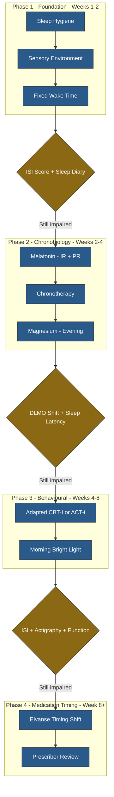

---
{"dg-publish":true,"permalink":"/research/sleep-intervention-protocols-for-au-dhd-adults/","tags":["sleep","ADHD","autism","AuDHD","melatonin","CBT-I","chronotherapy","sensory","magnesium","elvanse","intervention"],"dg-note-properties":{"type":"research","status":"active","date":"2026-03-27","tags":["sleep","ADHD","autism","AuDHD","melatonin","CBT-I","chronotherapy","sensory","magnesium","elvanse","intervention"],"summary":"Evidence-based sleep intervention protocols for AuDHD adults — melatonin, CBT-I adaptations, chronotherapy, sensory environment, stimulant timing, and magnesium","permalink":"obsidian/research/sleep-intervention-protocols-for-au-dhd-adults"}}
---

# Sleep Intervention Protocols for AuDHD Adults

> Companion note to [[research/Poor Sleep and AuDHD-HFE Interactions\|Poor Sleep and AuDHD-HFE Interactions]], which establishes why sleep is a central hub in Anthony's case. This note compiles the evidence for specific interventions, with PMIDs, key findings, and evidence ratings.

**Evidence Rating Key**
- **A** = Systematic review/meta-analysis or multiple high-quality RCTs
- **B** = Single well-designed RCT or multiple controlled studies
- **C** = Pilot study, open-label trial, or strong observational evidence
- **D** = Expert opinion, case series, or extrapolation from adjacent populations

> [!info]- Colour Key
> 🔵 Phase | 🟡 Gate

---

## 1. Melatonin

### 1.1 Dosing and Formulation

#### Immediate-Release (IR) vs Prolonged-Release (PR)

| Citation | Key Finding | Rating |
|----------|------------|--------|
| **Palagini L et al.** "International Expert Opinions and Recommendations on the Use of Melatonin in the Treatment of Insomnia and Circadian Sleep Disturbances in Adult Neuropsychiatric Disorders." *Front Psychiatry* 2021. PMID: [34177671](https://pubmed.ncbi.nlm.nih.gov/34177671/) | PR melatonin 2-10 mg, 1-2h before bedtime, recommended for insomnia in adults with ASD, ADHD, mood disorders, and schizophrenia. IR melatonin at **sub-milligram doses (<1 mg)** recommended specifically for circadian phase-shifting. | **B** |
| **Geoffroy PA et al.** "The use of melatonin in adult psychiatric disorders: Expert recommendations by the French institute of medical research on sleep (SFRMS)." *Encephale* 2019. PMID: [31248601](https://pubmed.ncbi.nlm.nih.gov/31248601/) | French expert consensus: melatonin useful in stabilised ADHD as adjuvant for insomnia and delayed sleep phase. Even at small chronobiotic doses (0.125 mg), melatonin synchronises circadian rhythm; soporific effect increases dose-dependently. | **B** |
| **Givler D et al.** "Chronic Administration of Melatonin: Physiological and Clinical Considerations." *Neurol Int* 2023. PMID: [36976674](https://pubmed.ncbi.nlm.nih.gov/36976674/) | Long-term melatonin at low-moderate doses (up to 5-6 mg) appears safe. Sleep-onset effect is modest for most people; sleep-maintenance effect is stronger with sustained-release preparations. Benefits established for ASD populations. | **B** |

#### Melatonin in ASD/ADHD — Key Trials

| Citation | Key Finding | Rating |
|----------|------------|--------|
| **Gringras P et al.** "Efficacy and Safety of Pediatric Prolonged-Release Melatonin for Insomnia in Children With Autism Spectrum Disorder." *J Am Acad Child Adolesc Psychiatry* 2017. PMID: [29096777](https://pubmed.ncbi.nlm.nih.gov/29096777/) | PR melatonin (2-5 mg) increased total sleep time by 57.5 min vs 9.1 min placebo (p=.034), reduced sleep latency by 39.6 min (p=.011) in ASD with/without ADHD. NNT = 3.38. | **A** |
| **Maras A et al.** "Long-Term Efficacy and Safety of Pediatric Prolonged-Release Melatonin for Insomnia in Children with Autism Spectrum Disorder." *J Child Adolesc Psychopharmacol* 2018. PMID: [30132686](https://pubmed.ncbi.nlm.nih.gov/30132686/) | 52-week follow-up: PR melatonin (2/5/10 mg) maintained +62 min total sleep time, -48.6 min sleep latency, -0.41 nightly awakenings vs baseline. 76% of completers achieved clinically meaningful improvement. No tolerance, no withdrawal effects. Caregiver QoL also improved. | **A** |
| **Malow BA et al.** "Sleep, Growth, and Puberty After 2 Years of Prolonged-Release Melatonin in Children With Autism Spectrum Disorder." *J Am Acad Child Adolesc Psychiatry* 2021. PMID: [31982581](https://pubmed.ncbi.nlm.nih.gov/31982581/) | 104-week follow-up: PR melatonin remained effective with no evidence of tolerance or safety concerns (fatigue 6.3%, somnolence 6.3% most common adverse events). | **A** |
| **Parvataneni T et al.** "Perspective on Melatonin Use for Sleep Problems in Autism and Attention-Deficit Hyperactivity Disorder: A Systematic Review of Randomized Clinical Trials." *Cureus* 2020. PMID: [32617211](https://pubmed.ncbi.nlm.nih.gov/32617211/) | Systematic review of 6 RCTs: melatonin 2-10 mg significantly improved sleep duration and sleep latency vs placebo across ASD and ADHD. Well tolerated and safe. | **A** |
| **Paditz E et al.** "The Pharmacokinetics, Dosage, Preparation Forms, and Efficacy of Orally Administered Melatonin for Non-Organic Sleep Disorders in ASD." *Children (Basel)* 2025. PMID: [40426828](https://pubmed.ncbi.nlm.nih.gov/40426828/) | Systematic review of 5 RCTs in ASD: recommends starting with **low-dose, non-delayed (IR) preparations** for rapid onset. Pharmacokinetic data suggests individual melatonin metabolism varies widely in ASD — start low, titrate up. | **A** |

#### Melatonin in ADHD Adults with DSPS — Direct Evidence

| Citation | Key Finding | Rating |
|----------|------------|--------|
| **van Andel E et al.** "Effects of chronotherapy on circadian rhythm and ADHD symptoms in adults with ADHD and DSPS: a randomized clinical trial." *Chronobiol Int* 2021. PMID: [33121289](https://pubmed.ncbi.nlm.nih.gov/33121289/) | RCT (n=51 adults with ADHD+DSPS): 0.5 mg/day melatonin advanced DLMO by 1h28 (p=.001) and **reduced ADHD symptoms by 14%** (p=.038). Effects reversed 2 weeks after cessation, confirming ongoing treatment needed. | **B** |

### 1.2 Practical Recommendations for Anthony

- **Circadian shifting**: IR melatonin 0.5 mg, timed 3h before current dim-light melatonin onset (likely ~20:30-21:00 given AuDHD evening chronotype)
- **Sleep-onset and maintenance**: PR melatonin 2 mg at bedtime, titrate to 5 mg if needed
- **Can combine both**: low-dose IR for circadian shift + PR for sleep maintenance (per Palagini et al.)
- **No tolerance seen** in up to 2-year follow-up studies
- **Iron interaction note**: melatonin has antioxidant properties and may offer some ferroptosis protection — a secondary benefit given HFE status (see [[research/Ferroptosis and Neuronal Iron\|Ferroptosis and Neuronal Iron]])

---

## 2. CBT-I Adapted for Neurodivergent Adults

### 2.1 Why Standard CBT-I May Fail in AuDHD

Standard CBT-I relies on:
- **Sleep restriction** — difficult when ADHD executive dysfunction prevents schedule adherence
- **Stimulus control** (leave bed if awake >20 min) — problematic for autistic adults with transition difficulties and sensory need for familiar environment
- **Cognitive restructuring** — may miss the point when insomnia is driven by sensory overload or circadian biology rather than maladaptive cognitions
- **Homework compliance** — executive function demands are high

### 2.2 Evidence for Adapted Approaches

| Citation | Key Finding | Rating |
|----------|------------|--------|
| **Cullen M et al.** "Effectiveness of Cognitive Behavioural Therapy for Insomnia (CBT-I) in Individuals With Neurodevelopmental Conditions: A Systematic Review." *J Sleep Res* 2025. PMID: [40180888](https://pubmed.ncbi.nlm.nih.gov/40180888/) | Systematic review of 8 studies (n=598, ASD and/or ADHD): CBT-I showed significant short-term effectiveness but improvements were **mostly not maintained at follow-up**. Quality was moderate. Key gap: no consensus on how to adapt CBT-I for neurodevelopmental populations. | **B** |
| **Jernelov S et al.** "Effects and clinical feasibility of a behavioral treatment for sleep problems in adult ADHD." *BMC Psychiatry* 2019. PMID: [31340804](https://pubmed.ncbi.nlm.nih.gov/31340804/) | Pilot study (n=19 ADHD adults): 10-week group CBT-i adapted for ADHD reduced ISI by 4.5 points at post-treatment, **6.8 points at 3-month follow-up** (both p<.01). 79% were on stimulant medication. Shows CBT-i is feasible and effective in medicated ADHD adults. | **C** |
| **Lawson LP et al.** "ACT-i, an insomnia intervention for autistic adults: a pilot study." *Behav Cogn Psychother* 2023. PMID: [36537291](https://pubmed.ncbi.nlm.nih.gov/36537291/) | Pilot (n=8 autistic adults): Acceptance and Commitment Therapy for insomnia (ACT-i) significantly improved ISI (p=.006) and anxiety (p=.015). 5/8 showed clinically reliable improvement. Rated highly acceptable by participants. ACT's emphasis on psychological flexibility rather than thought challenging may be better suited to autism. | **C** |
| **Kragh M et al.** "Efficacy of a Transdiagnostic Sleep and Circadian Intervention for Outpatients With Sleep Problems and Depression, ADHD, or Bipolar Disorder: A Randomised Controlled Trial." *J Sleep Res* 2026. PMID: [40345174](https://pubmed.ncbi.nlm.nih.gov/40345174/) | RCT (n=88, including ADHD): transdiagnostic intervention combining CBT-I with chronotherapy significantly improved sleep quality (p<.001), reduced insomnia severity (p<.001), and improved well-being, recovery, and work ability vs sleep hygiene alone. 6 individual sessions. | **B** |
| **Spaargaren KL et al.** "Protocol of a randomized controlled trial into guided internet-delivered CBT-I for insomnia in autistic adults (i-Sleep Autism)." *Contemp Clin Trials* 2024. PMID: [39357740](https://pubmed.ncbi.nlm.nih.gov/39357740/) | RCT protocol (n=160 planned): co-created with autistic adults, adapting existing i-Sleep intervention. Includes sensory and information processing accommodations. **Trial ongoing** — watch for results. | **D** (protocol only) |
| **Bijlenga D et al.** "The role of the circadian system in the etiology and pathophysiology of ADHD: time to redefine ADHD?" *Atten Defic Hyperact Disord* 2019. PMID: [30927228](https://pubmed.ncbi.nlm.nih.gov/30927228/) | Review establishing DSPS prevalence at 73-78% in ADHD. Argues that a substantial ADHD subgroup has chronic sleep disorders as root cause of symptoms. Recommends chronotherapy + sleep hygiene + specific sleep disorder treatment **before or alongside ADHD medication**. | **B** |

### 2.3 Key Adaptations for AuDHD CBT-I

Based on the above evidence:
1. **Replace rigid sleep restriction with gradual sleep window compression** — less executive demand
2. **Use ACT-based approaches** (acceptance, defusion) instead of pure cognitive restructuring — suits autistic thinking styles
3. **Combine with chronotherapy** (light, melatonin, fixed wake time) — targets the ADHD circadian biology
4. **Build in external structure** (alarms, apps, visual schedules) — accommodates ADHD executive dysfunction
5. **Address sensory environment explicitly** — not a standard CBT-I component but essential for autism
6. **Internet-delivered** formats may suit autistic adults who prefer reduced social demand

---

## 3. Chronotherapy

### 3.1 Evidence for Morning Bright Light + Fixed Wake Times in ADHD

| Citation | Key Finding | Rating |
|----------|------------|--------|
| **van Andel E et al.** "Effects of chronotherapy on circadian rhythm and ADHD symptoms in adults with ADHD and DSPS." *Chronobiol Int* 2021. PMID: [33121289](https://pubmed.ncbi.nlm.nih.gov/33121289/) | RCT (n=51): melatonin 0.5 mg advanced DLMO by 1h28; melatonin + 30-min morning bright light (10,000 lux, 07:00-08:00) advanced DLMO by 1h58 (p<.001). However, melatonin alone reduced ADHD symptoms while the combination did not — possibly because early morning light was burdensome and reduced compliance. | **B** |
| **van Andel E et al.** "ADHD and Delayed Sleep Phase Syndrome in Adults: A Randomized Clinical Trial on the Effects of Chronotherapy on Sleep." *J Biol Rhythms* 2022. PMID: [36181304](https://pubmed.ncbi.nlm.nih.gov/36181304/) | Secondary analysis of the same RCT: despite DLMO advancing, actual sleep times did **not** advance to match. Conclusion: chronotherapy shifts the clock but **extensive behavioral coaching is needed to shift behavior along with it**. | **B** |
| **van Andel E et al.** "Effects of Chronotherapeutic Interventions in Adults With ADHD and DSPS on Regulation of Appetite and Glucose Metabolism." *J Atten Disord* 2024. PMID: [39318134](https://pubmed.ncbi.nlm.nih.gov/39318134/) | Exploratory: melatonin treatment altered appetite-regulating hormones (decreased leptin and insulin), suggesting chronotherapy may affect metabolic regulation beyond sleep. | **C** |
| **Bijlenga D et al.** "The role of the circadian system in ADHD." *Atten Defic Hyperact Disord* 2019. PMID: [30927228](https://pubmed.ncbi.nlm.nih.gov/30927228/) | Review: 73-78% of ADHD adults have delayed circadian rhythm. Proposes chronotherapy (bright light, melatonin, fixed wake time) as adjunctive ADHD treatment. Recommends phase-advancing protocol as standard of care. | **B** |

### 3.2 Practical Protocol for Anthony

Based on the van Andel trial results:
1. **Low-dose melatonin** (0.5 mg) timed 3h before current DLMO, advancing weekly by 1h
2. **Morning bright light** (10,000 lux, 30 min) — but must be paired with behavioral structure
3. **Fixed wake time 7 days/week** — the single most important anchor
4. **Critical insight**: the clock can advance without behaviour following — needs external structure (alarm, accountability, morning routine reward)
5. Consider a **dawn simulator** as lower-demand alternative to light box for the autism sensory profile

---

## 4. Sensory Environment Interventions

### 4.1 Weighted Blankets

| Citation | Key Finding | Rating |
|----------|------------|--------|
| **Ekholm B et al.** "A randomized controlled study of weighted chain blankets for insomnia in psychiatric disorders." *J Clin Sleep Med* 2020. PMID: [32536366](https://pubmed.ncbi.nlm.nih.gov/32536366/) | RCT (n=120, MDD/BD/GAD/ADHD): weighted chain blanket significantly reduced ISI vs light blanket (Cohen's d = **1.90**, large effect). Improved sleep maintenance, daytime activity, reduced fatigue/depression/anxiety. Effects maintained at 12-month open follow-up. **Included ADHD patients.** | **B** |
| **Yu J et al.** "Effect of weighted blankets on sleep quality among adults with insomnia: a pilot randomized controlled trial." *BMC Psychiatry* 2024. PMID: [39501163](https://pubmed.ncbi.nlm.nih.gov/39501163/) | Pilot RCT (n=102): weighted blanket group showed significantly greater PSQI improvement (-4.1 vs -2.0, p=.006), plus reduced anxiety, stress, fatigue, and pain. Actigraphy showed trend toward fewer awakenings. | **B** |
| **Wong S et al.** "The effect of weighted blankets on sleep quality and mental health symptoms in people with psychiatric disorders: A systematic review and meta-analysis." *J Psychiatr Res* 2024. PMID: [39341068](https://pubmed.ncbi.nlm.nih.gov/39341068/) | SR/MA (9 studies, n=553, psychiatric populations including ADHD and autism): weighted blankets significantly reduced anxiety (SMD=-0.47, p<.001). Mixed evidence for insomnia specifically but trend toward benefit. | **B** |
| **Zhao Y et al.** "Safety and effectiveness of weighted blankets for symptom management in patients with mental disorders." *Complement Ther Med* 2024. PMID: [39447684](https://pubmed.ncbi.nlm.nih.gov/39447684/) | SR/MA (8 RCTs, n=426): small-magnitude decrease in anxiety (SMD=0.40). Sensitivity analysis of homogeneous studies showed significant ISI reduction (MD=-2.78, p=.001). No serious adverse events. | **B** |

### 4.2 Sensory Processing and Sleep in Autism

| Citation | Key Finding | Rating |
|----------|------------|--------|
| **Lane SJ et al.** "Sleep, Sensory Integration/Processing, and Autism: A Scoping Review." *Front Psychol* 2022. PMID: [35656493](https://pubmed.ncbi.nlm.nih.gov/35656493/) | Scoping review (24 studies): co-existence of sleep concerns and sensory integration/processing differences is frequently reported in autism. Both hyper- and hypo-reactivity linked to sleep disruption. Pressure-based and movement-based interventions show promise but lack rigorous study. | **C** |
| **Goldman SE et al.** "Characterizing Sleep in Adolescents and Adults with Autism Spectrum Disorders." *J Autism Dev Disord* 2017. PMID: [28286917](https://pubmed.ncbi.nlm.nih.gov/28286917/) | ASD adolescents/adults (n=28 vs 13 TD): longer sleep latencies, more difficulty going to bed and falling asleep. Insomnia is multifactorial — not solely physiological (melatonin). Poor sleep hygiene present in both groups. | **C** |

### 4.3 Practical Sensory Protocol for Anthony

Based on the evidence and the autism sensory profile:
- **Weighted blanket** (8-12 kg): strong evidence for insomnia in psychiatric populations including ADHD; the deep pressure input addresses proprioceptive seeking common in autism
- **Complete blackout**: eliminate all light sources (particularly blue/green wavelengths) — addresses visual hyper-reactivity
- **Consistent sound masking** (white/pink noise or brown noise): blocks auditory triggers; no specific ASD RCT but mechanistic rationale is strong given auditory hyper-reactivity
- **Temperature control**: cool room (16-18°C) — sensory overheating is a common autistic sleep disruptor
- **Consistent tactile environment**: same bedding texture, avoid changes — supports routine and reduces sensory surprises

---

## 5. Stimulant Timing Optimisation (Elvanse / Lisdexamfetamine)

### 5.1 Available Evidence

| Citation | Key Finding | Rating |
|----------|------------|--------|
| **Giblin JM & Strobel AL.** "Effect of lisdexamfetamine dimesylate on sleep in children with ADHD." *J Atten Disord* 2011. PMID: [20574056](https://pubmed.ncbi.nlm.nih.gov/20574056/) | Pilot RCT (n=24 children): LDX did not significantly increase latency to persistent sleep vs placebo on PSG. No significant objective sleep disturbance. However, small sample; authors urge caution in generalising. | **C** |
| **Wynchank D et al.** "Adult ADHD and Insomnia: an Update of the Literature." *Curr Psychiatry Rep* 2017. PMID: [29086065](https://pubmed.ncbi.nlm.nih.gov/29086065/) | Review: stimulants can both improve and worsen sleep. In some ADHD adults, stimulants reduce hyperarousal-driven insomnia; in others, they delay sleep onset. Individual variation is high. Late-day residual effects relevant for long-acting formulations. | **B** |
| **Kooij JJS et al.** "Updated European Consensus Statement on diagnosis and treatment of adult ADHD." *Eur Psychiatry* 2019. DOI: 10.1016/j.eurpsy.2018.11.001 | European consensus: recommends addressing sleep as part of ADHD treatment. Earlier dosing of long-acting stimulants can reduce sleep-onset effects. If insomnia persists, consider melatonin as adjunct. | **B** |
| **Ermer J et al.** "Lisdexamfetamine Dimesylate: Prodrug Delivery, Amphetamine Exposure and Duration of Efficacy." *Clin Drug Invest* 2016. DOI: 10.1007/s40261-015-0354-y | Pharmacokinetic review: LDX has extended Tmax and lower Cmax vs IR d-amphetamine. Therapeutic action extends 10-14 hours post-dose. At 70 mg, d-amphetamine plasma levels remain significant for ~13-14 hours. | **B** |

### 5.2 Practical Implications for Anthony

At **Elvanse 70 mg** (highest standard dose):
- Pharmacokinetic duration: **13-14 hours** of active d-amphetamine
- If taken at 08:00 → active until ~21:00-22:00
- If taken at 07:00 → active until ~20:00-21:00
- **Every 1 hour earlier = 1 hour less evening stimulant exposure**

Recommendations:
1. **Take Elvanse as early as feasible** — ideally 06:30-07:00 with breakfast
2. This is challenging with ADHD delayed sleep phase — creates a conflict between "take meds early" and "wake up early"
3. **Resolve by anchoring wake time first** (chronotherapy) then shifting meds earlier
4. If sleep remains problematic, discuss with prescriber: some clinicians use **earlier dosing + low-dose IR short-acting top-up at midday** rather than one large long-acting dose
5. Monitor: if earlier dosing reduces afternoon/evening coverage, this may affect TTM control (see [[neurodevelopment/Trichotillomania and Neurodevelopmental Links\|Trichotillomania and Neurodevelopmental Links]])

> **Note**: There is no published RCT directly testing "earlier vs later Elvanse dosing" on sleep outcomes. Evidence is extrapolated from pharmacokinetics and expert consensus. This is a significant evidence gap.

---

## 6. Magnesium for Sleep

### 6.1 General Sleep Evidence

| Citation | Key Finding | Rating |
|----------|------------|--------|
| **Hausenblas HA et al.** "Magnesium-L-threonate improves sleep quality and daytime functioning in adults with self-reported sleep problems." *Sleep Med X* 2024. PMID: [39252819](https://pubmed.ncbi.nlm.nih.gov/39252819/) | RCT (n=80): Mg-L-threonate 1g/day for 21 days significantly improved deep sleep score, REM sleep score, energy, mood, and mental alertness vs placebo. Mg-threonate is notable for brain bioavailability. | **B** |
| **Schuster J et al.** "Magnesium Bisglycinate Supplementation in Healthy Adults Reporting Poor Sleep." *Nat Sci Sleep* 2025. PMID: [40918053](https://pubmed.ncbi.nlm.nih.gov/40918053/) | RCT (n=155): Mg bisglycinate 250 mg elemental/day significantly reduced ISI vs placebo at 4 weeks (p=.049). Effect size was small (Cohen's d=0.2). Greater improvement in those with lower baseline dietary Mg. | **B** |
| **Nielsen FH et al.** "Magnesium supplementation improves indicators of low magnesium status and inflammatory stress in adults older than 51 years with poor quality sleep." *Magnes Res* 2010. PMID: [21199787](https://pubmed.ncbi.nlm.nih.gov/21199787/) | RCT (n=100): Mg supplementation improved sleep-related inflammatory markers (CRP) in those with low baseline Mg. PSQI improved in both groups (possible placebo effect confounded). Establishes Mg status-sleep quality association. | **C** |

### 6.2 Magnesium in ADHD/Autism Context

| Citation | Key Finding | Rating |
|----------|------------|--------|
| **Mousain-Bosc M et al.** "Magnesium VitB6 intake reduces central nervous system hyperexcitability in children." *J Am Coll Nutr* 2004. PMID: [15466962](https://pubmed.ncbi.nlm.nih.gov/15466962/) | Open study (n=52 hyperexcitable children, 30 with low erythrocyte Mg): Mg + B6 (100 mg/day) for 1-6 months normalised erythrocyte Mg and significantly reduced hyperexcitability symptoms including agitation, attention deficits, and muscle hypertonicity. | **C** |
| **Arnold LE.** "Alternative treatments for adults with ADHD." *Ann N Y Acad Sci* 2001. PMID: [11462750](https://pubmed.ncbi.nlm.nih.gov/11462750/) | Review: magnesium supplementation listed among treatments with "promising prospective pilot data" for ADHD. Noted that Mg deficiency is common in ADHD and supplementation may benefit a subgroup with confirmed low status. | **D** |
| **Cortese S et al.** "Sleep Disorders in Children and Adolescents with Autism Spectrum Disorder: Diagnosis, Epidemiology, and Management." *CNS Drugs* 2020. PMID: [32112261](https://pubmed.ncbi.nlm.nih.gov/32112261/) | Comprehensive review: identifies melatonin as having the strongest evidence (large effect sizes in meta-analysis of 5 RCTs). Does not provide RCT evidence for magnesium specifically in ASD sleep, reflecting the evidence gap. | **A** (for the review; **D** for Mg in ASD sleep specifically) |

### 6.3 Practical Recommendations for Anthony

- **Best evidence forms for sleep**: Mg-L-threonate (brain bioavailability, RCT evidence) or Mg bisglycinate (RCT evidence, good tolerability)
- **Dose**: 200-400 mg elemental magnesium, taken in the evening
- **Rationale beyond sleep**: Mg is a cofactor for >300 enzymes including those involved in GABA synthesis, neurotransmitter regulation, and inflammatory modulation — all relevant to AuDHD
- **Iron interaction note**: Mg and iron compete for absorption; take Mg supplements **at a different time of day** from any iron-containing foods/supplements
- **Evidence gap**: no published RCT of magnesium for sleep specifically in ADHD or autism adults — current evidence is extrapolated from general population RCTs and ADHD symptom studies
- **HFE relevance**: Mg deficiency increases oxidative stress; repletion may offer secondary antioxidant benefit (see [[minerals/Copper-Zinc-Iron Interactions\|Copper-Zinc-Iron Interactions]])

---

## 7. Integrated Protocol Summary

Based on the totality of evidence reviewed, a staged intervention protocol:

### Phase 1 — Immediate (Week 1-2)
| Intervention | Action | Evidence Level |
|-------------|--------|---------------|
| Sensory environment | Weighted blanket, blackout, sound masking, cool room | B |
| Fixed wake time | Set consistent alarm 7 days/week, regardless of sleep quality | B |
| Elvanse timing | Shift to within 30 min of waking, aim for 06:30-07:00 | B (extrapolated) |

### Phase 2 — Add Melatonin (Week 2-4)
| Intervention | Action | Evidence Level |
|-------------|--------|---------------|
| IR melatonin | 0.5 mg, 3h before target bedtime, for circadian shift | B |
| PR melatonin | 2 mg at bedtime, titrate to 5 mg if needed for maintenance | A |
| Magnesium | Mg-L-threonate or bisglycinate, 200-400 mg elemental, evening | B |

### Phase 3 — Add Light Therapy (Week 4-6)
| Intervention | Action | Evidence Level |
|-------------|--------|---------------|
| Morning bright light | 10,000 lux for 20-30 min within 1h of waking | B |
| OR dawn simulator | Gradual light increase 30 min before alarm (lower sensory demand) | D |

### Phase 4 — Behavioural (Week 6+)
| Intervention | Action | Evidence Level |
|-------------|--------|---------------|
| Adapted CBT-I/ACT-i | ACT-based approach preferred over traditional CBT-I; online delivery may suit | C |
| Transdiagnostic sleep intervention | Combines CBT-I + chronotherapy in 6 sessions (Kragh et al. model) | B |

---

## 8. Evidence Gaps and Watch List

- **No RCT of melatonin specifically in AuDHD adults** — adult evidence is from ADHD+DSPS (van Andel) or extrapolated from paediatric ASD trials
- **No RCT of Elvanse timing on sleep** — pharmacokinetic reasoning only
- **No RCT of magnesium for sleep in ADHD/ASD** — extrapolated from general population
- **i-Sleep Autism trial** (PMID: [39357740](https://pubmed.ncbi.nlm.nih.gov/39357740/)) — internet CBT-I co-designed with autistic adults, results pending
- **White noise/sound masking in autism** — mechanistic rationale strong but no sleep-focused RCT identified
- **Iron status and melatonin synthesis**: tryptophan hydroxylase is iron-dependent; iron overload could theoretically alter endogenous melatonin production — unstudied intersection relevant to HFE (see [[research/Iron and Circadian Rhythm\|Iron and Circadian Rhythm]], [[iron-metabolism/Tryptophan-Kynurenine Pathway\|Tryptophan-Kynurenine Pathway]])

---

## Cross-References

- [[research/Poor Sleep and AuDHD-HFE Interactions\|Poor Sleep and AuDHD-HFE Interactions]]
- [[research/Iron and Circadian Rhythm\|Iron and Circadian Rhythm]]
- [[neurodevelopment/Elvanse and Mineral Metabolism\|Elvanse and Mineral Metabolism]]
- [[research/Ferroptosis and Neuronal Iron\|Ferroptosis and Neuronal Iron]]
- [[iron-metabolism/Tryptophan-Kynurenine Pathway\|Tryptophan-Kynurenine Pathway]]
- [[neurodevelopment/Trichotillomania and Neurodevelopmental Links\|Trichotillomania and Neurodevelopmental Links]]
- [[neurodevelopment/Iron-Dopamine-ADHD Axis\|Iron-Dopamine-ADHD Axis]]
- [[neurodevelopment/Late-Diagnosed Autism - Distinct Profile\|Late-Diagnosed Autism - Distinct Profile]]
- [[neurodevelopment/ADHD-PI and Internal Hyperactivity\|ADHD-PI and Internal Hyperactivity]]
- [[minerals/Copper-Zinc-Iron Interactions\|Copper-Zinc-Iron Interactions]]
- [[diet-management/Diet and Supplement Strategy\|Diet and Supplement Strategy]]
- [[symptoms/Fatigue and Burnout\|Fatigue and Burnout]]
- [[Health Research MOC\|Health Research MOC]]
