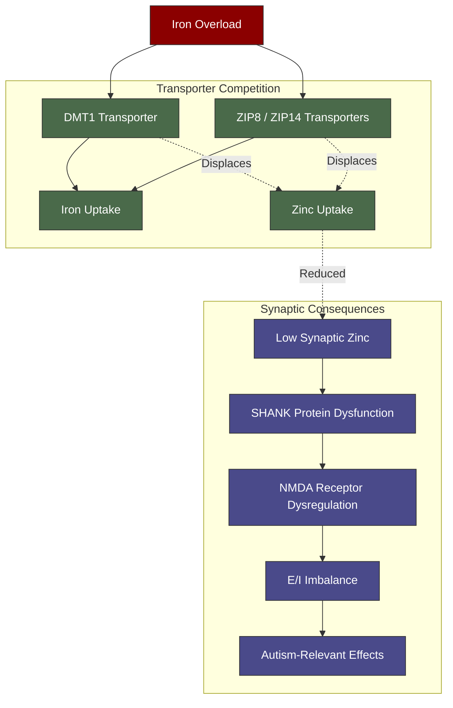

---
{"dg-publish":true,"permalink":"/research/zinc-iron-brain-competition/","tags":["zinc","iron","brain","DMT1","ZIP","ZnT","NMDA","SHANK","autism","glutamate"],"dg-note-properties":{"type":"research","status":"active","date":"2026-03-21","tags":["zinc","iron","brain","DMT1","ZIP","ZnT","NMDA","SHANK","autism","glutamate"],"summary":"Zinc and iron compete at the brain level via shared transporters — zinc modulates NMDA receptors and SHANK proteins critical for autism neurobiology","permalink":"research/zinc-iron-brain-competition"}}
---


# Zinc and Iron Competition at Brain Level

> [!info]- Colour Key
> 🔴 Overload | 🟢 Transport | 🔵 Consequence



## Beyond Gut Absorption

The [[minerals/Copper-Zinc-Iron Interactions\|Copper-Zinc-Iron Interactions]] note covers intestinal absorption competition. This note focuses on **brain-level zinc-iron interactions** — including transport, neurotransmitter modulation, and direct relevance to autism and ADHD.

## Transport Overlap in the Brain

### DMT1 in the Brain

> **Garrick MD et al.** "Iron, copper, and zinc transport: inhibition of DMT1 and hCTR1 by shRNA." *Biometals*. 2012;25(6):1177-1184. PMID: 22068728
> - DMT1 is expressed in brain endothelial cells and neurons
> - While zinc has **lower affinity** for DMT1 than iron (transport affinity: Mn > Cd > Fe > Pb > Co > Ni > Zn), there is still competition
> - In iron overload states, DMT1 upregulation for iron transport may further displace zinc

### ZIP Transporters

> **Bowers K, Bhatt DK et al.** "Current understanding of ZIP and ZnT zinc transporters in human health and diseases." *Cell Mol Life Sci*. 2024;81:241. PMC11113243
> - **ZIP family (SLC39A)**: imports zinc into the cytosol
> - **ZIP8 (SLC39A8)** and **ZIP14 (SLC39A14)** transport both zinc AND iron — creating direct competition
> - These same transporters are the primary uptake route for **NTBI** (see [[research/NTBI in the Brain\|NTBI in the Brain]])
> - In iron overload, NTBI saturating ZIP8/ZIP14 could reduce zinc uptake

### ZnT Transporters

> **ZnT family (SLC30A)**: exports zinc from the cytosol
> - **ZnT3 (SLC30A3)** packages zinc into glutamatergic synaptic vesicles
> - **ZnT1 (SLC30A1)** mediates zinc inhibition of NMDA receptors at the postsynaptic density

### The Competition at the BBB

> **Yokel RA.** New evidence of iron and zinc interplay at the enterocyte and neural tissues. *J Nutr*. 2006;136(4):1126-1127
> - DMT1 may import zinc into brain capillary endothelial cells
> - Other transporters then mediate export into brain parenchyma
> - Competition at this level could create brain zinc deficiency even when systemic zinc is adequate

## Synaptic Zinc — The Hidden Neurotransmitter

Zinc is co-released with glutamate from excitatory synapses and acts as a **neuromodulator**. This is entirely distinct from its enzymatic roles.

> **McAllister BB, Bhatt DK et al.** "Zinc transporter 3 (ZnT3) and vesicular zinc in central nervous system function." *Neurosci Biobehav Rev*. 2017;80:329-350
> - ZnT3 packages zinc into presynaptic vesicles of excitatory neurons
> - During synaptic transmission, zinc is **co-released with glutamate**
> - Released zinc modulates postsynaptic receptors, particularly **NMDA receptors**

### Zinc Modulation of NMDA Receptors

> **Anderson CT et al.** "Modulation of extrasynaptic NMDA receptors by synaptic and tonic zinc." *PNAS*. 2015;112(20):E2705-E2714. PMC4443361
> - GluN2A-containing NMDARs are highly sensitive to nanomolar zinc concentrations
> - Zinc **inhibits** NMDAR function — acting as a natural brake on glutamate excitation
> - This makes synaptic zinc a critical component of **excitatory/inhibitory balance**

> **Medvedeva YV et al.** "Synaptic zinc inhibition of NMDA receptors depends on the association of GluN2A with the zinc transporter ZnT1." *Sci Adv*. 2020;6(27):eabb1515. PMC7458442
> - ZnT1 at the postsynaptic density directly associates with GluN2A subunits
> - Creates a zinc microdomain that locally modulates NMDAR function
> - Intracellular zinc signalling enhances ZnT1-GluN2A interaction

## Zinc, NMDA Receptors, and Autism

> **Nishito Y et al.** "The role of zinc and NMDA receptors in autism spectrum disorders." *Pharmaceuticals*. 2023;16(1):1. PMC9866730
> - Both NMDARs and zinc are **strongly linked to ASD**
> - Zinc-dependent regulation of **SHANK proteins** (SHANK2 and SHANK3) is a critical mechanism
> - SHANK proteins form the backbone of the postsynaptic density
> - Mutations in SHANK2 and SHANK3 are among the **most common single-gene causes of autism**
> - **Dietary zinc supplementation enhances SHANK2/SHANK3 synaptic recruitment and rescues NMDAR deficits in ASD mouse models**

### The SHANK-Zinc-NMDAR Axis

```
Zinc released from presynaptic terminal
        |
        v
Inhibits GluN2A-NMDAR (prevents overexcitation)
        |
        v
Also promotes SHANK2/SHANK3 recruitment to PSD
        |
        v
SHANK proteins stabilise NMDAR and AMPAR at synapse
        |
        v
Proper excitatory synapse function
```

If zinc is depleted (due to iron competition):
- NMDAR inhibition is lost -> excitatory/inhibitory imbalance
- SHANK recruitment is impaired -> synapse instability
- Both mechanisms converge on autism-relevant pathology

## Iron Overload -> Zinc Depletion -> Autism Worsening

For HFE carriers with iron overload and autism:

1. **Systemic iron overload** suppresses zinc absorption (gut competition via DMT1)
2. **Low systemic zinc** (12.5 umol/L, 12% into range) means less zinc delivered to the brain
3. **At the BBB**, iron-loaded ZIP8/ZIP14 transporters may further reduce zinc entry
4. **In synapses**, reduced vesicular zinc means:
   - Less NMDA receptor inhibition -> more excitotoxicity (connects to [[research/Iron Glutamate and Excitotoxicity\|Iron Glutamate and Excitotoxicity]])
   - Less SHANK protein stabilisation -> synapse dysfunction
   - Worsened E/I imbalance -> worsened autism symptoms
5. **Iron also directly increases glutamate release** via System Xc- -> double hit on excitatory signalling

## Clinical Implications

1. **Zinc supplementation** has evidence in ASD (via SHANK/NMDAR pathway) — but must be timed away from iron-rich meals
2. **Iron reduction** (phlebotomy) may naturally improve zinc absorption and brain zinc levels
3. **Erythrocyte zinc** is a more reliable measure than serum zinc and should be tested
4. **The combination of low zinc + high iron** may be a specific risk signature for worsened autism symptoms
5. **Zinc carnosine** or **zinc picolinate** may have better brain bioavailability than zinc gluconate
6. **Selenium status** should also be checked — selenium is required for GPX4 (ferroptosis defence) and some selenoproteins interact with zinc transporters

---

## Cross-References
- [[minerals/Copper-Zinc-Iron Interactions\|Copper-Zinc-Iron Interactions]]
- [[research/Iron Glutamate and Excitotoxicity\|Iron Glutamate and Excitotoxicity]]
- [[research/Iron and GABAergic Function\|Iron and GABAergic Function]]
- [[research/Iron and Oxidative Stress in Autism\|Iron and Oxidative Stress in Autism]]
- [[research/NTBI in the Brain\|NTBI in the Brain]]
- [[lab-results/Blood Results - March 2026\|Blood Results - March 2026]]
- [[Health Research MOC\|Health Research MOC]]
