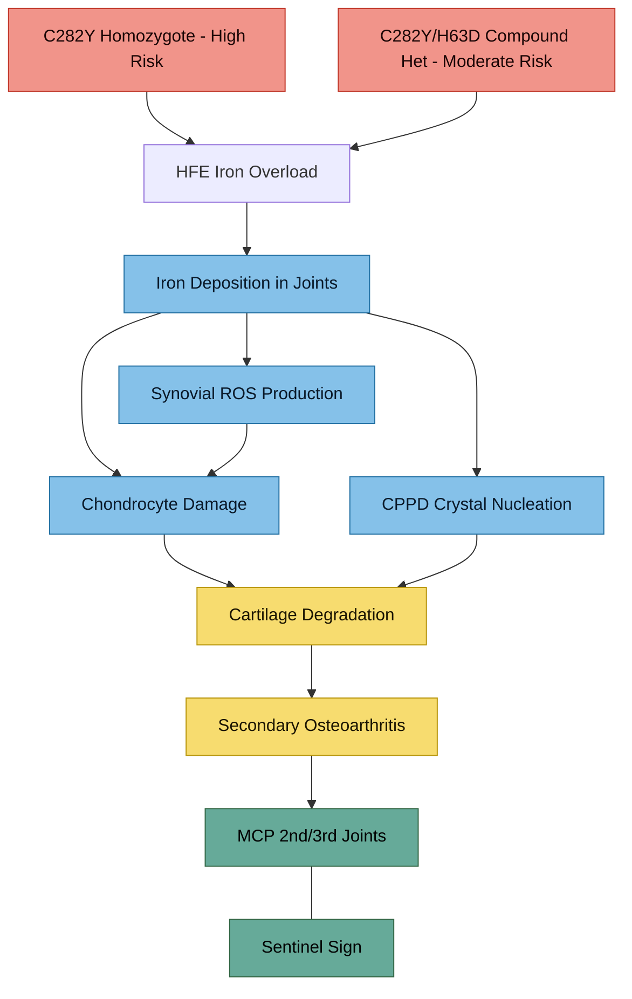

---
{"dg-publish":true,"permalink":"/symptoms/arthropathy-and-back-pain/","tags":["arthropathy","back-pain","haemochromatosis","musculoskeletal","iron-deposition","joints"],"dg-note-properties":{"date":"2026-03-17","type":"research","status":"active","tags":["arthropathy","back-pain","haemochromatosis","musculoskeletal","iron-deposition","joints"],"summary":"HFE haemochromatosis arthropathy patterns, lumbar involvement, and imaging recommendations","aliases":["Back Pain","Joint Pain","HH Arthropathy"],"permalink":"symptoms/arthropathy-and-back-pain"}}
---

# Arthropathy and Back Pain

## Your Symptom
Aching lower back — persistent. In context of [[genetics/HFE Compound Heterozygosity\|C282Y/H63D compound heterozygosity]], prior ferritin ~700 ug/L, and current [[iron-metabolism/Transferrin Saturation - Clinical Significance\|TSAT 60%]].

## Pathogenesis Overview

> [!info]- Colour Key
> 🟠 Risk | 🔵 Mechanism | 🔴 Outcome | 🟢 Sentinel

## Haemochromatosis Arthropathy — Overview

Joint disease is one of the most common and earliest manifestations of genetic haemochromatosis. It often **precedes diagnosis by years** and can occur even in compound heterozygotes with modest iron loading.

> **Kiely PDW.** "Haemochromatosis arthropathy — a conundrum of the Celtic curse." *J R Coll Physicians Edinb.* 2018;48(3):233-238
> - Arthropathy occurs in ~30-50% of C282Y homozygotes at presentation
> - **Joint symptoms often do not improve with de-ironing therapy** — unlike liver/cardiac endpoints
> - Iron deposition in cartilage triggers chondrocyte damage and secondary osteoarthritis
> - Penetrance to clinical iron overload in C282Y homozygotes: estimates range from <1% to 29% of men over 40

### The Distinctive Pattern
Classic haemochromatosis arthropathy targets:
- 2nd and 3rd metacarpophalangeal (MCP) joints (hands)
- Wrists, hips, knees, ankles
- **Spine** — lumbar and cervical involvement documented

> **Hemochromatosis Arthropathy chapter** — Springer, Kiely PDW. 2022
> - Recognisable as an osteoarthritis-like phenotype with accelerated features
> - Early age of onset, rapidly progressive, florid cysts and osteophytes on imaging
> - **Subcortical cysts and large osteophytes** are hallmarks

### Does It Happen in Compound Heterozygotes?

Yes — though less studied than in C282Y homozygotes:

> **Toama W et al.** "Iron study is a weak indicator in symptomatic C282Y/H63D compound heterozygotes." 2015
> - Compound heterozygotes CAN present with haemochromatosis-like symptoms including arthritis
> - Iron studies alone may underestimate tissue iron loading
> - Symptomatic compound hets exist and deserve investigation

> **Camacho A et al.** "Effect of C282Y genotype on self-reported musculoskeletal complications in hereditary hemochromatosis." *PLoS One.* 2015
> - Musculoskeletal complaints are common across HFE genotypes
> - Not limited to C282Y homozygotes

### UK Biobank Evidence

> **Banfield LR et al.** "Hemochromatosis genetic variants and musculoskeletal outcomes: 11.5-year follow-up in the UK Biobank cohort study." *JBMR Plus.* 2023;7:e10794
> - Large-scale study examining musculoskeletal outcomes by HFE genotype
> - Iron overload disorder associated with excess musculoskeletal morbidity
> - C282Y homozygosity carried highest risk, but compound hets were not zero-risk

### Haemochromatosis UK Patient Guidance
> "Many older people with genetic haemochromatosis experience arthropathy and associated acute joint pain... It is assumed that ongoing iron overload is the principal cause of joint damage, however this may not be the only explanation. Most patients find that removal of excess iron from the body makes little difference to joint stiffness or pain."
> — haemochromatosis.org.uk/arthropathy

## Mechanisms of Iron-Related Joint Damage

1. **Iron deposition in synovium and cartilage** — direct chondrotoxicity
2. **Calcium pyrophosphate crystal deposition (CPPD)** — iron promotes crystal nucleation
3. **Oxidative damage** — iron-catalysed ROS in avascular cartilage
4. **Inflammatory cytokine activation** — iron activates macrophages in joint tissue

## Lower Back Specifically

Iron deposition in the spine is less studied than hands/wrists but documented:
- Lumbar disc degeneration can be accelerated
- Facet joint involvement possible
- Iron deposition in paraspinal muscles contributes to stiffness

### Other Contributing Factors in Your Case
- **Sedentary patterns from ADHD executive dysfunction** — prolonged sitting
- **Elvanse-related tension** — stimulants can increase muscle tension
- **Autistic proprioception differences** — may affect posture/ergonomics
- **Age 37** — early for degenerative back pain, but within range for HH arthropathy onset

## What to Discuss With Your Doctor

1. **X-ray of lumbar spine and hands** — look for haemochromatosis-pattern changes (hook-like osteophytes at MCPs, disc/facet changes in spine)
2. **MRI lumbar spine** if X-ray shows changes or pain persists
3. **Calcium pyrophosphate screening** — synovial fluid analysis if any acute flares
4. **Whether iron reduction might slow progression** — evidence is mixed but early intervention may help more than late

## Important Caveat
Joint damage from iron overload may be **irreversible** even after de-ironing. This is one of the strongest arguments for **early and proactive iron management** in your case, despite the "low risk" genotype label.

---

## Key References
1. Kiely PDW. Haemochromatosis arthropathy. *J R Coll Physicians Edinb.* 2018;48(3):233-238
2. Kiely PDW. Hemochromatosis Arthropathy (Springer chapter). 2022;pp.111-123
3. Banfield LR et al. HH genetic variants and musculoskeletal outcomes. *JBMR Plus.* 2023;7:e10794
4. Camacho A et al. C282Y genotype and musculoskeletal complications. *PLoS One.* 2015
5. Toama W et al. Iron study is a weak indicator in symptomatic compound hets. 2015
6. Haemochromatosis UK. Arthropathy and joint pain. haemochromatosis.org.uk
7. Mayo Clinic. Hemochromatosis — symptoms and causes. 2026

---

## Cross-References
- [[lab-results/Blood Results - March 2026\|Blood Results - March 2026]]
- [[genetics/HFE Compound Heterozygosity\|HFE Compound Heterozygosity]]
- [[iron-metabolism/Transferrin Saturation - Clinical Significance\|Transferrin Saturation - Clinical Significance]]
- [[iron-metabolism/Iron Overload and NTBI\|Iron Overload and NTBI]]
- [[symptoms/Fatigue and Burnout\|Fatigue and Burnout]]
- [[Action Items and Monitoring Plan\|Action Items and Monitoring Plan]]
