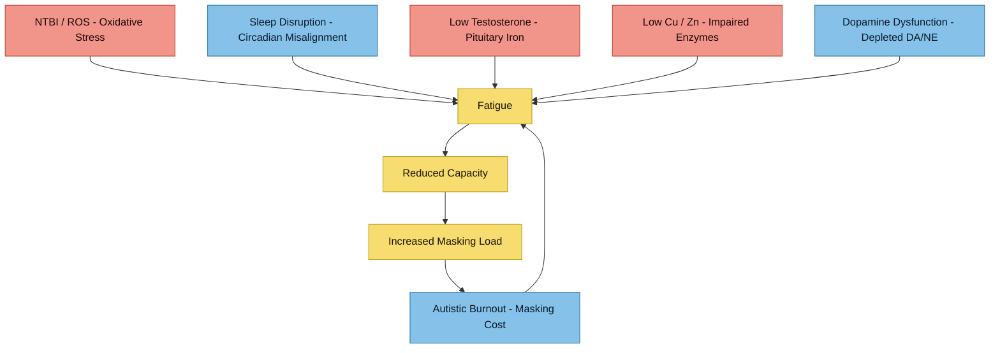

---
{"dg-publish":true,"permalink":"/symptoms/fatigue-and-burnout/","tags":["fatigue","burnout","ADHD","autism","iron-overload","mitochondria","oxidative-stress"],"dg-note-properties":{"date":"2026-03-17","type":"synthesis","status":"active","tags":["fatigue","burnout","ADHD","autism","iron-overload","mitochondria","oxidative-stress"],"summary":"Multifactorial fatigue analysis — iron toxicity, neurodivergent burnout, and micronutrient imbalance","aliases":["Extreme Fatigue Analysis"],"permalink":"symptoms/fatigue-and-burnout"}}
---

# Fatigue and Burnout

## Convergence Model

> [!info]- Colour Key
> 🟠 Pathological | 🔵 Neuro | 🔴 Outcome

## Symptom Context
- Extreme fatigue
- Burnout pattern
- ADHD + autism baseline neurocognitive load
- Concurrent iron dysregulation (TSAT 60%, previous ferritin ~700)
- **General body aches** (arms, shoulders, hands, back) that worsen significantly after consecutive nights of poor sleep — see [[symptoms/Arthropathy and Back Pain#Sleep Deprivation and Pain Amplification\|sleep-pain amplification]]

## Plausible Overlapping Drivers
1. **Iron-overload toxicity pathway**
   - NTBI/LPI -> oxidative stress -> mitochondrial strain
2. **Neurodivergent allostatic load**
   - chronic sensory/executive demand -> burnout vulnerability
3. **Sleep and circadian disruption**
   - common in ADHD/autism and can amplify fatigue severity
4. **Micronutrient imbalance**
   - low-normal zinc/copper may worsen energy and cognitive resilience
5. **Endocrine disruption from iron overload**
   - pituitary iron deposition → hypogonadotropic hypogonadism, subclinical hypothyroidism
   - see [[research/Endocrine Effects of HFE Iron Overload\|Endocrine Effects of HFE Iron Overload]]

## Research Notes
- Duca L et al. *Int J Mol Sci* 2025;26(13):6433 - NTBI/LPI toxicity model
- Thorsen M. *Prog Mol Biol Transl Sci* 2020;173:331-354 - oxidative/mitochondrial findings in ASD literature
- Mahony C, O'Ryan C. *Front Psychiatry* 2022;13:985713 - mitochondrial allostatic load perspective in autism (conceptual framework)
- Hauck S. *Front Psychiatry* 2025;16:1701625 - perspective linking stress, neurodivergence, and functional iron blockade

## Clinical Framing
This is likely **multifactorial** rather than one cause. Your biochemical profile gives a concrete treatable axis (iron regulation), while neurodivergent burnout provides an interacting non-lab axis.

## Cross-References
- [[iron-metabolism/Iron Overload and NTBI\|Iron Overload and NTBI]]
- [[iron-metabolism/Transferrin Saturation - Clinical Significance\|Transferrin Saturation - Clinical Significance]]
- [[neurodevelopment/Iron-Dopamine-ADHD Axis\|Iron-Dopamine-ADHD Axis]]
- [[neurodevelopment/Elvanse and Mineral Metabolism\|Elvanse and Mineral Metabolism]]
- [[Action Items and Monitoring Plan\|Action Items and Monitoring Plan]]
- [[research/Poor Sleep and AuDHD-HFE Interactions\|research/Poor Sleep and AuDHD-HFE Interactions]]
- [[research/Endocrine Effects of HFE Iron Overload\|Endocrine Effects of HFE Iron Overload]]
